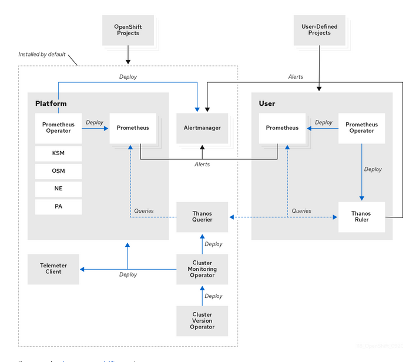
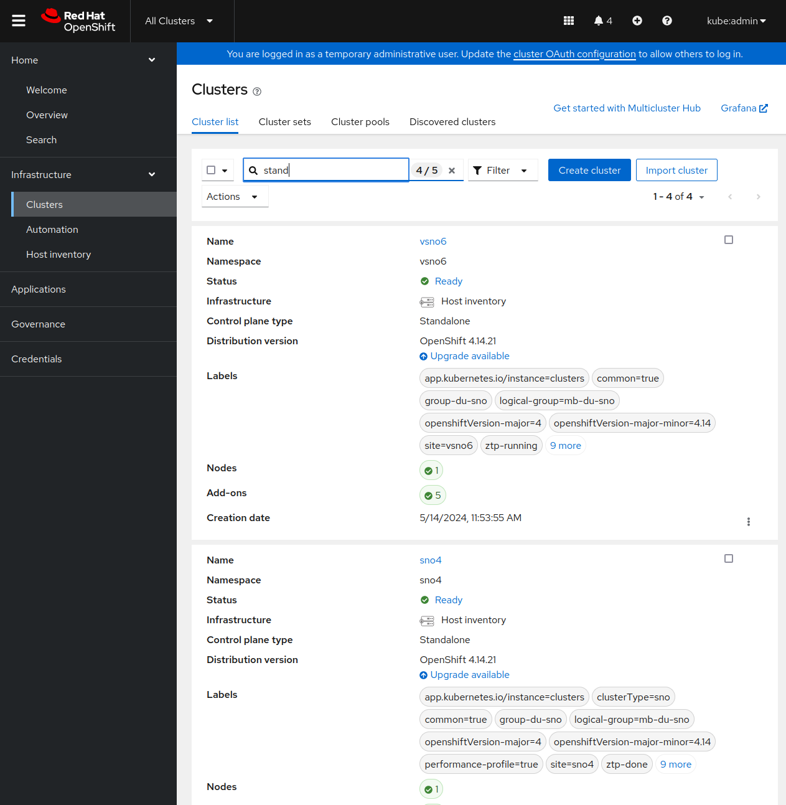
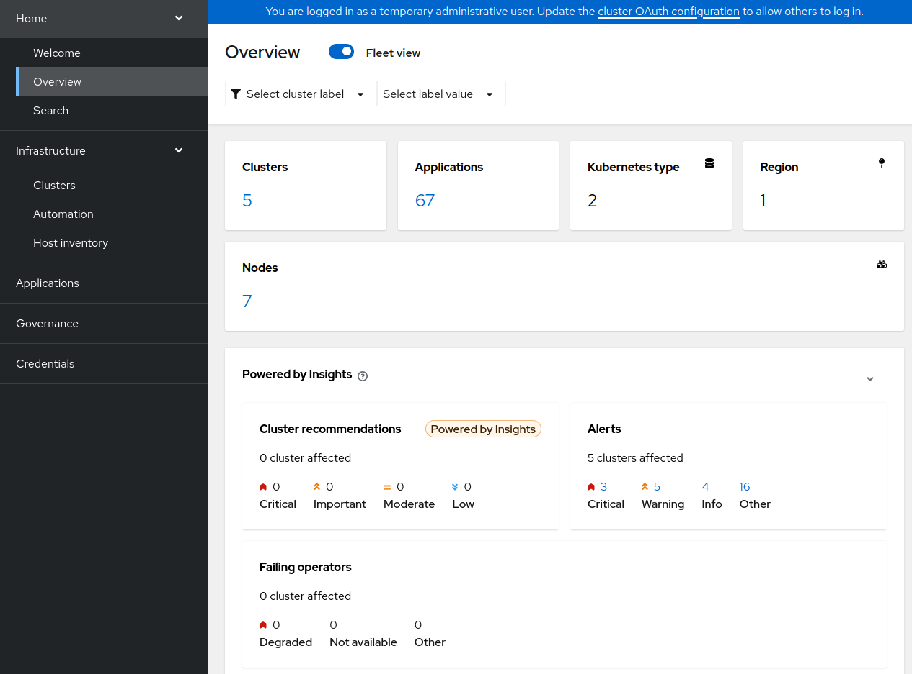
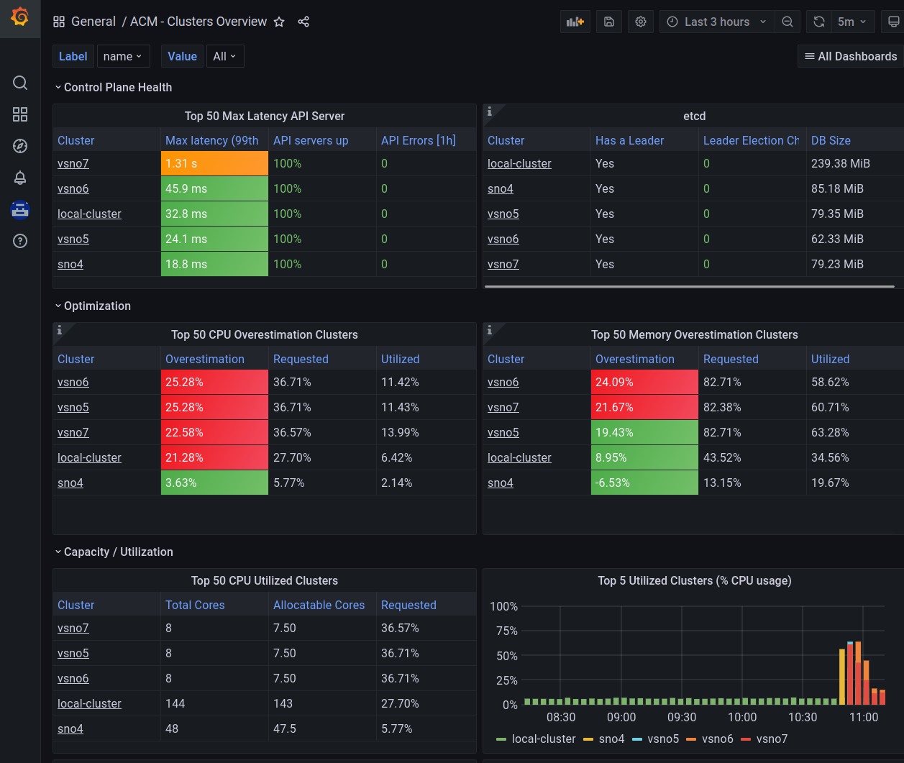
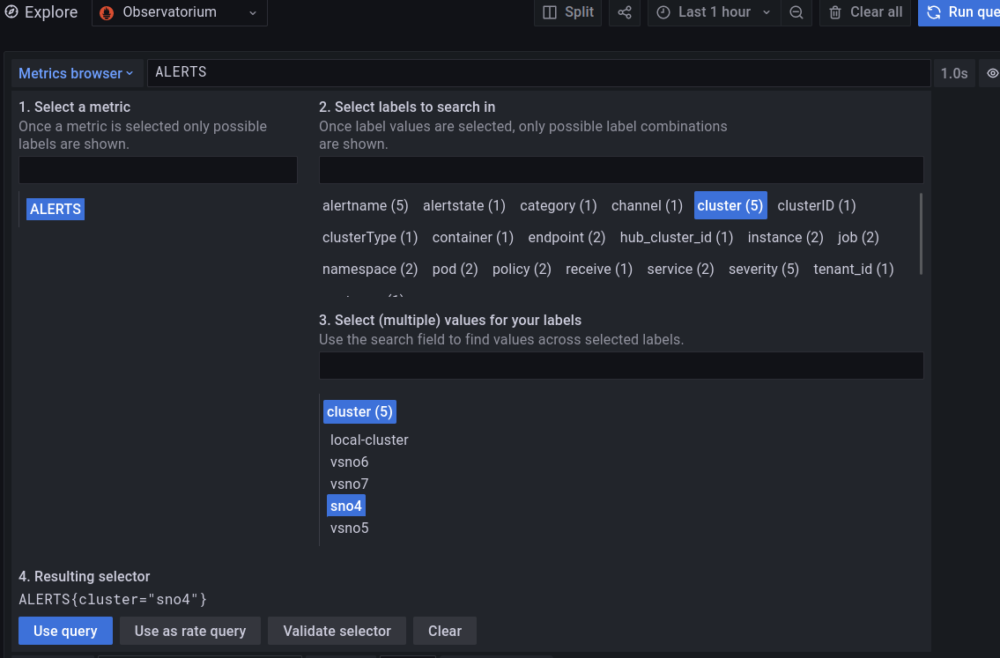
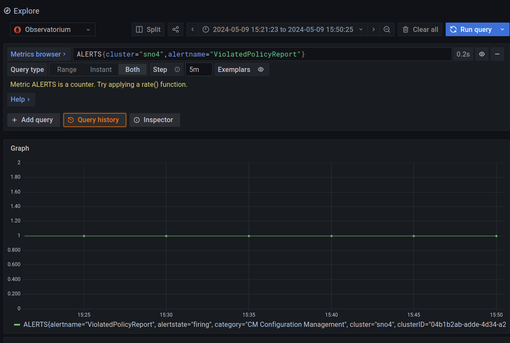
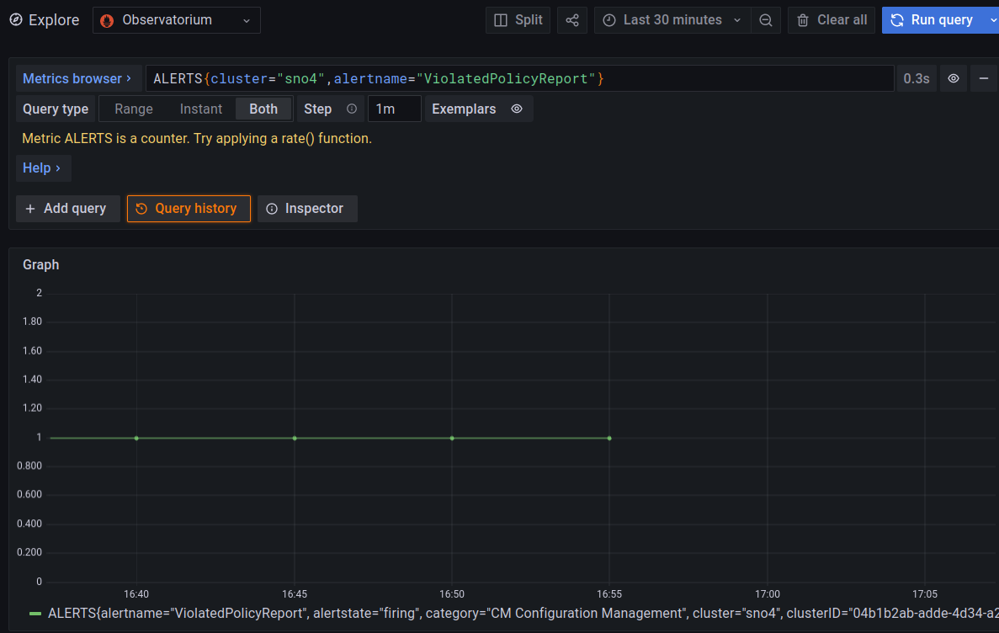
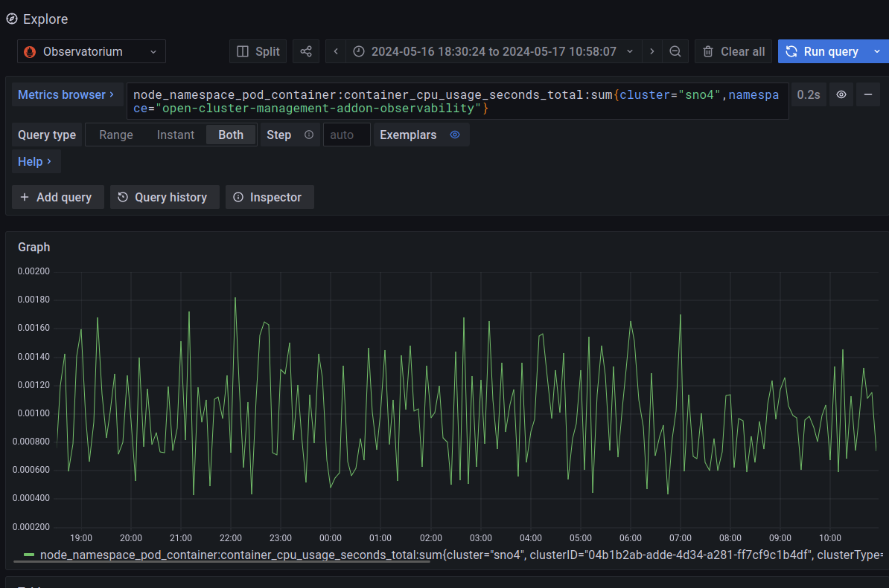
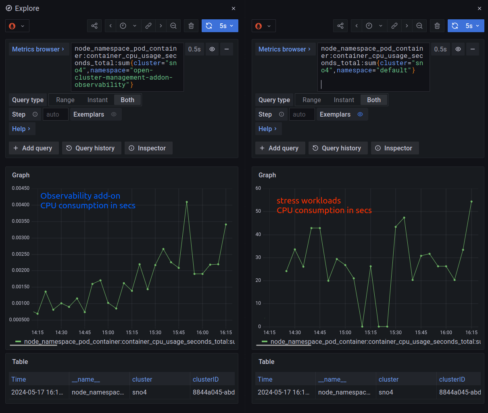
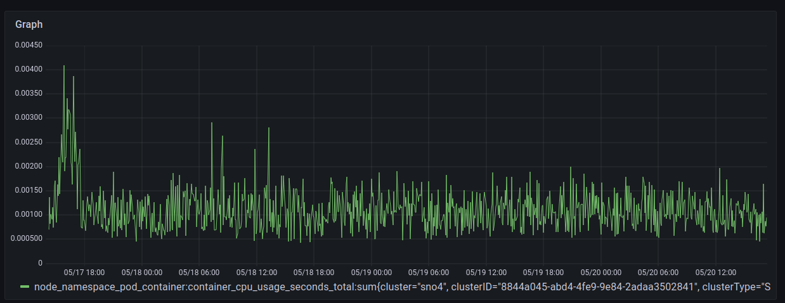

+++
title = "MultiCluster Observability"
date = "2024-05-17"
author = "Jose Gato Luis"
authorTwitter = "jgatoluis" #do not include @
cover = ""
tags = ["openshift", "operators", "observability", "management", "edge", "cloud", "rhacm"]
keywords = ["monitoring", "observability", "hub", "management"]
description = "Monitor your cloud/edge from a Red Hat Advanced Cluster Management"
showFullContent = false
readingTime = false
hideComments = false
+++

# Red Hat Advanced Cluster Management and MultiCluster Observability

In this blog, I will focus on how you can monitor your cloud/edge clusters from a central management point. Monitoring your clusters (or infrastructure) is a key first step to take decision (automatic or not), solve problems, doing maintenance, etc. When a large infrastructure, monitoring turns into a more painful task. Red Hat Advanced Cluster Management (RHACM) and the MultiCluster Observability, allows you to have an homogenized way of monitoring your whole infrastructure from  a central repository. Which is already your central life-cycle management, and most likely, the origin where all your clusters were created.

Before going with the real topic of this document, lets do a briefly introduction to Openshift Cluster Monitoring, RHACM and MultiCluster observability. 

First of all, every cluster using Openshift Cloud Platform deploys a cluster operator called Openshift Cluster Monitoring.



The main component in the **Cluster Monitoring** is Prometheus. Prometheus will scrape metrics of any service (defined by ServiceMonitoring) that exports a `/metrics` interface exposing a set of different metrics. Later, Thanos provides a PromQL interface, it is in charge of metric's persistence and it can receive metrics from different Prometheus instances. By default, Openshift defines a set of different metrics to be collected, but others can be added by users.

**[Red Hat Advanced Cluster Management](https://www.redhat.com/en/technologies/management/advanced-cluster-management)** allows you to deploy, upgrade, and configure different managed clusters from a central management cluster.



Once you have RHACM and your different managed clusters, you can enable the **[RHACM MultiCluster Observability operator](https://access.redhat.com/documentation/en-us/red_hat_advanced_cluster_management_for_kubernetes/2.10/html-single/observability/index)**. When enabled:
 * From the managed clusters: a new add-on is installed. In charge of forwarding the local Cluster Monitoring metrics to the management cluster.
 * From the management cluster: a new monitoring stack is deployed. Very briefly, it will contain a new Thanos, that will collect the metrics from every managed cluster, an Alertmanager, and new Grafana dashboards.

Enabling MultiCluster Observability is pretty easy, and you can follow the [official documentation](https://access.redhat.com/documentation/en-us/red_hat_advanced_cluster_management_for_kubernetes/2.10/html-single/observability/index#enabling-observability-service). In the process, you will have to provide an S3 compatible storage system.

## Using RHACM MultiCluster Observability

Once everything is enabled, you can have a very quick observation of your clusters, directly from the RHACM Overview console.



Also, you can use the Grafana observability dashboard (https://https://grafana-open-cluster-management-observability.apps.your-domain) to have a deeper view of what is happening.



Grafana provides you with a PromQL interface to customize your own queries. The query can be created manually, or following with a kind of wizard, that guides you with the different options.



Notice, how the wizard helps you to take a metric (actually an "Alert") and helps you to filter by cluster, pods, or other options.

## Observing an alert to take decision

In a very quick example, you can check different alerts on your clusters. 



In this example, you can see a triggered alert about a Policy Violation on the cluster named "sno4". You can consider a Policy, like a way of configuring or expressing a desired status on your cluster.

> I will not explain how to fix a Policy Violation, because it is not the scope of the blog and for the sake of blog's readiness. But basically, you apply/fix the  cluster configuration, to make it complain with the Policy.  More on [RHACM Governance](https://access.redhat.com/documentation/en-us/red_hat_advanced_cluster_management_for_kubernetes/2.10/html-single/governance/index#policy-overview)

Once the Alert is triggered, you can take the needed actions. If the problem is solved, the Alert will go down. As it can be been seen in the following picture, and how I solved the problem around 16:55.



## Observability and hardware consumption

Observability is needed in order to monitor all your clusters, but, the mechanisms has to be lightweight enough to not affect your current workloads. 

Therefore, I will do quick simple experiment to check how much extra consumption you would have using Observability. All the observations are, obviously, from the management cluster.

> This is just a light experiment, and it is not a reference measurement. It can be considered as just a quick/light analysis.

I will take a relaxed cluster: Single Node Openshift with 48 Cores and 96GB RAM. 

Initially, there are no extra workloads. The observability add-on is having the following CPU consumptions (around 0.08 and 0.18 seconds of CPU usage)



The query to take the CPU consumption of the Observability add-on:

```
node_namespace_pod_container:container_cpu_usage_seconds_total:sum{cluster="sno4",namespace="open-cluster-management-addon-observability"}
```


Now, we will stress the cluster to see if this makes the observability add-on to get higher consumptions. 


Basically, I will make many deployments of a client/server application. This will create many Pods, network interfaces, etc.

Something like:

```bash
sh-5.1# crictl pods | wc -l
271
sh-5.1# ip link show 2>/dev/null | wc -l  
477
```

Compared with the relaxed cluster:

```bash
sh-5.1# crictl pods | wc -l
103
sh-5.1# ip link show 2>/dev/null | wc -l 
177
```

> More about how I burn the cluster: you can check this [other tutorial](https://github.com/jgato/jgato/blob/main/random_docs/Debugging%20monitoring%20stack%20on%20Openshift.md). I am also adding a Pod that can take as much CPU as you want, based on [stress-ng](https://github.com/ColinIanKing/stress-ng/)

We have all the stress happening in the `default` Namespace:

```bash
$ oc adm top node
NAME   CPU(cores)   CPU%   MEMORY(bytes)   MEMORY%   
sno4   36543m       83%    46770Mi         75% 
```

With this load, we can compare the observability consumption related to the high loads of the stressing Namespace:



Apart from on very concrete peak, the increase on the load it seems not very meaningful. Considering the scale between 0.0015 and 0.0025 seconds. It seems that the high loads are not affecting to the observability add-on, which behaves pretty constant. 

Finally, a larger view of observability consumption after the experiment finished, during some days after.



## Conclusions

Monitoring and Observability are really crucial features, specially, when having large number of clusters in your infrastructure. To have everything centralized over a common platform for deploying, maintenance, life-cycle management, monitoring, etc is crucial in order to easiness your different processes. In the future, observability will collect also logs and traces, that will complete the platform. After that, automation and AI will do all the work for you ;) but this is other story.... 
