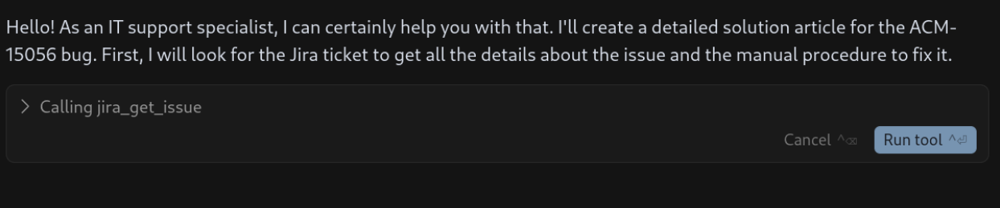
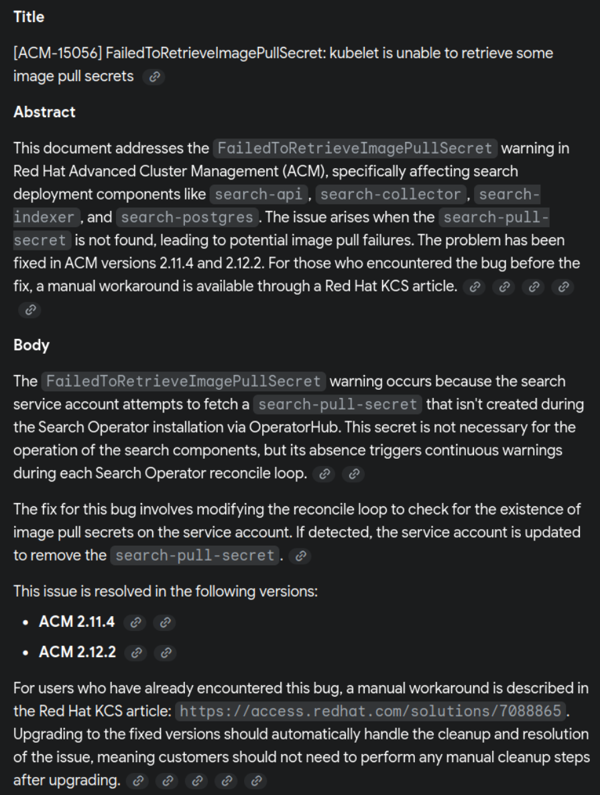
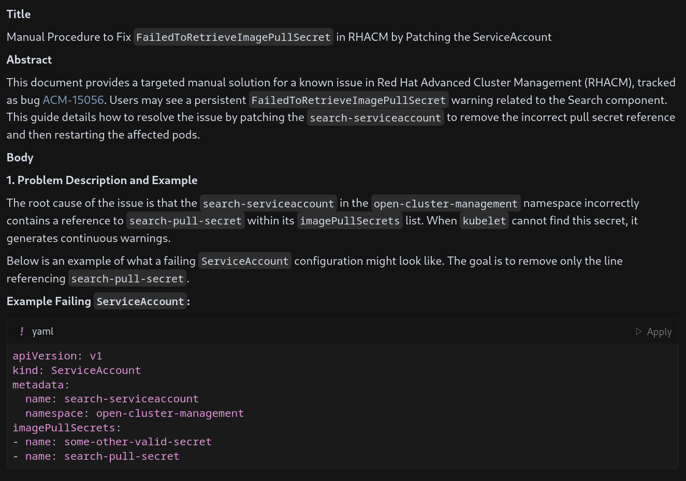
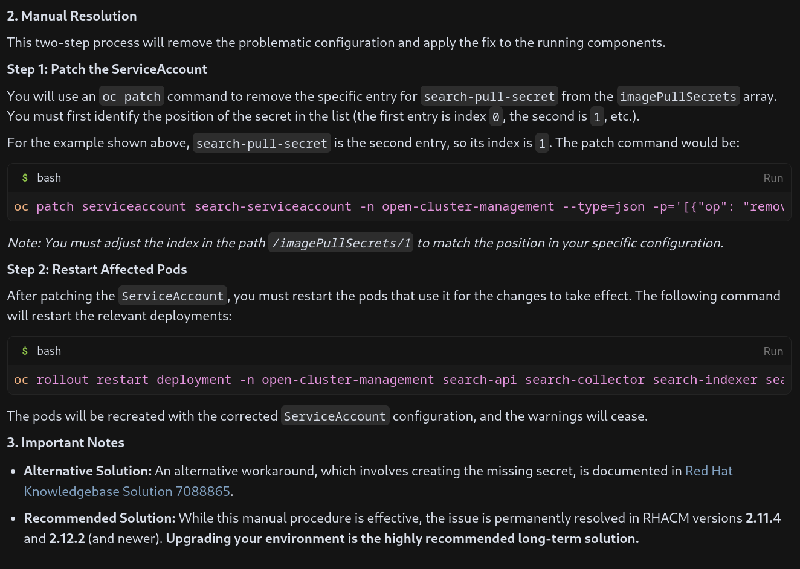
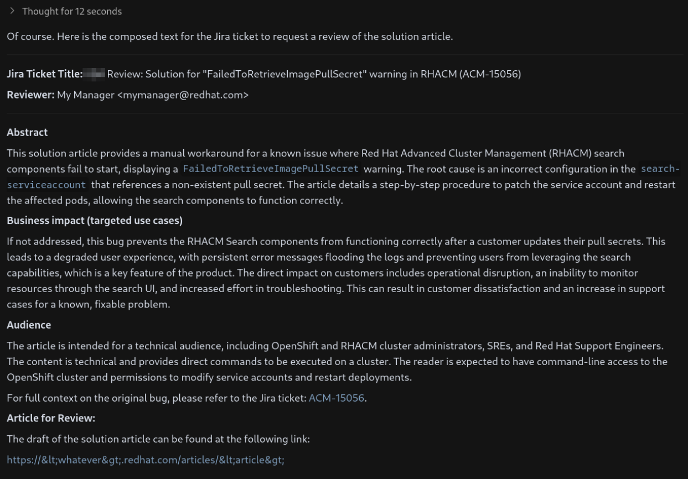
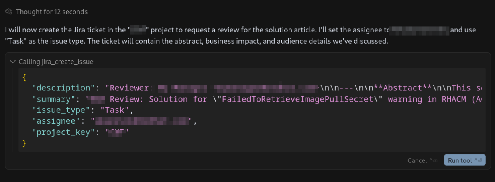

+++
title = "Converting a Jira issue into a solution with AI"
date = "2025-07-14"
author = "Jose Gato Luis"
authorTwitter = "jgatoluis" #do not include @
cover = ""
tags = ["openshift", "AI", "LLM", "Cursor", "Jira"]
keywords = ["openshift", "AI", "LLM","LLM", "Cursor", "Jira"]
description = "Jira issues can contain a lot of useful information from its long history. An AI LLM model could extract information to automatically generate a document with a solution to an issue."
showFullContent = false
readingTime = false
hideComments = false
+++

# Jira bug to a document with a solution

In this short blog I will document a kind of “hypothetical procedure”: how to extract, from a Jira ticket, enough knowledge to create a document with the solution to a problem.

I will start with a very good example, a [Jira ticket](https://issues.redhat.com/browse/ACM-15056) with a bug (open to the world because bugs should be open to everyone), a fix and a couple of workarounds. Basically, there is a problem with a wrong configured OpenShift ServiceAccount (we don't need to go into details). This has been fixed on newer versions, but for the ones already suffering the bug, there is a kind of manual workaround. 

So, let’s use a chatbot, with a good LLM, and an MCP agent to interact with Jira. My environment will be composed by:
 * Cursor to use as  chat bot and the agent to interact with the MCP
 * Gemini Pro 2.5 as the LLM
 * A Jira MCP to provide new tools for the chatboot
Another combination of tools would work the same.

> Note: in order to focus on the procedure, I am not explaining how to create this environment. But there is tons of documentation out there. Actually, I guess your LLM would help you with the configuration.

I will start with a prompt to be used with Cursor. The idea is to create a first generic prompt that I would use in future similar scenarios. Something like:

```prompt
you are an IT guy that works with support activities.
Write me the solution with the following format:
**Title**
**Abstract**
**Body **
The bug has the id ACM-15056, get all the comments for that ticket getting fields all and expand attribute to comments.
You have found a bug related to one Openshift component.
More in concrete on Red Hat Advanced Cluster Management.
The bug is documented on a Jira ticket, that explains the problem.
It explains also that is already fixed on newer versions and it should not happen again.
But for the ones that already hit the bug, they have to fix it
with a manual procedure explained also in the Jira Ticket.
```

> Note: I will use the Jira MCP to retrieve all the content. In previous tests, I just exported the Jira ticket to include it together with the prompt. But this is a more automatic way. Consider: that the Jira API extracts everything and cannot filter, for example, private comments. Something, that maybe, you don't want to use with the model.

> Note: it took me a while to instruct the agent correctly about how to use the jira tool to retrieve all the comments. In the case of Gemini Pro I have to give a lot of details, claude-4 managed to find out on its own.

The prompt is composed by a generic part, and then, a kind of form that I could fill depending on the case. The agent will start using the MCP to interact with Jira and you have to give it perms to do it.



After having the enough perms, this is the result:




Not bad for a first attempt, it is focusing on an existing KCS that points you to create the missing `pull-secret`. This is not the workaround we want to document, I want the one about: the `pull-secret` is no longer needed.

Second attempt. Now, with more concrete instructions about the solution to document and some more details based on some more iterations I had. Some addings:
 * Focus on the workadound I am interested with.
 * It is needed to restart pods.
 * Be brief.
 * How to format links.
I don't want to make this too long about all the interactions I did. But you should have in mind that, getting the better prompt takes time:

```prompt
you are an IT guy that works with support activities.
Write me the solution with the following format:
**Title**
**Abstract**
**Body **
The bug has the id ACM-15056, get all the comments for that ticket getting fields all and expand attribute to comments.
You have found a bug related to one Openshift component.
More in concrete on Red Hat Advanced Cluster Management.
The bug is documented on a Jira ticket, that explains the problem.
It explains also that is already fixed on newer versions and it should not happen again.
But for the ones that already hit the bug, they have to fix it
with a manual procedure explained also in the Jira Ticket.
Focus on showing
the manual procedure of modifying the ServiceAccount to not use the pull-secret.
Be brief explaining how to remove the pull-secret from the ServiceAccount using an oc patch. And show an example on how it would look a filing ServiceAccount. When removig only remove the failing pull secret.
In the section where you do the patch, dont explain every parameter.
Remember you have to restart the affected pods.
Finally add a note that points to the other KCS with the second solution and recommend to upgrade as the best option.
Compose the links in the way of [name](link)
```

Now, the solution is much more correct about, first, how to check the fail. 



Second, how to only remove the failing part and how to correctly restart the services:



To master prompts is essential to get the better from the model.

We are happily done :) or not...

## A final round using MCPs

Writing an article with a solution, it does not require just me to review it. In general, you have another colleague that will give you a hand. And in addition, as it is our case, we could create a Jira Ticket to ask for a review under an internal process.
I created a new prompt to create a new Jira ticket, that internally will trigger a review of article:

```prompt
I want to create a jira ticket to inform that I have created an article (called solution article) that needs review. Dont create the jria ticket yet, but lets compose it.
now I have the article ready and I will publish it on an open blog. But first, I need that a a committee makes a review.
Write me the text to ask a review for the previous document, with the following format:
**Abstract**
**Business impact (targeted use cases)**
**Audience**
Business Impact is about what could happen if the previous bug is not fixed, and how it could affect our customers
Audience is about who will read it, and if it is technical or not. Dont forget to include a link to the original bug.
Because the objective is a jira ticket, please include a title for the jira ticket explain that we are creating a KBA and why.
Also add some metadata about the reviewer, who is My Manager < mymanager@redhat.com>
plese, add that the article to review can be found here: https://<whatever>.redhat.com/articles/<article>
```

That prepares everything:



everything seems correct, so lets create the ticket:

```prompt
create the ticket on the project <TEST>,
set the Assignee to My Manager <MyManager@redhat.com>
```

	

Worked like a charm. I could even add comments and some more labels, to configure it properly into the review process.

Now, I am done ;)

# Conclusions

Jira tickets contain so much information, that sometimes, it is hard to retrieve the most relevant parts. A ticket with a problem, the fix, and the workaround, are susceptible to creating articles that just tell you how to solve a problem. An LLM chat would help you synthesize and extract this concrete workaround, and to format it the proper way.
 
Some important lessons learned:
 * Guiding the bot took me a while and also to refine the prompt, like explaining how to build links, or how to properly use the MCP tools. But once it is done, next time I can use 80% of the prompt and just add some concrete guides.
 * When I say a while it means… many tries. But it was also my first time. There is no magic, and you need time to learn how to interact. 
 * Other concerns should be taken in mind, like for example: the Jira API does not filter comments. Including even the private ones. 
 * The person guiding the bot is responsible for the final document. To know exactly the problem and the solution is a must. But also, to review that the output and commands are correct. Finally, another process that implies other persons to help with the review would be needed.

The experiment or idea explained here, would help to document more solutions, but it has to be used with extreme care. The saved time (that would come after repeating and gaining experience) should be counted about the tedious work of starting to write something from scratch. But it does not save you to read, check, try and review. 
