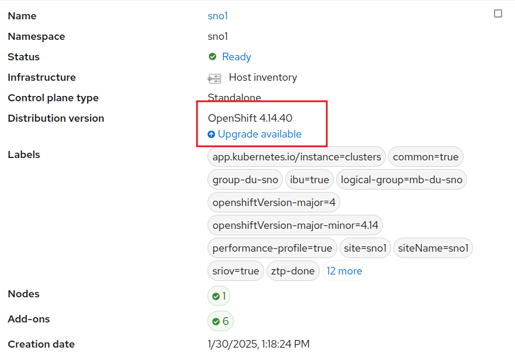
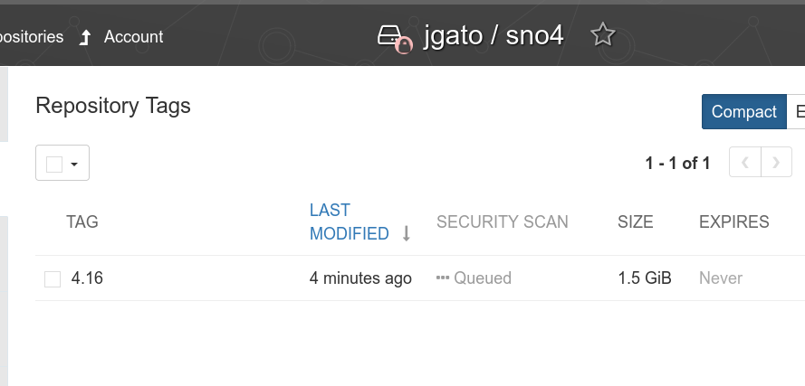
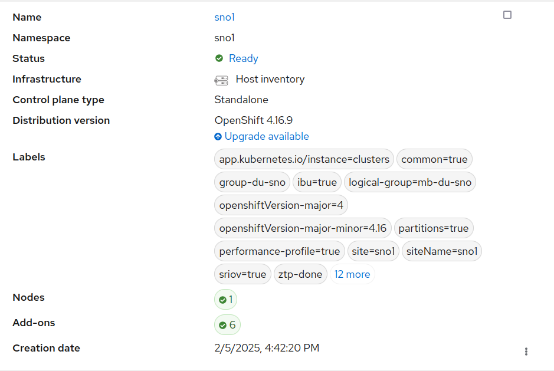

+++
title = "Telco Upgrades with Image Base Upgrade"
date = "2025-02-07"
author = "Jose Gato Luis"
authorTwitter = "jgatoluis" #do not include @
cover = ""
tags = ["openshift", "telco", "upgrades", "ran", "edge", "cloud", "rhacm"]
keywords = ["upgrades", "life-cycle", "hub", "management"]
description = "The fastest way of upgrading Single Node Openshift clusters"
showFullContent = false
readingTime = false
hideComments = false
+++

# Upgrading Clusters with Image-Based Upgrade (IBU)

In this blog, I will focus on how to upgrade the clusters in your infrastructure managed by Red Hat Advanced Cluster Management (RHACM), specifically using the new upgrade mechanism called Image-Based Upgrade (IBU).

Previously, you could upgrade your infrastructure using the standard OpenShift upgrade method:


Or by simply using the `oc cli`, as described in the [official documentation](https://docs.openshift.com/container-platform/4.16/updating/updating_a_cluster/updating-cluster-cli.html).

Both methods trigger the same process, updating the operating system, OpenShift, operators, etc. For a Single Node OpenShift (SNO), the time required varies based on configuration but typically takes around 60–70 minutes.

In telecommunications scenarios, SNOs are designed to run the Telco Radio Access Network (RAN). You can think of the software managing every antenna, meaning your infrastructure consists of thousands of antennas that need to be upgraded. This process is conducted within a strict maintenance window with very tight time constraints.

IBU addresses this challenge by providing an upgrade mechanism that reduces upgrade time to approximately 15/20 minutes. IBU works by creating an image from a "seed" cluster. All clusters in your infrastructure that are considered clones of this seed cluster can be upgraded using this image. This mechanism is particularly well-suited for homogeneous telco RAN environments composed exclusively of SNOs. However, IBU is not suitable for multi-node clusters or heterogeneous infrastructures. In fact, IBU includes pre-checks to ensure compliance with telco RAN configurations. So, it cannot be used for other purposes (as today).

In this blog, I will briefly cover how this new upgrade process works, but I will not go into details on configuring, installing, or deploying your infrastructure. The starting point assumes three SNOs are already installed, configured, and managed by ACM.


Notice that all these clusters are running OpenShift 4.14, and we aim to upgrade them to 4.16. Another advantage of IBU is that we can move directly to 4.16 without needing to first upgrade to 4.15 (which would take an extra hour).

A fourth cluster, SNO4, will be used as the seed cluster. All clusters share the same hardware, software, and network configuration.

## Using the Seed Cluster to Create the Upgrade Image

*For a more detailed explanation, refer to the [official documentation](https://docs.openshift.com/container-platform/4.16/edge_computing/image_based_upgrade/cnf-understanding-image-based-upgrade.html).*

The seed cluster is essentially a cloned environment that contains the desired software version. In this case, SNO4 has been deployed with OpenShift 4.16, the target upgrade version, while maintaining the same hardware and network configuration as the others.

The seed cluster should be treated as an ephemeral environment. It is installed, configured, used to generate the seed image, and then removed. It does not run any additional workloads, as these will be handled by the upgraded clusters later. Using a long-running cluster as a seed risks creating an image that is not as clean as expected.

If the seed cluster is part of ACM (or ZTP), it should be detached first to ensure that the resulting image does not contain workloads related to ACM.

Apart from the usual OpenShift installation and RAN configurations (not covered in this blog), two additional operators are required:
- [Operator Lifecycle Agent](https://docs.openshift.com/container-platform/4.16/edge_computing/image_based_upgrade/preparing_for_image_based_upgrade/cnf-image-based-upgrade-install-operators.html#cnf-image-based-upgrade-installing-lifecycle-agent-using-cli_install-operators): Triggers the image creation process.
- [OADP (OpenShift APIs for Data Protection)](https://docs.openshift.com/container-platform/4.16/backup_and_restore/application_backup_and_restore/installing/oadp-installing-operator.html#oadp-installing-operator-doc): Manages backups. The seed cluster does not perform backups, and it does not really need it. But it is installed, to be included as part of the seed image. When the other clusters use the seed image they will have the operator ready to restore their own individual backups.

Refer to the official documentation for installation instructions, but installing these operators follows the standard OpenShift operator installation process.

Once the operators are installed, we trigger the seed creation. First, we create a secret to authenticate with the container registry where the image will be stored:

```yaml
apiVersion: v1
kind: Secret
metadata:
  name: seedgen
  namespace: openshift-lifecycle-agent
type: Opaque
data:
  seedAuth: <base64_encoded_auth>
```

In my case, I use Quay.io, and `seedAuth` is a base64-encoded JSON similar to:

```json
{
  "auths": {
    "quay.io/jgato": {
      "auth": "amdhdG9......FuX0c2bmE="
    }
  }
}
```

Now, we initiate the seed generation creathing the following manifest:

```yaml
apiVersion: lca.openshift.io/v1
kind: SeedGenerator
metadata:
  name: seedimage
spec:
  seedImage: quay.io/jgato/sno4:4.16.9
```

### Monitoring the Image Creation

We can monitor the image creation process:

```bash
$ oc create -f seedgenerator.yaml && oc get seedgenerators.lca.openshift.io -w
seedgenerator.lca.openshift.io/seedimage created
NAME        AGE   STATE   DETAILS
seedimage   0s            
seedimage   0s    SeedGenInProgress   Waiting for system to stabilize
seedimage   2s    SeedGenInProgress   Starting seed generation
seedimage   2s    SeedGenInProgress   Pulling recert image
seedimage   7s    SeedGenInProgress   Preparing for seed generation
seedimage   8s    SeedGenInProgress   Cleaning cluster resources
seedimage   80s   SeedGenInProgress   Launching imager container
seedimage   80s   SeedGenInProgress   Launching imager container
```

At this point, kubelet is stopped, and a container is created outside OpenShift to generate the image. Once the process is complete, kubelet restarts, and we confirm the image has been successfully uploaded to Quay.io:

```bash
$ oc get seedgenerators.lca.openshift.io -w
NAME        AGE   STATE              DETAILS
seedimage   21s   SeedGenCompleted   Seed Generation completed
```



## Upgrading clusters
### Preparing the backup

Unlike a seed cluster, the cluster that will be upgraded is an operational one, which will continue running its workloads. These additional workloads will be included in a backup (using OADP) and restored after the upgrade. Other than that, the clusters are essentially the same.

For example, I’ve deployed a simple workload in the example-workload namespace, which uses a PersistentVolume provided by the LocalStorageOperator. This serves as an example for the backup and restore process. Keep in mind that the seed image aims to be as clean as possible, so it’s your responsibility to back up your workloads, PVs, roles, and any necessary CRDs.

```bash
> oc -n example-workload get deployment,pod,pvc
NAME                                       READY   UP-TO-DATE   AVAILABLE   AGE
deployment.apps/exception-app-deployment   1/1     1            1           56s

NAME                                            READY   STATUS    RESTARTS   AGE
pod/exception-app-deployment-7c9ff94dd9-c52x2   1/1     Running   0          57s

NAME                           STATUS   VOLUME              CAPACITY   ACCESS MODES   STORAGECLASS   AGE
persistentvolumeclaim/my-pvc   Bound    local-pv-4ad70ba3   1Gi        RWO            general        13m

```

The Pod is just simulating some exceptions (just an example):

```bash
> oc -n example-workload logs exception-app-deployment-7c9ff94dd9-c52x2 
{"timestamp": "2025-01-31T09:16:18.080413Z", "level": "INFO", "message": "Running... Exception will be raised in 30 seconds.", "app": "exception-app"}
Traceback (most recent call last):
  File "/app/exception_app.py", line 36, in cause_complex_exception
    level_one()
  File "/app/exception_app.py", line 28, in level_one
    level_two()
  File "/app/exception_app.py", line 31, in level_two
    level_three()
  File "/app/exception_app.py", line 34, in level_three
    raise Exception("Custom exception at level three")
Exception: Custom exception at level three

```

Let’s take a look at how things continue to work after the upgrade.

When preparing the backup, it depends on the SNO and various options for operators and storage. I won’t cover these details in this blog to keep it from becoming too overwhelming, but you can find all the information [here](https://docs.openshift.com/container-platform/4.16/edge_computing/image_based_upgrade/preparing_for_image_based_upgrade/cnf-image-based-upgrade-prep-resources.html). Instead, I’ll focus on how to back up and restore a custom workload.

```yaml
apiVersion: velero.io/v1
kind: Backup
metadata:
  labels:
    velero.io/storage-location: default
  name: backup-app
  namespace: openshift-adp
spec:
  includedNamespaces:
  - example-workload
  includedNamespaceScopedResources:
  - persistentvolumeclaims
  - deployments
  excludedClusterScopedResources:
  - persistentVolumes
---
apiVersion: velero.io/v1
kind: Restore
metadata:
  name: test-app
  namespace: openshift-adp
  labels:
    velero.io/storage-location: default
  annotations:
    lca.openshift.io/apply-wave: "4"
spec:
  backupName:
    backup-app
```

This custom back, and other backups needed but not covered in this blog, dont need to be directly created on the cluster. These need to be included into a ConfigMap:

```bash
> oc create -n openshift-adp configmap oadp-cm-example \
 --from-file=backup-acm-klusterlet.yaml=backup-acm-klusterlet.yaml \
 --from-file=backup-workload.yaml=backup-workload.yaml
```

And we patch the ImageBaseUpgrade resource with the backups.

```bash
> oc patch imagebasedupgrade upgrade \
-p='{"spec": {"oadpContent": [{"name": "oadp-cm-example", "namespace": "openshift-adp"}]}}'   --type=merge 
```

### Triggering the backup
*The whole process I am explaining is more detailed [here](https://docs.openshift.com/container-platform/4.16/edge_computing/image_based_upgrade/cnf-image-based-upgrade-base.html)*

On all the backups waiting to receive an upgrade, it has been installed the  Lifecycle Agent operator. This, will automatically create the ImageBaseUpgraded CR in charge of managing the upgrade. 

Initially we are in the `idle` stage:

```bash
$ oc get ibu upgrade
NAME      AGE   DESIRED STAGE   STATE   DETAILS
upgrade   18h   Idle            Idle    Idle

```

There are [other stages](https://docs.openshift.com/container-platform/4.16/edge_computing/image_based_upgrade/cnf-understanding-image-based-upgrade.html#cnf-image-based-upgrade_understanding-image-based-upgrade) that supports the logic of the whole Lifecycle Agent. 

Before moving to `pre` stage, we have to configure the `seedImageRef`.

```
apiVersion: lca.openshift.io/v1
kind: ImageBasedUpgrade
metadata:
  creationTimestamp: "2025-02-05T16:26:36Z"
  generation: 5
  name: upgrade
  resourceVersion: "225303"
  uid: 7b9ca970-b418-453e-8673-ba5be07c9622
spec:
  oadpContent:
  - name: oadp-cm-example
    namespace: openshift-adp
  seedImageRef:
    image: quay.io/jgato/sno4:4.16.9
    pullSecretRef:
      name: secret-pull-seed
    version: 4.16.9
  stage: Idle


```

The secret has been created on `openshift-lifecycle-agent` and contains the pullSecret to download the seed image:

```
apiVersion: v1
data:
  .dockerconfigjson: ewoJYXV0aHM6IHsKCQlxd....Qp9Cg==
kind: Secret
metadata:
  name:  secret-pull-seed
  namespace: openshift-lifecycle-agent
type: Opaque

```

Lets move to the `pre` stage:

```bash
$ oc patch imagebasedupgrades.lca.openshift.io upgrade -p='{"spec": {"stage": "Prep"}}' --type=merge -n openshift-lifecycle-agent
imagebasedupgrade.lca.openshift.io/upgrade patched
```

```bash
$ oc get ibu upgrade  -w
NAME      AGE   DESIRED STAGE   STATE        DETAILS
upgrade   17h   Prep            InProgress   Stateroot setup job in progress. job-name: lca-prep-stateroot-setup, job-namespace: openshift-lifecycle-agent
upgrade   17h   Prep            InProgress   Successfully launched a new job precache. job-name: , job-namespace: 
upgrade   17h   Prep            InProgress   Precache job in progress. job-name: lca-prep-precache, job-namespace: openshift-lifecycle-agent. No precache status file to read yet.
upgrade   17h   Prep            InProgress   Precache job in progress. job-name: lca-prep-precache, job-namespace: openshift-lifecycle-agent. total: 125 (pulled: 20, failed: 0)
upgrade   17h   Prep            InProgress   Precache job in progress. job-name: lca-prep-precache, job-namespace: openshift-lifecycle-agent. total: 125 (pulled: 40, failed: 0)
...
...
upgrade   17h   Prep            Completed    Prep stage completed successfully

```

Now, we are ready to do the upgrade, moving the ImageBaseUpgrade o the `upgrade` stage:

```bash
$ oc get clusterversion
NAME      VERSION   AVAILABLE   PROGRESSING   SINCE   STATUS
version   4.14.40   True        False         17h     Cluster version is 4.14.40

$ date
Thu Feb  6 05:04:23 EST 2025

$ $ oc patch imagebasedupgrades.lca.openshift.io upgrade -p='{"spec": {"stage": "Upgrade"}}' --type=merge

$ oc get ibu upgrade  -w
NAME      AGE   DESIRED STAGE   STATE        DETAILS
upgrade   17h   Upgrade         InProgress   Backup of Application Data is in progress
upgrade   17h   Upgrade         InProgress   Backing up Application Data
upgrade   17h   Upgrade         InProgress   Exporting Application Configuration
upgrade   17h   Upgrade         InProgress   Exporting Policy and Config Manifests
upgrade   17h   Upgrade         InProgress   Exporting Cluster and LVM configuration
upgrade   17h   Upgrade         InProgress   In progress

```

The SNO is rebooting. After that, in about 5 minute, you can see the node with the upgraded OCP version:

```bash
$ date
Thu Feb  6 05:10:56 EST 2025

$ oc get co
NAME                                       VERSION   AVAILABLE   PROGRESSING   DEGRADED   SINCE   MESSAGE
authentication                             4.16.9    True        False         False      6d20h   
config-operator                            4.16.9    True        False         False      6d21h   
dns                                        4.16.9    True        False         False      6d20h   
etcd                                       4.16.9    True        False         False      6d21h   
ingress                                    4.16.9    True        False         False      6d21h   
kube-apiserver                             4.16.9    True        False         False      6d21h   
kube-controller-manager                    4.16.9    True        False         False      6d21h   
kube-scheduler                             4.16.9    True        False         False      6d21h   
kube-storage-version-migrator              4.16.9    True        False         False      6d21h   
machine-approver                           4.16.9    True        False         False      6d21h   
machine-config                             4.16.9    True        False         False      6d21h   
marketplace                                4.16.9    True        False         False      6d21h   
monitoring                                 4.16.9    True        False         False      6d20h   
network                                    4.16.9    True        True          False      6d21h   DaemonSet "/openshift-multus/network-metrics-daemon" is waiting for other operators to become ready...
node-tuning                                4.16.9    True        False         False      6d20h   
openshift-apiserver                        4.16.9    True        False         False      6d21h   
openshift-controller-manager               4.16.9    True        False         False      6d21h   
operator-lifecycle-manager                 4.16.9    True        False         False      6d21h   
operator-lifecycle-manager-catalog         4.16.9    True        False         False      6d21h   
operator-lifecycle-manager-packageserver   4.16.9    True        False         False      6d20h   
service-ca                                 4.16.9    True        False         False      6d21h  

```

But still some work to do.

```bash
$ oc get ibu upgrade  -w
NAME      AGE    DESIRED STAGE   STATE        DETAILS
upgrade   7m2s   Upgrade         InProgress   Waiting for system to stabilize: one or more health checks failed...
upgrade   7m28s   Upgrade         InProgress   Applying Policy Manifests
upgrade   7m28s   Upgrade         InProgress   Applying Config Manifests
upgrade   7m28s   Upgrade         InProgress   Restoring Application Data
upgrade   7m28s   Upgrade         InProgress   Restore of Application Data is in progress
upgrade   7m58s   Upgrade         InProgress   Applying Policy Manifests
upgrade   7m58s   Upgrade         InProgress   Applying Config Manifests
upgrade   7m58s   Upgrade         InProgress   Restoring Application Data
upgrade   7m58s   Upgrade         InProgress   Restore of Application Data is in progress
upgrade   8m28s   Upgrade         InProgress   Applying Policy Manifests
upgrade   8m28s   Upgrade         InProgress   Applying Config Manifests
upgrade   8m28s   Upgrade         InProgress   Restoring Application Data
upgrade   8m30s   Upgrade         InProgress   Restoring Application Data
upgrade   8m30s   Upgrade         InProgress   Restoring Application Data
upgrade   8m30s   Upgrade         Completed    Upgrade completed

[jgato@provisioner ~]$ date
Thu Feb  6 05:19:47 EST 2025
```

Everything done in about 15 minutes. Considering this is baremetal, only the reboot consumed about 5 of these minutes.

Lets check the restore of our workload:

```bash
$ oc -n example-workload get pod
NAME                                        READY   STATUS    RESTARTS   AGE
exception-app-deployment-575c65d8cf-szjsf   1/1     Running   0          94s

```

Remember this SNO was part of ACM, and we can check it is still there:



There are other features not tested in the blog, like rollback if fail. But I did not want to do it too complex and give only a first approach.

## Upgrading a cluster with traditional upgrade

*Note: This is just a comparative on the amount of time, as reference. But it is not intended to compare (or to conclude) which one is better. As explained in the introduction IBU only covers very specific scenario and only SNO clusters. "Traditional" upgrade has to cover absolutely all the possible scenarios.*

We take a similar SNO and (simplified installation steps for clarity of the blog):

To intermediate version 4.15.38

```bash
$ date
Thu Feb  6 05:34:15 EST 2025

$ oc adm upgrade --to=4.15.38

$ oc get clusterversion
NAME      VERSION   AVAILABLE   PROGRESSING   SINCE   STATUS
version   4.15.38   True        False         50s     Cluster version is 4.15.38
$ date
Thu Feb  6 06:33:14 EST 2025

```

Then to 4.16.23 (there is no update path to .9, but it is oka). I also need some time to update some OLM Operators:

```bash
$ date
Thu Feb  6 06:46:10 EST 2025

$ oc adm upgrade --to=4.16.23

$ oc get clusterversion
NAME      VERSION   AVAILABLE   PROGRESSING   SINCE   STATUS
version   4.15.38   True        True          37s     Working towards 4.16.23: 110 of 903 done (12% complete), waiting on etcd, kube-apiserver

[jgato@provisioner ~]$ oc get clusterversion -w
NAME      VERSION   AVAILABLE   PROGRESSING   SINCE   STATUS
version   4.15.38   True        True          58m     Working towards 4.16.23: 764 of 903 done (84% complete), waiting on machine-config
version   4.15.38   True        True          62m     Working towards ...
...
version   4.16.23   True        False         0s      Cluster version is 4.16.23
$ date
Thu Feb  6 07:50:04 EST 2025


```

So, it took like another 60 minutes minutes to do the two upgrades up to reach to 4.16. In total around 120 minutes plus the extra if you have to upgrade OLM operators.


# Conclusion

Image-Based Upgrade for Single Node OpenShift clusters is an efficient way to upgrade clusters when there are very tight maintenance windows. However, it’s limited to specific scenarios, particularly when your infrastructure consists of homogeneous SNOs. In such cases, upgrades (including backup and restore of workloads) can take as little as 15-20 minutes, which is a significant improvement compared to other mechanisms that need to cover a wide range of possible scenarios.