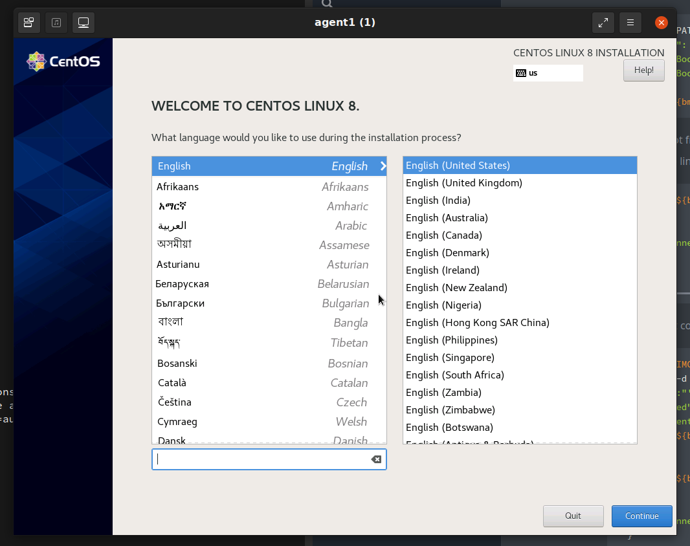

+++
title = "Sushy tools and Redfish tutorial "
date = "2022-09-16"
author = "Jose Gato Luis"
authorTwitter = "jgatoluis" #do not include @
cover = ""
tags = ["IPV6"]
keywords = ["", ""]
description = "This document is a short tutorial as introduction to use Sushy tools to manage a remote baremetal server."
showFullContent = false
readingTime = false
hideComments = false
+++

# Using Sushy tools to manage a BMC Redfish interface

This document is a short tutorial as introduction to use Sushy tools to manage a remote baremetal server.

What is covered in this tutorial?

* Understand how to install and use Sushy to create/virtualize Redfish interfaces. Redfish is a REST standard protocol to manage servers, storage, networks, etc.

* Some basics about the Redfish  BMC (REST) interface and how to interact with it.

* How to manage a BMC server using a Redfish interface. Power-off, power-on, managing isos and virtual medias, etc.

* **Provision a baremetal server with a new Operative System**

A virtual environment will be created for this tutorial, in order to facilitate the environment availability. This means:

* A virtual machine as a baremetal server. Created with [kcli tool](https://github.com/karmab/kcli).

* A virtual Redfish interface, created with Sushy tools, as a BMC.

This virtual environment should give us enough background to later interact with real Redfish interfaces. It will also help us to develop, safetly, some quick tests, before going for a real physical environment.

## Creating the virtual environment

First of all we create a VM without an OS installed. This VM will act as our baremetal Server.

```bash
$> kcli create vm -P uefi_legacy=true -P start=false -P nets=[default] \
    -P memory=8192 -P numcpus=2  agent1
```


Now we use Sushy tools to emulate the BMC Redfish interface. Sushy tools supports two different emulators. The one we are going to use in this tutorial is: the the virtual Redfish BMC.

This tool emulates a baremetal BMC implementing a Redfish REST interface. The emulator backend is implemented by libvirt. In the previous step, we have used kcli to create the VM, which is using also libvirt as backend. So, the Sushy emulator will communicate seamless with the virtual machine.

```bash
$> dnf -y install pkgconf-pkg-config libvirt-devel gcc python3-libvirt python3 git python3-netifaces httpd-tools
pip3 install sushy-tools
```

Lets create a basic Sushy configuration file:

```bash
cat << EOF > ./sushy.conf
SUSHY_EMULATOR_LISTEN_IP = u'0.0.0.0'
SUSHY_EMULATOR_LISTEN_PORT = 8000
SUSHY_EMULATOR_SSL_CERT = None
SUSHY_EMULATOR_SSL_KEY = None
SUSHY_EMULATOR_OS_CLOUD = None
SUSHY_EMULATOR_LIBVIRT_URI = u'qemu:///system'
# If authentication is desired, set this to an htpasswd file.
SUSHY_EMULATOR_AUTH_FILE = './auth.conf'
#SUSHY_EMULATOR_IGNORE_BOOT_DEVICE = True
SUSHY_EMULATOR_IGNORE_BOOT_DEVICE = False
SUSHY_EMULATOR_BOOT_LOADER_MAP = {
    u'UEFI': {
        u'x86_64': u'/usr/share/OVMF/OVMF_CODE.secboot.fd',
        u'aarch64': u'/usr/share/AAVMF/AAVMF_CODE.fd'
    },
    u'Legacy': {
        u'x86_64': None,
        u'aarch64': None
    }
}
EOF
```

* "SUSHY_EMULATOR_LIBVIRT_URI = u'qemu:///system'": the backend for redfish is libvirt, so it will interact with the VMs in the host.
* "SUSHY_EMULATOR_AUTH_FILE" it is an htpasswd file with the authentication. You can expect all the Redfish REST interfaces to have authorization.

Create the auth file

```bash
$> htpasswd -cB ${PWD}/auth.conf admin
New password:
Re-type new password:
Adding password for user admin
```

Now you can run the service with the created configuration.

```bash
$> /usr/local/bin/sushy-emulator --config ${PWD}/sushy.conf
 * Serving Flask app 'sushy_tools.emulator.main' (lazy loading)
 * Environment: production
   WARNING: This is a development server. Do not use it in a production deployment.
   Use a production WSGI server instead.
 * Debug mode: off
 * Running on all addresses.
   WARNING: This is a development server. Do not use it in a production deployment.
 * Running on http://10.39.194.148:8000/ (Press CTRL+C to quit)
```

The sushy-emulator will create a local REST interface as a bridge with the available Redfish BMC interface. Because of the backend is libvirt, you can manage all the VMs on the host.

```bash
$> export bmc=admin:admin@localhost:8000
$> curl ${bmc}/redfish/v1/Managers
{
    "@odata.type": "#ManagerCollection.ManagerCollection",
    "Name": "Manager Collection",
    "Members@odata.count": 7,
    "Members": [

          {
              "@odata.id": "/redfish/v1/Managers/04d4b2dc-1cdc-4f6e-900a-03007e9ed5c9"
          },

          {
              "@odata.id": "/redfish/v1/Managers/0604fdde-d410-40f0-8dd0-0f49f2202a94"
          },

          {
              "@odata.id": "/redfish/v1/Managers/184ca2d3-5fec-413f-a8b4-6823773add6d"
          },

          {
              "@odata.id": "/redfish/v1/Managers/3a877855-8bb2-4907-be67-ca91ff6d6bc7"
          },

          {
              "@odata.id": "/redfish/v1/Managers/9f0b1a48-7eb9-45ed-95cf-4ac0877cab0d"
          },

          {
              "@odata.id": "/redfish/v1/Managers/c3605a63-90f2-4aad-a227-4e49cf257d8a"
          },

          {
              "@odata.id": "/redfish/v1/Managers/dd1ef1cf-7c9c-4e1a-8907-dc2ce25f4a39"
          }

    ],
    "Oem": {},
    "@odata.context": "/redfish/v1/$metadata#ManagerCollection.ManagerCollection",
    "@odata.id": "/redfish/v1/Managers",
    "@Redfish.Copyright": "Copyright 2014-2017 Distributed Management Task Force, Inc. (DMTF). For the full DMTF copyright policy, see http://www.dmtf.org/about/policies/copyright."
}

# you have any interface for any VM in your host

$> kcli list vms
+--------------+--------+-----+--------------------------------------------------------+-------+---------+
|     Name     | Status | Ips |                         Source                         |  Plan | Profile |
+--------------+--------+-----+--------------------------------------------------------+-------+---------+
|    agent1    |  down  |     |                                                        | kvirt |  kvirt  |
|   bifrost    |  down  |     | CentOS-8-GenericCloud-8.4.2105-20210603.0.x86_64.qcow2 | kvirt | centos8 |
|   bifrost2   |  down  |     | CentOS-8-GenericCloud-8.4.2105-20210603.0.x86_64.qcow2 | kvirt | centos8 |
|   minikube   |  down  |     |                                                        |       |         |
| minikube-m02 |  down  |     |                                                        |       |         |
| minikube-m03 |  down  |     |                                                        |       |         |
|   support    |  down  |     | CentOS-8-GenericCloud-8.4.2105-20210603.0.x86_64.qcow2 | kvirt | centos8 |
+--------------+--------+-----+--------------------------------------------------------+-------+---------+
```

In my case, I have 7 VMs. So it returns 7 Managers (BMCs) or 7 Systems (Servers)

```bash
{
    "@odata.type": "#ComputerSystemCollection.ComputerSystemCollection",
    "Name": "Computer System Collection",
    "Members@odata.count": 7,
    "Members": [

            {
                "@odata.id": "/redfish/v1/Systems/9f0b1a48-7eb9-45ed-95cf-4ac0877cab0d"
            },

            {
                "@odata.id": "/redfish/v1/Systems/3a877855-8bb2-4907-be67-ca91ff6d6bc7"
            },

            {
                "@odata.id": "/redfish/v1/Systems/c3605a63-90f2-4aad-a227-4e49cf257d8a"
            },

            {
                "@odata.id": "/redfish/v1/Systems/0604fdde-d410-40f0-8dd0-0f49f2202a94"
            },

            {
                "@odata.id": "/redfish/v1/Systems/dd1ef1cf-7c9c-4e1a-8907-dc2ce25f4a39"
            },

            {
                "@odata.id": "/redfish/v1/Systems/184ca2d3-5fec-413f-a8b4-6823773add6d"
            },

            {
                "@odata.id": "/redfish/v1/Systems/04d4b2dc-1cdc-4f6e-900a-03007e9ed5c9"
            }

    ],
    "@odata.context": "/redfish/v1/$metadata#ComputerSystemCollection.ComputerSystemCollection",
    "@odata.id": "/redfish/v1/Systems",
    "@Redfish.Copyright": "Copyright 2014-2016 Distributed Management Task Force, Inc. (DMTF). For the full DMTF copyright policy, see http://www.dmtf.org/about/policies/copyright."
}

```

## Interacting with a Redfish interface

As we see in the outputs above, the Refish interface manages urls in the way of:

```
/redfish/v1/Systems/UUID/   # For the Server
/redfish/v1/Managers/UUID/   # For the BMC
```

In order to interact with the VM we created in the previous step, we have to find out what is its UUID. Lets get the UUID from the VM created with kcli in the first step:

```bash
$> kcli info vm -f id agent1
184ca2d3-5fec-413f-a8b4-6823773add6d
```

Now, we can interact with our VM using the Redfish interface and the UUID of the server:

```bash
$> export bmc_server=184ca2d3-5fec-413f-a8b4-6823773add6d
$> curl -s ${bmc}/redfish/v1/Systems/${bmc_server} | jq
{
  "@odata.type": "#ComputerSystem.v1_1_0.ComputerSystem",
  "Id": "184ca2d3-5fec-413f-a8b4-6823773add6d",
  "Name": "agent1",
  "UUID": "184ca2d3-5fec-413f-a8b4-6823773add6d",
  "Manufacturer": "Sushy Emulator",
  "Status": {
    "State": "Enabled",
    "Health": "OK",
    "HealthRollUp": "OK"
  },
  "PowerState": "Off",
  "Boot": {
    "BootSourceOverrideEnabled": "Continuous",
    "BootSourceOverrideTarget": "Hdd",
    "BootSourceOverrideTarget@Redfish.AllowableValues": [
      "Pxe",
      "Cd",
      "Hdd"
    ],
    "BootSourceOverrideMode": "UEFI",
    "UefiTargetBootSourceOverride": "/0x31/0x33/0x01/0x01"
  },
  "ProcessorSummary": {
    "Count": 2,
    "Status": {
      "State": "Enabled",
      "Health": "OK",
      "HealthRollUp": "OK"
    }
  },
  "MemorySummary": {
    "TotalSystemMemoryGiB": 8,
    "Status": {
      "State": "Enabled",
      "Health": "OK",
      "HealthRollUp": "OK"
    }
  },
  "Bios": {
    "@odata.id": "/redfish/v1/Systems/184ca2d3-5fec-413f-a8b4-6823773add6d/BIOS"
  },
  "Processors": {
    "@odata.id": "/redfish/v1/Systems/184ca2d3-5fec-413f-a8b4-6823773add6d/Processors"
  },
  "Memory": {
    "@odata.id": "/redfish/v1/Systems/184ca2d3-5fec-413f-a8b4-6823773add6d/Memory"
  },
  "EthernetInterfaces": {
    "@odata.id": "/redfish/v1/Systems/184ca2d3-5fec-413f-a8b4-6823773add6d/EthernetInterfaces"
  },
  "SimpleStorage": {
    "@odata.id": "/redfish/v1/Systems/184ca2d3-5fec-413f-a8b4-6823773add6d/SimpleStorage"
  },
  "Storage": {
    "@odata.id": "/redfish/v1/Systems/184ca2d3-5fec-413f-a8b4-6823773add6d/Storage"
  },
  "IndicatorLED": "Lit",
  "Links": {
    "Chassis": [
      {
        "@odata.id": "/redfish/v1/Chassis/15693887-7984-9484-3272-842188918912"
      }
    ],
    "ManagedBy": [
      {
        "@odata.id": "/redfish/v1/Managers/184ca2d3-5fec-413f-a8b4-6823773add6d"
      }
    ]
  },
  "Actions": {
    "#ComputerSystem.Reset": {
      "target": "/redfish/v1/Systems/184ca2d3-5fec-413f-a8b4-6823773add6d/Actions/ComputerSystem.Reset",
      "ResetType@Redfish.AllowableValues": [
        "On",
        "ForceOff",
        "GracefulShutdown",
        "GracefulRestart",
        "ForceRestart",
        "Nmi",
        "ForceOn"
      ]
    }
  },
  "@odata.context": "/redfish/v1/$metadata#ComputerSystem.ComputerSystem",
  "@odata.id": "/redfish/v1/Systems/184ca2d3-5fec-413f-a8b4-6823773add6d",
  "@Redfish.Copyright": "Copyright 2014-2016 Distributed Management Task Force, Inc. (DMTF). For the full DMTF copyright policy, see http://www.dmtf.org/about/policies/copyright."
}
```

Interesting info:

* "Name": "agent1", which is the name we gave to the VM

* "PowerState": "off",  this is ok, the VM is off

* "ProcessorSummary.Count": 2, again, as we specified when creating VM

Some more info from the Server:

```bash
> curl -s ${bmc}/redfish/v1/Managers/${bmc_server} | jq
{
  "@Redfish.Copyright": "Copyright 2014-2017 Distributed Management Task Force, Inc. (DMTF). For the full DMTF copyright policy, see http://www.dmtf.org/about/policies/copyright.",
  "@odata.context": "/redfish/v1/$metadata#Manager.Manager",
  "@odata.id": "/redfish/v1/Managers/184ca2d3-5fec-413f-a8b4-6823773add6d",
  "@odata.type": "#Manager.v1_3_1.Manager",
  "DateTime": "2022-56-21T13:56:01+00:00",
  "DateTimeLocalOffset": "+00:00",
  "Description": "Contoso BMC",
  "FirmwareVersion": "1.00",
  "Id": "184ca2d3-5fec-413f-a8b4-6823773add6d",
  "Links": {
    "ManagerForChassis": [],
    "ManagerForServers": [
      {
        "@odata.id": "/redfish/v1/Systems/184ca2d3-5fec-413f-a8b4-6823773add6d"
      }
    ]
  },
  "ManagerType": "BMC",
  "Model": "Joo Janta 200",
  "Name": "agent1-Manager",
  "PowerState": "On",
  "ServiceEntryPointUUID": null,
  "Status": {
    "Health": "OK",
    "State": "Enabled"
  },
  "UUID": "184ca2d3-5fec-413f-a8b4-6823773add6d",
  "VirtualMedia": {
    "@odata.id": "/redfish/v1/Managers/184ca2d3-5fec-413f-a8b4-6823773add6d/VirtualMedia"
  }
}
```

To power on the server, look at the system "Actions.#ComputerSystem.Reset.target" to get the url and the list of actions supported: on, off, GracefulShutdown, etc

```bash
# rest the server
$> curl -s -H "Content-Type: application/json"  -X POST ${bmc}/redfish/v1/Systems/${bmc_server}/Actions/ComputerSystem.Reset -d '{"ResetType": "On"}'
# check current status
$>  curl -s ${bmc}/redfish/v1/Systems/${bmc_server} | jq .PowerState
"On"
# switch off
$> curl -H "Content-Type: application/json"  -X POST ${bmc}/redfish/v1/Systems/${bmc_server}/Actions/ComputerSystem.Reset -d '{"ResetType": "ForceOff"}'
# reboot
$> curl -H "Content-Type: application/json"  -X POST ${bmc}/redfish/v1/Systems/${bmc_server}/Actions/ComputerSystem.Reset -d '{"ResetType": "ForceRestart"}'
```

## Virtual media management and booting with an ISO

Finally, we want to provision the VM with an ISO. Something we usually do in a baremetal server with a console and GUI for the BMC (ilo, idrac, etc). This is ok, but it is usually slow and it does not allows you many automations. Uing the Redfish REST interface is much more flexible than a GUI interface.

Currently, the server is booting from HDD:

```bash
$> curl -s ${bmc}/redfish/v1/Systems/${bmc_server} | jq .Boot.BootSourceOverrideTarget
{
  "BootSourceOverrideEnabled": "Continuous",
  "BootSourceOverrideTarget": "Hdd",
  "BootSourceOverrideTarget@Redfish.AllowableValues": [
    "Pxe",
    "Cd",
    "Hdd"
  ],
  "BootSourceOverrideMode": "UEFI",
  "UefiTargetBootSourceOverride": "/0x31/0x33/0x01/0x01"
}
```

We change that to use first Cd ( to make this having effect, in your sushy conf you have to have SUSHY_EMULATOR_IGNORE_BOOT_DEVICE=false).

```bash
$> curl -s -X PATCH -H 'Content-Type: application/json'     -d '{
      "Boot": {
          "BootSourceOverrideTarget": "Cd",
          "BootSourceOverrideEnabled": "Continuous"
      }
    }'   "${bmc}/redfish/v1/Systems/${bmc_server}"
# lets confirm the change
$> curl -s ${bmc}/redfish/v1/Systems/${bmc_server} | jq .Boot
{
  "BootSourceOverrideEnabled": "Continuous",
  "BootSourceOverrideTarget": "Cd",
  "BootSourceOverrideTarget@Redfish.AllowableValues": [
    "Pxe",
    "Cd",
    "Hdd"
  ],
  "BootSourceOverrideMode": "UEFI",
  "UefiTargetBootSourceOverride": "/0x31/0x33/0x01/0x01"
}
```

Next it will boot from CD (only once). But, the CD is empty. There is no iso linked to the virtual media

```bash
$> curl -s ${bmc}/redfish/v1/Managers/${bmc_server}/VirtualMedia/Cd/ | jq  '[{iso_connected: .Inserted}]'
[
  {
    "iso_connected": false
  }
]
```

We can create a connection with the Virtual Media and an ISO.

```bash
$> export ISO_IMG=http://0.0.0.0:7800/CentOS-8.5.2111-x86_64-dvd1.iso
$> curl -s -d '{
    "Image":"'"${ISO_IMG}"'",
    "Inserted": true
}' -H "Content-Type: application/json" \
   -X POST ${bmc}/redfish/v1/Managers/${bmc_server}/VirtualMedia/Cd/Actions/VirtualMedia.InsertMedia

# check the connection with the iso
$> curl -s ${bmc}/redfish/v1/Managers/${bmc_server}/VirtualMedia/Cd/ | jq  '[{iso_connected: .Inserted}]'
[
  {
    "iso_connected": true
  }
]
```

*How to serve the iso is not covered here, but you can just check [here](https://developer.mozilla.org/en-US/docs/Learn/Common_questions/set_up_a_local_testing_server)*

With the iso is connected and the boot sequence pointing to CD, lets power on the server:

```bash
$> curl -s -H "Content-Type: application/json"  -X POST ${bmc}/redfish/v1/Systems/${bmc_server}/Actions/ComputerSystem.Reset -d '{"ResetType": "ForceOn"}'
```
In a few moments, you will see (from the console) how is booting with the ISO installer.
 * With a real baremetal server, you can connect to the BMC to check the console of the server.
 * With a VM, you can use kcli to connect to the VM's console. This is not covered in this tutorial, but I have something about it [here](https://github.com/jgato/jgato/blob/main/random_docs/kcli-commands.md)



## Undo boot from virtual media

Just eject action and boot from hdd

```bash
$> curl -X POST ${bmc}/redfish/v1/Managers/${bmc_server}/VirtualMedia/Cd/Actions/VirtualMedia.EjectMedia

# check virtual media is disconnected

$> curl -s ${bmc}/redfish/v1/Managers/${bmc_server}/VirtualMedia/Cd/ | jq  '[{iso_connected: .Inserted}]'
[
  {
    "iso_connected": false
  }
]

#check is booting again  HDD

$> curl -s -X PATCH -H 'Content-Type: application/json'     -d '{
      "Boot": {
          "BootSourceOverrideTarget": "Hdd",
          "BootSourceOverrideEnabled": "Continuous"
      }
    }'   "${bmc}/redfish/v1/Systems/${bmc_server}"


$> curl -s -H "Content-Type: application/json"  -X POST ${bmc}/redfish/v1/Systems/${bmc_server}/Actions/ComputerSystem.Reset -d '{"ResetType": "ForceOff"}'
$> curl -s -H "Content-Type: application/json"  -X POST ${bmc}/redfish/v1/Systems/${bmc_server}/Actions/ComputerSystem.Reset -d '{"ResetType": "ForceOn"}'
```
