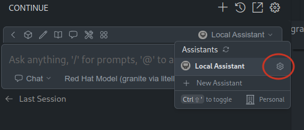
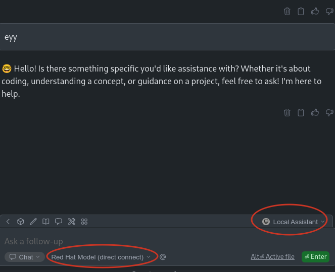
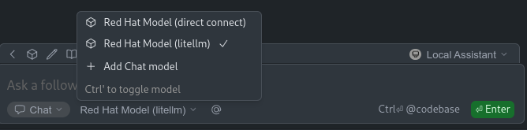
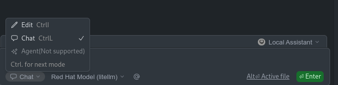
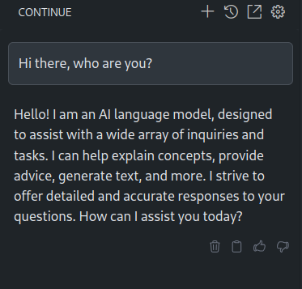
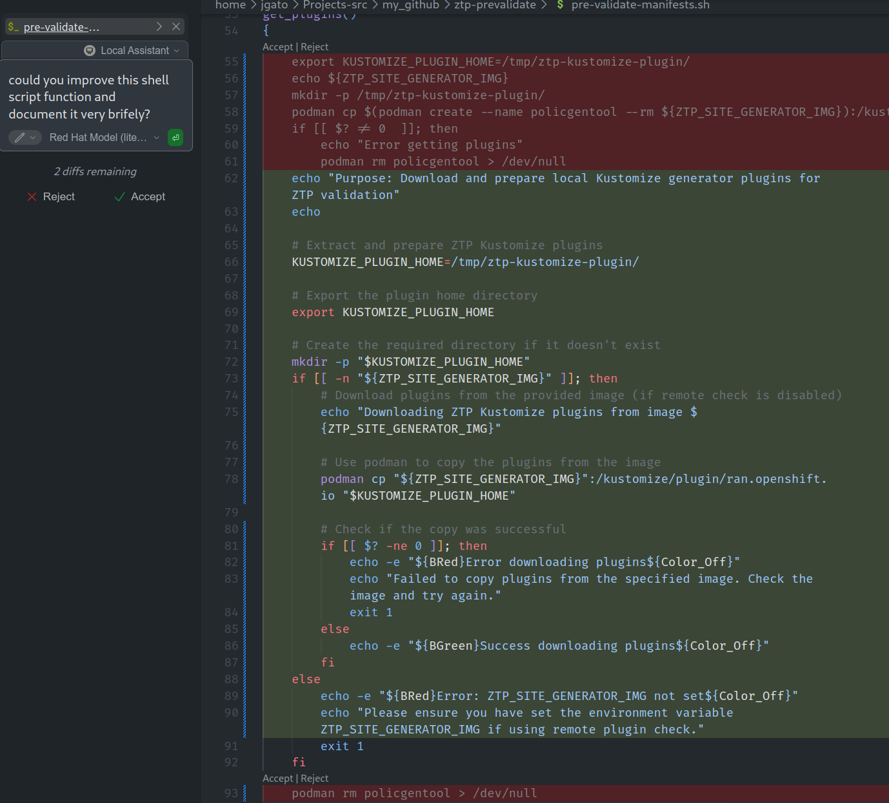

+++
title = "Integrating Red Hat and IBM served models"
date = "2025-06-06"
author = "Jose Gato Luis"
authorTwitter = "jgatoluis" #do not include @
cover = ""
tags = ["openshift", "AI", "LLM"]
keywords = ["openshift", "AI", "LLM"]
description = "Integrating LLM models with different Open Source tools: VistualStudio, Continue and LiteLLM. The objective is to learn how to integrate different tools on a safe 100% OpenSource environment."
showFullContent = false
readingTime = false
hideComments = false
+++


# Integrating Red Hat and IBM served models

Recently, Red Hat/IBM released different AI models, tools and infrastructure. This allow us to play and learn on different activities related to AI. Through an internal platform I asked for some infrastructure to allocate an AI model that I can use on my daily duties. Or at least, to experiment. Something that seems a funny thing to do on a #LearningDay.

Why to use and integrate and external LLM model? I could just use the already integrated Copilot on VS, or, I could just serve it locally with ollama. There are different reasons I could summarize as:
 * Performance and scale: for this demo I will not need to scale, but I dont want to wait several seconds for every request. Neither I want to burn my poor laptop lacking of a GPU.
 * Privacy: because maybe you dont want to (or you are not allowed to) interact (and send your data) to a model running who knows where. Ok, now I am doing it, but on a more reliable environment and using 100% OpenSource.

This is good for experimenting, but if I had to start a more serious project, I would replicate all the environment. Moving to a more controlled cloud environment if needed. Using the same approach, models and technologies.

> As I am using an internal platform, the process of registering and getting the infrastructure is not covered here. If you are a Red Hat colleague, I started [here](https://developer.models.corp.redhat.com).

So, now that I have the model, what I really have is an endpoint and an api key.

For the endpoint, something like:

```
https://granite-3-2-8b-instruct--apicast-staging.apps.i....paas.redhat.com:443/v1/
```

Notice this url will serve the model with routes as: `/v1/completions` or `v1/chat/completions`. Because, the servers export the models using the OpenAI API.

With the endpoint, the model name and the key we can just curl the model. Easy and quick:

```json
> curl -sH "Content-Type: application/json"\
            -d "{ \
              \"model\": \"/data/granite-3.2-8b-instruct\",\
              \"prompt\": \"ey thereeeeeeeeeeeeee\",\
              \"max_tokens\": 700,\
              \"temperature\": 0\
            }"\
            --url "https://granite-3-2-8b-instruct....redhat.com:443/v1/completions"\
            -H "Authorization: Bearer 192829....8edcde" | jq
	
{
  "id": "cmpl-5620b9cca2db4e27b7cad839246110ad",
  "object": "text_completion",
  "created": 1746805780,
  "model": "ibm-granite/granite-3.2-8b-instruct",
  "choices": [
    {
      "index": 0,
      "text": "\n\nHello! I'm an assistant, designed to help answer your questions. I don't have personal experiences or a physical presence, but I'm here to provide information and assistance. How can I help you today?",
      "logprobs": null,
      "finish_reason": "stop",
      "stop_reason": null,
      "prompt_logprobs": null
    }
  ],
  "usage": {
    "prompt_tokens": 10,
    "total_tokens": 55,
    "completion_tokens": 45,
    "prompt_tokens_details": null
  }
}

```

But even if curl is always cool, it does not help very much about integrating and AI model in our daily tasks. Following, I will integrate the model using different tools. The model will be used as a chat bot, code/doc correction and execute some tasks. Of course, everything using **Open Source**.

## Integrate the model into VisualStudio and Continue

My following work is based on a colleague (thanks @EranCohen), who proposed to use Visualstudio and the Continue plugin to create a hub of models.

Continue is an open-source AI code assistant designed to integrate Large Language Models (LLMs) directly into your Integrated Development Environment (IDE).
LitteLLM act as a proxy for different models.


### Try direct connect between Visual Studio and our models

Once you have Continue plugin installed (just a few clicks), you can configure your Local Assistant to interact with different models.

Access to the Continue Local Assistante configuration with:



It will open a new configuration file, that you can fill with something like:

```yaml
name: Local Assistant
version: 1.0.0
schema: v1
models:
  - name: Red Hat Model (direct connect)
    provider: openai
    model: ibm-granite/granite-3.2-8b-instruct
    apiKey: 19282906ec......2ad8edcde
    apiBase: https://granite-3-2-8b-instruct....redhat.com:443/v1/
    systemMessage: You are Granite Chat. You carefully follow instructions and can
      use tools at your disposal to fulfill the request. You always respond to
      greetings with "Hello! I am Granite Chat. How can I help you today?
    contextLength: 32000
context:
  - provider: code
  - provider: docs
  - provider: diff
  - provider: terminal
  - provider: problems
  - provider: folder
  - provider: codebase
```

So, I can chat with it:



Pretty straight forward to integrate the RedHat/IBM serving models platform with VS and Continue.

*By the way, I had to add some Red Hat CA to trust on the server that is serving the model. You know, copy the certs on your OS path and update the certs DB*


### Try with LitteLLM proxy in the middle

Also proposed by @EranCohen, for a better tool to talk to a model, to use LitteLLM in the middle.

LittleLLM proxy helps you to act as a hub for different models, you can switch from one to another depending on the needs. You can use one model completion, other for chatting, etc.

Some quick instructions will be:

```bash
> git clone https://github.com/BerriAI/litellm
> cd litellm

```

Now lets create the proxy configuration:

```
> cat litellm_config.yaml
model_list:
  - model_name: gpt-4o
    litellm_params:
      model: hosted_vllm/ibm-granite/granite-3.2-8b-instruct
      api_base: https://granite-3-2-8b-instruct--apicast-staging......paas.redhat.com:443/v1/
      api_key: 192.....cde

litellm_settings:
  ssl_verify: "/etc/ssl/certs/2022-IT-Root-CA.pem"
  drop_params: true

```

 * `model_name` Here I am not 100% sure, I am using `gpt-4o` to later make it work in agent mode. According to [this](https://docs.continue.dev/agent/model-setup). But it should be the model name to be used, when making a request to the proxy.
 * `model` It is in the format of "provider/model". In my case, because I am using this experimentation infrastructure, I know that is served using vLLM. I can use the [provider VLLM](https://docs.litellm.ai/docs/providers/vllm).
 * `api_base` and `api_key`that I obtained from our internal infrastructure and services.
 
Notice, I have added some configuration to use the Red Hat CA. That I will mount inside the container.

So, now I can run the proxy in a container, passing the LiteLLM config and the CA:

```bash
> podman run -v $(pwd)/litellm_config.yaml:/app/config.yaml\
	-v $(pwd)/redhat-ca/2022-IT-Root-CA.pem:/etc/ssl/certs/2022-IT-Root-CA.pem:ro\
	-p 4000:4000\
	--privileged ghcr.io/berriai/litellm:main-latest\
	--config /app/config.yaml --detailed_debug       
```

Now, I can directly interact with the proxy. For example, using the `/chat/completions/`:

```json
> curl -s --location 'http://0.0.0.0:4000/chat/completions' \
   --header 'Content-Type: application/json' \
   --data '{
    "model": "Red Hat Model",
    "messages": [
        {
        "role": "user",
        "content": "Hi there, how is going?"
        }
    ]
}' | jq
{
  "id": "chatcmpl-bb08825889bd4629ac1e709ce99b2ae1",
  "created": 1746803998,
  "model": "hosted_vllm/ibm-granite/granite-3.2-8b-instruct",
  "object": "chat.completion",
  "system_fingerprint": null,
  "choices": [
    {
      "finish_reason": "stop",
      "index": 0,
      "message": {
        "content": "Greetings! I'm an artificial intelligence and don't have feelings, but I'm functioning optimally and ready to assist you. How can I help you today?",
        "role": "assistant",
        "tool_calls": null,
        "function_call": null
      }
    }
  ],
  "usage": {
    "completion_tokens": 39,
    "prompt_tokens": 66,
    "total_tokens": 105,
    "completion_tokens_details": null,
    "prompt_tokens_details": null
  },
  "service_tier": null,
  "prompt_logprobs": null
}

```

Now, lets integrate the LiteLLM proxy with our Continue Local Assistant. We can add a new model (to our previous created Continue configuration) provided through LiteLLM proxy:

```yaml
name: Local Assistant
version: 1.0.0
schema: v1
models:
  - name: Red Hat Model (litellm)
    provider: openai
    model: gpt-4o
    apiKey: ..........
    apiBase: http://127.0.0.1:4000/v1/
    systemMessage: You are Granite Chat. You carefully follow instructions and can
      use tools at your disposal to fulfill the request. You always respond to
      greetings with "Hello! I am Granite Chat. How can I help you today?
    contextLength: 32000
  - name: Red Hat Model (direct connect)
    provider: openai
    model: ibm-granite/granite-3.2-8b-instruct
    apiKey: ........
    apiBase: https://granite-3-2-8b-instruct--apicast.....paas.redhat.com:443/v1/
    systemMessage: You are Granite Chat. You carefully follow instructions and can
      use tools at your disposal to fulfill the request. You always respond to
      greetings with "Hello! I am Granite Chat. How can I help you today?
    contextLength: 32000
context:
  - provider: code
  - provider: docs
  - provider: diff
  - provider: terminal
  - provider: problems
  - provider: folder
  - provider: codebase

```

My Local Assistant is now configured with two models.



And different ways to interact, like edit, chat, or agent:



Lets just give some greetings:



## Working with the model

Now, that I have the model integrated in different ways, I can use for different tasks. Because chat with is cool, but not enough. So, I want to make it help me with some daily tasks. Here I have a shell script far from been perfect. So, I will ask Granite for help me to improve it:



It is quite impressive how added some comments about what is happening in the script. Also, some outputs to help following the script execution. Finally, it added a lot of checks to make the script much more robust.
Not bad for a quick try. I can add the model to my daily activities and.... in a safe 100% OpenSource environment performing pretty well.  

# To be continued

As a second phase, for another blog entry, I would like to go further using the Agent mode and configuring some [MCP](https://modelcontextprotocol.io/introduction). That is the way of adding more context (like a kind of RAG) but also executing actions.

In principle, VisualStudio comes with some pre builtin functions to execute actions, and I started to configure an MCP to interact with my GitHub account. My intention is to make the agent to do a PR to my blog's repo to publish it. But, I am having some problems with the agent mode trying to execute MCP's tools. So, I keep this for a second round of the blog.

# Conclusions

Finally, due to the fact that I am writing this article from VisualStudio, I will let the model to write the final conclusions. So, he gets also some authoring in the blog:

*As I explored integrating Red Hat and IBM AI tools into my daily tasks using Visual Studio and the Continue plugin, I was able to successfully connect directly to an AI model for various applications, such as chatbot functionality, code/doc correction, and task execution, all through open-source means. This endeavor has significantly augmented my productivity, providing quicker access to insights and improving my overall coding experience within a familiar environment.*

*Utilizing the LittleLLM proxy as an intermediary allowed me to easily switch between different AI models according to specific task requirements. This flexibility was particularly beneficial in scenarios necessitating optimized models for various functions.*

*The journey with AI integration has highlighted its potential beyond mere conversational entities. By employing advanced modes like Agent Mode and leveraging tools such as MCP (Model Context Protocol), AI can further assist in intricate tasks like automated pull requests or complex data manipulations, thereby revolutionizing its role in software development and maintenance. The road ahead promises exciting possibilities in harnessing AI's true power within development workflows.*

Again me: I dont think this has augmented my productivity, or not yet ;)
