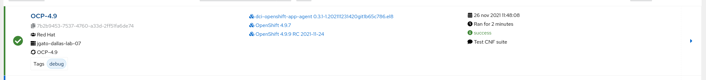

+++
title = "DCI Openshift App Agent"
date = "2022-09-16T11:19:12+02:00"
author = "Jose Gato Luis"
authorTwitter = "jgatoluis" #do not include @
cover = ""
tags = ["openshift", "dci", "automation"]
keywords = ["", ""]
description = "DCI Agents helps you to run any kind of test or application in a Openshift existing deployment."
showFullContent = false
readingTime = false
hideComments = false
+++


# DCI Openshift App Agent

This DCI Agents helps you to run any kind of test or application in a Openshift existing deployment.

Where to run it? In you usual provisioner, bastion, or supporting host to manage your Openshift Cluster. *During the ramp-up, usually we can use the lab-installer from our plan deployment*.

Requirements for the provisioner:

* Be running the latest stable RHEL release (**8.4 or higher**) and registered via RHSM

  * I have tested with CentOS and it works ok

* Ansible 2.9 (See section Newer Ansible Versions for newer Ansible versions)

* Access to the Internet, it could be through a proxy. Check our lab config to configure the proxy.

* Access to the following repositories:

  - epel
  - dci-release
  - baseos-rpms
  - appstream-rpms

* Podman 3.0

* kubernetes python module

If you created your provisioner with a kcli plan, mostly all of these requirement are already ok. Even the proxy configuration. So you only have to install the following in your provisioner (or lab-installer) host:

```bash
dnf -y install https://dl.fedoraproject.org/pub/epel/epel-release-latest-8.noarch.rpm
dnf -y install https://packages.distributed-ci.io/dci-release.el8.noarch.rpm
dnf -y install python3-kubernetes
dnf -y install dci-openshift-app-agent
```

## DCI Console and remote CIS

[Visit the DCI Console](https://www.distributed-ci.io/) to create your new remote CIS that will be used by the agent.


Once it is created take your credentials information.

## Configure Agent credentials

Edit the file '/etc/dci-openshift-app-agent/dcirc.sh' with your new credentials

```
#!/usr/bin/env bash
DCI_CS_URL="https://api.distributed-ci.io/"
DCI_CLIENT_ID=remoteci/<remoteci_id>
DCI_API_SECRET=<remoteci_api_secret>
export DCI_CLIENT_ID
export DCI_API_SECRET
export DCI_CS_URL
```

## Running tests

You will need access to the KUBECONFIG from the user 'dci-openshift-app-agent'. This will depend on your installation, but something like:

```
# mkdir /var/lib/dci-openshift-app-agent/.kube
# cp /root/ocp/auth/kubeconfig /var/lib/dci-openshift-app-agent/.kube/config
# chown -R dci-openshift-app-agent: /var/lib/dci-openshift-app-agent/.kube
# su - dci-openshift-app-agent
```

And run the agent manually:

```bash
su - dci-openshift-app-agent
dci-openshift-app-agent-ctl -s
```

The first time you run it, it will fail. This is on purpose to make you understand how it works. You can just add (empty) missing files or skip the steps.

The agent will run  tags (from a job, like steps to accomplish a job) for a set of configured tests. Possible tags: `job`, `dci`, `kubeconfig`, `pre-run`, `redhat-pre-run`, `partner-pre-run`, `install`, `running`, `testing`, `redhat-testing`, `partner-testing`, `post-run`, `succes`

The main entry point when running jobs is the file `/usr/share/dci-openshift-app-agent/dci-openshift-app-agent.yml` which defines what to do depending on the selected tags. A little exmple:

```yaml
# Step 2 : "running" step
- name: "Execute install step"
  hosts: jumphost
  tags:
    - install
    - running
  environment:
    KUBECONFIG: "{{ kubeconfig_path }}"
  tasks:
    - block:
        - name: Set job state - running
          dci_job:
            id: "{{ job_id }}"
            status: "running"
          tags: [dci]

        - name: "Execute install play"
          include_tasks: 'plays/install.yml'

        - name: "Execute install hook"
          include_tasks: "{{ dci_config_dir }}/hooks/install.yml"

      rescue: &failure_with_upload_logs
        - name: "Execute the teardown process"
          include_tasks: "{{ dci_config_dir }}/hooks/teardown.yml"
          when:
            - dci_teardown_on_failure
            - check_teardown.stat.exists

        - name: "Execute the failure process"
          include_tasks: plays/failure.yml
```

This step is making use of a hook install.yml and teardown.yml

By default the hooks are stored in `/etc/dci-openshift-app-agent/hooks/` with an structure like this:

```bash
├── hooks
│   ├── pre-run.yml
│   ├── install.yml
│   ├── tests.yml
│   ├── post-run.yml
│   └── teardown.yml
```

But you can create your own hooks directory.

## Running your own tests

The installation comes with some example jobs in `/var/lib/dci-openshift-app-agent/samples/`.

You can edit `/etc/dci-openshift-app-agent/settings.ym` to point to the configuration directory of some of these example.

Or you can create whatever other settings file and run the agent with -c FILE_WITH_ABSOLUTE_PATH.

```yaml
dci_topic: OCP-4.9
dci_components_by_query: ['name:4.9.7']
dci_comment: "Test webserver"
dci_openshift_app_ns: testns
dci_config_dir: /var/lib/dci-openshift-app-agent/samples/basic_example
```

This example it just create a webserver, test it works and delete it.

* dci_topic: where are testing OCP 4.9

* dci_components_by_query:  A component is an artifact (file, package, url, etc.) attached to a topic. An agent take components in its workflow. Those components are immutable and regularly updated with newer versions of the artifact through a feeder.

* dci_comment: just a message that can be used to know what the test did.

* dci_openshift_app_ns: the namespace where the different K8S will be created/testeed/deleted

* dci_config_dir: the directory with the hooks for the tests

```bash
dci-openshift-app-agent-ctl -s
# or
dci-openshift-app-agent-ctl -s -c NEW_CONFIG_FILE
```

When everything is finished you can see the resoults in the output and in the web console:

## Running CNF tests

Some special tests we will have to manage are about CNF testes. The settings.yaml

```yaml
dci_topic: OCP-4.8
dci_components_by_query: ['name:4.8.13']
dci_comment: "Test CNF suite"
dci_openshift_app_ns: testns
dci_config_dir: /var/lib/dci-openshift-app-agent/samples/tnf_test_example
dci_openshift_app_image: quay.io/testnetworkfunction/cnf-test-partner:latest
tnf_suites: "diagnostic access-control networking lifecycle observability platform-alteration"
tnf_targetpodlabels: [test-network-function/environment=testing]s
```

This test will use a discovery mechanisms based on tags. So you have to tag properly your nodes, something like:

```bash
for i in `seq 0 2`
> do
> oc label node lab-master-$i role=partner
> done
```

But it would depend on your installation.

The output:

```bash
PLAY RECAP *******************************************************************************************************************
jumphost                   : ok=70   changed=20   unreachable=0    failed=0    skipped=30   rescued=0    ignored=1
```

This is how you see it from the web console



# DCI Openshift Agent

**Notice: DCI Openshift Agent is related to install/test/update OCP4 installation, and it is not covered in this tutorial**

DCI agent for OCP4 will be in charge of automatic CI process over your cluster. DCI, aims to automatically deploy and test RedHat Products (like new versions of OCP). The DCI Openshift Agent is in charge of deploying OCP4.

What?: Using this agent you can deploy and test new updates of OCP4.

Who?: Red Hat deployments, but also partners.

Why? To test OCP in your own hardware and configuratoin. Partners? This allows them to also test their products and solutions installed in OCP4. This facilitates his certification of products making tests previous to a new release, and be prepared for that.

Other advantes:

1. Automation of nightly/candidate OCP component testing
2. CI runs on your own hardware
3. Red Hat doesn't have access to your hardware, the agent reports metrics/logs
   back to distributed-ci.io
4. The agent leverages the OpenShift IPI Installer which in turn is based on
   proven ansible tech
5. You have access to all your jobs logs and metrics through distributed-ci.io
   where you can also set notifications for errors/exceptions
