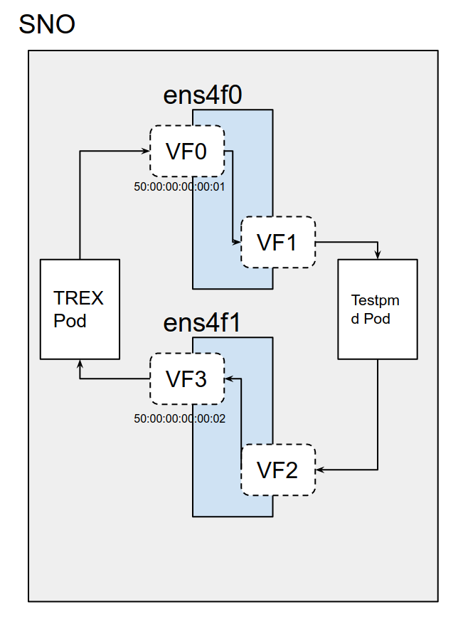
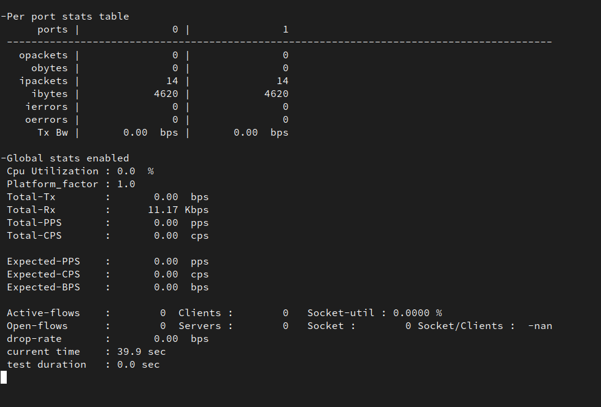
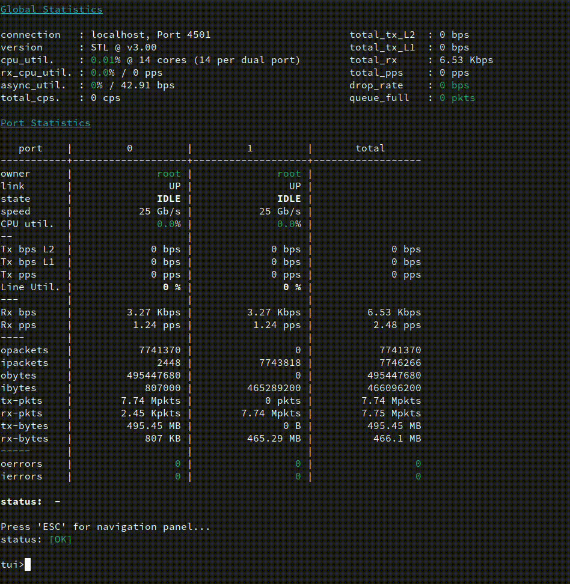

# Configuring SRIOV Intel E810 NIC with ZTP.

In this tutorial we will see the different steps to use ZTP, to configure Intel E810 NICs from an Openshift cluster. It covers:

* Deploy an Single Node Openshift with ZTP

* Checking your E810 available cards and ports

* Automatically configure your E810 cards with ZTP. 

As our SNO, we will use a server HPE DL380 with some Intel E810 cards. These are pretty new card, that for example, will need latest versions of the traffic simulator.

The SNO deployment and configuration will be done using [Red Hat ZTP](https://access.redhat.com/documentation/en-us/openshift_container_platform/4.10/html/scalability_and_performance/ztp-deploying-disconnected) (Zero Touch Provisioning). Which is based on ACM (Advanced Cluster Management), ArgoCD (to sync a git repository with an Openshift/Kubernetes cluster) and a set of tools called ZTP. These tools provide two new CRs, one for defining clusters (Siteconfig) and other for defining policies/configurations (PolicyGenTemplate)

Finally, with the cluster deployed and the SRIOV cards configured, we will run some tests. 

# Deploy an SNO using ZTP SiteConfig

If you are familiar with ZTP, there is nothing special here. We define the SNO with a ZTP SiteConfig. If you want to learn more about ZTP you will find more info [here](https://docs.openshift.com/container-platform/4.10/scalability_and_performance/ztp-deploying-disconnected.html)

```yaml
---
apiVersion: ran.openshift.io/v1
kind: SiteConfig
metadata:
  name: "intel-1-sno-1"
  namespace: "intel-1-sno-1"
spec:
  baseDomain: "hubcluster-1.lab.eng.cert.redhat.com"
  pullSecretRef:
    name: "assisted-deployment-pull-secret"
  clusterImageSetNameRef: "img4.9.18-x86-64-appsub"
  sshPublicKey: "ssh-rsa AAAAB3....gs= jgato@provisioner.el8k.hpecloud.org"
  clusters:
  - clusterName: "intel-1-sno-1"
    clusterLabels:
      common: "true"
      du-profile: "v4.9"
      #      group-du-sno: ""
      sites : "intel-1-sno-1"
    networkType: "OVNKubernetes"
    clusterNetwork:
      - cidr: 10.136.0.0/14
        hostPrefix: 23
    machineNetwork:
      - cidr: 192.168.24.0/25
    serviceNetwork:
      - 172.31.0.0/16
    additionalNTPSources:
      - 192.168.24.80
    nodes:
      - hostName: "intel-1-sno-1.hubcluster-1.lab.eng.cert.redhat.com"
        role: master
        bmcAddress: redfish-virtualmedia://<BMC_IP>/redfish/v1/Systems/1
        bmcCredentialsName:
          name: "intel-1-sno-1-bmc-secret"
        bootMACAddress: "94:40:c9:c1:eb:48"
        bootMode: "UEFI"
        rootDeviceHints:
          deviceName: /dev/sda
        nodeNetwork:
          config:
            interfaces:
              - name: eno5
                type: ethernet
                state: up
                ipv4:
                  enabled: true
                  dhcp: false
                  address:
                    - ip: <SERVER_IP>
                      prefix-length: 25
                ipv6:
                  enabled: false
            dns-resolver:
              config:
                server:
                  - <DNS>
            routes:
              config:
                - destination: 0.0.0.0/0
                  next-hop-address: <GATEWAY>
                  next-hop-interface: eno5
          interfaces:
            - name: "eno5"
              macAddress: "94:40:c9:c1:eb:48"
```

# Configure the SNO using ZTP PolicyGenTemplates

ZTP makes uses of PolicyGenTemplates to make different configurations. Like installing different Operators and its configurations. 

When installing a RAN server using ZTP, we usually use a kind of common PGT (PolicyGenTemplate) which installs different common operators:

```yaml
apiVersion: ran.openshift.io/v1
kind: PolicyGenTemplate
metadata:
  name: "common-rangen-4.9"
  namespace: "ztp-common"
spec:
  bindingRules:
    # These policies will correspond to all clusters with this label:
    common: "true"
    du-profile: "v4.9"
  sourceFiles:
    # Create operators policies that will be installed in all clusters
    - fileName: SriovSubscription.yaml
      policyName: "subscriptions-policy"
    - fileName: SriovSubscriptionNS.yaml
      policyName: "subscriptions-policy"
    - fileName: SriovSubscriptionOperGroup.yaml
      policyName: "subscriptions-policy"
    - fileName: PtpSubscription.yaml
      policyName: "subscriptions-policy"
    - fileName: PtpSubscriptionNS.yaml
      policyName: "subscriptions-policy"
    - fileName: PtpSubscriptionOperGroup.yaml
      policyName: "subscriptions-policy"
    - fileName: PaoSubscription.yaml
      policyName: "subscriptions-policy"
      spec:
        channel: "4.9"
    - fileName: PaoSubscriptionNS.yaml
      policyName: "subscriptions-policy"
    - fileName: PaoSubscriptionOperGroup.yaml
      policyName: "subscriptions-policy"
    - fileName: ClusterLogNS.yaml
      policyName: "subscriptions-policy"
    - fileName: ClusterLogOperGroup.yaml
      policyName: "subscriptions-policy"
    - fileName: ClusterLogSubscription.yaml
      policyName: "subscriptions-policy"
    - fileName: StorageNS.yaml
      policyName: "subscriptions-policy"
    - fileName: StorageOperGroup.yaml
      policyName: "subscriptions-policy"
    - fileName: StorageSubscription.yaml
      policyName: "subscriptions-policy"
    - fileName: ReduceMonitoringFootprint.yaml
      policyName: "config-policy"
```

This PGT install many different operators, including the SRIOV one. Following PGTs will configure these operators. Some of these operators will be slightly covered on this tutorial. But, we will focus on the part of SRIOV.

## Configuring PerformanceProfile

We will use the PerformanceProfile Operator to configure the PerformanceProfile for the server. We need to set which CPUS are going to be used by the platform, and which ones we keep for the workloads (our DPDK SRIOV Tests). We will also need to have Hugepages configured for later workloads. 

According lcpu 

```
NUMA node0 CPU(s):   0-23,48-71
NUMA node1 CPU(s):   24-47,72-95
```

The ',' separates the CPUS and the sibling. So, hyper threading is enabled. The sibling of each CPU can be obtained:

```bash
$> cat /sys/devices/system/cpu/cpu0/topology/core_cpus_list
0,48
$> cat /sys/devices/system/cpu/cpu4/topology/core_cpus_list
4,52
$> cat /sys/devices/system/cpu/cpu12/topology/core_cpus_list
12,60
```

We need 8 Reserved CPU for regular processes. But having in mind, that we have to pair also the siblings. So:

* Take 2 from each NUMA:  
  
  * From NUMA 0: CPUs 0 and 1, and their siblings 48, 49
  
  * From NUMA 1: CPUs 24 and 25 and their siblings 72,73

All the other CPUs to the isolated. These have the lowest latency. Processes in this group have no interruptions and so can, for example, reach much higher DPDK zero packet loss bandwidth. We also disable IRQs on these CPUs with 'globallyDisableIrqLoadBalancing: true'

In the PGT

```yaml
  - fileName: PerformanceProfile.yaml                                             
    metadata:                                                                     
      annotations:                                                                
        kubeletconfig.experimental: |                                             
          {"systemReserved": {"memory": "4Gi"}}                                   
      name: sno-perfprofile                                                       
    policyName: perfprofile-policy                                                
    spec:                                                                         
      additionalKernelArgs:                                                       
      - rcupdate.rcu_normal_after_boot=0                                          
      - idle=poll                                                                 
      cpu:                                                                        
        isolated: 2-23,26-47,50-71,74-95                                          
        reserved: 0,1,24,25,48,49,72,73                                           
# NUMA node0 CPU(s):   0-23,48-71                                                 
# NUMA node1 CPU(s):   24-47,72-95                                                                                                                                                                                                                            
      globallyDisableIrqLoadBalancing: true                                      
      hugepages:                                                                  
        defaultHugepagesSize: 1G                                                  
        pages:                                                                    
        - count: 32                                                               
          size: 1G                                                                
      machineConfigPoolSelector:                                                  
        pools.operator.machineconfiguration.openshift.io/master: ""               
      nodeSelector:                                                               
        node-role.kubernetes.io/master: ""                                        
      numa:                                                                       
        topologyPolicy: single-numa-node                                          
      realTimeKernel:                                                             
        enabled: true                   
```

Here the ',' in isolated and reserved are just enumerating CPUs. 

you can check that ssh into the node:

```bash
# cat  /proc/cmdline
BOOT_IMAGE=(hd0,gpt3)/ostree/rhcos-56fabc639a679b757ebae30e5f01b2ebd38e9fde9ecae91c41be41d3e89b37f8/vmlinuz-4.18.0-305.34.2.rt7.107.el8_4.x86_64 random.trust_cpu=on console=tty0 console=ttyS0,115200n8 ignition.platform.id=metal ostree=/ostree/boot.1/rhcos/56fabc639a679b757ebae30e5f01b2ebd38e9fde9ecae91c41be41d3e89b37f8/0 ip=eno5:dhcp root=UUID=1080762e-38cc-49d9-be5c-3b5e70a157ac rw rootflags=prjquota skew_tick=1 nohz=on 
rcu_nocbs=2-23,26-47,50-71,74-95 
tuned.non_isolcpus=00000300,00030000,03000003 intel_pstate=disable nosoftlockup tsc=nowatchdog intel_iommu=on iommu=pt 

isolcpus=managed_irq,2-23,26-47,50-71,74-95 

systemd.cpu_affinity=0,1,72,73,48,49,24,25 

default_hugepagesz=1G hugepagesz=1G hugepages=32 idle=poll rcupdate.rcu_normal_after_boot=0 nohz_full=4-31,36-95 crashkernel=512M

#  grep HugePages_ /proc/meminfo
HugePages_Total:      32
HugePages_Free:       32
HugePages_Rsvd:        0
HugePages_Surp:        0
# 
```


## Configuring SRIOV

### Understanding server SRIOV NIC configuration

When the SRIOV operator is installed, we can check the available NIC devices:

```yaml
$> oc get sriovnetworknodestates.sriovnetwork.openshift.io -n openshift-sriov-network-operator  -o yaml
apiVersion: v1
items:
- apiVersion: sriovnetwork.openshift.io/v1
  kind: SriovNetworkNodeState
  metadata:
    creationTimestamp: "2022-08-04T13:25:08Z"
    generation: 2
    name: intel-1-sno-1.hubcluster-1.lab.eng.cert.redhat.com
    namespace: openshift-sriov-network-operator
    ownerReferences:
    - apiVersion: sriovnetwork.openshift.io/v1
      blockOwnerDeletion: true
      controller: true
      kind: SriovNetworkNodePolicy
      name: default
      uid: 92af4999-d2ba-4348-b306-4ed164851cfd
    resourceVersion: "43108570"
    uid: 0c36b30e-0fbd-4602-bda8-9cf04aee97f0
  status:
    interfaces:
    - deviceID: "1657"
      driver: tg3
      linkSpeed: -1 Mb/s
      linkType: ETH
      mac: b4:7a:f1:dc:08:54
      mtu: 1500
      name: eno1
      pciAddress: "0000:02:00.0"
      vendor: "14e4"
    - deviceID: "1657"
      driver: tg3
      linkSpeed: -1 Mb/s
      linkType: ETH
      mac: b4:7a:f1:dc:08:55
      mtu: 1500
      name: eno2
      pciAddress: "0000:02:00.1"
      vendor: "14e4"
...
...
...
    - deviceID: "1593"
      driver: ice
      linkSpeed: -1 Mb/s
      linkType: ETH
      mac: b4:96:91:a3:f2:c3
      mtu: 1500
      name: ens1f3
      pciAddress: "0000:37:00.3"
      totalvfs: 64
      vendor: "8086"
    - deviceID: "1015"
      driver: mlx5_core
      linkSpeed: 25000 Mb/s
      linkType: ETH
      mac: 94:40:c9:c1:eb:48
      mtu: 1500
      name: eno5
      pciAddress: 0000:5d:00.0
      vendor: 15b3
    - deviceID: "1015"
      driver: mlx5_core
      linkSpeed: 25000 Mb/s
      linkType: ETH
      mac: 94:40:c9:c1:eb:49
      mtu: 1500
      name: eno6
      pciAddress: 0000:5d:00.1
      vendor: 15b3

    - deviceID: "1593"
      driver: ice
      linkSpeed: 25000 Mb/s
      linkType: ETH
      mac: b4:96:91:a3:ef:e9
      mtu: 1500
      name: ens4f1
      pciAddress: 0000:86:00.1
      totalvfs: 64
      vendor: "8086"
...
...
...
    - deviceID: "1592"
      driver: ice
      linkSpeed: -1 Mb/s
      linkType: ETH
      mac: b4:96:91:ad:83:c1
      mtu: 1500
      name: ens5f1
      pciAddress: 0000:af:00.1
      totalvfs: 128
      vendor: "8086"
    syncStatus: Succeeded
kind: List
metadata:
  resourceVersion: ""
  selfLink: ""
```

We are only interested on Intel and E810 NIC Cards for this tutorial.

Some IDs to locate the NICs in the Server:

* Vendor: 8086 INTEL

* deviceID: 1889 VFS

* deviceID: 1593  Ethernet Controller E810-C for SFP (XXVDA4)

* deviceID: 1592  Ethernet Controller E810-C for QSFP (CQDA4)

* deviceID: 1657

You can get more about that on [devicehunt](https://devicehunt.com/).

We see there are multiple interfaces. For example, in this server there are 8 interfaces for the Intel and Identifier 1593: 

```bash
$> oc get sriovnetworknodestates.sriovnetwork.openshift.io -n openshift-sriov-network-operator  -o yaml | grep 1593 -A 9 | grep name 
      name: ens1f0
      name: ens1f1
      name: ens1f2
      name: ens1f3
      name: ens4f0
      name: ens4f1
      name: ens4f2
      name: ens4f3
```

So, there really exists 2 cards (ens1 and ens4) with 4 physical ports each. Therefore, it is like 8 different NICs with their own MACs and configurations. Each one, supporting different virtual ports/interfaces (vfs) to be attached to PODs:

```bash
$> oc get sriovnetworknodestates.sriovnetwork.openshift.io -n openshift-sriov-network-operator  -o yaml | grep 1593 -A 9 | grep 'name\|totalvfs'
      name: ens1f0
      totalvfs: 64
      name: ens1f1
      totalvfs: 64
      name: ens1f2
      totalvfs: 64
      name: ens1f3
      totalvfs: 64
      name: ens4f0
      totalvfs: 64
      name: ens4f1
      totalvfs: 64
      name: ens4f2
      totalvfs: 64
      name: ens4f3
      totalvfs: 64
```

There are another 2 cards (en2 and ens5) for intel deviceID 1592, with 2 ports each.

```bash
$> oc get sriovnetworknodestates.sriovnetwork.openshift.io -n openshift-sriov-network-operator  -o yaml | grep 1592 -A 9 | grep name 
      name: ens2f0
      name: ens2f1
      name: ens5f0
      name: ens5f1
```

But, not all the ports are wired/connected in the 1593 card (linkSpeed -1)

```yaml
    - deviceID: "1593"
      driver: ice
      linkSpeed: -1 Mb/s
      linkType: ETH
      mac: b4:96:91:a3:ef:ea
      mtu: 1500
      name: ens4f2
      pciAddress: 0000:86:00.2
      totalvfs: 64
      vendor: "8086"
    - deviceID: "1593"
      driver: ice
      linkSpeed: -1 Mb/s
      linkType: ETH
      mac: b4:96:91:a3:f2:c3
      mtu: 1500
      name: ens1f3
      pciAddress: "0000:37:00.3"
      totalvfs: 64
      vendor: "8086"
```

But the first and second port are connected with 25000 Mb/s:

```yaml
    - deviceID: "1593"
      driver: ice
      linkSpeed: 25000 Mb/s
      linkType: ETH
      mac: b4:96:91:a3:ef:e8
      mtu: 1500
      name: ens4f0
      numVfs: 8
      pciAddress: 0000:86:00.0
      totalvfs: 64
      vendor: "8086"
    - deviceID: "1593"
      driver: ice
      linkSpeed: 25000 Mb/s
      linkType: ETH
      mac: b4:96:91:a3:ef:e9
      mtu: 1500
      name: ens4f1
      pciAddress: 0000:86:00.1
      totalvfs: 64
      vendor: "8086"
```

We can do the same for the other Intel Card with id 1592:

```bash
> oc get sriovnetworknodestates.sriovnetwork.openshift.io -n openshift-sriov-network-operator  -o yaml | grep 1592 -A 9 | grep 'name\|totalvfs'
      name: ens2f0
      totalvfs: 128
      name: ens2f1
      totalvfs: 128
      name: ens5f0
      totalvfs: 128
      name: ens5f1
      totalvfs: 128
```

In this case, we have two cards (ens2 and ens5) with two ports each.

```yaml
    - deviceID: "1592"
      driver: ice
      linkSpeed: -1 Mb/s
      linkType: ETH
      mac: b4:96:91:a4:0a:78
      mtu: 1500
      name: ens2f0
      pciAddress: "0000:12:00.0"
      totalvfs: 128
      vendor: "8086"
    - deviceID: "1592"
      driver: ice
      linkSpeed: -1 Mb/s
      linkType: ETH
      mac: b4:96:91:a4:0a:79
      mtu: 1500
      name: ens2f1
      pciAddress: "0000:12:00.1"
      totalvfs: 128
      vendor: "8086"
    - deviceID: "1592"
      driver: ice
      linkSpeed: -1 Mb/s
      linkType: ETH
      mac: b4:96:91:ad:83:c0
      mtu: 1500
      name: ens5f0
      pciAddress: 0000:af:00.0
      totalvfs: 128
      vendor: "8086"
    - deviceID: "1592"
      driver: ice
      linkSpeed: -1 Mb/s
      linkType: ETH
      mac: b4:96:91:ad:83:c1
      mtu: 1500
      name: ens5f1
      pciAddress: 0000:af:00.1
      totalvfs: 128
      vendor: "8086"
```

In this case, the 4 ports are disconnected. In this moment, we cannot use/configure that card.

Other way of inspecting the server. You can connect/ssh there and:

```bash
# lspci -nnvv | grep  8086:1592
12:00.0 Ethernet controller [0200]: Intel Corporation Ethernet Controller E810-C for QSFP [8086:1592] (rev 02)
12:00.1 Ethernet controller [0200]: Intel Corporation Ethernet Controller E810-C for QSFP [8086:1592] (rev 02)
af:00.0 Ethernet controller [0200]: Intel Corporation Ethernet Controller E810-C for QSFP [8086:1592] (rev 02)
af:00.1 Ethernet controller [0200]: Intel Corporation Ethernet Controller E810-C for QSFP [8086:1592] (rev 02)

# ip a s | grep 'ens4\|ens1\|ens2\|ens5'
6: ens2f0: <NO-CARRIER,BROADCAST,MULTICAST,UP> mtu 1500 qdisc mq state DOWN group default qlen 1000
7: ens2f1: <NO-CARRIER,BROADCAST,MULTICAST,UP> mtu 1500 qdisc mq state DOWN group default qlen 1000
10: ens1f0: <BROADCAST,MULTICAST,UP,LOWER_UP> mtu 1500 qdisc mq state UP group default qlen 1000
11: ens1f1: <BROADCAST,MULTICAST,UP,LOWER_UP> mtu 1500 qdisc mq state UP group default qlen 1000
12: ens1f2: <NO-CARRIER,BROADCAST,MULTICAST,UP> mtu 1500 qdisc mq state DOWN group default qlen 1000
13: ens1f3: <NO-CARRIER,BROADCAST,MULTICAST,UP> mtu 1500 qdisc mq state DOWN group default qlen 1000
14: ens4f0: <BROADCAST,MULTICAST,UP,LOWER_UP> mtu 1500 qdisc mq state UP group default qlen 1000
15: ens4f1: <BROADCAST,MULTICAST,UP,LOWER_UP> mtu 1500 qdisc mq state UP group default qlen 1000
16: ens4f2: <NO-CARRIER,BROADCAST,MULTICAST,UP> mtu 1500 qdisc mq state DOWN group default qlen 1000
17: ens4f3: <NO-CARRIER,BROADCAST,MULTICAST,UP> mtu 1500 qdisc mq state DOWN group default qlen 1000
18: ens5f0: <NO-CARRIER,BROADCAST,MULTICAST,UP> mtu 1500 qdisc mq state DOWN group default qlen 1000
19: ens5f1: <NO-CARRIER,BROADCAST,MULTICAST,UP> mtu 1500 qdisc mq state DOWN group default qlen 1000
```

you can use ip command to see which interfaces are connected or not (UP or DOWN)

### Creating PGT for virtual devices and networks

Now we have a clear picture of the server NICs. Summary:

- (1592 CQDA4) Ethernet Controller E810-C for QSFP
  
  - ens2 and ens5 both ports disconnected

- (1593 XXVDA4) Intel Ethernet Controller E810-C for SFP
  
  - ens1f0 connected
  
  - ens4f0 connected
  
  - ens4f1 connected
  
  - ens4f2 disconnected
  
  - ens4f3 disconnected
  
  - ens1f1 connected
  
  - ens1f2 disconnected
  
  - ens1f3 disconnected

We only have 4 available NICs, but we can use SRIOV and VFS to split this cards into multiple network interface. Each virtual network interface is assigned with a number of VFS. And each one exposed to be used by PODs with a network attached.

With all these devices we could create different network devices and networks. Following, we show an example to get some VFs from ens4f0/ens4f1 and creating two networks. This will be used later in the example 'Playing with DPDK'. 

```yaml
---
apiVersion: ran.openshift.io/v1
kind: PolicyGenTemplate
metadata:
  name: intel-1-sno-1-test-dpdk
  namespace: ztp-site
spec:
  bindingRules:
    name: intel-1-sno-1
  mcp: master
  sourceFiles:
  - fileName: SriovNetworkNodePolicy.yaml
    metadata:
      name: e810-ens4f0
    policyName: sriov-netdevice-policy
    spec:
      deviceType: vfio-pci
      nicSelector:
        deviceID: "1593"
        pfNames:
        - ens4f0
        vendor: "8086"
      numVfs: 8
      resourceName: e810_ens4f0
  - fileName: SriovNetworkNodePolicy.yaml
    metadata:
      name: e810-ens4f1
    policyName: sriov-netdevice-policy
    spec:
      deviceType: vfio-pci
      nicSelector:
        deviceID: "1593"
        pfNames:
        - ens4f1
        vendor: "8086"
      numVfs: 8
      resourceName: e810_ens4f1
  - fileName: SriovNetwork.yaml
    metadata:
      name: sriov-nw-du-test-pmd-e810-ens4f0
    policyName: sriov-nw-test-pmd-policy
    spec:
      ipam: |-
        {
          "type": "host-local",
          "ranges": [[{"subnet": "10.0.30.0/24"}]],
          "dataDir":
            "/run/my-orchestrator/container-ipam-state-1"
        }
      networkNamespace: testpmd
      resourceName: e810_ens4f0
      spoofChk: "off"

  - fileName: SriovNetwork.yaml
    metadata:
      name: sriov-nw-du-test-pmd-e810-ens4f1
    policyName: sriov-nw-test-pmd-policy
    spec:
      ipam: |-
        {
          "type": "host-local",
          "ranges": [[{"subnet": "10.0.40.0/24"}]],
          "dataDir":
            "/run/my-orchestrator/container-ipam-state-1"
        }
      networkNamespace: testpmd
      resourceName: e810_ens4f1
      spoofChk: "off"
```

After ZTP does all the work, you will see the devices and networks created.

Network devices:

```bash
> oc -n openshift-sriov-network-operator   get sriovnetworknodepolicies.sriovnetwork.openshift.io 
NAME          AGE
default       7d1h
e810-ens4f0   20m
e810-ens4f1   20m
```

The created networks:

```bash
> oc -n openshift-sriov-network-operator   get sriovnetwork 
NAME                               AGE
sriov-nw-du-test-pmd-e810-ens4f0   38m
sriov-nw-du-test-pmd-e810-ens4f1   38m
```

and more important, you can see the devices available in the node:

```bash
> oc get node master-0.intel-1-sno-1.hubcluster-1.lab.eng.cert.redhat.com  -o jsonpath={.status.allocatable} | jq
{
  "cpu": "88",
  "ephemeral-storage": "468283204Ki",
  "hugepages-1Gi": "32Gi",
  "hugepages-2Mi": "0",
  "memory": "157779140Ki",
  "openshift.io/e810_ens4f0": "8",
  "openshift.io/e810_ens4f1": "8",
  "pods": "250"
}
```

These 'openshift.io/e810_*' resources will be requested later in the deployment of TestPMD and TRex.


# Playing with DPDK

In this section we will test a DPDK application using some of the configurations created in the previous sections. We will use TRex to generate traffic to a test dpdk (testpmd) application.

*We basically re-use the work done by @alosadagrande from [here](https://github.com/alosadagrande/openshift-telco/) and this [Red Hat Article](https://access.redhat.com/articles/6969629). *

**Important to notice, this time, I am using an Intel E810 (which is supported with Trex 3.0 used later). Previous articles would be using other SRIOV cards.**



According to pic/architecture, we need 4 different ports. These ports will not be real physical ones, these will be 4 VFS from SRIOV NICs. We have already configured this environment and the needed VFs and Networks in a section above.

Traffic Generator will send packets from VF0 and this will be received by Testpmd VF1. Then Testpmd will forward packets to the VF2, and from there, it will reach back to Trex on the VF3.

We are using an SNO, so everything remains in the same server.

First of all, lets download the deployments for the TestPMD and the Traffic Generator:

We clone the repository:

```bash
$> git clone https://github.com/jgato/openshift-telco.git
$> cd openshift-telco/
```

I am using a fork repository, where I have done some modifications adapted to this tutorial.

## Running TestPMD

*[testPMD](https://doc.dpdk.org/guides/testpmd_app_ug/) is an application used to test DPDK in a packet forwarding mode and also to access NIC hardware features such as Flow Director.*

Some pre-requirements:

* PAO configuration: testPMD requires hugepages and guranteed POD. 

* SRIOV configuration: 
  
  * Two SRIOV interfaces
  
  * Two networks

All these requirements have be fulfilled with the PGTs created in the previous versions.

Other deployment requirements:

* SCC requirements:
  
  * serviceaccount with SCC 'privileged'

* Deployment capabilities:
  
  * RunAsRoot
  
  * ["IPC_LOCK","SYS_RESOURCE","NET_RAW","NET_ADMIN"]

Lets, edit the TestPMD deployment according to our previous configuration:

```bash
$> cd test-pmd/
$> vim manifests/deployment-testpmd-rhel.yaml
```

And configure to use one VF from ens4f0 and other from ens4f1. We also attach the pods to the previously created networks for these devices. 

```yaml
apiVersion: apps/v1
kind: Deployment
metadata:
  labels:
    app: testpmd
    app.kubernetes.io/component: testpmd
    app.kubernetes.io/instance: testpmd
  name: testpmd-rhel
  namespace: testpmd
spec:
  replicas: 1
  revisionHistoryLimit: 10
  selector:
    matchLabels:
      app: testpmd
  template:
    metadata:
      labels:
        app: testpmd
      annotations:
        k8s.v1.cni.cncf.io/networks: openshift-sriov-network-operator/sriov-nw-du-test-pmd-e810-ens4f0, openshift-sriov-network-operator/sriov-nw-du-test-pmd-e810-ens4f1
        irq-load-balancing.crio.io: "disable"
        cpu-load-balancing.crio.io: "disable"
    spec:
      runtimeClassName: "performance-performance-sno"
      serviceAccount: deployer
      serviceAccountName: deployer
      securityContext:
        runAsUser: 0
      containers:
        - image: registry.redhat.io/openshift4/dpdk-base-rhel8
          command:
          - /bin/bash
          - -c
          - sleep INF
          securityContext:
            runAsUser: 0
            capabilities:
              add: ["IPC_LOCK","SYS_RESOURCE","NET_RAW","NET_ADMIN"]
          imagePullPolicy: Always
          env:
            - name: RUN_TYPE
              value: "testpmd"
          name: testpmd
          terminationMessagePath: /dev/termination-log
          terminationMessagePolicy: File
          resources:
            limits:
              cpu: "16"
              hugepages-1Gi: 8Gi
              memory: 2Gi
              openshift.io/e810-ens4f0: "1"
              openshift.io/e810-ens4f1: "1"
            requests:
              cpu: "16"
              hugepages-1Gi: 8Gi
              memory: 2Gi
              openshift.io/e810-ens4f0: "1"
              openshift.io/e810-ens4f1: "1"
          volumeMounts:
            - mountPath: /mnt/huge
              name: hugepage
      dnsPolicy: ClusterFirst
      volumes:
      - name: hugepage
        emptyDir:
          medium: HugePages
      restartPolicy: Always
  test: false
```

With this configuration, the POD will be connected to three networks and three network devices. Two of these devices are the SRIOV VFs on different ports of the card.

```yaml
metadata:
  annotations:
    irq-load-balancing.crio.io: disable
    k8s.ovn.org/pod-networks: '{"default":{"ip_addresses":["10.136.0.252/23"],"mac_address":"0a:58:0a:88:00:fc","gateway_ips":["10.136.0.1"],"ip_address":"10.136.0.252/23","gateway_ip":"10.136.0.1"}}'
    k8s.v1.cni.cncf.io/network-status: |-
      [{
          "name": "ovn-kubernetes",
          "interface": "eth0",
          "ips": [
              "10.136.0.252"
          ],
          "mac": "0a:58:0a:88:00:fc",
          "default": true,
          "dns": {}
      },{
          "name": "testpmd/sriov-nw-du-test-pmd-e810-ens4f0",
          "interface": "net1",
          "ips": [
              "10.0.30.8"
          ],
          "dns": {},
          "device-info": {
              "type": "pci",
              "version": "1.0.0",
              "pci": {
                  "pci-address": "0000:86:01.5"
              }
          }
      },{
          "name": "testpmd/sriov-nw-du-test-pmd-e810-ens4f1",
          "interface": "net2",
          "ips": [
              "10.0.40.8"
          ],
          "dns": {},
          "device-info": {
              "type": "pci",
              "version": "1.0.0",
              "pci": {
                  "pci-address": "0000:86:09.2"
              }
          }
      }]
```

The pod has assigned two pci-address that correspond to the VFs of each card/port. You can dig more about this with:

```bash
> oc get sriovnetworknodestates.sriovnetwork.openshift.io -n openshift-sriov-network-operator  -o yaml
```

The Deployment will create a Pod with the tools to lunch a DPDK test application. This test application will just forward what it receives by its Port 0 to the its Port 1. Port 0 and 1 are the VFS 1 and 2 in the figure. 

The test application will collect also metrics about the packets received/transmitted. 

```bash
> oc apply -f manifests/deployment-testpmd-rhel.yaml 
deployment.apps/testpmd-rhel created
```

The deployment would take some time, when it creates the NS, the previously create sriovNetwoks (field networkNamespace: testpmd)  will create network-attachment-definitions in the NS.

To run the testpmd is important to define two different peers. It will forward only what it came from peer 50:00:00:00:00:01 to peer 50:00:00:00:00:02. Later, we will configure TREX Ports with these MAC addresses:

```
$> oc rsh testpmd-rhel-6789767d85-tx4z8
sh-4.4# export CPU=$(cat /sys/fs/cgroup/cpuset/cpuset.cpus)
sh-4.4# echo ${CPU}
4-11,52-59
sh-4.4# testpmd -l ${CPU} -a ${PCIDEVICE_OPENSHIFT_IO_E810_ENS4F0} -a ${PCIDEVICE_OPENSHIFT_IO_E810_ENS4F1} \
-n 4 -- -i --nb-cores=15 --rxd=4096 --txd=4096 --rxq=7 --txq=7 --forward-mode=mac \
--eth-peer=0,50:00:00:00:00:01 --eth-peer=1,50:00:00:00:00:02
EAL: Detected 96 lcore(s)
EAL: Detected 2 NUMA nodes
EAL: Multi-process socket /var/run/dpdk/rte/mp_socket
EAL: Selected IOVA mode 'VA'
EAL: No available hugepages reported in hugepages-2048kB
EAL: Probing VFIO support...
EAL: VFIO support initialized
EAL:   using IOMMU type 1 (Type 1)
EAL: Probe PCI driver: net_iavf (8086:1889) device: 0000:37:01.2 (socket 0)
EAL: Probe PCI driver: net_iavf (8086:1889) device: 0000:37:09.2 (socket 0)
EAL: No legacy callbacks, legacy socket not created
Interactive-mode selected
Set mac packet forwarding mode
testpmd: create a new mbuf pool <mb_pool_0>: n=267456, size=2176, socket=0
testpmd: preferred mempool ops selected: ring_mp_mc
Configuring Port 0 (socket 0)
iavf_configure_queues(): RXDID[1] is not supported, request default RXDID[1] in Queue[0]
iavf_configure_queues(): RXDID[1] is not supported, request default RXDID[1] in Queue[1]
iavf_configure_queues(): RXDID[1] is not supported, request default RXDID[1] in Queue[2]
iavf_configure_queues(): RXDID[1] is not supported, request default RXDID[1] in Queue[3]
iavf_configure_queues(): RXDID[1] is not supported, request default RXDID[1] in Queue[4]
iavf_configure_queues(): RXDID[1] is not supported, request default RXDID[1] in Queue[5]
iavf_configure_queues(): RXDID[1] is not supported, request default RXDID[1] in Queue[6]

Port 0: link state change event

Port 0: link state change event

Port 0: link state change event

Port 0: link state change event

Port 0: link state change event

Port 0: link state change event

Port 0: link state change event

Port 0: link state change event

Port 0: link state change event

Port 0: link state change event

Port 0: link state change event

Port 0: link state change event

Port 0: link state change event

Port 0: link state change event
Port 0: 62:B9:05:82:48:DB
Configuring Port 1 (socket 0)
iavf_configure_queues(): RXDID[1] is not supported, request default RXDID[1] in Queue[0]
iavf_configure_queues(): RXDID[1] is not supported, request default RXDID[1] in Queue[1]
iavf_configure_queues(): RXDID[1] is not supported, request default RXDID[1] in Queue[2]
iavf_configure_queues(): RXDID[1] is not supported, request default RXDID[1] in Queue[3]
iavf_configure_queues(): RXDID[1] is not supported, request default RXDID[1] in Queue[4]
iavf_configure_queues(): RXDID[1] is not supported, request default RXDID[1] in Queue[5]
iavf_configure_queues(): RXDID[1] is not supported, request default RXDID[1] in Queue[6]

Port 1: link state change event

Port 1: link state change event

Port 1: link state change event

Port 1: link state change event

Port 1: link state change event

Port 1: link state change event

Port 1: link state change event

Port 1: link state change event

Port 1: link state change event

Port 1: link state change event

Port 1: link state change event

Port 1: link state change event

Port 1: link state change event

Port 1: link state change event
Port 1: 4E:88:D9:B9:80:31
Checking link statuses...
Done
testpmd> 
```

Set promiscuous mode off:

```bash
testpmd> set promisc all off
```

Everything seems ok. But nothing there yet:

```bash
testpmd> start
mac packet forwarding - ports=2 - cores=14 - streams=14 - NUMA support enabled, MP allocation mode: native
Logical Core 5 (socket 0) forwards packets on 1 streams:
  RX P=0/Q=0 (socket 0) -> TX P=1/Q=0 (socket 0) peer=50:00:00:00:00:02
Logical Core 6 (socket 0) forwards packets on 1 streams:
  RX P=1/Q=0 (socket 0) -> TX P=0/Q=0 (socket 0) peer=50:00:00:00:00:01
Logical Core 7 (socket 0) forwards packets on 1 streams:
  RX P=0/Q=1 (socket 0) -> TX P=1/Q=1 (socket 0) peer=50:00:00:00:00:02
Logical Core 8 (socket 0) forwards packets on 1 streams:
  RX P=1/Q=1 (socket 0) -> TX P=0/Q=1 (socket 0) peer=50:00:00:00:00:01
Logical Core 9 (socket 0) forwards packets on 1 streams:
  RX P=0/Q=2 (socket 0) -> TX P=1/Q=2 (socket 0) peer=50:00:00:00:00:02
Logical Core 10 (socket 0) forwards packets on 1 streams:
  RX P=1/Q=2 (socket 0) -> TX P=0/Q=2 (socket 0) peer=50:00:00:00:00:01
Logical Core 11 (socket 0) forwards packets on 1 streams:
  RX P=0/Q=3 (socket 0) -> TX P=1/Q=3 (socket 0) peer=50:00:00:00:00:02
Logical Core 52 (socket 0) forwards packets on 1 streams:
  RX P=1/Q=3 (socket 0) -> TX P=0/Q=3 (socket 0) peer=50:00:00:00:00:01
Logical Core 53 (socket 0) forwards packets on 1 streams:
  RX P=0/Q=4 (socket 0) -> TX P=1/Q=4 (socket 0) peer=50:00:00:00:00:02
Logical Core 54 (socket 0) forwards packets on 1 streams:
  RX P=1/Q=4 (socket 0) -> TX P=0/Q=4 (socket 0) peer=50:00:00:00:00:01
Logical Core 55 (socket 0) forwards packets on 1 streams:
  RX P=0/Q=5 (socket 0) -> TX P=1/Q=5 (socket 0) peer=50:00:00:00:00:02
Logical Core 56 (socket 0) forwards packets on 1 streams:
  RX P=1/Q=5 (socket 0) -> TX P=0/Q=5 (socket 0) peer=50:00:00:00:00:01
Logical Core 57 (socket 0) forwards packets on 1 streams:
  RX P=0/Q=6 (socket 0) -> TX P=1/Q=6 (socket 0) peer=50:00:00:00:00:02
Logical Core 58 (socket 0) forwards packets on 1 streams:
  RX P=1/Q=6 (socket 0) -> TX P=0/Q=6 (socket 0) peer=50:00:00:00:00:01

  mac packet forwarding packets/burst=32
  nb forwarding cores=15 - nb forwarding ports=2
  port 0: RX queue number: 7 Tx queue number: 7
    Rx offloads=0x0 Tx offloads=0x10000
    RX queue: 0
      RX desc=4096 - RX free threshold=32
      RX threshold registers: pthresh=0 hthresh=0  wthresh=0
      RX Offloads=0x0
    TX queue: 0
      TX desc=4096 - TX free threshold=32
      TX threshold registers: pthresh=0 hthresh=0  wthresh=0
      TX offloads=0x10000 - TX RS bit threshold=32
  port 1: RX queue number: 7 Tx queue number: 7
    Rx offloads=0x0 Tx offloads=0x10000
    RX queue: 0
      RX desc=4096 - RX free threshold=32
      RX threshold registers: pthresh=0 hthresh=0  wthresh=0
      RX Offloads=0x0
    TX queue: 0
      TX desc=4096 - TX free threshold=32
      TX threshold registers: pthresh=0 hthresh=0  wthresh=0
      TX offloads=0x10000 - TX RS bit threshold=32
testpmd> show port stats all

  ######################## NIC statistics for port 0  ########################
  RX-packets: 258        RX-missed: 0          RX-bytes:  24666
  RX-errors: 0
  RX-nombuf:  0         
  TX-packets: 7          TX-errors: 0          TX-bytes:  2292

  Throughput (since last show)
  Rx-pps:            0          Rx-bps:            0
  Tx-pps:            0          Tx-bps:            0
  ############################################################################

  ######################## NIC statistics for port 1  ########################
  RX-packets: 258        RX-missed: 0          RX-bytes:  24666
  RX-errors: 0
  RX-nombuf:  0         
  TX-packets: 7          TX-errors: 0          TX-bytes:  2292

  Throughput (since last show)
  Rx-pps:            0          Rx-bps:            0
  Tx-pps:            0          Tx-bps:            0
  ############################################################################
```

We need to initiate the Traffic Generator to see how packets are received and forwarded.

## Running Trex

From the previous cloned git repository:

```bash
$> cd trex
$> vim pods/trex.yaml
```

and edit the 'trex.yaml' to configure the traffic generator

It is important to configure the Networks according to the peers (MAC addresses) configured on the Testpmd.
'trex.yaml`

```yaml
apiVersion: v1                                                                                                                                                                                                                                                
kind: Pod                                                                                                                                                                                                                                                     
metadata:                                                                                                                                                                                                                                                     
  annotations:                                                                                                                                                                                                                                                
    k8s.v1.cni.cncf.io/networks: '[                                                                                                                                                                                                                           
      {                                                                                                                                                                                                                                                       
       "name": "sriov-nw-du-test-pmd-e810-ens4f0",
       "mac": "50:00:00:00:00:01",  
       "namespace": "testpmd"      
      },                                                      
      {                               
       "name": "sriov-nw-du-test-pmd-e810-ens4f1",
       "mac": "50:00:00:00:00:02",
       "namespace": "testpmd"
      }                          
    ]' 
```

The 'mac_telc0' and 'mac_telco1' variables on the part of the script 'testpmd_addr.py' with the proper MAC addresses. 

IPs are not important here, we are only using MACs

```yaml
testpmd_addr.py: |                                                                                                                                                                                                                                    
    # wild second XL710 mac                                                                                                                                                                                                                             
    mac_telco0 = '50:00:00:00:00:01'                                                                                                                                                                                                                    
    # we don’t care of the IP in this phase                                                                                                                                                                                                             
    ip_telco0  = '10.0.0.1'                                                                                                                                                                                                                             
    # wild first XL710 mac                                                                                                                                                                                                                              
    mac_telco1 = '50:00:00:00:00:02'                                                                                                                                                                                                                    
    ip_telco1 = '10.1.1.1'
```

With everything configured, create the trex deployment:

```bash
$> oc -n testpmd apply -f pods/trex.yaml 
configmap/trex-info-for-config created
configmap/trex-config-template created
configmap/trex-tests created
pod/trex created
```

Now, we will configure the '/etc/trex_cfg.yaml'. 

> Together with the deployment there is on script trying to make configuration automatically. But it seems is failing about detecting the 'latency_thread', the socket and interfaces.
> So, double-check everything manually.

```bash
$> oc -n testpmd rsh trex
sh-5.1# echo $PCIDEVICE_OPENSHIFT_IO_E810_ENS4F0 
0000:86:01.5
sh-5.1# echo $PCIDEVICE_OPENSHIFT_IO_E810_ENS4F1 
0000:86:09.6
sh-5.1# cat /sys/fs/cgroup/cpuset/cpuset.cpus 
26-33,74-81
```

Use this information to double-check '/etc/trex_cfg.yaml':

```yaml
sh-4.4# cat /etc/trex_cfg.yaml 
- port_limit: 2
  version: 2
  interfaces: ["0000:86:09.6","0000:86:01.5"]
  port_bandwidth_gb: 25
  port_info:
   - ip: 10.10.10.2
     default_gw: 10.10.10.1
   - ip: 10.10.20.2
     default_gw: 10.10.20.1
  platform:
   master_thread_id: 26
   latency_thread_id: 74
   dual_if:
     - socket: 1 
       threads: [27,28,29,30,31,32,33,75,76,77,78,79,80,81]
```

Check the interfaces belongs to the PCI addressees of our VFs. 

From the list of CPUs assigned to the Pod, we get the first CPU (26) and its sibling (74) as master/latency threads. We put these two CPUs out of the thread list.

Siblings can be obtained from inside the pod:

```bash
sh-5.1# cat /sys/devices/system/cpu/cpu26/topology/core_cpus_list
26,74
```

Important: Check the socket used by the CPUs and Network interfaces. In this example, all belong to socket: 1. 

```bash
sh-5.1# lscpu -e
CPU NODE SOCKET CORE L1d:L1i:L2:L3 ONLINE
  0    0      0    0 0:0:0:0          yes
...
...
 24    1      1   24 32:32:32:1       yes
 25    1      1   25 33:33:33:1       yes
 26    1      1   26 34:34:34:1       yes
 27    1      1   27 35:35:35:1       yes
 28    1      1   28 36:36:36:1       yes
 29    1      1   29 37:37:37:1       yes
 30    1      1   30 38:38:38:1       yes
 31    1      1   31 41:41:41:1       yes
 32    1      1   32 42:42:42:1       yes
 33    1      1   33 43:43:43:1       yes
 34    1      1   34 44:44:44:1       yes
 35    1      1   35 45:45:45:1       yes
 36    1      1   36 48:48:48:1       yes
 37    1      1   37 49:49:49:1       yes
 38    1      1   38 50:50:50:1       yes
 39    1      1   39 51:51:51:1       yes
 40    1      1   40 52:52:52:1       yes
...
...
 94    1      1   46 60:60:60:1       yes
 95    1      1   47 61:61:61:1       yes
sh-5.1# 
sh-5.1#  lspci -v -nn -mm -k -s ${PCIDEVICE_OPENSHIFT_IO_E810_ENS4F0} 
Slot:    86:01.5
Class:    Ethernet controller [0200]
Vendor:    Intel Corporation [8086]
Device:    Ethernet Adaptive Virtual Function [1889]
SVendor:    Intel Corporation [8086]
SDevice:    Device [0000]
Rev:    02
Driver:    vfio-pci
Module:    iavf
NUMANode:    1
IOMMUGroup:    192

sh-5.1#  lspci -v -nn -mm -k -s ${PCIDEVICE_OPENSHIFT_IO_E810_ENS4F1} 
Slot:    86:09.6
Class:    Ethernet controller [0200]
Vendor:    Intel Corporation [8086]
Device:    Ethernet Adaptive Virtual Function [1889]
SVendor:    Intel Corporation [8086]
SDevice:    Device [0000]
Rev:    02
Driver:    vfio-pci
Module:    iavf
NUMANode:    1
IOMMUGroup:    201
```

With everything configured, lets run trex server:

```bash
sh-5.1# ./t-rex-64 --no-ofed-check --no-hw-flow-stat -i -c 14
Starting Scapy server..... Scapy server is started
The ports are bound/configured.
Starting  TRex v3.00 please wait  ... 
iavf_execute_vf_cmd(): Cmd 26 not supported
iavf_set_hena(): Failed to execute command of OP_SET_RSS_HENA
iavf_execute_vf_cmd(): Cmd 26 not supported
iavf_set_hena(): Failed to execute command of OP_SET_RSS_HENA
 set driver name net_iavf 
 driver capability  : TCP_UDP_OFFLOAD  TSO  SLRO 
 set dpdk queues mode to MULTI_QUE 
 Number of ports found: 2
zmq publisher at: tcp://*:4500
 wait 1 sec .
port : 0 
------------
link         :  link : Link Up - speed 25000 Mbps - full-duplex
promiscuous  : 0 
port : 1 
------------
link         :  link : Link Up - speed 25000 Mbps - full-duplex
promiscuous  : 0 
 number of ports         : 2 
 max cores for 2 ports   : 14 
 tx queues per port      : 16 
 -------------------------------
RX core uses TX queue number 65535 on all ports
 core, c-port, c-queue, s-port, s-queue, lat-queue
 ------------------------------------------
 1        0      0       1       0      0  
 2        0      1       1       1    255  
 3        0      2       1       2    255  
 4        0      3       1       3    255  
 5        0      4       1       4    255  
 6        0      5       1       5    255  
 7        0      6       1       6    255  
 8        0      7       1       7    255  
 9        0      8       1       8    255  
 10        0      9       1       9    255  
 11        0     10       1      10    255  
 12        0     11       1      11    255  
 13        0     12       1      12    255  
 14        0     13       1      13    255  
 -------------------------------
```

after some secs you will see something like:



Now, it is time to open a new console to run some packet's simulation:

```bash
> oc rsh trex
sh-5.1#  ./trex-console

Using 'python3' as Python interpeter


Connecting to RPC server on localhost:4501                   [SUCCESS]


Connecting to publisher server on localhost:4500             [SUCCESS]


Acquiring ports [0, 1]:                                      [SUCCESS]

*** Warning - Port 0 destination is unresolved ***
*** Warning - Port 1 destination is unresolved ***

Server Info:

Server version:   v3.00 @ STL
Server mode:      Stateless
Server CPU:       14 x Intel(R) Xeon(R) Gold 5220R CPU @ 2.20GHz
Ports count:      2 x 25.0Gbps @ Ethernet Adaptive Virtual Function    

-=TRex Console v3.0=-

Type 'help' or '?' for supported actions
```

Execute 'tui' command to enter in a visual/dashboard with statistics of what is happening on the ports. Not very much should be happening yet.

Together with the deployment, it was included a python application that will make a packet simulation. Lets run the packet simulation on port 0, sending 1 million packets per second.

```bash
tui> start -f /opt/tests/testpmd.py -m 1mpps -p0
```

What is happening now?

The test application is sending packets through Trex Port 0, which is sending the packages to Testpmd Port 0. Then Testpmd is configured to forward everything Testpmd Port 1. From there, the packages are received by Trex Port 1.



You can see how Port 0 outpackets and Port 1 inputpackets are mostly the same. 

We can see something similar if we go back to testpmd to check its statistics:

```bash
testpmd> show port stats all

  ######################## NIC statistics for port 0  ########################
  RX-packets: 156912848  RX-missed: 0          RX-bytes:  8787319976
  RX-errors: 0
  RX-nombuf:  0         
  TX-packets: 840        TX-errors: 0          TX-bytes:  245942

  Throughput (since last show)
  Rx-pps:            0          Rx-bps:          672
  Tx-pps:            0          Tx-bps:          672
  ############################################################################

  ######################## NIC statistics for port 1  ########################
  RX-packets: 848        RX-missed: 0          RX-bytes:  247976
  RX-errors: 0
  RX-nombuf:  0         
  TX-packets: 156912840  TX-errors: 0          TX-bytes:  9414965942

  Throughput (since last show)
  Rx-pps:            0          Rx-bps:          672
  Tx-pps:            0          Tx-bps:          672
  ############################################################################
```

Here, Port 0 RX-packets and  Port 1 TX-packets are mostly the same.

# ToDo and future work

Extend the tutorial about the SCCs needed for running DPDK and play with the different speeds of the ports.

Maybe, I will cover this on a continuation tutorial.