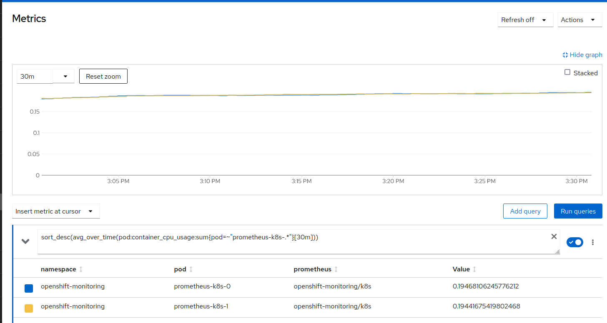
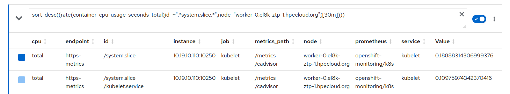

# Performing monitoring stack

In this chapter we will play with some tuning trying to get better performance on the monitoring stack. Better performing because of we will configure it to make a less intensive work about collecting metrics from the different services.

This is just testing to dig into the Prometheus/node_exporter performance. It is nothing recommended/official/supported. Just a test experiment.

The experiment will consist on getting the following metrics:

* Get the pods more CPU consuming during the last 30m

* Get the '/system/slice' CPU consuming to have the global slice consumption and 'kubelet', during the last 30m

We will take this metrics with:

* A clean cluster and A cluster with a big number of pods running.
  
  * Default monitoring stack configuration
  
  * Double scrap time for the metrics for 'node_exporter'
  
  * Double all the scraping times

Why we make special interest on doubling 'node_exporter' scrape interval? 'node_exporter' takes metrics about Pods, Containers, Memory Used by these, etc. These metrics are extracted from 'kubelet' cAdvisory, so,'kubelet' is very affected by Prometheus gathering metrics. 

From Prometheus there are many different scrape_intervals, most of them set to 30s. To increase this is not easy because configuration is managed by operators. If you are using an OpenShift Red Hat supported environment, you cannot change that without breaking the support. Changing these intervals would affect other Openshift metrics/alarms and also the auto scaling feature. It is out of the scope of this tutorial to find out which value is better.

How we are burning the cluster? In a previous [tutorial](https://github.com/jgato/jgato/blob/main/random_docs/Debugging%20monitoring%20stack%20on%20Openshift.md) I explained how I use kube-burner.

The infrastructure I am using for the experiment:

OCP Standard Cluster with 3 Master and 2 Workers


The workers, where I will take most of results, are just vms with 16 cores and 32.00 GiB.

Following we show the results of the experiment. At the end of the document I show how I have managed to 'hack' the monitoring stack to change the metrics.

## The experiment

To take the measurements we will use Prometheus with the following queries:

CPU usage for prometheus pods

```
sort_desc(avg_over_time(pod:container_cpu_usage:sum[30m]))
```

CPU usage of '/system/slice' and '/system/slice/kubelet.service'

```
sort_desc((rate(container_cpu_usage_seconds_total{id=~".*system.slice.*",node="worker-0.el8k-ztp-1.hpecloud.org"}[30m])))
```

About this last query, it takes the CPU usage under '/system/slice' where you find 'kubelet', crio-o, etc. Some processes used support the Openshift platform.  When we burn the cluster, we create some loads but only on one of the workers (worker-0). So, the 'kubelet' consumption we are interested on, it is the one on that worker. Of course, in worker-1 we can compare 'kubelet is performing when no load is there.

With '/system/slice' we get the whole CPU consumption under these services, and we take also how much is consumed by 'kubelet', The difference between the '/system/slice' and 'kubelet is the CPU consumed by other services like: cri-o, ovs-*, sshd, etc. But we only need to know how much is consuming 'kubelet'. 

Remember we take the consumption of 'kubelet', because inside it has the cAdvisor. Which is queried by Prometheus with the node_exporter.  The scrape_interval of 'node_exporter' is very special, and impacts directly on 'kubelet' (cAdvisory).

These are the results collected with the experiment

### Clean cluster

All the measurements taken during 30m

#### Default monitoring stack configuration

All set to default values

```bash
>  oc -n openshift-monitoring debug pod/prometheus-k8s-0 -- cat /etc/prometheus/config_out/prometheus.env.yaml | grep 'scrape_interval' 
Defaulting container name to prometheus.
Use 'oc describe pod/prometheus-k8s-0-debug -n openshift-monitoring' to see all of the containers in this pod.

Starting pod/prometheus-k8s-0-debug ...
  scrape_interval: 30s
  scrape_interval: 30s
  scrape_interval: 30s
  scrape_interval: 30s
  scrape_interval: 30s
...
  scrape_interval: 30s
  scrape_interval: 30s
  scrape_interval: 30s
  scrape_interval: 30s
..
  scrape_interval: 30s
  scrape_interval: 30s
  scrape_interval: 30s
  scrape_interval: 1m
  scrape_interval: 1m
  scrape_interval: 30s
  scrape_interval: 30s
  scrape_interval: 30s
  scrape_interval: 30s
  scrape_interval: 15s
  scrape_interval: 2m
  scrape_interval: 2m
  scrape_interval: 30s
  scrape_interval: 30s
  scrape_interval: 30s
  scrape_interval: 30s
  scrape_interval: 30s
  scrape_interval: 10s
  scrape_interval: 30s
...
  scrape_interval: 30s

Removing debug pod ...
```

* CPU usage for prometheus pods
  
  * prometheus-k8s-0  17%
  
  * prometheus-k8s-1  17%
  
  

* CPU usage of '/system/slice' and '/system/slice/kubelet.service' in seconds
  
  * '/system/slice' 0.18 sec
  
  * '/system/slice/kubelet.service' 0.10 sec
  
  

Quick conclusions: 

In default and relaxed conditions, we can quickly observe how much 'kubelet' consumes from the total amount of /system/slice. Just 'kubelet' takes 50% of the total consumed by this 'slice'.

Prometheus containers take about 17% of a single CPU which is not very much, but in this moment the cluster is not doing anything. 

#### Double scrap time for 'node_exporter'

Scrap time for 'node_exporter' is 15s. We double this and we let the others as default:

```yaml
>  oc -n openshift-monitoring debug pod/prometheus-k8s-0 -- cat /etc/prometheus/config_out/prometheus.env.yaml | grep 'scrape_interval' 
Defaulting container name to prometheus.
Use 'oc describe pod/prometheus-k8s-0-debug -n openshift-monitoring' to see all of the containers in this pod.

Starting pod/prometheus-k8s-0-debug ...
  scrape_interval: 30s
  scrape_interval: 30s
...
  scrape_interval: 30s
  scrape_interval: 60s
  scrape_interval: 60s
  scrape_interval: 30s
...
  scrape_interval: 1m
  scrape_interval: 1m
  scrape_interval: 30s
  scrape_interval: 30s
  scrape_interval: 30s
  scrape_interval: 30s
  scrape_interval: 30s
  scrape_interval: 2m
  scrape_interval: 2m
  scrape_interval: 30s
  scrape_interval: 30s
  scrape_interval: 30s
  scrape_interval: 30s
  scrape_interval: 30s
  scrape_interval: 10s
  scrape_interval: 30s
  scrape_interval: 30s
  scrape_interval: 30s
  scrape_interval: 30s
  scrape_interval: 30s
  scrape_interval: 30s
  scrape_interval: 30s
  scrape_interval: 30s
  scrape_interval: 30s

Removing debug pod ...
```

Ensure the one for node_exporter is 30s.

```bash
>  oc -n openshift-monitoring debug pod/prometheus-k8s-0 -- cat /etc/prometheus/config_out/prometheus.env.yaml | grep 'node-exporter/0'  -A 7 
Defaulting container name to prometheus.
Use 'oc describe pod/prometheus-k8s-0-debug -n openshift-monitoring' to see all of the containers in this pod.

Starting pod/prometheus-k8s-0-debug ...
- job_name: serviceMonitor/openshift-monitoring/node-exporter/0
  honor_labels: false
  kubernetes_sd_configs:
  - role: endpoints
    namespaces:
      names:
      - openshift-monitoring
  scrape_interval: 30s

Removing debug pod ...
```

* CPU usage for prometheus pods
  
  * prometheus-k8s-0 20%
  
  * prometheus-k8s-1 20%
  
  

* CPU usage of '/system/slice' and '/system/slice/kubelet.service' in seconds
  
  * '/system/slice' 0.18 sec
  
  * '/system/slice/kubelet.service' 0.10 sec
  
  

Quick conclusions: not very much changes from the default.

#### Double all the scraping times

We double the lower scraping times, all of them that were 30s are now 60s.

```bash
>  oc -n openshift-monitoring debug pod/prometheus-k8s-0 -- cat /etc/prometheus/config_out/prometheus.env.yaml | grep 'scrape_interval'  
Defaulting container name to prometheus.
Use 'oc describe pod/prometheus-k8s-0-debug -n openshift-monitoring' to see all of the containers in this pod.

Starting pod/prometheus-k8s-0-debug ...
  scrape_interval: 60s
  scrape_interval: 60s
  scrape_interval: 60s
  scrape_interval: 60s
...
  scrape_interval: 60s
  scrape_interval: 60s
  scrape_interval: 60s
  scrape_interval: 60s
  scrape_interval: 60s
  scrape_interval: 60s
  scrape_interval: 60s
..
  scrape_interval: 60s
  scrape_interval: 60s
  scrape_interval: 60s
  scrape_interval: 60s
  scrape_interval: 1m
  scrape_interval: 1m
  scrape_interval: 60s
  scrape_interval: 60s
  scrape_interval: 60s
  scrape_interval: 60s
  scrape_interval: 30s
  scrape_interval: 2m
  scrape_interval: 2m
  scrape_interval: 60s
  scrape_interval: 30s
  scrape_interval: 60s
  scrape_interval: 60s
  scrape_interval: 60s
  scrape_interval: 60s
  scrape_interval: 10s
  scrape_interval: 60s
  scrape_interval: 60s
  scrape_interval: 60s
  scrape_interval: 60s
  scrape_interval: 60s
  scrape_interval: 60s
  scrape_interval: 60s
  scrape_interval: 60s
  scrape_interval: 60s

Removing debug pod ...
```

So, more or less arre going to be around 60s. The one for node_export is doubled from 15s to 30s.

```bash
> oc -n openshift-monitoring debug pod/prometheus-k8s-0 -- cat /etc/prometheus/config_out/prometheus.env.yaml | grep 'node-exporter/0'  -A 7 
Defaulting container name to prometheus.
Use 'oc describe pod/prometheus-k8s-0-debug -n openshift-monitoring' to see all of the containers in this pod.

Starting pod/prometheus-k8s-0-debug ...
- job_name: serviceMonitor/openshift-monitoring/node-exporter/0
  honor_labels: false
  kubernetes_sd_configs:
  - role: endpoints
    namespaces:
      names:
      - openshift-monitoring
  scrape_interval: 30s

Removing debug pod ...
```

* CPU usage for prometheus pods
  
  * prometheus-k8s-0  12%
  
  * prometheus-k8s-1  12%
  
  

* CPU usage of '/system/slice' and '/system/slice/kubelet.service' in seconds
  
  * '/system/slice'  0.17sec
  
  * '/system/slice/kubelet.service'  0.09 sec
  
  

Quick conclusions: we see a good reduction on Prometheus consumption

#### Conclusions

In the first step the cluster is pretty relaxed, so the consumption is ok, but in some way high for a cluster without loads. 

The second step tries to focus on the scraping time of node_exporter, and therefore Kubelet. But there is no difference. Kubelet (cAdvisory) is pretty relaxed, no matter how frequent you call it. Maybe, because there are few Pods or resources to monitor. In this step, Prometheus consumes pretty the same. It makes sense, because we only changed one scrape interval focused on getting metrics from Kubelet. With a more loaded cluster, this should have a good impact.

For the third step we double most of the scraping times. The one about node_exporter and Kubelet dont change. Makes sense, we didnt changed the scrape interval for that, and, again, Kubelet is pretty relaxed. But, we see a significant impact on Prometheus performing. Prometheus is configured with many scraping jobs, and we have doubled most of them. So, Prometheus has to query less frequency and this impacts really significant on the CPU consumption. Going from about 20% of one CPU to about 12%. Almost half of CPU consumption.

**Doubling scraping times on most of the intervals makes Prometheus to consume half of usual CPU consumption.**

Now we will burn the cluster, this will affect very much to Kubelet. Depending on how frequent is queried, it will have to return info from many more Pods.

### Burn cluster

The cluster is pretty much loaded of pods, not very much CPU consumed from these pods, but many pods. But more Pods are more info to get from Kubelet (cAdvisor), which is one of our main objectives. 

#### Default monitoring stack configuration

* CPU usage for prometheus pods
  
  * prometheus-k8s-0  
  
  * prometheus-k8s-1  

* CPU usage of '/system/slice' and '/system/slice/kubelet.service' in seconds
  
  * '/system/slice' 0.17%
  
  * '/system/slice/kubelet.service' 0.09%

#### Double scrap time for 'node_exporter'

* CPU usage for prometheus pods

* CPU usage of '/system/slice' and '/system/slice/kubelet.service' in seconds

#### Double all the scraping times

* CPU usage for prometheus pods
  
  * prometheus-k8s-0 
  
  * prometheus-k8s-1 

* CPU usage of '/system/slice' and '/system/slice/kubelet.service' in seconds
  
  * '/system/slice' 0.17%
  
  * '/system/slice/kubelet.service' 0.09%

# Hacking the monitoring stack to change scrap intervals

Monitoring stack is managed by an Openshift Operator, so, anything not supported by the Operator configuration, cannot be changed. We set the operator to unmanaged, so it will no monitor any of its CRs. This make the operator and cluster unsupported. This is why this tutorial does not cover any kind of recommended procedure. Just testing.

Edit the ClusterVersion to set unmanaged the operator:

```yaml
apiVersion: v1
items:
- apiVersion: config.openshift.io/v1
  kind: ClusterVersion
  metadata:
    creationTimestamp: "2022-10-10T09:23:42Z"
    generation: 6
    name: version
    resourceVersion: "1043553"
    uid: e454f9c4-4009-4a87-b32f-85209881f683
  spec:
    channel: stable-4.10
    clusterID: c8943a89-be9c-47b9-af4b-f1d84f032ca4
    desiredUpdate:
      version: 4.10.9
    overrides:
    - group: apps/v1
      kind: Deployment
      name: cluster-monitoring-operator
      namespace: openshift-monitoring
      unmanaged: true
    upstream: https://api.openshift.com/api/upgrades_info/v1/graph
```

And now we can scale down the operator:

```bash
> oc -n openshift-monitoring scale deployments cluster-monitoring-operator --replicas=0
deployment.apps/cluster-monitoring-operator scaled

> oc -n openshift-monitoring scale deployments prometheus-operator --replicas=0
deployment.apps/prometheus-operator scaled
> oc -n openshift-monitoring get deployments
NAME                          READY   UP-TO-DATE   AVAILABLE   AGE
cluster-monitoring-operator   0/0     0            0           26h
kube-state-metrics            1/1     1            1           26h
openshift-state-metrics       1/1     1            1           26h
prometheus-adapter            2/2     2            2           25h
prometheus-operator           0/0     0            0           26h
telemeter-client              1/1     1            1           25h
thanos-querier                2/2     2            2           25h
```

## Patching the monitoring stack

With the two operators down. We can start patching and changing scraping interval. 

The different jobs and intervals for monitoring are stored on Secret called 'prometheus-k8s':

```yaml
> oc get -n openshift-monitoring secrets prometheus-k8s -o jsonpath='{.data.prometheus\.yaml\.gz}'  | base64 -d | gunzip -c
global:
  evaluation_interval: 30s
  scrape_interval: 30s
  external_labels:
    prometheus: openshift-monitoring/k8s
    prometheus_replica: $(POD_NAME)
rule_files:
- /etc/prometheus/rules/prometheus-k8s-rulefiles-0/*.yaml
scrape_configs:
- job_name: serviceMonitor/openshift-apiserver-operator/openshift-apiserver-operator/0
  honor_labels: false
  kubernetes_sd_configs:
  - role: endpoints
    namespaces:
      names:
      - openshift-apiserver-operator
  scrape_interval: 30s
  scheme: https
  tls_config:
    insecure_skip_verify: false
    server_name: metrics.openshift-apiserver-operator.svc
    ca_file: /etc/prometheus/configmaps/serving-certs-ca-bundle/service-ca.crt
    cert_file: /etc/prometheus/secrets/metrics-client-certs/tls.crt
    key_file: /etc/prometheus/secrets/metrics-client-certs/tls.key
  bearer_token_file: /var/run/secrets/kubernetes.io/serviceaccount/token
  relabel_configs:
  - source_labels:
    - job
    target_label: __tmp_prometheus_job_name
  - action: keep
    source_labels:
    - __meta_kubernetes_service_label_app
    - __meta_kubernetes_service_labelpresent_app
    regex: (openshift-apiserver-operator);true
  - action: keep
```

So lets get all the Prometheus configuration about jobs and intervals. By default all set to 30s. We can change that to 60s and store the whole configuration on a file.

```bash
> oc get -n openshift-monitoring secrets prometheus-k8s \
    -o jsonpath='{.data.prometheus\.yaml\.gz}' \
    | base64 -d \
    | gunzip -c \
    | sed 's/30s/60s/g' > /tmp/file.yaml
```

Now we have in this file all intervals set to 60s. Here an example of the job for scraping node_exporter. Notice there are many jobs. This one (node_expoerter) is the only one we change in our experiment. And finally we change all of them to 60s.

```yaml
- job_name: serviceMonitor/openshift-monitoring/node-exporter/0                
  honor_labels: false                                                          
  kubernetes_sd_configs:                                                       
  - role: endpoints                                                            
    namespaces:                                                                
      names:                                                                   
      - openshift-monitoring                                                   
  scrape_interval: 60s                                                                                                                                                                                                                                        
  scheme: https                                                                
  tls_config:                                                                  
    insecure_skip_verify: false                                                
    server_name: node-exporter.openshift-monitoring.svc                        
    ca_file: /etc/prometheus/configmaps/serving-certs-ca-bundle/service-ca.crt 
    cert_file: /etc/prometheus/secrets/metrics-client-certs/tls.crt            
    key_file: /etc/prometheus/secrets/metrics-client-certs/tls.key             
  bearer_token_file: /var/run/secrets/kubernetes.io/serviceaccount/token      
```

With the file and the intervals configured as desired, we zip and encode again:

```yaml
> cat /tmp/file.yaml | gzip | base64 -w 0
H4sIAAAAAAAAA+2dW5OjOJbH3+tTODrm.......Ck+Z1uPvw/zuRltydbAgA=
```

Edit again the secret and change the config file:

```yaml
> oc -n openshift-monitoring edit secrets prometheus-k8s

apiVersion: v1                                                                 
data:                                                                          
  prometheus.yaml.gz: H4sIAAAAAAAAA+2dW5OjOJbH3+tTODrm.......Ck+Z1uPvw/zuRltydbAgA=
```

This configuration is reflected into the Prometheus Pods:

```bash
> oc -n openshift-monitoring debug pod/prometheus-k8s-0 -- cat /etc/prometheus/config_out/prometheus.env.yaml | grep 'node-exporter/0'  -A 7 
Defaulting container name to prometheus.
Use 'oc describe pod/prometheus-k8s-0-debug -n openshift-monitoring' to see all of the containers in this pod.

Starting pod/prometheus-k8s-0-debug ...
- job_name: serviceMonitor/openshift-monitoring/node-exporter/0
  honor_labels: false
  kubernetes_sd_configs:
  - role: endpoints
    namespaces:
      names:
      - openshift-monitoring
  scrape_interval: 60s

Removing debug pod ...
```

Now, we can configure our scrape intervals as we need for our experiments.

# Burning the cluster

In the [previous tutorial](https://github.com/jgato/jgato/blob/main/random_docs/Debugging%20monitoring%20stack%20on%20Openshift.md) we have learn how to burn the cluster

So we have the cluster as:

```bash
sh-4.4# crictl ps | wc -l
268
sh-4.4# crictl pods | wc -l
239
sh-4.4# ip link show 2>/dev/null | wc -l
458
```