# Openshift Monitoring stack: Playing with Prometheus performance and scraping intervals

In this tutorial we will play with some Prometheus configurations, trying to get better performance on the Openshift Monitoring stack. The experiment consists on lowering the scraping frequency  to make less intensive work collecting metrics. 

Prometheus comes configured with different jobs, or metrics to be collected. Each of these jobs is configured about which service has to be queried, and an interval. Depending on your environment this can be configured/changed on different ways. In the case of an Openshift cluster, all these configurations are managed by the Monitoring (and Prometheus) operators. So, it would be not so easy to change it.

*This is just testing/experiment to dig into the Prometheus and Kubelet performance. It is nothing recommended/official/supported by Red Hat.*

The experiment will work on getting the following metrics:

* Get the CPU consumed by Prometheus Pods.

* Get the CPU consumed by Kubelet. 

The metrics will be collected on different scenarios. A clean cluster ( with no extra workloads deployed) and a cluster with a big number of pods running. For each of these scenarios, the metrics will be collected with different scrape intervals configurations:

* Default monitoring stack scrape intervals.

* Doubling the lowest scrape intervals, from 30sec to 60sec.

* Doubling some scrape intervals in a more selected way. Changing the ones affecting more to Kubelet, or, changing the ones managed by Openshift Monitoring stack ServiceMonitors.

The experiment will put special focus on how these intervals affect to Kubelet system's process and Prometheus Pods.

Why we make special interest on  performance of Kubelet? [Kubelet/cAdvisor takes metrics](https://github.com/google/cadvisor/blob/master/docs/storage/prometheus.md) about Pods, Containers, Memory, CPU etc. Specially on environments very loaded, Kubelet CPU consumption would be very affected by a very low scraping interval. More Pods, more info to be gathered.

Why we make special interest on performance of Prometheus? It is the core of all the monitoring stack. From Prometheus there are many different scrape_intervals, most of them set to 30s. Scraping more frequent should affect to CPU consumed. Scraping on loaded environments should affect also, because of more data is retrieved.

This experiment dont collect enough information to conclude the best scrape intervals. Actually, this depends on many different scenarios and needs. It only shows how changing these intervals affects to the general performance.

How we are burning the cluster in one of the scenarios? In a previous [tutorial](https://github.com/jgato/jgato/blob/main/random_docs/Debugging%20monitoring%20stack%20on%20Openshift.md) I explained how I used kube-burner for that.

The infrastructure we are using for the experiment:

OCP Standard Cluster (baremetal) with 3 Master and 2 Workers

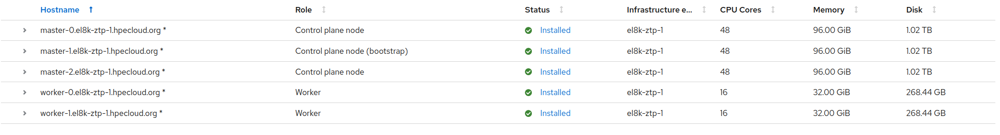

The workers, where we will take most of results, are just vms with 16 cores and 32.00 GiB, on a baremetal server.

Following we show the results of the experiment. At the end of the document it is explained how to 'hack' the monitoring stack to change the metrics.

## The experiment

To take the measurements we will use Prometheus with the following queries:

% of CPU usage for Prometheus pods 

```
sort_desc(avg_over_time(pod:container_cpu_usage:sum{pod=~"prometheus-k8s-.*"}[30m]))
```

Secs the CPU is used by '/system/slice' and '/system/slice/kubelet.service'

```
sort_desc((rate(container_cpu_usage_seconds_total{id=~".*system.slice.*",node="worker-0.el8k-ztp-1.hpecloud.org"}[30m])))
```

It will return values between 0 and 1, so it can be considered as % if you multiply the value by 100.

About this last query, it takes the CPU usage under '/system/slice' where you find Kubelet, crio-o, etc. Some processes used support the Openshift platform.  When we burn the cluster, we create some loads but only on one of the workers (worker-0). So, the Kubelet consumption we are interested on, it is the one on that worker. Of course, in worker-1 we can compare Kubelet is performing when no load is there.

Lets start the experiment.

### Clean cluster

Just clean installed cluster with no extra workloads.

#### Default monitoring stack configuration

All scrap intervals are set to default values

```bash
>  oc -n openshift-monitoring debug pod/prometheus-k8s-0 -- cat /etc/prometheus/config_out/prometheus.env.yaml | grep 'scrape_interval' 
Defaulting container name to prometheus.
Use 'oc describe pod/prometheus-k8s-0-debug -n openshift-monitoring' to see all of the containers in this pod.

Starting pod/prometheus-k8s-0-debug ...
  scrape_interval: 30s
  scrape_interval: 30s
  scrape_interval: 30s
  scrape_interval: 30s
  scrape_interval: 30s
...
  scrape_interval: 30s
  scrape_interval: 30s
  scrape_interval: 30s
  scrape_interval: 30s
..
  scrape_interval: 30s
  scrape_interval: 30s
  scrape_interval: 30s
  scrape_interval: 1m
  scrape_interval: 1m
  scrape_interval: 30s
  scrape_interval: 30s
  scrape_interval: 30s
  scrape_interval: 30s
  scrape_interval: 15s
  scrape_interval: 2m
  scrape_interval: 2m
  scrape_interval: 30s
  scrape_interval: 30s
  scrape_interval: 30s
  scrape_interval: 30s
  scrape_interval: 30s
  scrape_interval: 10s
  scrape_interval: 30s
...
  scrape_interval: 30s

Removing debug pod ...
```

* CPU usage for Prometheus pods
  
  * prometheus-k8s-0  17%
  
  * prometheus-k8s-1  17%
  
  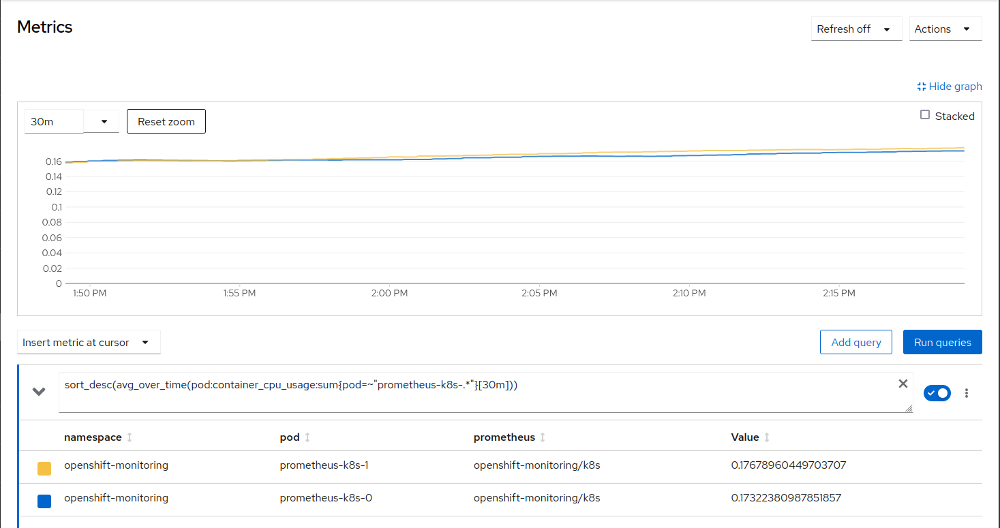

* CPU usage of '/system/slice' and '/system/slice/kubelet.service' in seconds
  
  * '/system/slice' 0.18 sec
  
  * '/system/slice/kubelet.service' 0.10 sec
  
  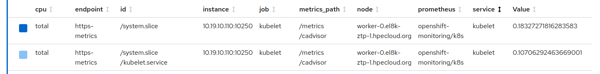

Quick conclusions: 

In default and relaxed conditions, we can quickly observe how much Kubelet consumes from the total amount of /system/slice. Just Kubelet takes 50% of the total consumed by this 'slice'. In the total consumption of CPU, 10sec, is not very much. But it is half of what is happening under 'system/slice'.

Prometheus containers take about 17% of a single CPU which is not very much, but in this moment the cluster is not doing very much work. 

#### Doubling some scraping times

We double the lower scraping times, all of them that were 30s are now 60s.

```bash
>  oc -n openshift-monitoring debug pod/prometheus-k8s-0 -- cat /etc/prometheus/config_out/prometheus.env.yaml | grep 'scrape_interval'  
Defaulting container name to prometheus.
Use 'oc describe pod/prometheus-k8s-0-debug -n openshift-monitoring' to see all of the containers in this pod.

Starting pod/prometheus-k8s-0-debug ...
  scrape_interval: 60s
  scrape_interval: 60s
  scrape_interval: 60s
  scrape_interval: 60s
...
  scrape_interval: 60s
  scrape_interval: 60s
  scrape_interval: 60s
  scrape_interval: 60s
  scrape_interval: 60s
  scrape_interval: 60s
  scrape_interval: 60s
..
  scrape_interval: 60s
  scrape_interval: 60s
  scrape_interval: 60s
  scrape_interval: 60s
  scrape_interval: 1m
  scrape_interval: 1m
  scrape_interval: 60s
  scrape_interval: 60s
  scrape_interval: 60s
  scrape_interval: 60s
  scrape_interval: 30s
  scrape_interval: 2m
  scrape_interval: 2m
  scrape_interval: 60s
  scrape_interval: 30s
  scrape_interval: 60s
  scrape_interval: 60s
  scrape_interval: 60s
  scrape_interval: 60s
  scrape_interval: 10s
  scrape_interval: 60s
  scrape_interval: 60s
  scrape_interval: 60s
  scrape_interval: 60s
  scrape_interval: 60s
  scrape_interval: 60s
  scrape_interval: 60s
  scrape_interval: 60s
  scrape_interval: 60s

Removing debug pod ...
```


* CPU usage for prometheus pods
  
  * prometheus-k8s-0  12%
  
  * prometheus-k8s-1  12%
  
  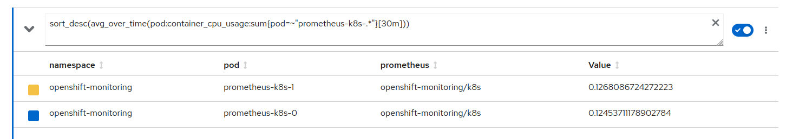

* CPU usage of '/system/slice' and '/system/slice/kubelet.service' in seconds
  
  * '/system/slice'  0.17sec
  
  * '/system/slice/kubelet.service'  0.09 sec
  
  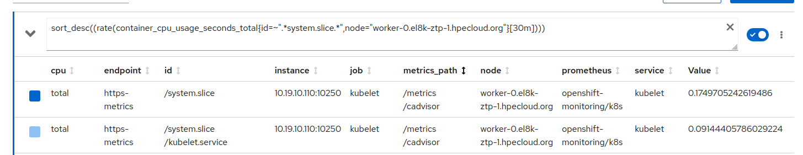

Quick conclusions: we see a good reduction on Prometheus consumption. But not very much affecting to Kubelet. 

#### Conclusions

In the first step the cluster is pretty relaxed, so the consumption is ok. 

For the second step we double some of the scraping intervals. We dont see improvements on Kubelet consumption. The reason? We are doubling some intervals in indiscriminately. So, we dont know if this new intervals affect or not to Kubelet. We will see more about it below.

We see a significant impact on Prometheus performing. Prometheus is configured with many scraping jobs, and we have doubled many of them. So, Prometheus has to query less frequency and this impacts really significant on the CPU consumption. Going from about 20% of one CPU to about 12%. Almost half of CPU consumption.

**Doubling scraping times on most of the intervals makes Prometheus to consume half of usual CPU consumption.**

Now we will burn the cluster, this will affect very much to Kubelet. Depending on how frequent is queried, it will have to return info from many more Pods.

### Burn cluster

The cluster is pretty much loaded of pods, not very much CPU consumed from these pods, but many pods. With more Pods, more info to get from Kubelet (cAdvisor), which is one of our main objectives. 

```bash
sh-4.4# crictl ps | wc -l
268
sh-4.4# crictl pods | wc -l
239
sh-4.4# ip link show 2>/dev/null | wc -l 
458
```

#### Default monitoring stack configuration

All the operators up and therefore the scraping terminals to default:

```bash
>  oc -n openshift-monitoring debug pod/prometheus-k8s-0 -- cat /etc/prometheus/config_out/prometheus.env.yaml | grep 'scrape_interval'  
Defaulting container name to prometheus.
Use 'oc describe pod/prometheus-k8s-0-debug -n openshift-monitoring' to see all of the containers in this pod.

Starting pod/prometheus-k8s-0-debug ...
  scrape_interval: 30s
  scrape_interval: 30s
  scrape_interval: 30s
  scrape_interval: 30s
 ...
  scrape_interval: 60s
  scrape_interval: 60s
  scrape_interval: 30s
  scrape_interval: 30s
...
  scrape_interval: 30s
  scrape_interval: 30s
  scrape_interval: 1m
  scrape_interval: 1m
  scrape_interval: 30s
  scrape_interval: 30s
  scrape_interval: 30s
  scrape_interval: 30s
  scrape_interval: 15s
  scrape_interval: 2m
  scrape_interval: 2m
  scrape_interval: 30s
...
  scrape_interval: 30s
  scrape_interval: 30s
  scrape_interval: 30s
```

* CPU usage for prometheus pods
  
  * prometheus-k8s-0   30%
  
  * prometheus-k8s-1   30%
  
  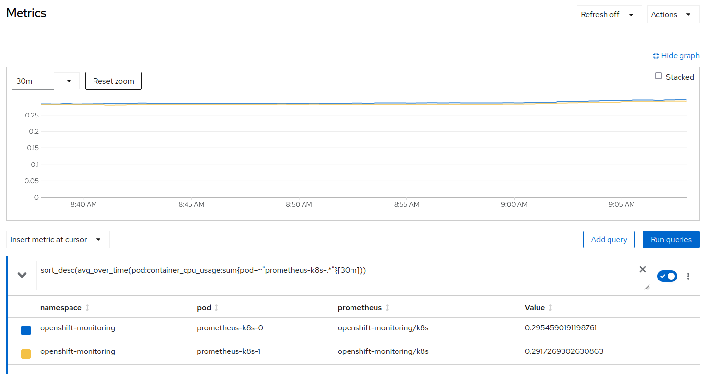

* CPU usage of '/system/slice' and '/system/slice/kubelet.service' in seconds
  
  * '/system/slice' 0.50sec
  
  * '/system/slice/kubelet.service' 0.37sec
  
  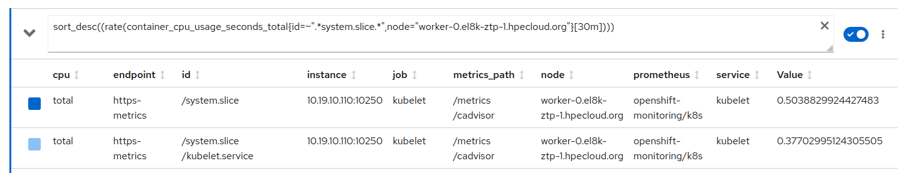

Quick conclusion: as expected, in a loaded environment, scraping very frequent, has a big impact on the CPU consumed by Prometheus. Almost doubled. But the impact is even bigger on Kubelet, having to return metrics from Kubernetes resources, now many Pods running. Almost 4 times more time CPU consumed in compared with the clean cluster.

#### Doubling some scraping times

We double the lower scraping times, all of them that were 30s are now 60s.

```bash
>  oc -n openshift-monitoring debug pod/prometheus-k8s-0 -- cat /etc/prometheus/config_out/prometheus.env.yaml | grep 'scrape_interval'  
Defaulting container name to prometheus.
Use 'oc describe pod/prometheus-k8s-0-debug -n openshift-monitoring' to see all of the containers in this pod.

Starting pod/prometheus-k8s-0-debug ...
  scrape_interval: 60s
  scrape_interval: 60s
...
  scrape_interval: 60s
  scrape_interval: 60s
...
  scrape_interval: 1m
  scrape_interval: 1m
  scrape_interval: 60s
  scrape_interval: 60s
  scrape_interval: 60s
  scrape_interval: 60s
  scrape_interval: 2m
  scrape_interval: 2m
  scrape_interval: 60s
  scrape_interval: 60s
  scrape_interval: 60s
  scrape_interval: 60s
  scrape_interval: 60s
  scrape_interval: 60s
  scrape_interval: 10s
  scrape_interval: 60s
  scrape_interval: 60s
  scrape_interval: 60s
  scrape_interval: 60s
  scrape_interval: 60s
  scrape_interval: 60s
  scrape_interval: 60s
  scrape_interval: 60s
  scrape_interval: 60s
```

* CPU usage for prometheus pods
  
  * prometheus-k8s-0  17%
  
  * prometheus-k8s-1  17%
  
  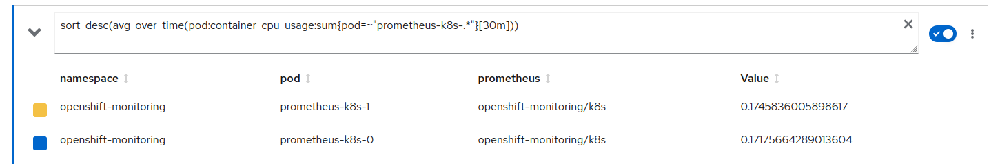

* CPU usage of '/system/slice' and '/system/slice/kubelet.service' in seconds
  
  * '/system/slice' 0.40sec
  
  * '/system/slice/kubelet.service' 0.31sec
  
  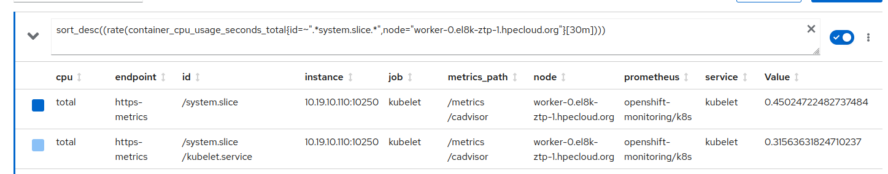

There is a high impact on Prometheus consumption caused by doubling most of the metrics.  We see an improvement on Kubelet, but not very much, considering all the intervals we changed. 

#### Kubelet performance is not getting much better

We have done a kind of "random" doubling of scrape intervals, from the many available. If we go a little bit deeper on Prometheus configuration, we can find which are the ones affecting only to Kubelet:

```bash
> cat /tmp/file.yaml | grep 'serviceMonitor/openshift-monitoring/kubelet/'  -A 7 
- job_name: serviceMonitor/openshift-monitoring/kubelet/0
  honor_labels: true
  kubernetes_sd_configs:
  - role: endpoints
    namespaces:
      names:
      - kube-system
  scrape_interval: 60s
--
- job_name: serviceMonitor/openshift-monitoring/kubelet/1
  honor_labels: true
  honor_timestamps: false
  kubernetes_sd_configs:
  - role: endpoints
    namespaces:
      names:
      - kube-system
  scrape_interval: 60s
--
- job_name: serviceMonitor/openshift-monitoring/kubelet/2
  honor_labels: true
  kubernetes_sd_configs:
  - role: endpoints
    namespaces:
      names:
      - kube-system
  scrape_interval: 60s
--
- job_name: serviceMonitor/openshift-monitoring/kubelet/3
  honor_labels: false
  kubernetes_sd_configs:
  - role: endpoints
    namespaces:
      names:
      - kube-system
  scrape_interval: 60s
```

So these are the jobs which are scraping metrics from Kubelet.  We had already doubled them, but we will do it again up to 120s.

#### Changing the specific scraping intervals which affect Kubelet

We have change these intervals to 2m (so double over the doubled, 4x, original 30sec)

```bash
>  oc -n openshift-monitoring debug pod/prometheus-k8s-0 -- cat /etc/prometheus/config_out/prometheus.env.yaml | grep 'serviceMonitor/openshift-monitoring/kubelet/'  -A 7 
Defaulting container name to prometheus.
Use 'oc describe pod/prometheus-k8s-0-debug -n openshift-monitoring' to see all of the containers in this pod.

Starting pod/prometheus-k8s-0-debug ...
- job_name: serviceMonitor/openshift-monitoring/kubelet/0
  honor_labels: true
  kubernetes_sd_configs:
  - role: endpoints
    namespaces:
      names:
      - kube-system
  scrape_interval: 120s
--
- job_name: serviceMonitor/openshift-monitoring/kubelet/1
  honor_labels: true
  honor_timestamps: false
  kubernetes_sd_configs:
  - role: endpoints
    namespaces:
      names:
      - kube-system
--
- job_name: serviceMonitor/openshift-monitoring/kubelet/2
  honor_labels: true
  kubernetes_sd_configs:
  - role: endpoints
    namespaces:
      names:
      - kube-system
  scrape_interval: 120s
--
- job_name: serviceMonitor/openshift-monitoring/kubelet/3
  honor_labels: false
  kubernetes_sd_configs:
  - role: endpoints
    namespaces:
      names:
      - kube-system
  scrape_interval: 120s
```

and we observe the CPU consumption of Kubelet:

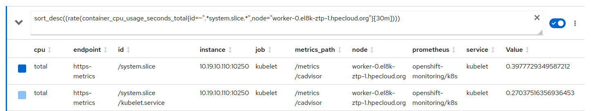

About 0.27sec compared to the previous 0.31 or the original 0.37. This can be considered as a good improvement.

#### The experiment as SNO

We have been doing some tests based on "almost" doubling all the different jobs metrics captured by the Monitoring stack, or focusing on the jobs about Kubelet. 

Something similar to that, it has been already implemented when using Single Node Opensift. A kind of OCP cluster where the resources are more constrained to only one single node. This was included with [SNO 4.11](https://github.com/openshift/cluster-monitoring-operator/pull/1652/files). And it is officially supported.

To finish our tests, we will try to make the same for multinode. So, we will make a more concrete change on the scrape intervals. We will double the ones managed by ServiceMonitors:

```bash
$> oc -n openshift-monitoring get servicemonitor
NAME                          AGE
cluster-monitoring-operator   14d
etcd                          14d
kube-state-metrics            14d
kubelet                       14d
node-exporter                 14d
openshift-state-metrics       14d
prometheus-adapter            14d
prometheus-k8s                14d
prometheus-operator           14d
telemeter-client              14d
thanos-querier                14d
thanos-sidecar                14d
```

In the sections bellow, it is explained how to hack/change each job's interval. But also, how to change the ServiceMonitors. 

In a default environment, with the Monitoring Operator enabled, we have these values for the intervals managed by a ServiceMonitor:

```bash
$> oc -n openshift-monitoring get servicemonitor -o jsonpath={.items[*].spec.endpoints[*].interval} 
30s 1m 1m 30s 30s 30s 30s 15s 2m 2m 30s 30s 30s 30s 30s
```

We will make the following changes to try to replicate what it was officially implemented for SNOs:

- Interval from 15s to 30s:
  
  - node-exporter,

- Interval from 30s to 60s:
  
  - etcd, kubelet, prometheus-adapter, prometheus-k8s, telemeter-client, thanos-querier thanos-sidecar

- Interval from 1m to 2m:
  
  - kube-state-metrics

- We keep the ones currently at 2 minutes. The PR for SNO put the limit to 2m maximum.

With the Monitoring Operator disabled (as explained below) we change the intervals:

```bash
>  oc -n openshift-monitoring get servicemonitor  -o json  \
 | sed -e 's/1m/2m/g; s/30s/60s/g; s/15s/30s/g' \
 | oc replace -f -
```

we check the new values:

```bash
>  oc -n openshift-monitoring get servicemonitor -o jsonpath={.items[*].spec.endpoints[*].interval}
60s 2m 2m 60s 60s 60s 60s 30s 2m 2m 60s 60s 60s 60s 60s
```

and lets take new measurements with the cluster burned.

- CPU usage for prometheus pods
  
  - prometheus-k8s-0 20%
  
  - prometheus-k8s-1 20%
  
  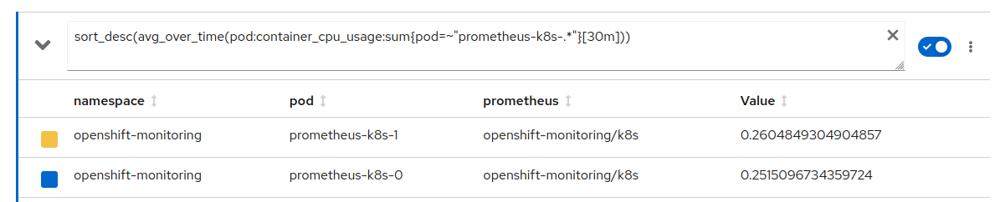

- CPU usage of '/system/slice' and '/system/slice/kubelet.service' in seconds
  
  - '/system/slice'  0.42 sec
  
  - '/system/slice/kubelet.service'  0.30 sec
  
  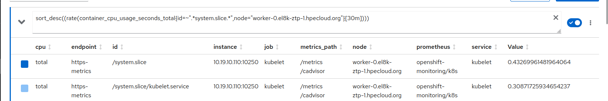

Makes sense to compare this to the default behavior of the Burn Cluster. To see how much impacted these concrete changes (based on the changes already introduced for SNOs).

- Prometheus CPU consumption has not high impact, because there are many jobs we have not doubled the interval. We have changed only an small portion of them. The ones managed by ServiceMonitors

- The Kubelet consumption goes from 0.37sec to 0.30. Like a 20% less, what is not bad considering the few changed we did.

### Final conclusions

After all the experiments we can conclude:

- Prometheus is mainly affected by how frequent it has to scrap metrics. So there is a direct relation on lowering CPU consumption when we scrap less frequent. Makes sense, Prometheus will take all of its configured jobs, and it will query about them based on the configured intervals. If the interval is higher, for the same number of jobs, makes queries less frequent.
  
  

- Kubelet/cAdvisory will be queried to retrieve metrics on the Kubernetes environment, pods, memory, etc. Therefore, when we burn the cluster, Kubelet consumption is highly increased. How much is this affected because of Prometheus scraping intervals? 
  
  The following table summarizes, in a loaded cluster, how changing intervals affect to Kubelet. We dont show the results from "doubling almost everything". Better to focus on the ones related to Kubelet or on the ones implemented with the SNO solution. These are more meaningful. 

|                  | default intervals | changing kubelet intervals (4x) | doubling as an SNO, Kubelet ones (2x) |
| ---------------- | ----------------- | ------------------------------- | ------------------------------------- |
| kubelet/cAdvisor | 0.37sec           | 0.27                            | 0.30                                  |


# Hacking the monitoring stack to change scrap intervals

Monitoring stack is managed by an Openshift Operator, so, anything not supported by the Operator configuration, cannot be changed. We set the operator to unmanaged, so it will no monitor any of its CRs. This make the operator and cluster unsupported by Red Hat. This is why this tutorial does not cover any kind of recommended procedure. Just testing.

Edit the ClusterVersion to set unmanaged the two related operators:

```yaml
apiVersion: v1
items:
- apiVersion: config.openshift.io/v1
  kind: ClusterVersion
  metadata:
    name: version
  spec:
    channel: stable-4.10
    desiredUpdate:
      version: 4.10.9
    overrides:
    - group: apps
      kind: Deployment
      name: cluster-monitoring-operator
      namespace: openshift-monitoring
      unmanaged: true
    - group: apps
      kind: Deployment
      name: prometheus-operator
      namespace: openshift-monitoring
      unmanaged: true
    upstream: https://api.openshift.com/api/upgrades_info/v1/graph
```

And now we can scale down the two operators:

```bash
> oc -n openshift-monitoring scale deployments cluster-monitoring-operator --replicas=0
deployment.apps/cluster-monitoring-operator scaled

> oc -n openshift-monitoring scale deployments prometheus-operator --replicas=0
deployment.apps/prometheus-operator scaled
> oc -n openshift-monitoring get deployments
NAME                          READY   UP-TO-DATE   AVAILABLE   AGE
cluster-monitoring-operator   0/0     0            0           26h
kube-state-metrics            1/1     1            1           26h
openshift-state-metrics       1/1     1            1           26h
prometheus-adapter            2/2     2            2           25h
prometheus-operator           0/0     0            0           26h
telemeter-client              1/1     1            1           25h
thanos-querier                2/2     2            2           25h
```

## Patching the monitoring stack

### Patching the Prometheus configuration file

With the two operators down. We can start patching and changing scraping interval.

The different jobs and intervals for monitoring are stored on Secret called 'prometheus-k8s' and a fille called 'prometheus.yaml.gz'

```yaml
> oc get -n openshift-monitoring secrets prometheus-k8s -o jsonpath='{.data.prometheus\.yaml\.gz}'  | base64 -d | gunzip -c
global:
  evaluation_interval: 30s
  scrape_interval: 30s
  external_labels:
    prometheus: openshift-monitoring/k8s
    prometheus_replica: $(POD_NAME)
rule_files:
- /etc/prometheus/rules/prometheus-k8s-rulefiles-0/*.yaml
scrape_configs:
- job_name: serviceMonitor/openshift-apiserver-operator/openshift-apiserver-operator/0
  honor_labels: false
  kubernetes_sd_configs:
  - role: endpoints
    namespaces:
      names:
      - openshift-apiserver-operator
  scrape_interval: 30s
  scheme: https
  tls_config:
    insecure_skip_verify: false
    server_name: metrics.openshift-apiserver-operator.svc
    ca_file: /etc/prometheus/configmaps/serving-certs-ca-bundle/service-ca.crt
    cert_file: /etc/prometheus/secrets/metrics-client-certs/tls.crt
    key_file: /etc/prometheus/secrets/metrics-client-certs/tls.key
  bearer_token_file: /var/run/secrets/kubernetes.io/serviceaccount/token
  relabel_configs:
  - source_labels:
    - job
    target_label: __tmp_prometheus_job_name
  - action: keep
    source_labels:
    - __meta_kubernetes_service_label_app
    - __meta_kubernetes_service_labelpresent_app
    regex: (openshift-apiserver-operator);true
  - action: keep
```

So lets get all the Prometheus configuration about jobs and intervals. By default all set to 30s. We can change that to 60s and store the whole configuration on a file.

```bash
> oc get -n openshift-monitoring secrets prometheus-k8s \
    -o jsonpath='{.data.prometheus\.yaml\.gz}' \
    | base64 -d \
    | gunzip -c \
    | sed 's/30s/60s/g' > /tmp/file.yaml
```

Now we have in this file all intervals set to 60s. Here an example of the job for scraping node_exporter. Notice there are many jobs. 

```yaml
- job_name: serviceMonitor/openshift-monitoring/node-exporter/0                
  honor_labels: false                                                          
  kubernetes_sd_configs:                                                       
  - role: endpoints                                                            
    namespaces:                                                                
      names:                                                                   
      - openshift-monitoring                                                   
  scrape_interval: 60s                                                                                                                                                                                                                                        
  scheme: https                                                                
  tls_config:                                                                  
    insecure_skip_verify: false                                                
    server_name: node-exporter.openshift-monitoring.svc                        
    ca_file: /etc/prometheus/configmaps/serving-certs-ca-bundle/service-ca.crt 
    cert_file: /etc/prometheus/secrets/metrics-client-certs/tls.crt            
    key_file: /etc/prometheus/secrets/metrics-client-certs/tls.key             
  bearer_token_file: /var/run/secrets/kubernetes.io/serviceaccount/token      
```

With the file and the intervals configured as desired, we zip and encode again:

```yaml
> cat /tmp/file.yaml | gzip | base64 -w 0
H4sIAAAAAAAAA+2dW5OjOJbH3+tTODrm.......Ck+Z1uPvw/zuRltydbAgA=
```

Edit again the secret and change the config file 'prometheus.yaml.gz':

```yaml
> oc -n openshift-monitoring edit secrets prometheus-k8s

apiVersion: v1                                                                 
data:                                                                          
  prometheus.yaml.gz: H4sIAAAAAAAAA+2dW5OjOJbH3+tTODrm.......Ck+Z1uPvw/zuRltydbAgA=
```

This configuration is reflected into the Prometheus Pods:

```bash
> oc -n openshift-monitoring debug pod/prometheus-k8s-0 -- cat /etc/prometheus/config_out/prometheus.env.yaml | grep 'node-exporter/0'  -A 7 
Defaulting container name to prometheus.
Use 'oc describe pod/prometheus-k8s-0-debug -n openshift-monitoring' to see all of the containers in this pod.

Starting pod/prometheus-k8s-0-debug ...
- job_name: serviceMonitor/openshift-monitoring/node-exporter/0
  honor_labels: false
  kubernetes_sd_configs:
  - role: endpoints
    namespaces:
      names:
      - openshift-monitoring
  scrape_interval: 60s

Removing debug pod ...
```

### Patching the different ServiceMonitor

To make this patch, only the Monitoring Operator has to be down. The Prometheus Operator has to be up, to get the info from these ServiceMonitor into the Prometheus configuration file automatically.

There are different ServiceMonitor:

```yaml
> oc -n openshift-monitoring get ServiceMonitor
NAME                          AGE
cluster-monitoring-operator   14d
etcd                          14d
kube-state-metrics            14d
kubelet                       14d
node-exporter                 14d
openshift-state-metrics       14d
prometheus-adapter            14d
prometheus-k8s                14d
prometheus-operator           14d
telemeter-client              14d
thanos-querier                14d
thanos-sidecar                14d

> oc -n openshift-monitoring get servicemonitor prometheus-k8s -o yaml
apiVersion: monitoring.coreos.com/v1
kind: ServiceMonitor
metadata:
  creationTimestamp: "2022-10-10T09:49:38Z"
  generation: 12
  labels:
    app.kubernetes.io/component: prometheus
    app.kubernetes.io/instance: k8s
    app.kubernetes.io/name: prometheus
    app.kubernetes.io/part-of: openshift-monitoring
    app.kubernetes.io/version: 2.32.1
  name: prometheus-k8s
  namespace: openshift-monitoring
  resourceVersion: "12988731"
  uid: 66919a9d-bcf8-4be5-b7c8-b32ff1f0bce4
spec:
  endpoints:
  - bearerTokenFile: /var/run/secrets/kubernetes.io/serviceaccount/token
    bearerTokenSecret:
      key: ""
    interval: 30s
    port: metrics
    scheme: https
    tlsConfig:
      ca: {}
      caFile: /etc/prometheus/configmaps/serving-certs-ca-bundle/service-ca.crt
      cert: {}
      certFile: /etc/prometheus/secrets/metrics-client-certs/tls.crt
      keyFile: /etc/prometheus/secrets/metrics-client-certs/tls.key
      serverName: prometheus-k8s.openshift-monitoring.svc
  namespaceSelector: {}
  selector:
    matchLabels:
      app.kubernetes.io/component: prometheus
      app.kubernetes.io/instance: k8s
      app.kubernetes.io/name: prometheus
      app.kubernetes.io/part-of: openshift-monitoring
```

You can play with the different intervals managed by this monitors. The changes will end-up  on the prometheus.yaml.gz (that we also manually changed on the previous section):

```yaml
- job_name: serviceMonitor/openshift-monitoring/prometheus-k8s/0               
  honor_labels: false                                                          
  kubernetes_sd_configs:                                                       
  - role: endpoints                                                            
    namespaces:                                                                
      names:                                                                       
      - openshift-monitoring                                                   
  scrape_interval: 15s                                                         
  scheme: https                                                                
  tls_config:                                                                  
    insecure_skip_verify: false                                                
    server_name: prometheus-k8s.openshift-monitoring.svc                                                                                                                                                                                                      
    ca_file: /etc/prometheus/configmaps/serving-certs-ca-bundle/service-ca.crt 
    cert_file: /etc/prometheus/secrets/metrics-client-certs/tls.crt            
    key_file: /etc/prometheus/secrets/metrics-client-certs/tls.key             
  bearer_token_file: /var/run/secrets/kubernetes.io/serviceaccount/token           
  relabel_configs:                                                             
```

You have both ways to change the intervals. Now, we can configure our scrape intervals as we need for our experiments.

# 