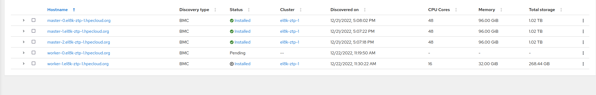
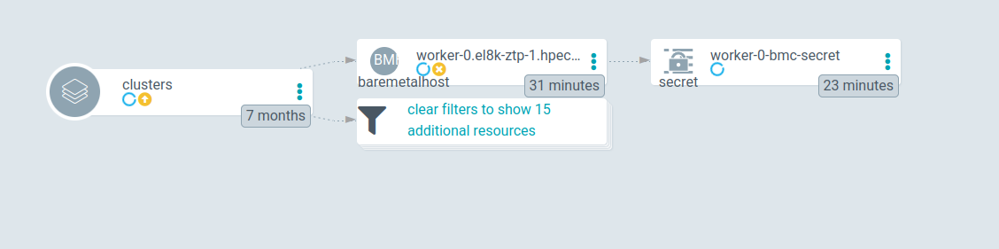
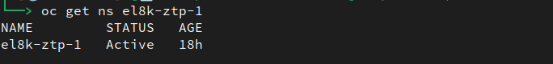

*Nothing official, just a quick experiment to share*

# Demonstrating the waves are not working as expected

We have all the resources managed by ArgoCD with sync-wave 1 but the one for NS as sync-wave 0. In theory, these will create the NS the first, and the the others. When deleting, the inverse order.

I think, the order is oka, but there are not waits between waves. Or, no wait for an object to be created or deleted. Unless we used hooks, and we dont. So, the order works, but without waits, it is like all are deleted at the same time. Ok, deleted in order, one after another, no waits, so.. pretty close to all at the same time.

I have done a test of deleting, and immediately we sync, the NS appears as terminating. 

This test will  do:

* Use the ArgoCD GUI to make the synch but not synching the NS object. 

* There is one BMH that failed the installation. Forced by me with a wrong RootDeviceHint

* So the BMH is controlled by the BMO and it will make the deprovisioning process

* With the NS not been deleted, the BMH will be able to all the work it needs to do correctly.

* So all the objects should be deleted correctly. No stuck

* And after that, the NS can be synch, and it should be deleted.

## The environment



About the workers:

* worker-1: has been installed correctly. So its BMH is now managed by the AI:

```bash
> oc -n el8k-ztp-1 get bmh worker-1.el8k-ztp-1.hpecloud.org -o jsonpath={.metadata.annotations} | jq
{
  "argocd.argoproj.io/sync-wave": "1",
  "baremetalhost.metal3.io/detached": "assisted-service-controller",
...
...
}
```

* worker-0: One has been forced to fail. So the BMO manages the object.

## Deleting the cluster but no the NS

When we invoke the deletion, worker-1 will be deleted immediately. The BMO do nothing. The worker-0 under the BMO control will do the deprovisioning and it will take more time.

Delete the Siteconfig, and ArgoCD will look out of synch. But this time, we will synch everything but the Namespace. So we give enough time objects to be deleted. Specially, to the BMH for worker-0:

With the NS not marked to be synch, this is neither deleted or marked to be deleted:



And the BMHO of worker-0 is still taking time:


The BMH is trying to be deleted, and it is taking some time. But the NS is still there and it can continue working.



The deletion is taking some time. We can check some errors on the BMO, which it is trying to do something as deprovisioning:

```bash
{"level":"error","ts":1671706496.2856994,"logger":"controller.baremetalhost","msg":"Reconciler error","reconciler group":"metal3.io","reconciler kind":"BareMetalHost","name":"worker-0.el8k-ztp-1.hpecloud.org","namespace":"el8k-ztp-1","error":"action \"deleting\" failed: failed to remove finalizer: Operation cannot be fulfilled on baremetalhosts.metal3.io \"worker-0.el8k-ztp-1.hpecloud.org\": StorageError: invalid object, Code: 4, Key: /kubernetes.io/metal3.io/baremetalhosts/el8k-ztp-1/worker-0.el8k-ztp-1.hpecloud.org, ResourceVersion: 0, AdditionalErrorMsg: Precondition failed: UID in precondition: f8feab9f-784a-4f5b-a95d-c483bf417f57, UID in object meta: ","errorVerbose":"Operation cannot be fulfilled on baremetalhosts.metal3.io \"worker-0.el8k-ztp-1.hpecloud.org\": StorageError: invalid object, Code: 4, Key: /kubernetes.io/metal3.io/baremetalhosts/el8k-ztp-1/worker-0.el8k-ztp-1.hpecloud.org, ResourceVersion: 0, AdditionalErrorMsg: Precondition failed: UID in precondition: f8feab9f-784a-4f5b-a95d-c483bf417f57, UID in object meta: \nfailed to remove finalizer\ngithub.com/metal3-io/baremetal-operator/controllers/metal3%2eio.(*BareMetalHostReconciler).actionDeleting\n\t/go/src/github.com/metal3-io/baremetal-operator/controllers/metal3.io/baremetalhost_controller.go:542\ngithub.com/metal3-io/baremetal-operator/controllers/metal3%2eio.(*hostStateMachine).handleDeleting\n\t/go/src/github.com/metal3-io/baremetal-operator/controllers/metal3.io/host_state_machine.go:538\ngithub.com/metal3-io/baremetal-operator/controllers/metal3%2eio.(*hostStateMachine).ReconcileState\n\t/go/src/github.com/metal3-io/baremetal-operator/controllers/metal3.io/host_state_machine.go:199\ngithub.com/metal3-io/baremetal-operator/controllers/metal3%2eio.(*BareMetalHostReconciler).Reconcile\n\t/go/src/github.com/metal3-io/baremetal-operator/controllers/metal3.io/baremetalhost_controller.go:247\nsigs.k8s.io/controller-runtime/pkg/internal/controller.(*Controller).reconcileHandler\n\t/go/src/github.com/metal3-io/baremetal-operator/vendor/sigs.k8s.io/controller-runtime/pkg/internal/controller/controller.go:298\nsigs.k8s.io/controller-runtime/pkg/internal/controller.(*Controller).processNextWorkItem\n\t/go/src/github.com/metal3-io/baremetal-operator/vendor/sigs.k8s.io/controller-runtime/pkg/internal/controller/controller.go:253\nsigs.k8s.io/controller-runtime/pkg/internal/controller.(*Controller).Start.func2.2\n\t/go/src/github.com/metal3-io/baremetal-operator/vendor/sigs.k8s.io/controller-runtime/pkg/internal/controller/controller.go:214\nruntime.goexit\n\t/usr/lib/golang/src/runtime/asm_amd64.s:1581\naction \"deleting\" failed\ngithub.com/metal3-io/baremetal-operator/controllers/metal3%2eio.(*BareMetalHostReconciler).Reconcile\n\t/go/src/github.com/metal3-io/baremetal-operator/controllers/metal3.io/baremetalhost_controller.go:251\nsigs.k8s.io/controller-runtime/pkg/internal/controller.(*Controller).reconcileHandler\n\t/go/src/github.com/metal3-io/baremetal-operator/vendor/sigs.k8s.io/controller-runtime/pkg/internal/controller/controller.go:298\nsigs.k8s.io/controller-runtime/pkg/internal/controller.(*Controller).processNextWorkItem\n\t/go/src/github.com/metal3-io/baremetal-operator/vendor/sigs.k8s.io/controller-runtime/pkg/internal/controller/controller.go:253\nsigs.k8s.io/controller-runtime/pkg/internal/controller.(*Controller).Start.func2.2\n\t/go/src/github.com/metal3-io/baremetal-operator/vendor/sigs.k8s.io/controller-runtime/pkg/internal/controller/controller.go:214\nruntime.goexit\n\t/usr/lib/golang/src/runtime/asm_amd64.s:1581","stacktrace":"sigs.k8s.io/controller-runtime/pkg/internal/controller.(*Controller).Start.func2.2\n\t/go/src/github.com/metal3-io/baremetal-operator/vendor/sigs.k8s.io/controller-runtime/pkg/internal/controller/controller.go:214"}
```

The error seems to be something about the storate. We forced to fail the installation, actually, because of a wrong storage. So, maybe makes sense this take time. Anyway, in some moment it will time out, or it will give up, and the object will be deleted:


All the objects have been deleted:

```bash
> oc -n el8k-ztp-1 get bmh
No resources found in el8k-ztp-1 namespace.
```

But even the NS, which is something not expected (maybe some configuration in the ArgoCD App):

```bash
> oc get ns el8k-ztp-1
Error from server (NotFound): namespaces "el8k-ztp-1" not found
```

## Conclusion

* The way we are using the ArgoCD sync-waves are not working as we would expect. All the objects are deleted at the same time, or, one just after the other.

* With this behavior, some objects would not finish correctrly.

* The BMO is taking very much time to delete the BMH. But this would be the expected behavior.

* 