# Installation an SNO node

In this tutorial we will follow how to install an SNO node.

In a firs step you have to create the cluster to install the SNO node. In this tutorial we cover different options

* Create the Cluster from the AI Web UI

* Create the Cluster from the AI command line tool

Later, you will prepare and configure th node. In this tutorial we cover different options:

* Install the node in a virtual machine

* Install the node in a baremetal server - Command line way

Once the node is ready, there are some commons steps to finalize the node installation.

## Step 0 - Create the cluster

Choose the method you prefer to create the cluster

### Option a) Create the Cluster from the AI web console

Go to the assisted installer to create the image to boot our SNO virtual machine. [here](https://console.redhat.com/openshift/assisted-installer/clusters/~new)

It is very simple, you just create a cluster given a name and a domain. 

Jump to [Step 1](Step_1)

### Option b) Create the Cluster using AI command line tool

## Step 1 - Prepare and configure the SNO node

Choose the method you prefer to prepare the node.

### Option a) SNO in a virtual machine with Kcli

Tutorial to deploy Openshift Single Node in virtualized environment. The requirements for the single node:

* 30 GB of RAM

* 120GB hard disk

* 8 cpus

Generate and download the Discovery ISO from the cluster you created in the Step 0.

* Include an ssh key into the image. One key available from the host where you are creating the VM (next steps) 

* Here configure also the proxy if need it

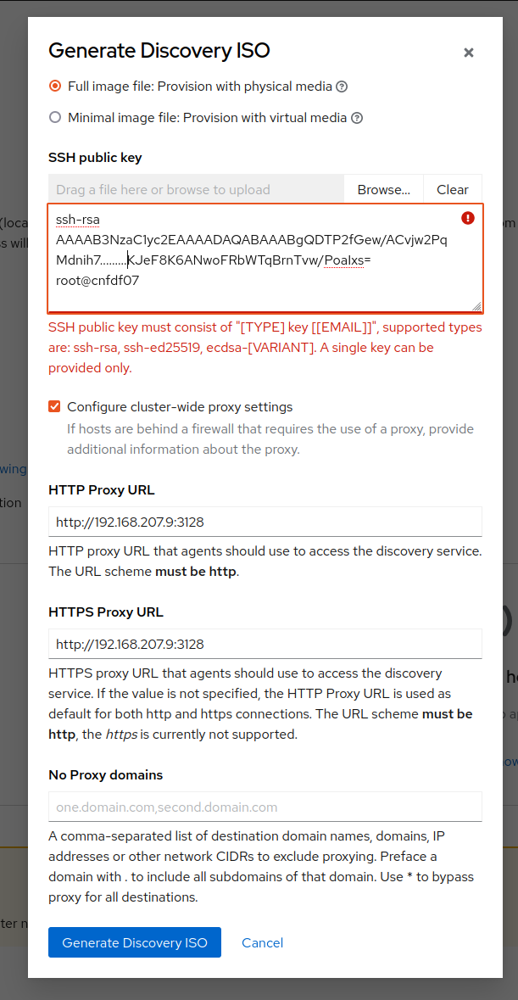

Lets create the VM for the SNO node with Kcli:

```bash
kcli create vm SNO_vm -P memory=30720 -P numcpus=8 \
> -P disks=['{"size": 120}']  \
> -P http_proxy=http://192.168.207.9:3128 \
> -P iso=/tmp/discovery_image_test-sno-local-jgato.iso
Deploying vm SNO_vm from profile kvirt...
SNO_vm created on local
kcli start vm SNO_vm
Starting vm SNO_vm...
SNO_vm started
```

* iso pointing to the created and download it iso.

* The http_proxy if need it.
  
  * If using our dallas lab, you have to use the jump proxy

Wait a little and connect the host:

```bash
ssh core@IP
```

This will use the ssh key that you used during the image creation.

If everything goes ok, back to the cluster web console, you will see your SNO available. It is time for the next common  step

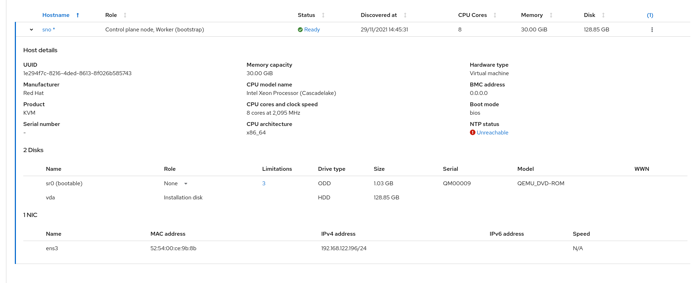

### Option b) SNO in baremetal with command line

Tutorial to deploy SNO in a baremetal server, using [GitHub - karmab/assisted-installer-cli: assisted-installer-cli helper tool](https://github.com/karmab/assisted-installer-cli). 

* This process is done from a jump-host in a baremetal server.

* The SNO node will be created with an available server.

* If you want to access SNO, you need to resolve dns for Ingress Wildcard: apps.
  
  * Ingress Wildcard *.apps.<clustername>.<base_domain>
  * Internal API: api-int.<clustername>.<base_domain>
  * External API: api.<clustername>.<base_domain>

In our case, this is basically solved with the '/etc/hosts' of the jump host (access from outside not need it):

```
#nodeXX
192.168.207.XX cnfdf07.ran.dfwt5g.lab
192.168.207.XX api.cnfdf07.ran.dfwt5g.lab
192.168.207.XX api-int.cnfdf07.ran.dfwt5g.lab
192.168.207.XX *.apps.cnfdf07.ran.dfwt5g.lab
```

So, during step 0 be sure you use a cluster name and base domain depending on you DNS. In this case, the base domain used in step 0 was ran.dfwt5g.lab and the cluster name cnfdf07. That will solve to the host where the SNO will be installed.

Important, use the Assisted Installer **ONLY TO CREATE THE CLUSTER**, **dont prepare the discovery image**. This will be done manually now, in order to configure: workload partitioning and OVNKubernetes as our SDN plugin.

Get an API TOKEN from [here](https://console.redhat.com/openshift/token) and store it in an env variable:

```bash
TOKEN=<token>
```

#### Prepare aicli command line tool

Create a directory to be used by aicli:

```bash
mkdir -p ${HOME}/.aicli
```

aicli can be downloaded, or used as a docker container. In this case we will use it as a docker container. An alias will facilitate the usage of the command

```bash
alias aicli='sudo podman run --rm -e AI_OFFLINETOKEN=${TOKEN} -v ${HOME}/.ssh/:/root/.ssh/:Z -v $HOME/.aicli:/root/.aicli:Z -v ${HOME}/.aicli/:/workdir:Z quay.io/karmab/aicli:latest'
```

if the aicli will need a proxy, then:

```bash
alias aicli='sudo podman run --rm -e http_proxy=<your_proxy> -e https_proxy=<your_proxy> -e AI_OFFLINETOKEN=${TOKEN} -v ${HOME}/.ssh/:/root/.ssh/:Z -v $HOME/.aicli:/root/.aicli:Z -v ${HOME}/.aicli/:/workdir:Z quay.io/karmab/aicli:latest'
```

The command is pretty simple. It is just invoke aicli inside a container. You are sharing with the container the TOKEN, a directory to share files, and the ssh directory. This will give the command access to your ssh key (to latter connect the node) and the aicli directory with some manifests with the configuration.

Now try the command:

```bash
]# aicli list clusters
Using https://api.openshift.com as base url
Storing new token in /root/.aicli/token.txt
+---------------------+--------------------------------------+-------------------+----------------+
|       Cluster       |                  Id                  |       Status      |   Dns Domain   |
+---------------------+--------------------------------------+-------------------+----------------+
|       cnfdf07       | 17b576f9-6045-4cd5-8d39-2b42a5c31437 | pending-for-input | ran.dfwt5g.lab |
| test-sno-loca-jgato | 4daa5e7d-61aa-4892-a151-24f87ddeabec |     installed     | jgato-test.com |
+---------------------+--------------------------------------+-------------------+----------------+
```

In the output there is another cluster that I owned by the time of this tutorial.

Now we will tune the installation before downloading the SNO image.

#### Configure the workload partitioning

*This step depends on your host*

Configure your workload partitioning manifest. Edit the CPUSET value to fit your needs:

```bash
CPUSET="0-1,20-21,30-31,40-41"
mkdir -p ${HOME}/.aicli/ai-manifests-jgato
cat <<EOF > ${HOME}/.aicli/ai-manifests-jgato/99_workload_partitioning.yaml
apiVersion: machineconfiguration.openshift.io/v1
kind: MachineConfig
metadata:
  labels:
    machineconfiguration.openshift.io/role: master
  name: 02-master-workload-partitioning
spec:
  config:
    ignition:
      version: 3.2.0
    storage:
      files:
      - contents:
          source: data:text/plain;charset=utf-8;base64,WP01
        mode: 420
        overwrite: true
        path: /etc/crio/crio.conf.d/01-workload-partitioning
        user:
          name: root
      - contents:
          source: data:text/plain;charset=utf-8;base64,WP02
        mode: 420
        overwrite: true
        path: /etc/kubernetes/openshift-workload-pinning
        user:
          name: root
EOF
```

Now we do two substitutions to include the partitioning info (encoded) into the manifest

Substitution 1:

```bash
sed -i "s/WP01/$(echo "W2NyaW8ucnVudGltZS53b3JrbG9hZHMubWFuYWdlbWVudF0KYWN0aXZhdGlvbl9hbm5vdGF0aW9uID0gInRhcmdldC53b3JrbG9hZC5vcGVuc2hpZnQuaW8vbWFuYWdlbWVudCIKYW5ub3RhdGlvbl9wcmVmaXggPSAicmVzb3VyY2VzLndvcmtsb2FkLm9wZW5zaGlmdC5pbyIKcmVzb3VyY2VzID0geyAiY3B1c2hhcmVzIiA9IDAsICJjcHVzZXQiID0gIkNIQU5HRU1FIiB9Cg==" | base64 -d | sed "s/CHANGEME/${CPUSET}/" | base64 -w0)/" ${HOME}/.aicli/ai-manifests-jgato/99_workload_partitioning.yaml
```

What is this command doing?

* It is substituting WP01 string for a base64 encoded string

* This encoded string contains you CPUSET and some other configs. If you decode the string:

```bash
echo "W2NyaW8ucnVudGltZS53b3JrbG9hZHMubWFuYWdlbWVudF0KYWN0aXZhdGlvbl9hbm5vdGF0aW9uID0gInRhcmdldC53b3JrbG9hZC5vcGVuc2hpZnQuaW8vbWFuYWdlbWVudCIKYW5ub3RhdGlvbl9wcmVmaXggPSAicmVzb3VyY2VzLndvcmtsb2FkLm9wZW5zaGlmdC5pbyIKcmVzb3VyY2V
zID0geyAiY3B1c2hhcmVzIiA9IDAsICJjcHVzZXQiID0gIjAtMSwyMC0yMSwzMC0zMSw0MC00MSIgfQo=" | base64 --decode
[crio.runtime.workloads.management]
activation_annotation = "target.workload.openshift.io/management"
annotation_prefix = "resources.workload.openshift.io"
resources = { "cpushares" = 0, "cpuset" = "0-1,20-21,30-31,40-41" }
```

Substitution 2:

```bash
sed -i "s/WP02/$(echo "ewogICJtYW5hZ2VtZW50IjogewogICAgImNwdXNldCI6ICJDSEFOR0VNRSIKICB9Cn0K" | base64 -d | sed "s/CHANGEME/${CPUSET}/" | base64 -w0)/" ${HOME}/.aicli/ai-manifests-jgato/99_workload_partitioning.yaml
```

Very similar to the previous one. Here we are encoding:

```json
{
  "management": {
    "cpuset": "0-1,20-21,30-31,40-41"
  }
}
```

And finally we create the manifests based on this configuration

```bash
aicli create manifests --dir /workdir/ai-manifests-jgato/ <cluster_name>
Using https://api.openshift.com as base url
Uploading manifests for Cluster cnfdf07
Storing new token in /root/.aicli/token.txt
uploading file 99_workload_partitioning.yaml
```

* Here /workdir/ai-manifest refers to the created dir inside the container, which also points to  ~/.aicli/ai-manifests-jgato

* <cluster_name> is the one you used in the Step 0. The name you gave to the cluster. cnfdf07 in this case. But you can get it with ''aicli list clusters'

#### Configure static IP (optional)

*This step depends on your host*

*This step is need it if dont have DHCP server*

If you have a DHCP Server, Jump to [Download the SNO image](Download_the_SNO_image)

This is just an example, you will have to custom it according to your infrastructure (IP, Gateway, DNS, etc).

```bash
cat <<EOF > ${HOME}/.aicli/aicli-parameters-jgato.yaml
static_network_config:
- interfaces:
    - name: ens3
      type: ethernet
      state: up
      ethernet:
        auto-negotiation: true
        duplex: full
        speed: 1000
      ipv4:
        address:
        - ip: 192.168.207.10
          prefix-length: 24
        enabled: true
      mtu: 1500
      mac-address: 0c:42:a1:bc:63:e4
  dns-resolver:
    config:
      server:
      - 192.168.207.9
  routes:
    config:
    - destination: 0.0.0.0/0
      next-hop-address: 192.168.207.1
      next-hop-interface: ens3
      table-id: 254
EOF
```

(Optional) Due to we will download the iso image from command line and not from the Web UI. We have to set here the proxy (in case the SNO will need to access internet with a Proxy):

```bash
aicli update cluster <cluster_name> -P http_proxy=<proxy> -P https_proxy=<proxy>
```

And we create the ISO image with these params:

```bash
aicli create iso -m --paramfile ${HOME}/.aicli/aicli-parameters-jgato.yaml <your_cluster_name>
```

and download the iso we have created with our custom network configuration:

```bash
aicli download iso -p /workdir/ <your_cluster_name>
```

Remember workdir (inside the container) is linked to your ${home}/.aicli/. So:

```bash
ls -l ~/.aicli/*.iso
-rw-r--r--. 1 root root 108984320 Nov 30 04:00 /root/.aicli/cnfdf07.iso
```

We can check that image contains our custom configuration

```bash
aicli info cluster --full -f image_info <your_cluster_name>
```

You can step next section, because you already have the image. Jump to [Boot the Server](Boot_the_server)

#### Download the SNO image

If you did the configure static IP you already have the image. If not, go to the AI Web Console and download it. In that case, remember:

* To include you ssh key 

* Configure the proxy if need it.

#### Boot the server with BMC/VirtualMedia

[ToDo] Use captures with English language.

Download the ISO to a local host and connect to the BMC/VirtualMedia to boot it.

```bash
scp root@dallas-jump:~/.aicli/cnfdf07.iso .
Warning: Permanently added '172.27.17.56' (ED25519) to the list of known hosts.
root@172.27.17.56's password: 
cnfdf07.iso                                     0%   96KB  91.0KB/s   19:28 ETA
```

Connect the virtual media and assign the ISO to the CD/DVD

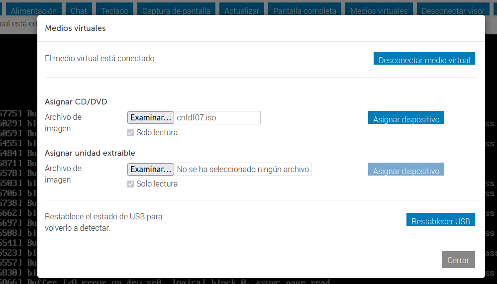

Check the that the iso has been assigned to CD/DVD

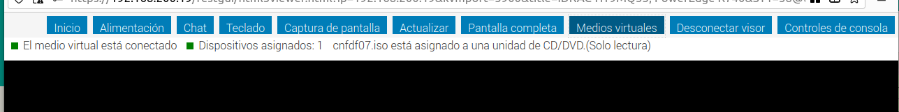

Select to boot from a virtual ISO CD/DVD

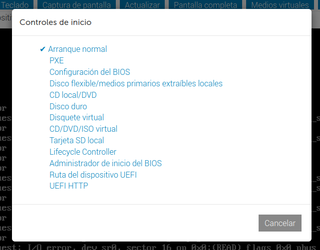

and confirm. 

The host should reboot now, If not, send ctrl+alt+del .

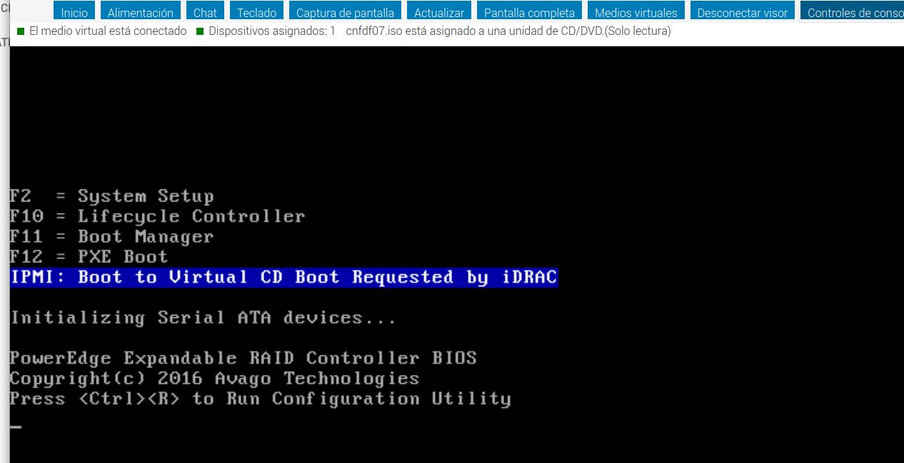

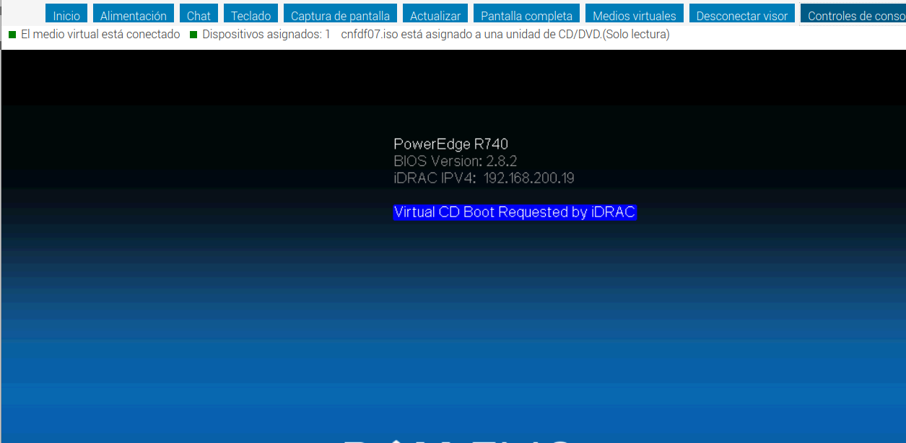

And finally it will boot with our ISO

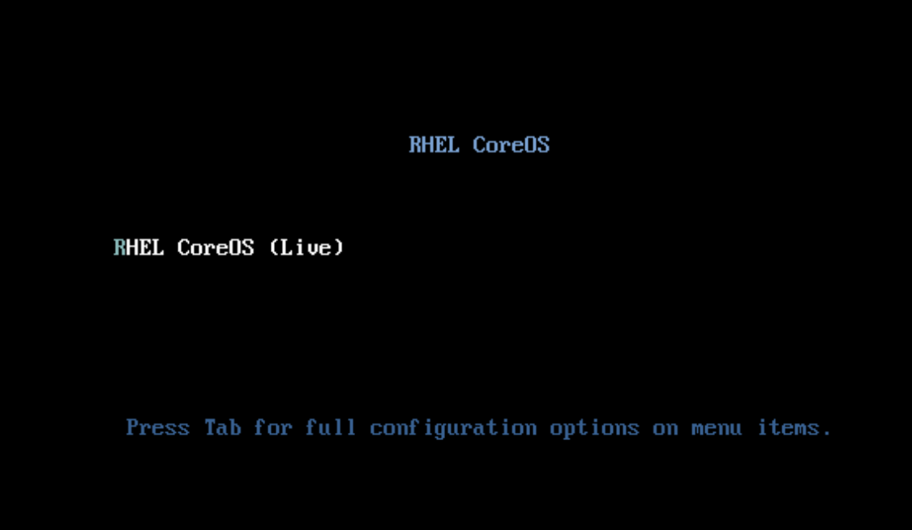

Now you can jump to Next Common Steps

## Next common steps

### Wait to see the node of your cluster

From the AI web console, in a while, it should appear the node.

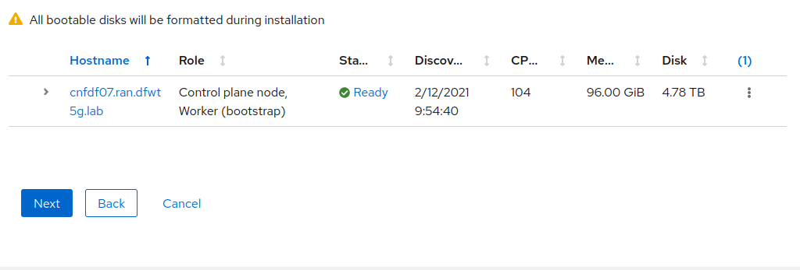

### Networking

In the next step the network is validates, If it was not provided a proper CIDR address, the web console interface will propose you a new alternative:

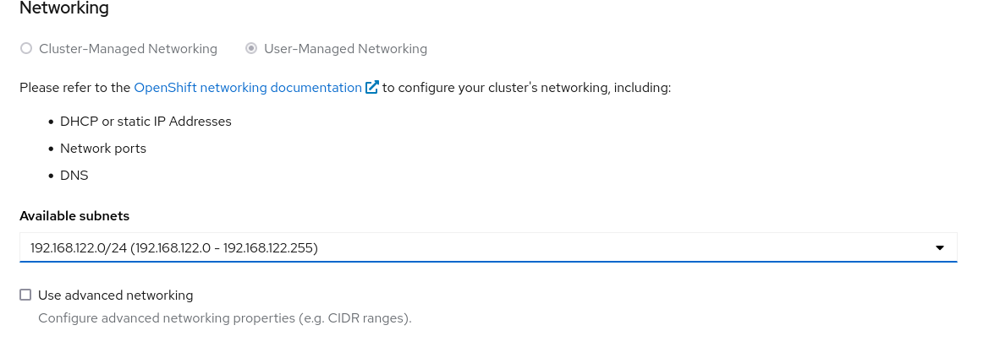

Choose an available subnet and click next.

In the advanced networking you can choose OVN as you network plugin. This is more advanced (and soon the default). Very recommended for CNF.

Go to last step and click install cluster.

### Installing

From the web console you can check the installation process

This will take a while

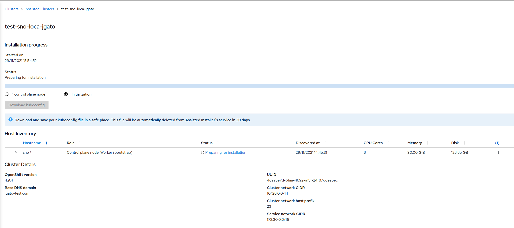

And finally you got it:

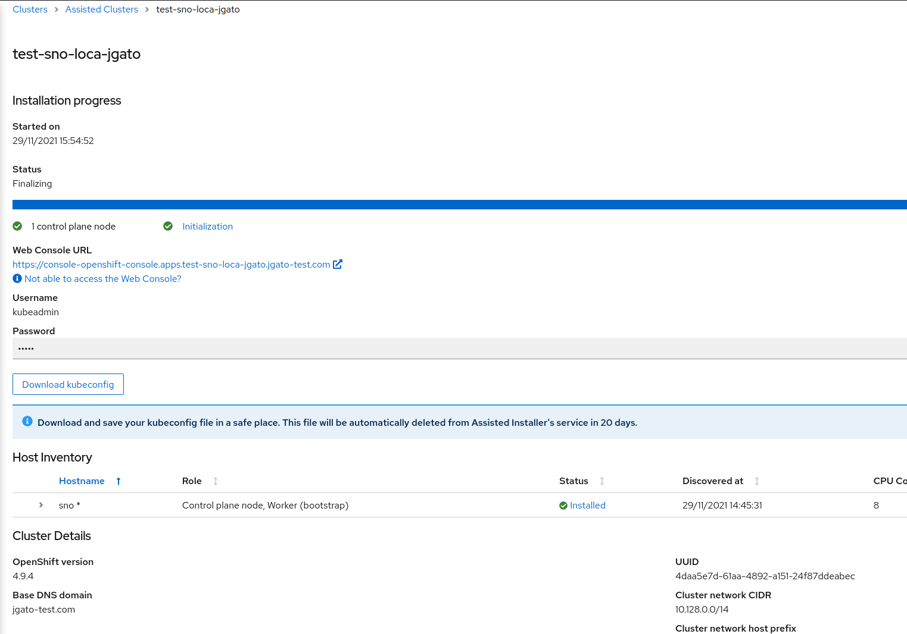

### Testing the cluster

# Some issues found

## Proxy not properly configured

If you ssh into the node and use journal to look some logs

```
Nov 29 13:30:56 localhost systemd[1]: Starting agent.service...
Nov 29 13:30:56 localhost agent-fix-bz1964591[6454]: Error: registry.redhat.io/rhai-tech-preview/assisted-installer-agent-rhel8:v1.0.0-76: image not known
Nov 29 13:30:56 localhost podman[6557]: Trying to pull registry.redhat.io/rhai-tech-preview/assisted-installer-agent-rhel8:v1.0.0-76...
Nov 29 13:31:56 localhost podman[6557]: Error: Error initializing source docker://registry.redhat.io/rhai-tech-preview/assisted-installer-agent-rhel8:v1.0.0-76: error pinging docke>
Nov 29 13:31:56 localhost systemd[1]: agent.service: Control process exited, code=exited status=125
Nov 29 13:31:56 localhost systemd[1]: agent.service: Failed with result 'exit-code'.
Nov 29 13:31:56 localhost systemd[1]: Failed to start agent.service.
Nov 29 13:32:00 localhost systemd[1]: agent.service: Service RestartSec=3s expired, scheduling restart.
Nov 29 13:32:00 localhost systemd[1]: agent.service: Scheduled restart job, restart counter is at 32.
```

You did not configured correctly the proxy during image creation. 

## NTP issues

During my installation, appeared an NTP issue:

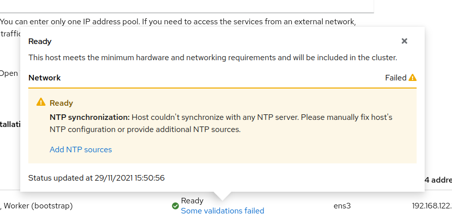

This can be fixed in the networking step with the web console. In my case, I used the NTP address according to the laboratory I was using.

## HTTP problems accessing SNO VM in our lab

If you find problems connnecting to you VM and you receive some forbidden errors. Check if you have some environment variables configured to point the proxy server in the jump host. This makes all the HTTP(S) requests goes through the Proxy, including any execution of oc command. 

```bash
oc get nodes --kubeconfig ./kube-test
Unable to connect to the server: Forbidden
```

Solution, configure the environment to not use the proxy when accessing to the SNO node:

```bash
export NO_PROXY=api.test-sno-local-jgato.jgato-test.com,192.168.122.196
oc get nodes --kubeconfig ./kube-test
NAME   STATUS   ROLES           AGE   VERSION
sno    Ready    master,worker   17h   v1.22.0-rc.0+ef241fd
```
