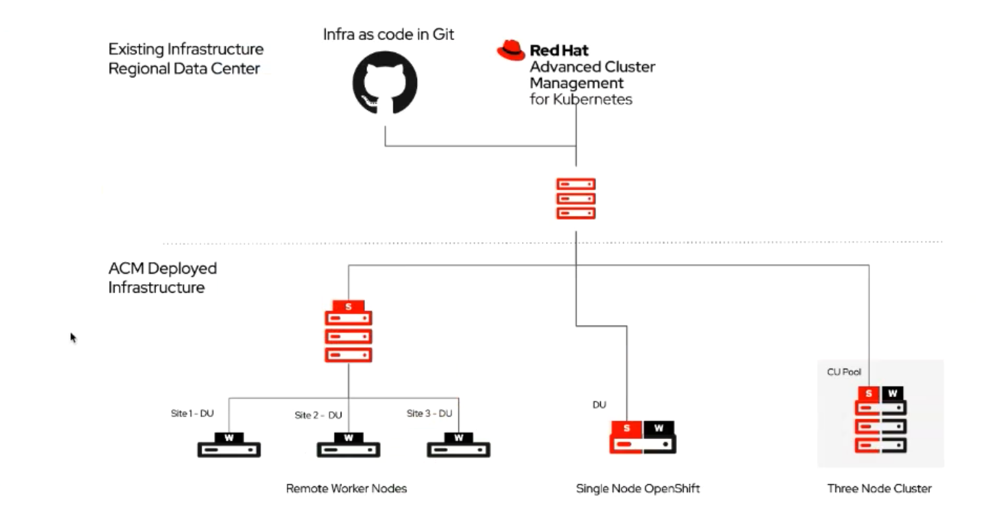
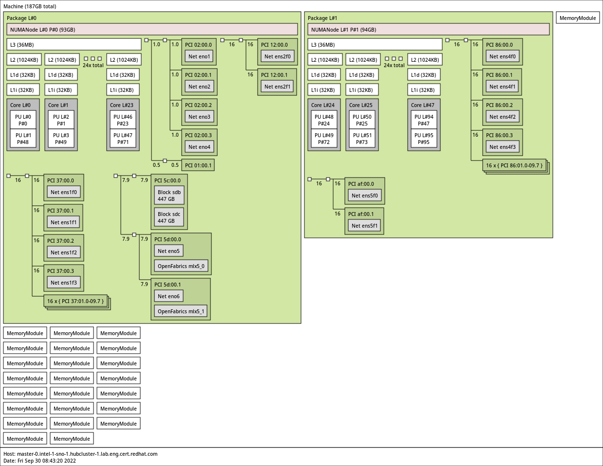
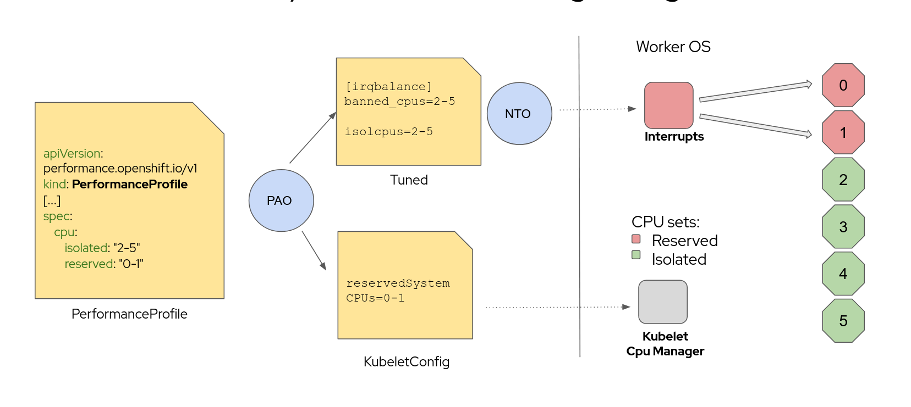
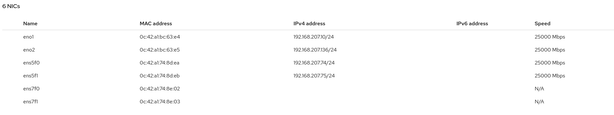

# Openshift Operators

## ACM

The Advanced Cluster Management is based on two Operators:

* Multi-cluster-hub that runs in the Openshift which manages other clusters

* Multi-cluster-endpoint that runs in the Managed Clusters

How it is used in 5G infrastructures. By the moment for the DU (Distributed units) with SNO and CU(Central unit) and 3 nodes in the future



1 single node with 3 Du

just SNO with 1 DU

They are trying to support as much clusters as possible. A demo with Verizon, instalilng 1000 SNO clusters in 4 hours.

## Machine Config

*"Machine Config operator manage updates and configuration changes to essentially everything between the kernel and kubelet. This operator manages updates to systemd, cri-o/kubelet, kernel, NetworkManager, etc. It also offers a new MachineConfig CRD that can write configuration files onto the host."*

CRDS:

* The source of machine configuration and is used for installation and 
  first-boot, as well as upgrades. 

```yaml
apiVersion: machineconfiguration.openshift.io/v1
kind: MachineConfig
metadata:
  labels:
    machineconfiguration.openshift.io/role: infra
  name: 50-infra
spec:
  config:
    ignition:
      version: 2.2.0
    storage:
      files:
      - contents:
          source: data:,test
        filesystem: root
        mode: 0644
        path: /etc/testinfra
```

* The Machine Config Pool is the main object to resolve the 
  situation. The Machine Config Pool operates similarly to the Rolebinding
   object, which associates roles with users. The Machine Config Pool 
  associates nodes with Machine Configs.

```yaml
apiVersion: machineconfiguration.openshift.io/v1
kind: MachineConfigPool
metadata:
  name: infra
spec:
  machineConfigSelector:
    matchExpressions:
      - {key: machineconfiguration.openshift.io/role, operator: In, values: [worker,infra]}
  maxUnavailable: null
  nodeSelector:
    matchLabels:
      node-role.kubernetes.io/infra: ""
  paused: false
```

### Roles and pools

So, we have see how MCP assign MCs for an specific node's role. This is very important: **A host can belongs only to one MCP**. So, **if a host has roles that belongs to different MCP, the Operator will not know which one to apply**.  But the exception on having Worker and Master roles. In this case, the host is affected for two MCP, but the operator is aware and will apply only the MCP of Master.

Other options:

* Master + CustomRole: Not allowed, error

* Master + Worker: as it is explained, it is ok and it will apply Master Configs

* Worker + CustomRole: applies both

* Master + Worker + CustomRole: the same, not allowed

* More than one CustomRole: not allowed neither

[This piece of code](https://github.com/openshift/machine-config-operator/blob/release-4.9/pkg/controller/node/node_controller.go#L578-L609) summarizes everything really well.

## CNF Operators

### Performance Addon Operator

This operator sets special performance configurations for CPU. Very related to each hardware. It is an operator very related to lowlatency and RT needs, like in RAN. Mainly is used by RAN providers.

Fine-tunning your CPU Hardware based on profiles. The same cluster, different nodes with different hardware. Configure certain nodes for low latency, real-time or DPDK purposes without having to understand all the interactions of kernel, RHCOS and OCP components.

- Certain workloads need to be isolated from all interruptions as the latency of their responses matter (packet latency <20us was requested by Nokia)
- This is specifically needed for Telco customers both for their Web-scale and Edge deployments

What can be configured:

* CPU Isolation/Reserved configuration
* hugepages
* realTimeKernel
* numa topology

[Story for Performance Addon Operator](https://issues.redhat.com/browse/CNF-909)

[GitHub - openshift-kni/performance-addon-operators: Operators related to optimizing OpenShift clusters for applications sensitive to cpu and network latency](https://github.com/openshift-kni/performance-addon-operators)

[Doc for OCP 4.5](https://docs.openshift.com/container-platform-ocp/4.5/scalability_and_performance/cnf-performance-addon-operator-for-low-latency-nodes.html)

#### Partitioning the CPUs

Specify two groups of CPUs in the `spec` section:

- `isolated` - Has the lowest latency. Processes in this group have no interruptions and so can, for example, reach much higher DPDK zero packet loss bandwidth.
  
  Isolated because it means that works isolated and not interrupted (by default). 

- `reserved` - or housekeeping CPUs. Threads in the reserved group tend to be very busy, so latency-sensitive applications should be run in the isolated group. It runs all the usual process in the cluster, but also some not low latency workloads.

Some confusions:

* Reserved as mostly used for the OS processes.

* Regular pods run on isolated pool

* LowLatency, RT, DPDK Pods will run in isolated cpus. But, once this cpu is assigned to these... it will not be used by regular pods. This is because a pod has done CPU pinning, and the assiganted isolated cpu will work exclusively for it. 

* IRQS works differently, it depends on if you have configured to not have IRQS in isolated. globalirqloadbalance by default is false, so by default, you will have IRQS in isolated.

* if you have IRQS enabled on isolated, when you make CPU Pining you can specify to not have IRQs in that CPU.

* Actually, regular pods could also run in Reserved ones.

#### How to know the available cpus in the system:

```bash
[root@cnfdf07 core]# grep Cpus_allowed_list /proc/self/status | awk '{print $2}'
0-103
```

#### How to get a whole picture of your hardware NUMAS

The lstopo tool can help you to get a picture of the architecture

```bash
$> oc debug node/master-0.intel-1-sno-1.hubcluster-1.lab.eng.cert.redhat.com --image=quay.io/karampok/snife -- lstopo -f /host/tmp/numas.png
```

Then copy the picture to your host (trick):

One terminal to open a debug node (pod), and make rsync to copy the file from the pod in other terminal

```bash
# Terminal 1
$> oc debug node/master-0.intel-1-sno-1.hubcluster-1.lab.eng.cert.redhat.com
# Terminal 2
$> oc -n default rsync master-0intel-1-sno-1hubcluster-1labengcertredhatcom-debug:/host/tmp/numas.png /tmp
```




#### How to know the affinity between irqs and cpus

```bash
# find /proc/irq/ -name smp_affinity_list -exec sh -c 'i="$1"; mask=$(cat $i); file=$(echo $i); echo $file: $mask' _ {} \;
/proc/irq/0/smp_affinity_list: 0-103
/proc/irq/1/smp_affinity_list: 0-103
/proc/irq/2/smp_affinity_list: 0-103
/proc/irq/3/smp_affinity_list: 0-103
/proc/irq/4/smp_affinity_list: 0,2,4,6,8,10,12,14,16,18,20,22,24,26,28,30,32,34,36,38,40,42,44,46,48,50,52,54,56,58,60,62,64,66,68,70,72,74,76,78,80,82,84,86,88,90,92,94,96,98,100,102
/proc/irq/5/smp_affinity_list: 0,2,4,6,8,10,12,14,16,18,20,22,24,26,28,30,32,34,36,38,40,42,44,46,48,50,52,54,56,58,60,62,64,66,68,70,72,74,76,78,80,82,84,86,88,90,92,94,96,98,100,102
/proc/irq/6/smp_affinity_list: 0-103
/proc/irq/7/smp_affinity_list: 0-103
/proc/irq/8/smp_affinity_list: 0,2,4,6,8,10,12,14,16,18,20,22,24,26,28,30,32,34,36,38,40,42,44,46,48,50,52,54,56,58,60,62,64,66,68,70,72,74,76,78,80,82,84,86,88,90,92,94,96,98,100,102
/proc/irq/9/smp_affinity_list: 0,2,4,6,8,10,12,14,16,18,20,22,24,26,28,30,32,34,36,38,40,42,44,46,48,50,52,54,56,58,60,62,64,66,68,70,72,74,76,78,80,82,84,86,88,90,92,94,96,98,100,102
/proc/irq/10/smp_affinity_list: 0,2,4,6,8,10,12,14,16,18,20,22,24,26,28,30,32,34,36,38,40,42,44,46,48,50,52,54,56,58,60,62,64,66,68,70,72,74,76,78,80,82,84,86,88,90,92,94,96,98,100,102
/proc/irq/11/smp_affinity_list: 0,2,4,6,8,10,12,14,16,18,20,22,24,26,28,30,32,34,36,38,40,42,44,46,48,50,52,54,56,58,60,62,64,66,68,70,72,74,76,78,80,82,84,86,88,90,92,94,96,98,100,102
/proc/irq/12/smp_affinity_list: 0-103
/proc/irq/13/smp_affinity_list: 0-103
/proc/irq/14/smp_affinity_list: 0-103
/proc/irq/15/smp_affinity_list: 0-103
/proc/irq/16/smp_affinity_list: 12
....
...
```

In a system with the 'GloballyDisableIrqLoadBalancing' set to true, Isolated CPUs will not be pointed by any irq.

More commands about IRQs and CPUS 

```bash

```

#### How to use it

[Make the installation](https://github.com/ansvu/pao-sriov-operator#installing-the-performance-addon-operator-using-the-cli)

Check the installation:

```bash
$  oc get csv
NAME                                DISPLAY                      VERSION   REPLACES   PHASE
performance-addon-operator.v4.9.3   Performance Addon Operator   4.9.3                Succeeded
$ oc get po -n openshift-performance-addon-operator -o wide
NAME                                    READY   STATUS    RESTARTS   AGE     IP             NODE                     NOMINATED NODE   READINESS GATES
performance-operator-774b48d9f9-9r8r4   1/1     Running   0          5m16s   10.128.0.115   cnfdf07.ran.dfwt5g.lab   <none>           <none>
$ oc get csv
NAME                                DISPLAY                      VERSION   REPLACES   PHASE
performance-addon-operator.v4.9.3   Performance Addon Operator   4.9.3                Succeeded
```

This Operator is a Global Operator, so you can see it in any namespace

When installed it allows a new CRD: PerformanceProfile

It work similar to Openshift MachineConfig and MachineConfigPools. There you can configure the different machines and labels, that will be used by the created Profile.

Firstly, you define a MachineConfigPool with the configuration to be applied to a subset of nodes. In this case we are applying an specific configuration for RT nodes. These are usually worker nodes. So a RT node will have its configuration as RT node, but also the usual available configuration for worker nodes. 

```yaml
apiVersion: machineconfiguration.openshift.io/v1                                  
kind: MachineConfigPool                                                           
metadata:                                                                      
  name: worker-rt                                                              
  labels:                                                                      
    machineconfiguration.openshift.io/role: worker-rt                          
spec:                                                                          
  machineConfigSelector:                                                       
    matchExpressions:                                                          
      - {                                                                      
          key: machineconfiguration.openshift.io/role,                         
          operator: In,                                                        
          values: [worker-rt, worker],                                         
        }                                                                      
  paused: false                                                                
  nodeSelector:                                                                
    matchLabels:                                                               
      node-role.kubernetes.io/worker-rt: ""  
```

In this case, the nodes labeled as worker-rt will have MachineConfigurations created for worker and worker-rt. And it will be applied only on the nodes with the Role worker-rt. Check the section [Machine Configs - Roles and Pools](#Roles-and-pools) to better understand how roles are applied.

And now create the Performance Profile for worker-rt:

```yaml
apiVersion: performance.openshift.io/v2                                                                                                                                                                                                                       
kind: PerformanceProfile                                                          
metadata:                                                                      
  name: worker-rt                                                              
spec:                                                                          
  cpu:                                                                         
    isolated: 0-8                                                              
    reserved: 9-103                                                             
  hugepages:                                                                   
    defaultHugepagesSize: "1G"                                                 
    pages:                                                                     
    - size: "1G"                                                               
      count: 16                                                                
      node: 0                                                                  
  realTimeKernel:                                                              
    enabled: true                                                              
  nodeSelector:                                                                
    node-role.kubernetes.io/worker-rt: ""         
```

This PerformanceProfile will be converted into MachineConfig for worker-rt roles. 

So, the new MCP, created above, is rendered with the MachineConfigs for workers and workers-rt. 

Include some node into the worker-rt set:

```
oc label node your_worker node-role.kubernetes.io/worker-rt='' --overwrite
```

```bash
NAME        CONFIG                                                UPDATED   UPDATING   DEGRADED   MACHINECOUNT   READYMACHINECOUNT   UPDATEDMACHINECOUNT   DEGRADEDMACHINECOUNT   AGE
master      rendered-master-9f180a950af84d21a40e460eb940123a      True      False      False      3              3                   3                     0                      27m
worker      rendered-worker-27770033b92ef89681dcf17ca680a27a      True      False      False      2              2                   2                     0                      27m
worker-rt   rendered-worker-rt-27770033b92ef89681dcf17ca680a27a   False     True       False      1              0                   0                     0                      7m3s
```

Here, the MachineConfigPool worker-rt points to a rendered CONFIG, that includes all the MachineConfig from worker and the new one created for worker-rt. Here is still upgrading, but a machine has been selected. 

Look the kernel how it has RT enabled: 4.18.0-305.28.1.**rt**7.100.el8_4.x86_64

```bash
$ oc get nodes -o wide
NAME                     STATUS   ROLES           AGE   VERSION           INTERNAL-IP      EXTERNAL-IP   OS-IMAGE                                                       KERNEL-VERSION                         CONTAINER-RUNTIME
cnfdf07.ran.dfwt5g.lab   Ready    master,worker   44h   v1.22.3+4dd1b5a   192.168.207.10   <none>        Red Hat Enterprise Linux CoreOS 49.84.202111231504-0 (Ootpa)   4.18.0-305.28.1.rt7.100.el8_4.x86_64   cri-o://1.22.1-4.rhaos4.9.gite3dfe61.el8
```

##### Example with an SNO

Here it is important to notice that an SNO node already has Master+Worker Roles. Please, take a look to the section [Machine Config - Roles and Pools](#Roles-and-pools). 

Master+Worker node is allowed but you cannot add more Roles.  How to apply specific configuration for a new Role worker-rt. You cannot do it. You cannot add other role to the SNO node. The solution is:

* Create the PerformanceProfile to apply to Master. So the new PerformanceProfile is deployed as another config of the Master Role. You cannot base the PerformanceProfile on Worker configs, because in this case, only the Master configs are applied

```yaml
apiVersion: performance.openshift.io/v2
kind: PerformanceProfile
metadata:
  name: master    
spec:
  cpu:
    isolated: 0-8
    reserved: 9-103
  hugepages:
    defaultHugepagesSize: "1G"
    pages:
    - size: "1G"
      count: 16
      node: 0
  realTimeKernel:
    enabled: true
  nodeSelector:
    node-role.kubernetes.io/master: ""    
```

You dont need to create a MCP, because you are using the MCP for Master nodes. The existing MCP for master will use this PerformanceProfile, well... the MachineConfig that will be created with this PerformanceProfile.

Once the profile is crated, this is added to the MCP of master:

```yaml
piVersion: machineconfiguration.openshift.io/v1
kind: MachineConfigPool
metadata:
  creationTimestamp: "2021-12-13T16:59:05Z"
  generation: 7
  labels:
    machineconfiguration.openshift.io/mco-built-in: ""
    operator.machineconfiguration.openshift.io/required-for-upgrade: ""
    pools.operator.machineconfiguration.openshift.io/master: ""
  name: master
  resourceVersion: "570972"
  uid: 7a994cc7-1ebf-4a35-8754-0fc7a0396453
spec:
  configuration:
    name: rendered-master-1e54bc25983e744fbc3530441dfb38b8
    source:
    - apiVersion: machineconfiguration.openshift.io/v1
      kind: MachineConfig
      name: 00-master
    - apiVersion: machineconfiguration.openshift.io/v1
      kind: MachineConfig
      name: 01-master-container-runtime
    - apiVersion: machineconfiguration.openshift.io/v1
      kind: MachineConfig
      name: 01-master-kubelet
    - apiVersion: machineconfiguration.openshift.io/v1
      kind: MachineConfig
      name: 02-master-workload-partitioning
    - apiVersion: machineconfiguration.openshift.io/v1
      kind: MachineConfig
      name: 50-masters-chrony-configuration
    - apiVersion: machineconfiguration.openshift.io/v1
      kind: MachineConfig
      name: 50-nto-master
    - apiVersion: machineconfiguration.openshift.io/v1
      kind: MachineConfig
      name: 50-performance-master
    - apiVersion: machineconfiguration.openshift.io/v1
      kind: MachineConfig
      name: 99-master-dnsmasq-configuration
    - apiVersion: machineconfiguration.openshift.io/v1
      kind: MachineConfig
      name: 99-master-generated-kubelet
    - apiVersion: machineconfiguration.openshift.io/v1
      kind: MachineConfig
      name: 99-master-generated-registries
    - apiVersion: machineconfiguration.openshift.io/v1
      kind: MachineConfig
      name: 99-master-ssh
```

Notice that the Master MCP now it also includes a config 50-performance-master, created by the PerformanceProfile Operator.

#### Optimizations

##### Enabling RT Kernel

##### Allow reducing net queues via tuned - fixes failures to move irqs to housekeeping

[Details here](https://docs.google.com/presentation/d/1nrsDQ-OIvSJsnjCOTf0HosL-LwH_clOIbo_tpAqnQ8k/edit#slide=id.g95456f0950_0_127)

##### Management and workloads split

For RAN deployments the number of CPUs available for RAN workloads directly translates into the number of cell sectors that a DU can support. The more compute power that is available for my RAN workload(s), the more cell sectors the node can support.

Customers who want us to reduce the resource consumption of management
workloads have a fixed budget of CPU cores in mind. We want to use
normal scheduling capabilities of kubernetes to manage the number of
pods that can be placed onto those cores, and we want to avoid mixing
management and normal workloads there.

Management workloads: kubernetes, openshift, operators, etc deployed with an OCP or SNO installation. More focused on SNO.

[Details here](https://github.com/openshift/enhancements/blob/master/enhancements/workload-partitioning/management-workload-partitioning.md)

##### Enabling/Disabling interruptions on guaranteed pods

Currently, to provide low-latency, exclusive CPU usage for guaranteed 
pods, PerformanceAddon operator applies tuning to remove all 
non-reserved CPUs as eligible CPUs for processing device interrupts. 
 This ensures that as guaranteed pods are created, all possible CPUs are
 already not processing interrupts.  This works well for DPDK workoads 
which don't use interrupts.



However, there is a need to support worker nodes which have both a 
high kernel-network requirement and support pods running DPDK.  When 
pods are present which have a lot of kernel network activity, the [relatively few]  reserved CPUs are not enough to sustain the kernel network 
requirements of the pods.  One can increase the number of reserved CPUs,
 but that comes at a cost of reducing the reported capacity of the 
worker node, and feedback from telco customers indicate that they are 
willing to accept only a couple CPUs as "reserved" or "houskeeping".

In order to maintain a low number of reserved CPUs, maintain the 
low-latency of guaranteed pods, and provide high kernel-network 
performance on the same worker node, this requirement asks to provide a 
run-time reconfiguration of irqbalance, such that:

- By default a guaranteed pod's CPUs are allowed to receive device interrupts (irqbalance does not exclude these pod's CPUs)
- A pod may opt-in to "no-irq", ensuring it does not receive IRQs.  This is used for DPDK applications

The default policy ensures that available CPUs to process interrupts 
is not inadvertently reduced my the mere existence of many guaranteed 
pods, many of which might actually need that interrupt-processing 
capacity.

- PAO shall not disable device interrupts on ‘isolated’ CPUs by default.

- Device interrupts disabling shall be driven by pod annotations.

- Device interrupts shall be disabled only as long as the pod runs.

- Existing deployments shall preserve current behavior after upgrade.

In the performance profile this is manged 'GloballyDisableIrqLoadBalancing'. GloballyDisableIrqLoadBalancing toggles whether IRQ load balancing will be disabled for the Isolated CPU set. 

* set to "true" it disables IRQs load balancing for the Isolated CPU set.

* set to "false" allows the IRQs to be balanced across all CPUs, however the IRQs load balancing can be disabled per pod CPUs when using irq-load-balancing.crio.io/cpu-quota.crio.io annotations.

* Defaults to "false"

##### Hugepages

Allows to configure Linux Kernel to use Memory pages of bigger memory which actually are never swapped. The PAO allows to configure HugePages at NUMA node level. Something you cannot do just with the kernel commands. 

Then you can deploy your pods, and instead of requiring memory, it can require these hugepages. It is important to notice that hugepages availability would be very limited. 

PAO to create 16 pages of 1GB. Usually memory pages are about 4KB

```json
  hugepages:
    defaultHugepagesSize: "1G"
    pages:
    - size: "1G"
      count: 16
      node: 0
```

We set te total ammount of memory we need from hugepages. Here an example using pages of 2Megas.

```json
apiVersion: v1
kind: Pod
metadata:
  name: example
spec:
  containers:
# use the image you like
    volumeMounts:
    - mountPath: /hugepages
      name: hugepage
    resources:
      requests:
        hugepages-2Mi: 1Gi
      limits:
        hugepages-2Mi: 1Gi
  volumes:
  - name: hugepage
    emptyDir:
      medium: HugePages
```

### SRI-OV Operator

Single Root I/O Virtualization)  is an I/O technology to virualice I/O resources. Logic split of physical devices. It enhances the scalability, flexibility, performance and latency of network. The NIC (Network Interface Card) has to be SRIOV capable devices.

This is an operator aimed at simplifying the configuration of SRIOV devices, which do network multiplexing, creating virtual nics (called virtual functions, or VF).

Once the operator is ready you have these new 3 CRDs:

- SriovNetworkNodeState: readonly and provide information about SRIOV capable devices in the cluster

- SriovNetwork: creates a network that will be based in the NIC device

- SriovNetworkNodePolicy: nics get configured

SriovNetworkNodeState shows you the different supported devices in your cluster (auto-discovered by the operator).

Depending on the device this provides different PF that can be divided into several VF.

The number of the virtual functions (VF) to create for the SR-IOV physical network device. For an Intel Network Interface Card (NIC), the number of VFs cannot be larger than the total VFs supported by the device. For a Mellanox NIC, the number of VFs cannot be larger than 128.

This creates 4 VFs from the nic device ibcnic1.

```yaml
apiVersion: sriovnetwork.openshift.io/v1
kind: SriovNetworkNodePolicy
metadata:
  name: policy-ib-net-1
  namespace: openshift-sriov-network-operator
spec:
  resourceName: ibnic1
  nodeSelector:
    feature.node.kubernetes.io/network-sriov.capable: "true"
  numVfs: 4
  nicSelector:
    vendor: "15b3"
    deviceID: "101b"
    rootDevices:
      - "0000:19:00.0"
  linkType: ib
  isRdma: true
```

But you could choose one concrete PF from the device and split it to create different pools of VFs with different characteristics.

This example uses the PF named 'netpf0' and creates 8 VPFs with the driver netdevice

```yaml
apiVersion: sriovnetwork.openshift.io/v1
kind: SriovNetworkNodePolicy
metadata:
  name: policy-net-1
  namespace: openshift-sriov-network-operator
spec:
  resourceName: net1
  nodeSelector:
    feature.node.kubernetes.io/network-sriov.capable: "true"
  numVfs: 8
  nicSelector:
    pfNames: ["netpf0#0-7"]
  deviceType: netdevice
```

and then it uses the same PF to create 16 more with the driver vfio-pci

```yaml
apiVersion: sriovnetwork.openshift.io/v1
kind: SriovNetworkNodePolicy
metadata:
  name: policy-net-1-dpdk
  namespace: openshift-sriov-network-operator
spec:
  resourceName: net1dpdk
  nodeSelector:
    feature.node.kubernetes.io/network-sriov.capable: "true"
  numVfs: 16
  nicSelector:
    pfNames: ["netpf0#8-15"]
  deviceType: vfio-pci
```

VRF: Virtual routing and forwarding (VRF) devices combined with IP rules 
provide the ability to create virtual routing and forwarding domains. It is a VF device configured with routings and ips.

#### How to use it

[Follow this tutorial](https://github.com/ansvu/pao-sriov-operator#installing-the-sr-iov-network-operator-using-cli)

Also, remember to enable SRI-OV capability in the BIOS, if need it.

You can check the detected devices

```yaml
$> oc get sriovnetworknodestates.sriovnetwork.openshift.io -n openshift-sriov-network-operator  -o yaml
```

Spec section is empty. And it should appear something like:

```yaml
apiVersion: v1
kind: List
metadata:
  resourceVersion: ""
  selfLink: ""
items:
- apiVersion: sriovnetwork.openshift.io/v1
  kind: SriovNetworkNodeState
  metadata:
    creationTimestamp: "2021-12-12T16:49:41Z"
    generation: 1
    name: cnfdf07.ran.dfwt5g.lab
    namespace: openshift-sriov-network-operator
    ownerReferences:
    - apiVersion: sriovnetwork.openshift.io/v1
      blockOwnerDeletion: true
      controller: true
      kind: SriovNetworkNodePolicy
      name: default
      uid: 76147a2e-a89d-430f-bee1-3b19cf7d41b3
    resourceVersion: "312099"
    uid: 90ee747e-38a3-4d44-8aa8-a784ba1e5252
  spec:
    dpConfigVersion: "311654"
  status:
    interfaces:
    - deviceID: "1015"
      driver: mlx5_core
      linkSpeed: 25000 Mb/s
      linkType: ETH
      mac: 0c:42:a1:bc:63:e4
      mtu: 1500
      name: eno1
      pciAddress: "0000:19:00.0"
      vendor: 15b3
    - deviceID: "1015"
      driver: mlx5_core
      linkSpeed: 25000 Mb/s
      linkType: ETH
      mac: 0c:42:a1:bc:63:e5
      mtu: 1500
      name: eno2
      pciAddress: "0000:19:00.1"
      vendor: 15b3
    - deviceID: "1017"
      driver: mlx5_core
      linkSpeed: 25000 Mb/s
      linkType: ETH
      mac: 0c:42:a1:74:8d:ea
      mtu: 1500
      name: ens5f0
      pciAddress: 0000:86:00.0
      vendor: 15b3
    - deviceID: "1017"
      driver: mlx5_core
      linkSpeed: 25000 Mb/s
      linkType: ETH
      mac: 0c:42:a1:74:8d:eb
      mtu: 1500
      name: ens5f1
      pciAddress: 0000:86:00.1
      vendor: 15b3
    - deviceID: "1017"
      driver: mlx5_core
      linkSpeed: -1 Mb/s
      linkType: ETH
      mac: 0c:42:a1:74:8e:02
      mtu: 1500
      name: ens7f0
      pciAddress: 0000:87:00.0
      vendor: 15b3
    - deviceID: "1017"
      driver: mlx5_core
      linkSpeed: -1 Mb/s
      linkType: ETH
      mac: 0c:42:a1:74:8e:03
      mtu: 1500
      name: ens7f1
      pciAddress: 0000:87:00.1
      vendor: 15b3
    syncStatus: Succeeded
```

We can see the 6 NIC devices in this cluster. In this case is just an SNO.



Now we can create a NetworkNodePolicy on the NameSpace, that will create the 6 Virtual Functions from the NIC device called 'ens5f0'

```yaml
apiVersion: sriovnetwork.openshift.io/v1
kind: SriovNetworkNodePolicy
metadata:
  name: sriov-network-node-policy
  namespace: openshift-sriov-network-operator
spec:
  deviceType: netdevice
  isRdma: false
  nicSelector:
    pfNames:
      - eno1
  nodeSelector:
    node-role.kubernetes.io/worker-cnf: ""
  numVfs: 6
  resourceName: vuy_sriovnic
```

Notice the nodeSelector to a node where the NIC device exists

```bash
oc label node cnfdf07.ran.dfwt5g.lab node-role.kubernetes.io/worker-cnf=''
```

ResourceName can be whatever, but pfName is the NIC existing device.

After applying the NetworkNodePolicy, the node will reboot.

Now if get again:

```yaml
oc get sriovnetworknodestates.sriovnetwork.openshift.io -n openshift-sriov-network-operator  -o yaml
apiVersion: v1
items:
- apiVersion: sriovnetwork.openshift.io/v1
  kind: SriovNetworkNodeState
  metadata:
    creationTimestamp: "2021-12-14T11:51:00Z"
    generation: 2
    name: cnfdf07.ran.dfwt5g.lab
    namespace: openshift-sriov-network-operator
    ownerReferences:
    - apiVersion: sriovnetwork.openshift.io/v1
      blockOwnerDeletion: true
      controller: true
      kind: SriovNetworkNodePolicy
      name: default
      uid: 9344a0de-c704-4447-99bc-0aabddf1720d
    resourceVersion: "184747"
    uid: a3862d7a-128b-48ec-8f8d-49a971a76ab4
  spec:
    dpConfigVersion: "184725"
    interfaces:
    - linkType: eth
      name: eno1
      numVfs: 6
      pciAddress: "0000:19:00.0"
      vfGroups:
      - deviceType: netdevice
        policyName: sriov-network-node-policy
        resourceName: vuy_sriovnic
        vfRange: 0-5
```

and:

```bash
[core@cnfdf07 ~]$ ip a l|grep eno1
2: eno1: <BROADCAST,MULTICAST,UP,LOWER_UP> mtu 1500 qdisc mq master ovs-system state UP group default qlen 1000
26: eno1v0: <BROADCAST,MULTICAST> mtu 1500 qdisc noop state DOWN group default qlen 1000
27: eno1v1: <BROADCAST,MULTICAST> mtu 1500 qdisc noop state DOWN group default qlen 1000
28: eno1v2: <BROADCAST,MULTICAST> mtu 1500 qdisc noop state DOWN group default qlen 1000
29: eno1v3: <BROADCAST,MULTICAST> mtu 1500 qdisc noop state DOWN group default qlen 1000
30: eno1v4: <BROADCAST,MULTICAST> mtu 1500 qdisc noop state DOWN group default qlen 1000
31: eno1v5: <BROADCAST,MULTICAST> mtu 1500 qdisc noop state DOWN group default qlen 1000
```

We can see the resource 'vuy_sriovnic' with 6 VFs.

Now we will test it with a pod that will use this VF.

Create a NS for the pod:

```bash
oc create ns sriov-testing
```

And create a network

```yaml
apiVersion: sriovnetwork.openshift.io/v1
kind: SriovNetwork
metadata:
  name: sriov-network
  namespace: openshift-sriov-network-operator
spec:
  resourceName: vuy_sriovnic
  networkNamespace: sriov-testing
  ipam: |-
    {
      "type": "host-local",
      "subnet": "10.56.217.0/24",
      "rangeStart": "10.56.217.171",
      "rangeEnd": "10.56.217.181",
      "gateway": "10.56.217.1"
    }
```

**Notices**: the SriovNetwork resource is created in the NameSpace where the sriov operator is deployed. But the network is created (net-attach-def) in the namespace where later we will deploy the Pod. It is important to see the differences. 

```
$ oc get sriovnetwork -n openshift-sriov-network-operator
NAME            AGE
sriov-network   2m36s
$ oc get net-attach-def -n sriov-testing
NAME            AGE
sriov-network   12m
```

and now we create the pod attached to that network:

```yaml
apiVersion: v1
kind: Pod
metadata:
  name: sriovpod2
  namespace: sriov-testing
  annotations:
    k8s.v1.cni.cncf.io/networks: sriov-network
spec:
  containers:
  - name: sriovpod2
    command: ["/bin/sh", "-c", "trap : TERM INT; sleep 600000& wait"]
    image: registry.redhat.io/openshift4/dpdk-base-rhel8:v4.9.0-7
```

So this pod will have one interface in this network, which is connected to a VFs:

Now lets check the pods interfaces:

```bash
$ oc -n sriov-testing exec -it sriovpod2 -- ip a
1: lo: <LOOPBACK,UP,LOWER_UP> mtu 65536 qdisc noqueue state UNKNOWN group default qlen 1000
    link/loopback 00:00:00:00:00:00 brd 00:00:00:00:00:00
    inet 127.0.0.1/8 scope host lo
       valid_lft forever preferred_lft forever
    inet6 ::1/128 scope host 
       valid_lft forever preferred_lft forever
3: eth0@if94: <BROADCAST,MULTICAST,UP,LOWER_UP> mtu 1400 qdisc noqueue state UP group default 
    link/ether 0a:58:0a:80:00:46 brd ff:ff:ff:ff:ff:ff link-netnsid 0
    inet 10.128.0.70/23 brd 10.128.1.255 scope global eth0
       valid_lft forever preferred_lft forever
    inet6 fe80::858:aff:fe80:46/64 scope link 
       valid_lft forever preferred_lft forever
26: net1: <BROADCAST,MULTICAST,UP,LOWER_UP> mtu 1500 qdisc mq state UP group default qlen 1000
    link/ether a6:e8:7f:73:34:e3 brd ff:ff:ff:ff:ff:ff
    inet 10.56.217.171/24 brd 10.56.217.255 scope global net1
       valid_lft forever preferred_lft forever
    inet6 fe80::a4e8:7fff:fe73:34e3/64 scope link 
       valid_lft forever preferred_lft forever
```

you see that net1 has an ip from the network we have created.

and also

```bash
$ oc -n sriov-testing exec -it sriovpod2 -- env|grep PCI
PCIDEVICE_OPENSHIFT_IO_VUY_SRIOVNIC=0000:19:00.2
$ oc -n sriov-testing exec -it sriovpod2 -- lspci|grep Virtual
19:00.2 Ethernet controller: Mellanox Technologies MT27710 Family [ConnectX-4 Lx Virtual Function]
19:00.3 Ethernet controller: Mellanox Technologies MT27710 Family [ConnectX-4 Lx Virtual Function]
19:00.4 Ethernet controller: Mellanox Technologies MT27710 Family [ConnectX-4 Lx Virtual Function]
19:00.5 Ethernet controller: Mellanox Technologies MT27710 Family [ConnectX-4 Lx Virtual Function]
19:00.6 Ethernet controller: Mellanox Technologies MT27710 Family [ConnectX-4 Lx Virtual Function]
19:00.7 Ethernet controller: Mellanox Technologies MT27710 Family [ConnectX-4 Lx Virtual Function]
```

#### Using DPDK with an SRI-OV Device

Data Plane Development Kit: drivers for offloading TCP packet processing from the operating system kernel to processes running in user space. This offloading achieves higher computing efficiency and higher packet throughput than is possible using the interrupt-driven processing provided in the kernel. 

**So it does not use system interuptions**, applications/pods using DPDK would run on CPUs/CORES which dont process interruptions. See how to optimize this, isolating CPUs from interruptions and assign this to specific pods like the ones using DPDK. Section above with performance operator.

These libraries can be used over SRI-OV NICS for better performance. OCP provides a DPDK image that can be used to build the CNF applications. Red Hat DPDK image is a well know probed image. But others cold be used. It can be used to build/deploy applications with mechanism src to image. Openshift will use the DPDK as a base image to build a DPDK depending app. 

You can run a remote direct memory access (RDMA) or a Data Plane 
Development Kit (DPDK) application in a pod with SR-IOV VF attached.

#### Assigning a secondary network to a VRF

[Assigning a secondary network to a VRF - Multiple networks | Networking | OpenShift Container Platform Branch Build](https://cnf-846--ocpdocs.netlify.app/openshift-enterprise/latest/networking/multiple_networks/assigning-a-secondary-network-to-a-vrf.html)

### NMSTATE

The Kubernetes NMState Operator provides a Kubernetes API for performing
 state-driven network configuration across the OpenShift Container 
Platform cluster’s nodes with NMState. The Kubernetes NMState Operator 
provides users with functionality to configure various network interface
 types, DNS, and routing on cluster nodes. Additionally, the daemons on 
the cluster nodes periodically report on the state of each node’s 
network interfaces to the API server.

(It seems similar to SRI-OV about creating new network interfaces, routes, etc)

### PTP - Preccision Time Protocol

OpenShift Container Platform includes the capability to use Precision Time Protocol (PTP)hardware on your nodes.
You can configure linuxptp services on nodes in your cluster that have PTP-capable hardware.

Once the Operator is [installed](https://docs.openshift.com/container-platform/4.6/networking/configuring-ptp.html#install-ptp-operator-cli_configuring-ptp) it detects the different hosts in your cluster which supports PTP hardware.

```bash
$ oc get nodeptpdevices -n openshift-ptp
NAME                     AGE
cnfdf07.ran.dfwt5g.lab   113s
[jgato@jumphost2 ptp]$ oc describe nodeptpdevices -n openshift-ptp
Name:         cnfdf07.ran.dfwt5g.lab
Namespace:    openshift-ptp
Labels:       <none>
Annotations:  <none>
API Version:  ptp.openshift.io/v1
Kind:         NodePtpDevice
Metadata:
  Creation Timestamp:  2021-12-09T15:13:40Z
  Generation:          1
  Managed Fields:
    API Version:  ptp.openshift.io/v1
    Fields Type:  FieldsV1
    fieldsV1:
      f:spec:
    Manager:      ptp-operator
    Operation:    Update
    Time:         2021-12-09T15:13:40Z
    API Version:  ptp.openshift.io/v1
    Fields Type:  FieldsV1
    fieldsV1:
      f:status:
        .:
        f:devices:
    Manager:         ptp
    Operation:       Update
    Subresource:     status
    Time:            2021-12-09T15:13:53Z
  Resource Version:  2142229
  UID:               5b7c611c-9a61-4f26-9abb-03698c3780bc
Spec:
Status:
  Devices:
    Name:  eno1
    Name:  eno2
    Name:  ens5f0
    Name:  ens5f1
    Name:  ens7f0
    Name:  ens7f1
```

The operator creates a NodePTPDevices which each node. But not all will have avilable PTP devices. Like in this example:

```bash
$> oc get nodeptpdevices -n openshift-ptp
NAME                                         AGE
ip-10-0-153-211.us-east-2.compute.internal   4m9s
ip-10-0-162-22.us-east-2.compute.internal    4m9s
ip-10-0-180-65.us-east-2.compute.internal    4m9s
ip-10-0-184-245.us-east-2.compute.internal   4m8s
ip-10-0-195-216.us-east-2.compute.internal   4m8s
ip-10-0-240-106.us-east-2.compute.internal   4m9s

$> oc describe nodeptpdevices.ptp.openshift.io ip-10-0-153-211.us-east-2.compute.internal -n openshift-ptp
Name:         ip-10-0-153-211.us-east-2.compute.internal
Namespace:    openshift-ptp
Labels:       <none>
Annotations:  <none>
API Version:  ptp.openshift.io/v1
Kind:         NodePtpDevice
Metadata:
  Creation Timestamp:  2021-12-10T09:12:53Z
  Generation:          1
  Managed Fields:
    API Version:  ptp.openshift.io/v1
    Fields Type:  FieldsV1
    fieldsV1:
      f:spec:
    Manager:      ptp-operator
    Operation:    Update
    Time:         2021-12-10T09:12:53Z
    API Version:  ptp.openshift.io/v1
    Fields Type:  FieldsV1
    fieldsV1:
      f:status:
    Manager:         ptp
    Operation:       Update
    Subresource:     status
    Time:            2021-12-10T09:13:05Z
  Resource Version:  43143
  UID:               3ecf8eec-4a6f-400e-a4f1-e9f3e764c9e7
Spec:
Status:
Events:  <none>
```

This will apply a grandmaster ptp config

```yaml
apiVersion: ptp.openshift.io/v1
kind: PtpConfig
metadata:
  name: grandmaster
  namespace: openshift-ptp
spec:
  profile:
  - name: "grandmaster"
    interface: "eno1"
    ptp4lOpts: ""
    phc2sysOpts: "-a -r -r"
  recommend:
  - profile: "grandmaster"
    priority: 4
    match:
    - nodeLabel: "ptp/grandmaster"
```

and we label the node we want to make it grandmaster

```bash
oc label node  cnfdf07.ran.dfwt5g.lab ptp/grandmaster='' --overwrite
```

### SCTP - Stream Control Transmission Protocol

It is not an operator, it is a MachineConfig to be used by the MachineConfig Operator installed by default. 

Consists of a single machineconfig, which makes sure that the SCTP module is not blacklisted and loaded at boot time.

So before applying the new config, if you go into an specific node:

```bash
oc debug node/cnfdf07.ran.dfwt5g.lab
Starting pod/cnfdf07randfwt5glab-debug ...
To use host binaries, run `chroot /host`
Pod IP: 192.168.207.10
If you don't see a command prompt, try pressing enter.
sh-4.4# chroot /host
sh-4.4# cat /etc/modprobe.d/sctp-blacklist.conf 
# This kernel module can be automatically loaded by non-root users. To
# enhance system security, the module is blacklisted by default to ensure
# system administrators make the module available for use as needed.
# See https://access.redhat.com/articles/3760101 for more details.
#
# Remove the blacklist by adding a comment # at the start of the line.
blacklist sctp
sh-4.4# cat /etc/modules-load.d/sctp-load.conf
sh: /etc/modules-load.d/sctp-load.conf: No such file or directory
```

The 'sctp' module is blacklisted.

Lets create a new cofiguration to avoid that.

```yaml
apiVersion: machineconfiguration.openshift.io/v1
kind: MachineConfig
metadata:
  labels:
    machineconfiguration.openshift.io/role: worker-rt
  name: load-sctp-module
spec:
  config:
    ignition:
      version: 2.2.0
    storage:
      files:
        - contents:
            source: data:,
            verification: {}
          filesystem: root
          mode: 420
          path: /etc/modprobe.d/sctp-blacklist.conf
        - contents:
            source: data:text/plain;charset=utf-8,sctp
          filesystem: root
          mode: 420
          path: /etc/modules-load.d/sctp-load.conf
```

Notice this configuration is applied to all the machines in worker-rt subset managed by a MachineConfigPool that links the Config with some Machines.

Something like that (more details in the PerformanceAddonOperator)

```yaml
apiVersion: machineconfiguration.openshift.io/v1
kind: MachineConfigPool
metadata:
  name: worker-rt
  labels:
    machineconfiguration.openshift.io/role: worker-rt
spec:
  machineConfigSelector:
    matchExpressions:
      - {
          key: machineconfiguration.openshift.io/role,
          operator: In,
          values: [master, worker-rt, worker],
        }
  paused: false
  nodeSelector:
    matchLabels:
      node-role.kubernetes.io/worker-rt: ""
```

you will see this extra config is included in the worker-rt:

```yaml
$ oc describe mcp worker-rt

...
 Configuration:
    Name:  rendered-worker-rt-a2f11917dbd6c6765f3fd8644f15ee07
    Source:
      API Version:            machineconfiguration.openshift.io/v1
      Kind:                   MachineConfig
      Name:                   00-master
        ...
        ...
      API Version:            machineconfiguration.openshift.io/v1
      Kind:                   MachineConfig
      Name:                   load-sctp-module
```

You see that the MachineConfigPool still has no any machine assigned. So it is not applying our new MachineConfig.

```
oc get mcp
NAME        CONFIG                                             UPDATED   UPDATING   DEGRADED   MACHINECOUNT   READYMACHINECOUNT   UPDATEDMACHINECOUNT   DEGRADEDMACHINECOUNT   AGE
master      rendered-master-775c9bb037d7b406888ea131a3d50b89   True      False      False      3              3                   3                     0                      89m
worker      rendered-worker-839fcdc35f18aaecadad287bc5b89fe8   True      False      False      3              3                   3                     0                      89m
worker-rt                                                                                                                                                                      3s
```

You have to include some worker node in the worker-rt set:

```bash
oc label node your_worker node-role.kubernetes.io/worker-rt='' --overwrite
```

and now

```bash
oc get mcp
NAME        CONFIG                                                UPDATED   UPDATING   DEGRADED   MACHINECOUNT   READYMACHINECOUNT   UPDATEDMACHINECOUNT   DEGRADEDMACHINECOUNT   AGE
master      rendered-master-775c9bb037d7b406888ea131a3d50b89      True      False      False      3              3                   3                     0                      93m
worker      rendered-worker-839fcdc35f18aaecadad287bc5b89fe8      True      False      False      2              2                   2                     0                      93m
worker-rt   rendered-worker-rt-4089b7b622dd1965c4f66af306018c04   False     True       False      1              0                   0                     0                      3m16s
```

There is one node, still not updated, belonging to that pool. And it will receive the new config.

After applying and when the updating process of the MCP is finsihed:

```bash
oc debug node/ip-10-0-162-22.us-east-2.compute.internal
Starting pod/ip-10-0-162-22us-east-2computeinternal-debug ...
To use host binaries, run `chroot /host`
Pod IP: 10.0.162.22
If you don't see a command prompt, try pressing enter.
sh-4.4# chroot /host
sh-4.4# cat /etc/modprobe.d/sctp-blacklist.conf 
sh-4.4# cat /etc/modules-load.d/sctp-load.conf
sctp
sh-4.4# lsmod  | grep sctp
sctp                  405504  12
libcrc32c              16384  6 nf_conntrack,nf_nat,openvswitch,nf_tables,xfs,sctp
```

Now it is not blacklisted and it is applied.

### FPGA Operators

#### Intel N3000 FPGA

The Intel® FPGA PAC N3000 is used as a reference FPGA and uses LTE/5G Forward Error Correction (FEC) as an example workload that accelerates the 5G or 4G L1 base station network function. OpenNESS Operator for Intel® FPGA PAC N3000 (Programming) is able to flash N3000 cards with a user provided bitstream

[openshift-pacn3000-operator](https://github.com/open-ness/openshift-operator/blob/main/spec/openshift-pacn3000-operator.md)

#### FEC device (4G LTE and 5G)

The role of the OpenNESS Operator for Intel Wireless FEC Accelerator is to orchestrate and manage the resources/devices exposed by a range of Intel's vRAN FEC acceleration devices/hardware within the OpenShift cluster.

[openshift-sriov-fec-operator](https://github.com/smart-edge-open/openshift-operator/blob/main/spec/openshift-sriov-fec-operator.md)

# Distributed Unit profile with Openshift CNF Operators

Cnfigure certain nodes to host a Radio Access Network Distributed Unit (RAN DU) without having to understand all the interactions of kernel, RHCOS and OCP components. Involves the following operators:

- SCTP
- PTP 
  - The Precision Time Protocol (PTP) is required to synchronize the workloads across thew RAN
- Performance Addon Operator
  - Configuration of the rt-kernel
  - Workload isolation from all interruptions as the latency of their responses matter
    - Hugepages for DPDK application
- SRIOV
  - SRIOV is needed to direct traffic to the pods

[Profile here](https://github.com/openshift-kni/cnf-features-deploy/tree/release-4.7/feature-configs/cn-ran-overlays)