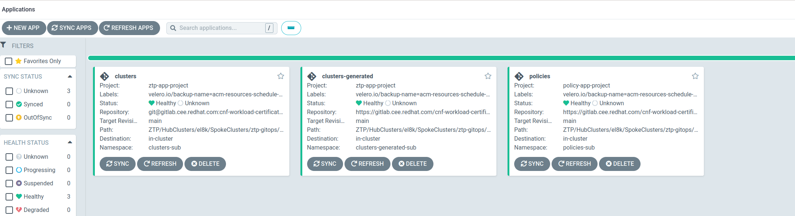
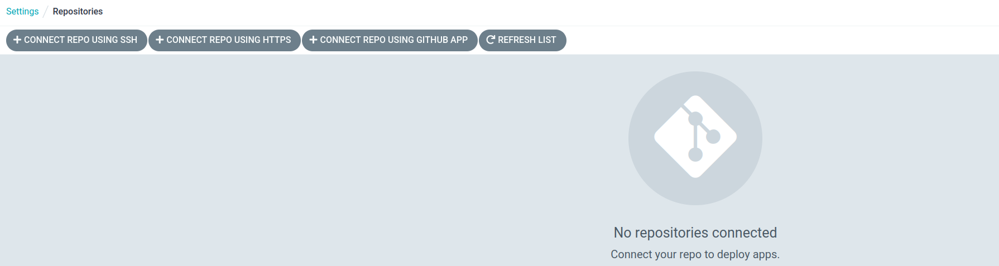

# Preparing a RHACM hub cluster and ZTP with backups system

In this tutorial we will cover how to configure a Red Hat ACM cluster with a backups system. We will follow [this tutorial](https://github.com/stolostron/blog-drafts/blob/main/hub-backup/acm-backup.md) and this [official documentation](https://access.redhat.com/documentation/es-es/red_hat_advanced_cluster_management_for_kubernetes/2.6/html-single/backup_and_restore/index).

The main difference here, **we have all the spoke clusters created with ZTP Gitops**. After restoring, the ZTP workflow will have to point to the new restored hub, not noticing any difference.

For the environment we will have two independent hub clusters with the following characteristics:

* OCP 4.12 compact cluster (el8k-1 and el8k-2)

* el8k-2 will be the main hub cluster, acting as active

* el8k-1 will act as backup, and it is acting as passive.

* RHACM 2.6

* OADP 1.0

## Backups strategy

For the backups system, we will use an active-passive approach. This means, we have an active hub that, it will write in the backup system. The passive one is connected to the backup system, we would say, just listening. In case of disaster on the active hub, The passive one will become the new active, restoring  the last backup


This approach allows you to quickly recover from disaster. You dont only have a backup of the data, you actually have a whole (real time) copy of the active hub into a passive one. If a disaster happens, the passive hub can be converted on active quickly.

The bad part, you need two (or more) clusters. And this increase your costs.

You could implement a more simple strategy that just backups the data. If disaster, a rebuild of the original cluster is needed to restore there the data.

## Starting point

The active (el8k-2) hub has already a set of spoke clusters deployed:


The passive (el8k-1) hub is empty about spoke clusters


**Important: all operators, used in this tutorial, have to use the same Namespaces on both hub clusters**

## Installing OADP Operator to manage backups

To enable backups we will use the solution [Velero](https://velero.io/), which is provided by the Openshift OADP-Operator.

It is pretty easy to install this Operator with RHACM. You just need to enable them through the `MultiClusterHub`object. Enable this on both clusters, the active and the passive.

```bash
>  oc -n open-cluster-management edit multiclusterhubs.operator.open-cluster-management.io multiclusterhub
```


That will start the OADP operator installation:


```bash
> oc -n open-cluster-management-backup get pods
NAME                                                       READY   STATUS    RESTARTS        AGE
cluster-backup-chart-ef6d8-clusterbackup-9f6cc8b5d-4tjns   1/1     Running   0               3m16s
cluster-backup-chart-ef6d8-clusterbackup-9f6cc8b5d-c4p7h   1/1     Running   4 (2m25s ago)   3m16s
openshift-adp-controller-manager-c76d5c685-2wbsq           1/1     Running   0               3m7s
```

## Preparing the Storage

For the storage of this tutorial I am using ODF. But this is not covered here how to provide it. You can configure OADP backups to end-up on different storage providers, such as AWS. Check the list of available providers and how to configure them on OCP, [here](https://docs.openshift.com/container-platform/4.12/backup_and_restore/application_backup_and_restore/installing/about-installing-oadp.html)

Using ODF and Noobaa I can create a new Bucket for my backups, with an S3 (Objects) interface:


When creating the Bucket it also creates the `Secret`


From here, we have all the info needed to configure the `DataProtectionApplication` with OADP. 

For the Secret:

```
AWS_ACCESS_KEY_ID=GuhXXXXXXXXXX8UHSY
AWS_SECRET_ACCESS_KEY=TlQO5LXXXXXXXXXYZrPh5vNwi
```

For the  OADP MultiCloud Object Gateway (S3)

```
Endpoint=s3.openshift-storage.svc:443
BucketName=s3-bucket-backup-acm-e30066ec-1685-48fa-98c5-668af266849f
```

This Endpoint is not accessible from outside. To get the proper route to access S3:

```bash
> oc get route s3 -n openshift-storage
NAME   HOST/PORT                                       PATH   SERVICES   PORT       TERMINATION       WILDCARD
s3     s3-openshift-storage.apps.el8k-1.hpecloud.org          s3         s3-https   reencrypt/Allow   None
```

```bash
Endpoint=https://s3-openshift-storage.apps.el8k-1.hpecloud.org
BucketName=s3-bucket-backup-acm-e30066ec-1685-48fa-98c5-668af266849f
```

You could get this info from other storage source/provider.

## Configure OADP and the DataProtectionApplication

To enable backups on OADP, the `DataProtectionApplication`object, defines how these are going to be stored. Basically, a set of different Velero plugins that allows us to set, where the backups will be stored.

Here, we will use our previous S3 created bucket.

The next steps have to be done in both clusters, active and passive.

First we create the `Secret`with the credentials. We will use different `Secrets`for `snapshotLocations` and `backupLocations`

```bash
> cat /tmp/cloud-credentials
[default]
AWS_ACCESS_KEY_ID=GuhsgXXXXXXp8UHSY
AWS_SECRET_ACCESS_KEY=TlQO5LAAXXXXXXXXYZrPh5vNwi
> oc -n open-cluster-management-backup create secret generic cloud-credentials --from-file cloud=/tmp/cloud-credentials 
secret/s3-backup-cloud-credentials created
> oc -n open-cluster-management-backup get secret/s3-backup-cloud-credentials -o yaml
apiVersion: v1
data:
  cloud: W2RlZmF1bHQtcHJvZmlsZV0KQVdTX0FDQ0VTU19LRVlfSUQ9R3Voc2dJY3hoTlkwVEZwOFVIU1kKQVdTX1NFQ1JFVF9BQ0NFU1NfS0VZPVRsUU81TEFBWHp4OU5jRC91SXFZZ3JCdFNnYlJ3aFlaclBoNXZOd2kK
kind: Secret
metadata:
  creationTimestamp: "2023-03-06T16:46:51Z"
  name: s3-backup-cloud-credentials
  namespace: openshift-adp
  resourceVersion: "11737459"
  uid: 4d15b4df-d7cb-470f-9547-c04f1a7a65ab
type: Opaque
```

And finally, the `DataProtectionApplication`. 

```yaml
apiVersion: oadp.openshift.io/v1alpha1
kind: DataProtectionApplication
metadata:
  name: acm-backup
  namespace: open-cluster-management-backup
spec:
  configuration:
    velero:
      defaultPlugins:
      - openshift
      - aws
    restic:
      enable: true
  backupImages: false
  backupLocations:
    - name: default
      velero:
        provider: aws
        default: true
        objectStorage:
          bucket: s3-bucket-backup-acm-e30066ec-1685-48fa-98c5-668af266849f
          prefix: backup-acm
        config:
          region: us-east-1
          profile: "default"
          s3Url: https://s3-openshift-storage.apps.el8k-1.hpecloud.org
          insecureSkipTLSVerify: "true"
          s3ForcePathStyle: "true"
        credential:
          name: s3-backup-cloud-credentials
          key: cloud
  snapshotLocations:
    - name: default
      velero:
        provider: aws
        config:
          region: us-east-1
          profile: "default"
```

* `velero.config.profile` should point to the profile on the previously created `Secret`. In this case, the `Secret`only contains one profile called default.

* `velero.config.s3Url` with https://<S3_URL> from our previous step.

* `velero.objectStorage` contains the Multicloud Object Gateway info, we get in the previous step.

* The `snapshotLocations` will use always a `Secret` called `cloud-crecentials`. The `backupLocations`allows you to use a custom name for the `Secret`. In this case we need two secrets, the default named `cloud-credentials`and the custom named `s3-backup-cloud-credentials`

> Using  OADP 1.0 there is a Bug, about creating one `Route` with a very long name: 
> 
> *Route.route.openshift.io "oadp-acm-backup-1-aws-registry-route" is invalid: spec.host: Invalid value: "oadp-acm-backup-1-aws-registry-route-open-cluster-management-backup.apps.el8k-1.hpecloud.org": must be no more than 63 characters*
> 
> Setting `backupImages: false` fix this problem, because it does not create a Registry for the images, and the failing `Route`. If you need it, OADP 1.1 has solved this issue

The DPA is created and connected to the Storage Bucket:


The DPA is Reconciled, and it has created a `BackupStorageLocation`with is in `Phase: Available`. You have to observe the same in both clusters.

## Configure the backups on the active cluster

We create a `BackupSchedule`, in the `Active` Hub. The one managing different spoke clusters:

```yaml
apiVersion: cluster.open-cluster-management.io/v1beta1
kind: BackupSchedule
metadata:
  name: schedule-acm
  namespace: open-cluster-management-backup
spec:
  veleroSchedule: 0 */2 * * * # Create a backup every 2 hours
  veleroTtl: 120h # deletes scheduled backups after 120h; optional, if not specified, the maximum default value set by velero is used - 720h
```

### Backed up resources

Which resources are backed up? You can have detail info from [here](https://access.redhat.com/documentation/en-us/red_hat_advanced_cluster_management_for_kubernetes/2.6/html-single/backup_and_restore/index#resources-that-are-backed-up). Mainly: 

* There are some `Namespaces`which are ignored, like `MultiClusterHub`.

* All the CRs from the API groups: `argoproj.io`, `app.k8s.io`, `core.observatorium.io`, `hive.openshift.io`

* Backup all CRDs with an API version suffixed by `.open-cluster-management.io`

* But some concrete CRs from these API groups are ignored.

* Whatever resource you add the label `cluster.open-cluster-management.io/backup`

* Ignore whatever resource with the label `velero.io/exclude-from-backup: "true"`

The different objects to be backed up are controlled by different `Backups`created by our previous `Backupschedule`:


Notice: you will see this Backup's list on both clusters. This is because, both are connected to the backups Bucket, with the `DataProtectionApplication`. But only the `active`cluster is the one generating them. 

### Activation data backup

**Activation Data**: A managed cluster data backup (acm-managed-clusters-schedule) includes the data that makes the cluster an `active`cluster. This data is only contained in the `active`cluster, therefore, the `passive`cluster  **do not have to restore it**. Unless, we are recovering from a disaster, and we want to make a `pasive` cluster, to be converted to an `active` cluster.

You can git the info from these (and others) backups, to see which Resources contains:

```bash
> oc -n open-cluster-management-backup get Schedule acm-managed-clusters-schedule -o jsonpath={.spec.template.includedResources} | jq
[
  "clusterdeployment.hive.openshift.io",
  "machinepool.hive.openshift.io",
  "managedcluster.cluster.open-cluster-management.io",
  "clustersync.hiveinternal.openshift.io",
  "managedcluster.clusterview.open-cluster-management.io",
  "klusterletaddonconfig.agent.open-cluster-management.io",
  "managedclusteraddon.addon.open-cluster-management.io",
  "clusterpool.hive.openshift.io",
  "clusterclaim.hive.openshift.io",
  "clustercurator.cluster.open-cluster-management.io",
  "baremetalhost.metal3.io",
  "bmceventsubscription.metal3.io",
  "hostfirmwaresettings.metal3.io",
  "clusterimageset.hive.openshift.io",
  "agentclusterinstall.extensions.hive.openshift.io"
]
```

## Before restore on the passive cluster


The passive cluster have to have the same operators  (in the same Namespaces) as the active hub. In our scenario, this means to have also Openshift-GitOps.

About the Openshift-Gitops operator (used by ZTP Gitops), this will need to be configured accordingly to your ZTP setup. Basically, to create some ArgoCD Apps to point to your Git Repo. How to do that, it is not covered on this tutorial. 

Before doing the restore, you have to have the **Openshift-Gitops operator installed.** But, **do not configure the ZTP integration**. Backup restore will do that. Including, ArgoCD Apps to point to your Git Repo. Repo that contains all the information about the spoke clusters on the `active` hub.

Also the Topology Aware Lifecycle Manager operator is needed, as part of the ZTP stack. 

So, the `passive`cluster is empty on the RHACM and the Gitops (ArgoCD):


## Configure the restore on the passive cluster

In the `passive` cluster we will create a `Restore`object. This restore** will not include the activation data**. The restore will be done periodically (but it could be done continuously. 

```yaml
apiVersion: cluster.open-cluster-management.io/v1beta1
kind: Restore
metadata:
  name: restore-acm
  namespace: open-cluster-management-backup
spec:
  syncRestoreWithNewBackups: true #it will restore any new backup
  restoreSyncInterval: 2h
  cleanupBeforeRestore: CleanupRestored
  veleroManagedClustersBackupName: skip # this is the activation data that makes a cluster to be the Active
  veleroCredentialsBackupName: latest
  veleroResourcesBackupName: latest
```

* `veleroManagedClustersBackupName` we skip, because this make the cluster to be the `active` one. We only do this, after a disaster.

* `veleroManagedClustersBackupName`, `veleroCredentialsBackupName`, `veleroResourcesBackupName` are the different created backups from our `BackupSchedule`:
  
  

        For each one you can decide what to do.

The `Restore` object will initiate the restore process:


`Phase: PartiallyFailed` means restoring a backup which is empty.

Notice, how we are not restoring the `Backup` which contains the activation data. So, we dont see any spoke cluster:


In ArgoCD the Apps has been created:



But there are some missing objects, like Repositories info:


Which is oka, because we dont want to synch with the GitOps repo until this cluster is set as the active one.

The reason would be, the Repository is a Secret, and this is maybe not restored until activation data. Or, maybe we have to add this to the backup.

## Checking backup and restore are working

Together with all the installation, an ACM Policy is created to check that backups and restores are working:


This only check if backups and restores were done successfully. So, it is constrained to the scheduled times. You would create other Policies that checks more precisely when the `active` hub is not working properly

## Simulating a disaster and configuring a new active cluster

To simulate the disaster, we will just power off all the nodes on the current `active` hub cluster.

After that, we will modify our Restore object to include also the activation data. Here, it is important to do it, over a previous data restore of everything but the activation data.

```yaml
> oc -n open-cluster-management-backup edit restore restore-acm 
apiVersion: cluster.open-cluster-management.io/v1beta1                         
kind: Restore                                                                  
metadata:                                                                      
  annotations:                                                                 
    kubectl.kubernetes.io/last-applied-configuration: |                        
      {"apiVersion":"cluster.open-cluster-management.io/v1beta1","kind":"Restore","metadata":{"annotations":{},"name":"restore-acm","namespace":"open-cluster-management-backup"},"spec":{"cleanupBeforeRestore":"CleanupRestored","restoreSyncInterval":"2h","syncRestoreWithNewBackups":true,"veleroCredentialsBackupName":"latest","veleroManagedClustersBackupName":"skip","veleroResourcesBackupName":"latest"}}
  creationTimestamp: "2023-03-07T14:44:51Z"                                    
  generation: 2                                                                
  name: restore-acm                                                            
  namespace: open-cluster-management-backup                                    
  resourceVersion: "16253672"                                                  
  uid: c0f5b9ba-59aa-4d16-a1c9-3730a5172013                                    
spec:                                                                          
  cleanupBeforeRestore: CleanupRestored                                        
  restoreSyncInterval: 2h                                                      
  syncRestoreWithNewBackups: true                                              
  veleroCredentialsBackupName: latest                                          
  veleroManagedClustersBackupName: latest                                      
  veleroResourcesBackupName: latest          
```

Set `veleroManagedClustersBackupName` also to the `latest` backup

After a while, the activation data is also restored:

```bash
> oc -n open-cluster-management-backup get restore
NAME          PHASE                MESSAGE
restore-acm   FinishedWithErrors   Velero restores have run to completion but encountered 1+ errors
```

All the spoke clusters have been imported:


Inside each cluster:


This `insufficient` look strange, because everything seems oka. This is an status that avoids starting an installation. But the cluster is not waiting for starting an installation.

### ZTP resources

What happened about our ZTP Gitops integration? Before the activation data restored, ArgoCD contained the proper Apps. But was missing the repository Info which connects to the Git Repo. 

After activation data restored, the situation looks the same:


and the repository info seems missing:



Repositories are stored as secrets:

```yaml
$> oc -n openshift-gitops get secret repo-1241775770  -o yaml
apiVersion: v1
data:
  insecure: <REDACTED>
  password: <REDACTED>
  project: <REDACTED>
  type: <REDACTED>
  url: <REDACTED>
  username: <REDACTED>
kind: Secret
metadata:
  annotations:
    managed-by: argocd.argoproj.io
  creationTimestamp: "2023-03-24T12:43:50Z"
  labels:
    argocd.argoproj.io/secret-type: repository
  name: repo-1241775770
  namespace: openshift-gitops
  resourceVersion: "124866222"
  uid: b73f180b-c24f-4c2d-9d41-96f92ff9d090
type: Opaque
```

According to the Kind and the labels, this will not be backed up. Therefore, it does not appear in the Restore.

TODO: try to label to include it on the backup (activation data)

```bash
$> oc -n openshift-gitops get secret repo-1241775770  -o yaml | grep label -A 2
  labels:
    argocd.argoproj.io/secret-type: repository
    cluster.open-cluster-management.io/backup: ""

```