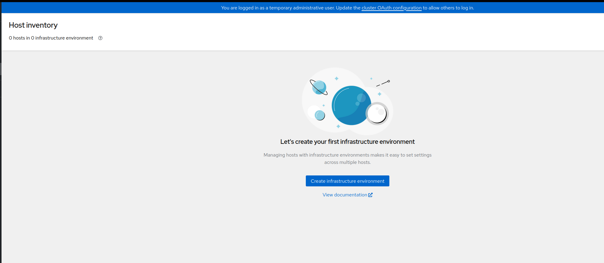
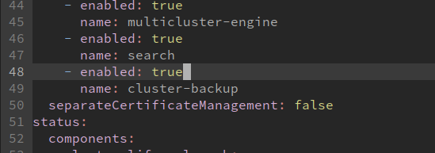

# Preparing a RHACM hub cluster with backups system

In this tutorial we will cover how to configure a Red Hat ACM cluster with a backups system. We will follow [this tutorial](https://github.com/stolostron/blog-drafts/blob/main/hub-backup/acm-backup.md) and this [official documentation](https://access.redhat.com/documentation/es-es/red_hat_advanced_cluster_management_for_kubernetes/2.6/html-single/backup_and_restore/index).

The main difference here, we have all the spoke clusters created with ZTP Gitops. After restoring, the ZTP workflow will have to point to the new restored hub, not noticing any difference.

For the environment we will have two independent hub clusters with the following characteristics:

* OCP 4.12 compact cluster (el8k-1 and el8k-2)

* el8k-2 will be the main hub cluster, acting as active

* el8k-1 will act as backup, and it is acting as passive.

* RHACM 2.6

For the backups system, we will use an active-passive approach. This means, we have an active hub that, it will write in the backup system. The passive one is connected to the backup system, we would say, just listening. In case of disaster on the active hub, The passive one will become the new active, restoring  the last backup


## Starting point

The active (el8k-2) hub has already a set of spoke clusters deployed:


The passive (el8k-1) hub is empty about spoke clusters



**Important: all operators, used in this tutorial, have to use the same Namespaces on both hub clusters**

## Preparing the backup mechanism

To enable backups we will use the solution [Velero](https://velero.io/), which is provided by the Openshift OADP-Operator.

To do on both clusters:

* Enable the MultiClusterHub backup:
  
  ```bash
  >  oc -n open-cluster-management edit multiclusterhubs.operator.open-cluster-management.io multiclusterhub
  ```

        


* Install the OADP-Operator 


## Before restore

The passive cluster have to have the same operators  (in the same Namespaces) as the active hub. In our scenario, this means to have also Openshift-GitOps.

About the Openshift-Gitops operator, this will need to be configured accordingly to your ZTP setup. Basically, to create some ArgoCD Apps to point to your Git Repo. How to do that, it is not covered on this tutorial. 

Before doing the restore, you have to have the Openshift-Gitops operator installed. But, **do not configure the ZTP integration**. Lets do this step, after the backup is restored. So, when the integration is done, the backups is restored, and ZTP will not notice any missing cluster. Otherwise, it would start the installation of any missing cluster.


