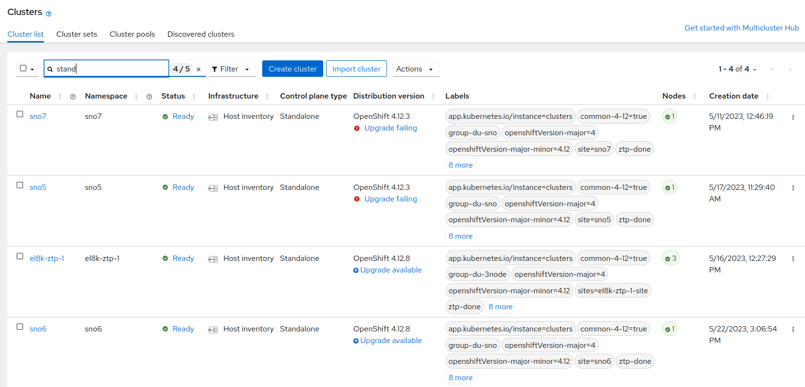

# Red Hat ACM view of any spoke's object

[Red Hat ACM](https://www.redhat.com/en/technologies/management/advanced-cluster-management) allows you control from an Openshift Hub cluster, to deploy, upgrade, configure different Spoke clusters. It is an Openshift cluster that manages other clusters.

Once you have you Hub controlling other clusters:



You have a simple way of managing and monitoring this. There are some ACM resources created on the Hub clusters that contains information of every Spoke cluster. The Hub contains a NS of every Spoke cluster with that information:

```bash
──> oc -n sno5 get infraenv,agentclusterinstall
NAME                                       ISO CREATED AT
infraenv.agent-install.openshift.io/sno5   2023-05-17T09:30:02Z

NAME                                                    CLUSTER   STATE
agentclusterinstall.extensions.hive.openshift.io/sno5   sno5      adding-hosts

```

And other basic information, specially, information that was needed for deploying and configuring the cluster. Number of nodes, Openshift version, etc.

In this tutorial, we will cover how to obtain any other information living inside each Spoke cluster. Basically, to collect any Openshift/K8S resource inside any Spoke cluster

## ManagedClusterView

[`ManagedClusterView` object](https://github.com/stolostron/multicloud-operators-foundation/blob/629b9e066e342d7c0ce8141aa2f1f3ca5128c771/docs/view/managedClusterView.md) allows the Hub cluster to bring a copy of an object from an Spoke cluster. It is like syncing the remote object into the Hub.

It is pretty basic, and you just have to define which object you want to bring to the Hub, and place it, into the NS of the Spoke in the Hub. 

Following we will see some examples.


### Retrieving information of ClusterVersion

As you can see in the picture above, there are some clusters that failed during the upgrade. In the GUI the information appears there, but this is not so easy to check with the 'oc client'.
So, what we will do is to bring the `ClusterVersion` object from `sno5`cluster. Then, we can inspect whatever was happening during the installation.

Lets create a `ManagedClusterView`, in our Hub cluster, for the `ClusterVersion` object of the `sno5` cluster. 

```yaml
apiVersion: view.open-cluster-management.io/v1beta1
kind: ManagedClusterView
metadata:
  name: cluster-version
  namespace: sno5
spec:
  scope:
    apiGroup: config.openshift.io/v1
    resource: ClusterVersion
    name: version
```

After creating the object, this is stored and it will collect all the information from the object. Syncing, by default, each 30 secs.

`ClusterVersion`object is pretty long, so I have redacted a lot the content:

```yaml
> oc -n sno5 get managedclusterviews.view.open-cluster-management.io  cluster-version -o yaml
apiVersion: view.open-cluster-management.io/v1beta1
kind: ManagedClusterView
metadata:
  <REDACTED>
  name: cluster-version
  namespace: sno5
  <REDACTED>
spec:
  scope:
    apiGroup: config.openshift.io/v1
    kind: ClusterVersion
    name: version
    resource: ClusterVersion
status:
  conditions:
  - lastTransitionTime: "2023-05-24T13:53:18Z"
    message: Watching resources successfully
    reason: GetResourceProcessing
    status: "True"
    type: Processing
  result:
    apiVersion: config.openshift.io/v1
    kind: ClusterVersion
    metadata:
      <REDACTED>
        manager: cluster-version-operator
        operation: Update
        subresource: status
        time: "2023-05-24T14:39:53Z"
      name: version
    spec:
      channel: stable-4.12
      clusterID: 1cf7ff18-a8fa-47d9-986e-ab1022288949
      desiredUpdate:
        version: 4.12.8
      upstream: https://api.openshift.com/api/upgrades_info/v1/graph
    status:
     <REDACTED>
      desired:
        channels:
        - candidate-4.12
        - candidate-4.13
        - eus-4.12
        - fast-4.12
        - fast-4.13
        - stable-4.12
        image: quay.io/openshift-release-dev/ocp-release@sha256:28358de024c01a449b28f27fb4c122f15eb292a2becdf7c651511785c867884a
        url: https://access.redhat.com/errata/RHBA-2023:1269
        version: 4.12.8
       <REDACTED>

```

Notice, the real information from the imported object is under `.status.result`. And from there, you have the object spec, metadata and status.

Why the installation is failing is under the status of the ClusterVersion object. With a little of jq querying you can do cool stuff like:

```bash
> oc -n sno5 get managedclusterviews.view.open-cluster-management.io  \
 cluster-version -o jsonpath='{.status.result.status.conditions}' \
 | jq '.[] | select((.type == "Progressing" or .type=="Available"))' \
 | jq '.type + ": " + .message'
"Available: Done applying 4.12.3"
"Progressing: Unable to apply 4.12.8: wait has exceeded 40 minutes for these operators: machine-config"

```


