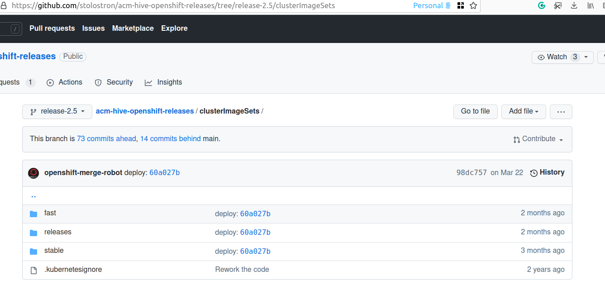

# Managing RHACM ClusterImageSets

RHACM comes with Hive installed, which provides a set of OCP images available to use for clusters creations:


```yaml
> oc get clusterimagesets.hive.openshift.io 
NAME                      RELEASE
img4.10.3-x86-64-appsub   quay.io/openshift-release-dev/ocp-release:4.10.3-x86_64
img4.10.4-x86-64-appsub   quay.io/openshift-release-dev/ocp-release:4.10.4-x86_64
img4.10.5-x86-64-appsub   quay.io/openshift-release-dev/ocp-release:4.10.5-x86_64
img4.6.1-x86-64-appsub    quay.io/openshift-release-dev/ocp-release:4.6.1-x86_64
img4.6.12-x86-64-appsub   quay.io/openshift-release-dev/ocp-release:4.6.12-x86_64
img4.6.13-x86-64-appsub   quay.io/openshift-release-dev/ocp-release:4.6.13-x86_64
img4.6.15-x86-64-appsub   quay.io/openshift-release-dev/ocp-release:4.6.15-x86_64
img4.6.16-x86-64-appsub   quay.io/openshift-release-dev/ocp-release:4.6.16-x86_64
img4.6.17-x86-64-appsub   quay.io/openshift-release-dev/ocp-release:4.6.17-x86_64
img4.6.18-x86-64-appsub   quay.io/openshift-release-dev/ocp-release:4.6.18-x86_64
img4.6.19-x86-64-appsub   quay.io/openshift-release-dev/ocp-release:4.6.19-x86_64
...
...
```


How this list of images are managed/updated? There exists a subscription and a channel:

```yaml
> oc get subscription hive-clusterimagesets-subscription-fast-0 -n open-cluster-management -oyaml
apiVersion: apps.open-cluster-management.io/v1
kind: Subscription
metadata:
  annotations:
    apps.open-cluster-management.io/git-branch: release-2.4
    apps.open-cluster-management.io/git-path: clusterImageSets/fast
    meta.helm.sh/release-name: console-chart-de7d6
    meta.helm.sh/release-namespace: open-cluster-management
    open-cluster-management.io/user-group: c3lzdGVtOnNlcnZpY2VhY2NvdW50cyxzeXN0ZW06c2VydmljZWFjY291bnRzOm9wZW4tY2x1c3Rlci1tYW5hZ2VtZW50LHN5c3RlbTphdXRoZW50aWNhdGVk
    open-cluster-management.io/user-identity: c3lzdGVtOnNlcnZpY2VhY2NvdW50Om9wZW4tY2x1c3Rlci1tYW5hZ2VtZW50Om11bHRpY2x1c3Rlci1vcGVyYXRvcnM=
  creationTimestamp: "2022-03-29T12:39:46Z"
  generation: 1
  labels:
    app: hive-clusterimagesets
    app.kubernetes.io/managed-by: Helm
    subscription-pause: "false"
  name: hive-clusterimagesets-subscription-fast-0
  namespace: open-cluster-management
  ownerReferences:
  - apiVersion: apps.open-cluster-management.io/v1
    blockOwnerDeletion: true
    controller: true
    kind: HelmRelease
    name: console-chart-de7d6
    uid: bc794365-4bec-4ec1-bf55-28a14fa70b77
  resourceVersion: "372156332"
  uid: 909032bc-e040-4b16-b4e9-72b281bf3573
spec:
  channel: open-cluster-management/acm-hive-openshift-releases-chn-0
  placement:
    local: true
status:
  ansiblejobs: {}
  lastUpdateTime: "2022-05-24T22:20:38Z"
  message: Active
  phase: Subscribed
  statuses:
    /:
      packages:
        acm-hive-openshift-releases-chn-0-ClusterImageSet-img4.6.1-x86-64-appsub:
          lastUpdateTime: "2022-04-17T14:43:26Z"
          phase: Subscribed
        acm-hive-openshift-releases-chn-0-ClusterImageSet-img4.6.3-x86-64-appsub:
          lastUpdateTime: "2022-04-17T14:43:25Z"
          phase: Subscribed
        acm-hive-openshift-releases-chn-0-ClusterImageSet-img4.6.4-x86-64-appsub:
          lastUpdateTime: "2022-04-17T14:43:27Z"
          phase: Subscribed
        acm-hive-openshift-releases-chn-0-ClusterImageSet-img4.6.6-x86-64-appsub:
...
...
> oc get channel acm-hive-openshift-releases-chn-0 -n open-cluster-management -oyaml
apiVersion: apps.open-cluster-management.io/v1
kind: Channel
metadata:
  annotations:
    apps.open-cluster-management.io/reconcile-rate: low
    meta.helm.sh/release-name: console-chart-de7d6
    meta.helm.sh/release-namespace: open-cluster-management
    open-cluster-management.io/user-group: c3lzdGVtOnNlcnZpY2VhY2NvdW50cyxzeXN0ZW06c2VydmljZWFjY291bnRzOm9wZW4tY2x1c3Rlci1tYW5hZ2VtZW50LHN5c3RlbTphdXRoZW50aWNhdGVk
    open-cluster-management.io/user-identity: c3lzdGVtOnNlcnZpY2VhY2NvdW50Om9wZW4tY2x1c3Rlci1tYW5hZ2VtZW50Om11bHRpY2x1c3Rlci1vcGVyYXRvcnM=
  creationTimestamp: "2022-03-29T12:39:46Z"
  generation: 1
  labels:
    app.kubernetes.io/managed-by: Helm
  name: acm-hive-openshift-releases-chn-0
  namespace: open-cluster-management
  ownerReferences:
  - apiVersion: apps.open-cluster-management.io/v1
    blockOwnerDeletion: true
    controller: true
    kind: HelmRelease
    name: console-chart-de7d6
    uid: bc794365-4bec-4ec1-bf55-28a14fa70b77
  resourceVersion: "220996116"
  uid: 9e01ed16-7d4e-44cc-85c6-449df0cd2e1f
spec:
  pathname: https://github.com/stolostron/acm-hive-openshift-releases.git
  type: Git
```

The channel points to a git repository updated by RedHat with the 'ClusterImageSets'. The subscription selects with path (with the images) and branch wants to sync:

```yaml
metadata:
  annotations:
    apps.open-cluster-management.io/git-branch: release-2.4
    apps.open-cluster-management.io/git-path: clusterImageSets/fast
```





## ClusterImageSets channel and deployed clusters

By default, RHACM subscribes the list of 'clusterimagesets' to a fast channel. But the deployed clusters contains OCPs clusters subscribed to stable channel. This is a [known issue/limitation](https://github.com/stolostron/rhacm-docs/blob/2.5_stage/release_notes/known_issues.adoc#the-product-channel-out-of-sync-with-provisioned-cluster). 

Because of this limitation, the clusters will be deployed with an stable channel (which seems of for us in this moment). But, should we change the subscription on RHACM to dont have this kind of "discrepancy". 


## Changing the channel to synch

Above is explained that RHACM comes with fast channel installed by default. This can be changed following these steps (if are just using RHACM by default, all the resources should be managed into the Namespace open-cluster-management):

* Pause the fast channel sub

```bash
> oc -n open-cluster-management patch appsub hive-clusterimagesets-subscription-fast-0 --type='json' -p='[{"op":"replace","path": "/metadata/labels/subscription-pause","value":"true"}]'
subscription.apps.open-cluster-management.io/hive-clusterimagesets-subscription-fast-0 patched
```

* Delete all the current available Images

```bash
> oc delete clusterimageset --all
clusterimageset.hive.openshift.io "img4.10.10-x86-64-appsub" deleted
clusterimageset.hive.openshift.io "img4.10.11-x86-64-appsub" deleted
clusterimageset.hive.openshift.io "img4.10.12-x86-64-appsub" deleted
clusterimageset.hive.openshift.io "img4.10.13-x86-64-appsub" deleted
clusterimageset.hive.openshift.io "img4.10.14-x86-64-appsub" deleted
clusterimageset.hive.openshift.io "img4.10.15-x86-64-appsub" deleted
clusterimageset.hive.openshift.io "img4.10.3-x86-64-appsub" deleted
clusterimageset.hive.openshift.io "img4.10.4-x86-64-appsub" deleted
clusterimageset.hive.openshift.io "img4.10.5-x86-64-appsub" deleted
clusterimageset.hive.openshift.io "img4.10.6-x86-64-appsub" deleted
clusterimageset.hive.openshift.io "img4.10.8-x86-64-appsub" deleted
...
```

* Add a new subscription for stable channel. Suggestion, use the fast channel one and clean it. Just change the git-patch, ensure it is not paused, and change the name for stable-0. The channel is the current existing one.

```yaml
apiVersion: apps.open-cluster-management.io/v1                                    
kind: Subscription                                                                
metadata:                                                                      
  annotations:                                                                 
    apps.open-cluster-management.io/git-branch: release-2.4                    
    apps.open-cluster-management.io/git-path: clusterImageSets/stable          
    open-cluster-management.io/user-group: c3lzdGVtOnNlcnZpY2VhY2NvdW50cyxzeXN0ZW06c2VydmljZWFjY291bnRzOm9wZW4tY2x1c3Rlci1tYW5hZ2VtZW50LHN5c3RlbTphdXRoZW50aWNhdGVk
    open-cluster-management.io/user-identity: c3lzdGVtOnNlcnZpY2VhY2NvdW50Om9wZW4tY2x1c3Rlci1tYW5hZ2VtZW50Om11bHRpY2x1c3Rlci1vcGVyYXRvcnM=
  labels:                                                                      
    app: hive-clusterimagesets                                                 
    subscription-pause: "false"                                                
  name: hive-clusterimagesets-subscription-stable-0                            
  namespace: open-cluster-management                                           
spec:                                                                          
  channel: open-cluster-management/acm-hive-openshift-releases-chn-0           
  placement:                                                                   
    local: true  
```

* Check the new images belongs to stable channel:

```bash
> oc get clusterimagesets img4.9.9-x86-64-appsub  -o jsonpath={.metadata.labels.channel}
stable
```


After that, you can change from one channel to other, just pausing and unpausing the subscriptions.


Also, you can clone [this repository](https://github.com/stolostron/acm-hive-openshift-releases). It includes a Makefile with opetions to pause/unpause different subscriptions. Notice: the repo will work inside the Namespace Hive. So, you have to proceed with care, to not mix the two namespaces: open-cluster-management and hive and its subscriptions.


## ClusterImageSets refresh

The refresh time is managed by the subscription:

```bash
> oc get channel acm-hive-openshift-releases-chn-0 -n open-cluster-management -o json | grep apps.open-cluster-management.io/reconcile-rate
            "apps.open-cluster-management.io/reconcile-rate": "low",
```

Low refresh each hour. Other values [here](https://github.com/stolostron/rhacm-docs/blob/03ef1dcd63be0919f0e77bdb71cb0b270a552181/applications/reconcile_options.adoc#reconcile-frequency-git-channel)

## Repos not been updated

Maybe because of this [previous bug](https://github.com/stolostron/acm-hive-openshift-releases/pull/45https://github.com/stolostron/acm-hive-openshift-releases/pull/45) the Git repo was not updated and the RHACM and ClusterImageSets were not been updated. Now (25th of May) fixed. Dont need to make changes on the deployments, it is managed on the Git CI Pipeline.

On 25th of May:


```bash
$> oc get clusterimagesets.hive.openshift.io  | wc -l
97

```


The next day:

```bash
> oc get clusterimagesets.hive.openshift.io  | wc -l
121

```


Containing, for example, the latest Z images of 4.10:

```bash
$> oc get clusterimagesets.hive.openshift.io  | grep 4.10
img4.10.10-x86-64-appsub   quay.io/openshift-release-dev/ocp-release:4.10.10-x86_64
img4.10.11-x86-64-appsub   quay.io/openshift-release-dev/ocp-release:4.10.11-x86_64
img4.10.12-x86-64-appsub   quay.io/openshift-release-dev/ocp-release:4.10.12-x86_64
img4.10.13-x86-64-appsub   quay.io/openshift-release-dev/ocp-release:4.10.13-x86_64
img4.10.14-x86-64-appsub   quay.io/openshift-release-dev/ocp-release:4.10.14-x86_64
img4.10.15-x86-64-appsub   quay.io/openshift-release-dev/ocp-release:4.10.15-x86_64
img4.10.3-x86-64-appsub    quay.io/openshift-release-dev/ocp-release:4.10.3-x86_64
img4.10.4-x86-64-appsub    quay.io/openshift-release-dev/ocp-release:4.10.4-x86_64
img4.10.5-x86-64-appsub    quay.io/openshift-release-dev/ocp-release:4.10.5-x86_64
img4.10.6-x86-64-appsub    quay.io/openshift-release-dev/ocp-release:4.10.6-x86_64
img4.10.8-x86-64-appsub    quay.io/openshift-release-dev/ocp-release:4.10.8-x86_64
img4.10.9-x86-64-appsub    quay.io/openshift-release-dev/ocp-release:4.10.9-x86_64

```
