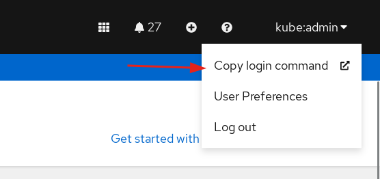

# RHACM Observability metrics query

just quick tutorial on how to execute your Prometheus queries on a terminal. Based on [this](https://docs.redhat.com/en/documentation/red_hat_advanced_cluster_management_for_kubernetes/2.11/html-single/observability/index#using-observability)

First get the route, from your hub, to the observabilty API:

```bash
PROXY_ROUTE_URL=$(oc get route rbac-query-proxy -n open-cluster-management-observability --no-headers  | awk '{print $2}')
```

Get a bearer token from Openshift Oauth. Easy and quick way is with the GUI:



and

```bash
> TOKEN=sha256~QwhPjAQfg.............FKVkLEnQ8XCI6alhtQ
```

now you can build your query (you have to put the string as url encoded):

```bash
# count(kube_pod_info{namespace="openshift-monitoring",pod="prometheus-k8s-0"})
> QUERY=count%28kube_pod_info%7Bnamespace%3D%22openshift-monitoring%22%2Cpod%3D%22prometheus-k8s-0%22%7D%29
```

and execute it:

```bash
> curl  -k -H "Authorization: Bearer ${TOKEN}" https://${PROXY_ROUTE_URL}/api/v1/query?query=${QUERY}
```