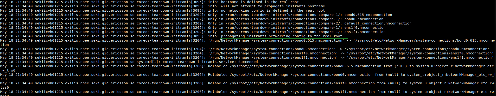

*This document is not an official Red Had documentation. It is just part of my experience working with these technologies. If you need more official or support, reach to the official Red Hat documentation.*

# RHCOS boot process for a RHACM and Assisted Installer installation

RHCOS (Red Hat CoreOS) is an immutable OS optimized for running containers. 
RHACM (Red Hat Advanced Cluster Management) allows Openshift/Kubernetes to deploy and manage other Kubernetes cluster, and your infrastructure as a pool of resources. RHACM lives on a first Openshift/Kubernetes cluster, which  is called Hub (Management) cluster. From there all the deployed clusters are Spoke (Managed) Clusters.

AI is in charge of initiating the cluster installation, on a first discovery phase of each node. After that, each node boots into RHCOS with the configurations prepared by the AI. This document covers this phase. About how the previous phase works, you can read this other document: [How cluster's deployment works with Red Hat ACM and Assisted Installer](https://github.com/jgato/jgato/blob/main/random_docs/ACM_and_RH_installations.md)

## Booting RHCOS and starting the cluster creation

Here we are booting after the discovery phase of the AI. RHCOS boots and merges the base configuration with an Ignition file. The Ignition file contains a set of different systemd units, files, and configurations. Remember this is an immutable OS, you cannot change its configuration, and this come from the Ignition file. You can modify the Ignition file, as part of the cluster configuration, but this is out of the scope in this document.

Assisted installer, during the discovery phase, [has invoked](https://coreos.github.io/coreos-installer/cmd/install/) `rhcos-installer`with the option `--copy-network`. This is copying the network configuration used during the discovery phase, into the node for the first boot. Configuration manually created by the person/process creating the cluster.

So, we go with the boot:
 1- During the the first-boot, the files coming from `--copy-network` are copied from '/mnt/boot_partition/coreos-firstboot-network/' to a temporally file system '/run/NetworkManager/':

```log
Aug 30 13:26:16 localhost systemd[1]: Starting CoreOS Enable Network...
Aug 30 13:26:16 localhost systemd[1]: Started CoreOS Enable Network.
Aug 30 13:26:16 localhost systemd[1]: Starting Ignition (fetch)...
Aug 30 13:26:16 localhost systemd[1]: Starting Copy CoreOS Firstboot Networking Config...

Aug 30 13:26:17 localhost coreos-copy-firstboot-network[2456]: info: copying files from /mnt/boot_partition/coreos-firstboot-network to /run/NetworkManager/system-connections/
Aug 30 13:26:16 localhost ignition[2450]: GET http://214.11.83.249:22624/config/worker: attempt #1
Aug 30 13:26:17 localhost coreos-copy-firstboot-network[2474]: '/mnt/boot_partition/coreos-firstboot-network/bond0.615.nmconnection' -> '/run/NetworkManager/system-connections/bond0.615.nmconnection'
Aug 30 13:26:17 localhost coreos-copy-firstboot-network[2474]: '/mnt/boot_partition/coreos-firstboot-network/bond0.nmconnection' -> '/run/NetworkManager/system-connections/bond0.nmconnection'
Aug 30 13:26:17 localhost coreos-copy-firstboot-network[2474]: '/mnt/boot_partition/coreos-firstboot-network/ens1f0.nmconnection' -> '/run/NetworkManager/system-connections/ens1f0.nmconnection'
Aug 30 13:26:17 localhost coreos-copy-firstboot-network[2474]: '/mnt/boot_partition/coreos-firstboot-network/ens1f1.nmconnection' -> '/run/NetworkManager/system-connections/ens1f1.nmconnection'
```

  With this temporal configuration the network is configured as it was done in discovery phase. You can ensure that network will work.

 2- With the network working, it downloads an Ignition file. This file will depend on the role of the node to be installed (Worker, Master). And this configuration is applied. This makes several changes, copy files from the ignition file, create systemd services, etc.

```log
Aug 30 13:26:27 localhost.localdomain ignition[2887]: INFO     : Ignition 2.14.0
Aug 30 13:26:27 localhost.localdomain ignition[2887]: INFO     : Stage: files
<REDACTED>
Aug 30 13:26:27 localhost.localdomain ignition[2887]: INFO     : files: ensureUsers: op(1): [finished] creating or modifying user "core"
Aug 30 13:26:27 localhost.localdomain ignition[2887]: INFO     : files: ensureUsers: op(2): [started]  adding ssh keys to user "core"
Aug 30 13:26:27 localhost.localdomain ignition[2887]: INFO     : files: ensureUsers: op(2): [finished] adding ssh keys to user "core"
Aug 30 13:26:27 localhost.localdomain ignition[2887]: INFO     : files: createFilesystemsFiles: createFiles: op(3): [started]  writing file "/sysroot/etc/chrony.conf"
Aug 30 13:26:27 localhost.localdomain ignition[2887]: INFO     : files: createFilesystemsFiles: createFiles: op(3): [finished] writing file "/sysroot/etc/chrony.conf"
<REDACTED>
Aug 30 13:26:28 localhost.localdomain ignition[2887]: INFO     : files: createFilesystemsFiles: createFiles: op(1d): [started]  writing file "/sysroot/etc/systemd/system.conf.d/kubelet-cgroups.conf"
Aug 30 13:26:28 localhost.localdomain ignition[2887]: INFO     : files: createFilesystemsFiles: createFiles: op(1d): [finished] writing file "/sysroot/etc/systemd/system.conf.d/kubelet-cgroups.conf"
Aug 30 13:26:28 localhost.localdomain ignition[2887]: INFO     : files: createFilesystemsFiles: createFiles: op(1e): [started]  writing file "/sysroot/var/usrlocal/bin/nm-clean-initrd-state.sh"
Aug 30 13:26:28 localhost.localdomain ignition[2887]: INFO     : files: createFilesystemsFiles: createFiles: op(1e): [finished] writing file "/sysroot/var/usrlocal/bin/nm-clean-initrd-state.sh"
Aug 30 13:26:29 localhost.localdomain ignition[2887]: INFO     : files: createFilesystemsFiles: createFiles: op(1f): [started]  writing file "/sysroot/etc/NetworkManager/conf.d/sdn.conf"
Aug 30 13:26:29 localhost.localdomain ignition[2887]: INFO     : files: createFilesystemsFiles: createFiles: op(1f): [finished] writing file "/sysroot/etc/NetworkManager/conf.d/sdn.conf"
Aug 30 13:26:29 localhost.localdomain ignition[2887]: INFO     : files: createFilesystemsFiles: createFiles: op(20): [started]  writing file "/sysroot/etc/NetworkManager/conf.d/20-keyfiles.conf"
Aug 30 13:26:29 localhost.localdomain ignition[2887]: INFO     : files: createFilesystemsFiles: createFiles: op(20): [finished] writing file "/sysroot/etc/NetworkManager/conf.d/20-keyfiles.conf"
Aug 30 13:26:29 localhost.localdomain ignition[2887]: INFO     : files: createFilesystemsFiles: createFiles: op(21): [started]  writing file "/sysroot/var/lib/kubelet/config.json"
Aug 30 13:26:29 localhost.localdomain ignition[2887]: INFO     : files: createFilesystemsFiles: createFiles: op(21): [finished] writing file "/sysroot/var/lib/kubelet/config.json"
<REDACTED>
Aug 30 13:26:29 localhost.localdomain ignition[2887]: INFO     : files: createFilesystemsFiles: createFiles: op(37): [started]  writing file "/sysroot/etc/pki/ca-trust/source/anchors/openshift-config-user-ca-bundle.crt"
Aug 30 13:26:29 localhost.localdomain ignition[2887]: INFO     : files: createFilesystemsFiles: createFiles: op(37): [finished] writing file "/sysroot/etc/pki/ca-trust/source/anchors/openshift-config-user-ca-bundle.crt"
Aug 30 13:26:29 localhost.localdomain ignition[2887]: INFO     : files: createFilesystemsFiles: createFiles: op(38): [started]  writing file "/sysroot/etc/kubernetes/static-pod-resources/configmaps/cloud-config/ca-bundle.pem"
Aug 30 13:26:29 localhost.localdomain ignition[2887]: INFO     : files: createFilesystemsFiles: createFiles: op(38): [finished] writing file "/sysroot/etc/kubernetes/static-pod-resources/configmaps/cloud-config/ca-bundle.pem"
<REDACTED>
Aug 30 13:26:29 localhost.localdomain ignition[2887]: INFO     : files: op(42): op(43): [started]  writing systemd drop-in "mco-disabled.conf" at "/sysroot/etc/systemd/system/docker.socket.d/mco-disabled.conf"
Aug 30 13:26:29 localhost.localdomain ignition[2887]: INFO     : files: op(42): op(43): [finished] writing systemd drop-in "mco-disabled.conf" at "/sysroot/etc/systemd/system/docker.socket.d/mco-disabled.conf"
Aug 30 13:26:29 localhost.localdomain ignition[2887]: INFO     : files: op(42): [finished] processing unit "docker.socket"
Aug 30 13:26:29 localhost.localdomain ignition[2887]: INFO     : files: op(44): [started]  processing unit "kubelet-auto-node-size.service"
Aug 30 13:26:29 localhost.localdomain ignition[2887]: INFO     : files: op(44): op(45): [started]  writing unit "kubelet-auto-node-size.service" at "/sysroot/etc/systemd/system/kubelet-auto-node-size.service"
Aug 30 13:26:29 localhost.localdomain ignition[2887]: INFO     : files: op(44): op(45): [finished] writing unit "kubelet-auto-node-size.service" at "/sysroot/etc/systemd/system/kubelet-auto-node-size.service"
<REDACTED>

Aug 30 13:26:29 localhost.localdomain ignition[2887]: INFO     : files: op(78): [started]  setting preset to enabled for "kubelet.service"
Aug 30 13:26:29 localhost.localdomain ignition[2887]: INFO     : files: op(78): [finished] setting preset to enabled for "kubelet.service"
Aug 30 13:26:29 localhost.localdomain ignition[2887]: INFO     : files: op(79): [started]  setting preset to enabled for "machine-config-daemon-pull.service"
Aug 30 13:26:29 localhost.localdomain ignition[2887]: INFO     : files: op(79): [finished] setting preset to enabled for "machine-config-daemon-pull.service"
Aug 30 13:26:29 localhost.localdomain ignition[2887]: INFO     : files: op(7a): [started]  setting preset to enabled for "nodeip-configuration.service"
Aug 30 13:26:29 localhost.localdomain ignition[2887]: INFO     : files: op(7a): [finished] setting preset to enabled for "nodeip-configuration.service"
Aug 30 13:26:29 localhost.localdomain ignition[2887]: INFO     : files: op(7b): [started]  setting preset to enabled for "ovs-configuration.service"
Aug 30 13:26:29 localhost.localdomain ignition[2887]: INFO     : files: op(7b): [finished] setting preset to enabled for "ovs-configuration.service"
Aug 30 13:26:29 localhost.localdomain ignition[2887]: INFO     : files: op(7c): [started]  setting preset to enabled for "coredump-directory.service"
Aug 30 13:26:29 localhost.localdomain ignition[2887]: INFO     : files: op(7c): [finished] setting preset to enabled for "coredump-directory.service"
<REDACTED>
``` 
 
 3- Then, it starts a "Starting Reload configuration from Real Root". That tries to start moving from temporal config, to the Real Root copied config:

```log
Aug 30 13:26:34 localhost.localdomain systemd[1]: Started CoreOS Post Ignition Checks.
Aug 30 13:26:34 localhost.localdomain systemd[1]: Started CoreOS Boot Edit.
Aug 30 13:26:34 localhost.localdomain systemd[1]: Starting Reload Configuration from the Real Root...
Aug 30 13:26:34 localhost.localdomain systemd[1]: Reached target Ignition Boot Disk Setup.
Aug 30 13:26:34 localhost.localdomain systemd[1]: Reached target Ignition Complete.
Aug 30 13:26:34 localhost.localdomain systemd[1]: Reloading.
```

 4- This cleans, among other things, the files from --copy-network in '/mnt/boot-partition/coreos-firstboot-network'  In this moment, NetworkManager is still working with the temporal files from '/run/NetworkManager'

```logs
Aug 30 13:26:34 localhost.localdomain systemd[1]: Starting CoreOS Post Ignition Checks...
Aug 30 13:26:34 localhost.localdomain systemd-journald[1329]: Missed 339 kernel messages
Aug 30 13:26:34 localhost.localdomain kernel: EXT4-fs (nvme0n1p3): mounted filesystem with ordered data mode. Opts: (null)
Aug 30 13:26:34 localhost.localdomain coreos-boot-edit[2923]: removed '/mnt/boot_partition/coreos-firstboot-network/bond0.615.nmconnection'
Aug 30 13:26:34 localhost.localdomain coreos-boot-edit[2923]: removed '/mnt/boot_partition/coreos-firstboot-network/bond0.nmconnection'
Aug 30 13:26:34 localhost.localdomain coreos-boot-edit[2923]: removed '/mnt/boot_partition/coreos-firstboot-network/ens1f0.nmconnection'
Aug 30 13:26:34 localhost.localdomain coreos-boot-edit[2923]: removed '/mnt/boot_partition/coreos-firstboot-network/ens1f1.nmconnection'
Aug 30 13:26:34 localhost.localdomain coreos-boot-edit[2923]: removed directory '/mnt/boot_partition/coreos-firstboot-network'
Aug 30 13:26:34 localhost.localdomain coreos-boot-edit[2926]: Injected kernel arguments into BLS: root=UUID=81671d7a-094c-45a2-bcc2-9b782d0ed2ce rw rootflags=prjquota
```

But later, the NetworkManager is reloaded to get the configuration from the Real Root. Normally, the Network configuration from the discovery phase is propagated into the Real Root.



 5- coreos-teardown ends moving to Real Root and continue booting, as it will happen in a normal boot. 
 
```logs
Aug 30 13:26:46 sekiicvh01337.exilis.npee.seki.gic.ericsson.se systemd[1]: Mounted CoreOS Dynamic Mount for /boot.
Aug 30 13:26:46 sekiicvh01337.exilis.npee.seki.gic.ericsson.se systemd[1]: Reached target Local File Systems.
Aug 30 13:26:46 sekiicvh01337.exilis.npee.seki.gic.ericsson.se systemd[1]: Starting Rebuild Dynamic Linker Cache...
Aug 30 13:26:46 sekiicvh01337.exilis.npee.seki.gic.ericsson.se systemd[1]: Starting Rebuild Journal Catalog...
Aug 30 13:26:46 sekiicvh01337.exilis.npee.seki.gic.ericsson.se systemd[1]: Starting Restore /run/initramfs on shutdown...
Aug 30 13:26:46 sekiicvh01337.exilis.npee.seki.gic.ericsson.se systemd[1]: Starting Create coredump directory...
Aug 30 13:26:46 sekiicvh01337.exilis.npee.seki.gic.ericsson.se systemd[1]: Starting Run update-ca-trust...
Aug 30 13:26:46 sekiicvh01337.exilis.npee.seki.gic.ericsson.se systemd[1]: Started Restore /run/initramfs on shutdown.
Aug 30 13:26:46 sekiicvh01337.exilis.npee.seki.gic.ericsson.se systemd[1]: Started Rebuild Journal Catalog.
Aug 30 13:26:46 sekiicvh01337.exilis.npee.seki.gic.ericsson.se systemd[1]: coredump-directory.service: Succeeded.
Aug 30 13:26:46 sekiicvh01337.exilis.npee.seki.gic.ericsson.se systemd[1]: Started Create coredump directory.
<REDACTED>
Aug 30 13:26:47 sekiicvh01337.exilis.npee.seki.gic.ericsson.se systemd[1]: Started Security Auditing Service.
Aug 30 13:26:47 sekiicvh01337.exilis.npee.seki.gic.ericsson.se systemd[1]: Starting Update UTMP about System Boot/Shutdown...
Aug 30 13:26:47 sekiicvh01337.exilis.npee.seki.gic.ericsson.se systemd[1]: Started Update UTMP about System Boot/Shutdown.
Aug 30 13:26:47 sekiicvh01337.exilis.npee.seki.gic.ericsson.se systemd[1]: Started Run update-ca-trust.
Aug 30 13:26:47 sekiicvh01337.exilis.npee.seki.gic.ericsson.se systemd[1]: Reached target System Initialization.
Aug 30 13:26:47 sekiicvh01337.exilis.npee.seki.gic.ericsson.se systemd[1]: Started Daily Cleanup of Temporary Directories.
Aug 30 13:26:47 sekiicvh01337.exilis.npee.seki.gic.ericsson.se systemd[1]: Started Daily rotation of log files.
Aug 30 13:26:47 sekiicvh01337.exilis.npee.seki.gic.ericsson.se systemd[1]: Listening on bootupd.socket.
Aug 30 13:26:47 sekiicvh01337.exilis.npee.seki.gic.ericsson.se systemd[1]: Started daily update of the root trust anchor for DNSSEC.
Aug 30 13:26:47 sekiicvh01337.exilis.npee.seki.gic.ericsson.se systemd[1]: Reached target Timers.
<REDACTED>
Aug 30 13:26:47 sekiicvh01337.exilis.npee.seki.gic.ericsson.se systemd[1]: Starting CoreOS Generate iSCSI Initiator Name...
Aug 30 13:26:47 sekiicvh01337.exilis.npee.seki.gic.ericsson.se systemd[1]: Starting OpenSSH ed25519 Server Key Generation...
Aug 30 13:26:47 sekiicvh01337.exilis.npee.seki.gic.ericsson.se systemd[1]: Started D-Bus System Message Bus.
Aug 30 13:26:47 sekiicvh01337.exilis.npee.seki.gic.ericsson.se systemd[1]: Starting CRI-O Auto Update Script...
Aug 30 13:26:47 sekiicvh01337.exilis.npee.seki.gic.ericsson.se systemd[1]: Starting OpenSSH rsa Server Key Generation...
Aug 30 13:26:47 sekiicvh01337.exilis.npee.seki.gic.ericsson.se systemd[1]: Starting System Security Services Daemon...
Aug 30 13:26:47 sekiicvh01337.exilis.npee.seki.gic.ericsson.se systemd[1]: Starting Load CPU microcode update...
Aug 30 13:26:47 sekiicvh01337.exilis.npee.seki.gic.ericsson.se sssd[3920]: Starting up
Aug 30 13:26:47 sekiicvh01337.exilis.npee.seki.gic.ericsson.se systemd[1]: Starting CoreOS Mark Ignition Boot Complete...

```
With the system configured, network reloaded and boot finished, OCP installation starts according to the configuration of the node. Configuration done between the AI discovery phase and the proper Ignition file.

```logs
Aug 30 13:26:48 sekiicvh01337.exilis.npee.seki.gic.ericsson.se systemd[1]: Started Open vSwitch Forwarding Unit.
Aug 30 13:26:48 sekiicvh01337.exilis.npee.seki.gic.ericsson.se systemd[1]: Starting Open vSwitch...
Aug 30 13:26:48 sekiicvh01337.exilis.npee.seki.gic.ericsson.se systemd[1]: Started Open vSwitch.
Aug 30 13:26:48 sekiicvh01337.exilis.npee.seki.gic.ericsson.se systemd[1]: Starting Network Manager..


``` 

From this point the installation continues, and the AI keeps monitoring the installation status. But this, dont interfere again in the installation. 
 
# Some troubleshooting 


## Network configuration, from discovery phase, dont appear in RHCOS
 
 In the previous step 4), we can see how the network is "unconfigured" to move to the configuration from the Real Root. Or, to move to the configuration corresponding to the node Ignition. 
 There is one [script](https://github.com/coreos/ignition/blob/c8c631a2b7a7bf10f7b5b1cb037b6d3e2608c909/dracut/30ignition/coreos-teardown-initramfs.sh#L46C1-L63C2), that detects if the Ignition file contains some configuration about networking. And it will propagate, or not, the network configuration.
 Basically, it checks if the content from the Ignition file, in the directories '/sysroot/etc/NetworkManager/system-connections/' and '/sysroot/etc/sysconfig/network-scripts/' are empty. If these are empty, it propagates the discovery phase network configuration. If these are not empty, it relies that this should be the real configuration. 
 
 ```log
Aug 30 13:26:38 localhost.localdomain coreos-teardown-initramfs[3071]: info: taking down network device: ens3f1
Aug 30 13:26:38 localhost.localdomain coreos-teardown-initramfs[3154]: RTNETLINK answers: Operation not supported
Aug 30 13:26:38 localhost.localdomain coreos-teardown-initramfs[3071]: info: flushing all routing
Aug 30 13:26:38 localhost.localdomain coreos-teardown-initramfs[3071]: info: hostname is defined in the real root
Aug 30 13:26:38 localhost.localdomain coreos-teardown-initramfs[3071]: info: will not attempt to propagate initramfs hostname
Aug 30 13:26:38 localhost.localdomain coreos-teardown-initramfs[3071]: info: networking config is defined in the real root
Aug 30 13:26:38 localhost.localdomain coreos-teardown-initramfs[3071]: info: will not attempt to propagate initramfs networking
```
 

**info: networking config is defined in the real root**

**info: will not attempt to propagate initramfs networking**

 Usually, these directories are empty, but it could happen that would contain some configurations. 
  * It could be the real network configuration that you want to have. So, everything will continue with this configuration, and it should work oka.
  * It could be these files are just small tune/changes you did on your day-2 operations on the cluster. These small changes dont really create a network configuration, it just make some small changes. So, the node will boot from here, resulting on a node wrongly configured.
 
### Solution 1: modify your day2 network configuration

If possible, you would modify the network configuration that affects to this day-2 node installation. This would be the one for Worker or for Master. So, check your MachineConfig Operator and the MachineConfigs that affects to these roles. Check which MC is modifying the content of the previous directories, and see how you can tune this. Maybe you can change this, or you can include the whole network configuration there.

### Solution 2: use the karg `coreos.force_persist_ip`

There exists a way of forcing to propagate the Network configuration from the '--copy-network' files to the Real Root. Using the karg [`coreos.force_persist_ip`](https://github.com/coreos/coreos-installer/pull/554).

How to do that? 
 * You can interrupt boot and edit kernel args to add it.
 * Depending on how you are installing the cluster, usually, it provides a mechanisms to insert more kernel arguments or installing arguments. If you are using ZTP Gitops, you can use this at [Siteconfig level](https://github.com/openshift-kni/cnf-features-deploy/blob/7f10588733900bda2f1225d2fa326a56d9ef2878/ztp/siteconfig-generator-kustomize-plugin/testSiteConfig/site1-sno-du.yaml#L56)

*I didnt test this solution yet*