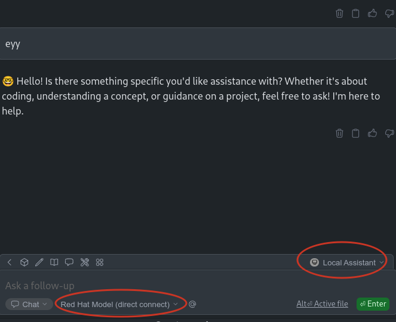

*Disclaimer: this is just me playing with some interal services on Red Hat, to help us play and learn about different usages of AI LLM models*

# Playing with Red Hat serving models

Recently, Red Hat is providing internally different tools and infrastructure, to allow us to play and learn on different activities related to AI. Through an internal platform I asked for some infrastructure to allocate an AI model that I can use on my daily duties. Or at least, I wanted to experiment. Something that seems a funny thing to do on a #LearningDay.

Because of this is an internal platform the process of registering and getting the infrastructure is not covered here. If you are a Red Hat colleague, I started [here](https://developer.models.corp.redhat.com).

At the end you will end-up with an endpoint and an api-key (as other many platforms) to interact with it. I could even run it locally (but lack of GPU and good performance), or try Openshift AI serving (maybe for other day, and anyway, I dont have servers with GPU).

In our case, the API_BASE would be something like:

```
https://granite-3-2-8b-instruct--apicast-staging.apps.i....paas.redhat.com:443/v1/
```

Notice this url will then serve it with `/v1/completions` or `v1/chat/completions`.

With the endpoint and key we can just curl:

```bash
> curl -sH "Content-Type: application/json"           -d "{ \                                                                                                                                                                                              
                \"prompt\": \"ey how is going, who is out there?\", \
                \"max_tokens\": 300, \
                \"temperature\": 0 \
              }"           --url "https://granite-3-2-8b-instruct--apicast-.....paas.redhat.com:443/v1/completions"           -H "Authorization: Bearer 1928....de" | jq
{
  "id": "cmpl-5620b9cca2db4e27b7cad839246110ad",
  "object": "text_completion",
  "created": 1746805780,
  "model": "ibm-granite/granite-3.2-8b-instruct",
  "choices": [
    {
      "index": 0,
      "text": "\n\nHello! I'm an assistant, designed to help answer your questions. I don't have personal experiences or a physical presence, but I'm here to provide information and assistance. How can I help you today?",
      "logprobs": null,
      "finish_reason": "stop",
      "stop_reason": null,
      "prompt_logprobs": null
    }
  ],
  "usage": {
    "prompt_tokens": 10,
    "total_tokens": 55,
    "completion_tokens": 45,
    "prompt_tokens_details": null
  }
}

```

But we will go further integrating other tools.

## Integrate the model into VisualStudio and Continue

My following work is based on a colleague (@EranCohen), who proposed to use Visualstudio and the Continue plugin, that allows you to create a hub of models. Thanks @EranCohen.


### Try direct connect between Visual Studio and our models

Once you have Continues installed, you can configure your Local Assistant to interact with the model. In my case, something like this:

```yaml
name: Local Assistant
version: 1.0.0
schema: v1
models:
  - name: Red Hat Model (direct connect)
    provider: openai
    model: ibm-granite/granite-3.2-8b-instruct
    apiKey: 19282906ec8f48750903d302ad8edcde
    apiBase: https://granite-3-2-8b-instruct--apicast-staging.apps.int.stc.ai.prod.us-east-1.aws.paas.redhat.com:443/v1/
    systemMessage: You are Granite Chat. You carefully follow instructions and can
      use tools at your disposal to fulfill the request. You always respond to
      greetings with "Hello! I am Granite Chat. How can I help you today?
    contextLength: 32000
context:
  - provider: code
  - provider: docs
  - provider: diff
  - provider: terminal
  - provider: problems
  - provider: folder
  - provider: codebase
```

So, I can chat with it:


*By the way, I had to add some Red Hat CA to trust on the server that is serving the model. You know, copy the certs on your OS path and update the certs DB*


### Try with LitteLLM proxy in the middle

Also proposed by Eran, for a better tool to talk to a model, to use LitteLM.

LittleLLM proxy helps you to act as a hub for different models, you can switch from one to another depending on the needs. You can use one model completion, other for chatting, etc.

Some quick instructions will be:

```bash
> git clone https://github.com/BerriAI/litellm
> cd litellm

```

Now lets create the proxy configuration:

```
> cat litellm_config.yaml 
model_list:
  - model_name: Red Hat Model
    litellm_params:
      model: hosted_vllm/ibm-granite/granite-3.2-8b-instruct
      api_base: https://granite-3-2-8b-instruct--apicast-staging......paas.redhat.com:443/v1/
      api_key: 192.....cde

litellm_settings:
  ssl_verify: "/etc/ssl/certs/2022-IT-Root-CA.pem"
  drop_params: true

```

 * `model_name` it is just how you want to name the model
 * `model` it is in the format of "provider/model". In my case, because of I am using this experimentation infrastructure, I know that is an OpeanAI compatible server. And I can use the [provider VLLM](https://docs.litellm.ai/docs/providers/vllm). So, the provider is "hosted_vllm" and the model name I get from the available options I had. 
 * `api_base`as explained above.
 * `api_key` that I received.
 
Notice, I have added some configuration to use the Red Hat CA. That I will mount inside the container.

So, now I can run the proxy in a container, passing the litellm config and the CA:

```bash
> podman run -v $(pwd)/litellm_config.yaml:/app/config.yaml\
	-v $(pwd)/redhat-ca/2022-IT-Root-CA.pem:/etc/ssl/certs/2022-IT-Root-CA.pem:ro\
	-p 4000:4000\
	--privileged ghcr.io/berriai/litellm:main-latest\
	--config /app/config.yaml --detailed_debug       
```

Now, I can directly interact with the proxy. For example, using the `/chat/completions/`: 

```bash
> curl -s --location 'http://0.0.0.0:4000/chat/completions'     --header 'Content-Type: application/json'     --data '{
    "model": "Red Hat Model",
    "messages": [
        {
        "role": "user",
        "content": "ey there, how is going?"
        }
    ]
}' | jq
{
  "id": "chatcmpl-bb08825889bd4629ac1e709ce99b2ae1",
  "created": 1746803998,
  "model": "hosted_vllm/ibm-granite/granite-3.2-8b-instruct",
  "object": "chat.completion",
  "system_fingerprint": null,
  "choices": [
    {
      "finish_reason": "stop",
      "index": 0,
      "message": {
        "content": "Greetings! I'm an artificial intelligence and don't have feelings, but I'm functioning optimally and ready to assist you. How can I help you today?",
        "role": "assistant",
        "tool_calls": null,
        "function_call": null
      }
    }
  ],
  "usage": {
    "completion_tokens": 39,
    "prompt_tokens": 66,
    "total_tokens": 105,
    "completion_tokens_details": null,
    "prompt_tokens_details": null
  },
  "service_tier": null,
  "prompt_logprobs": null
}

```

`curl` is cool but not to chat. So, we integrate our VisualStudio and the Continue plugin to use the proxy. 

So, lets add this option to our Continue Local Assistant, with a new model provided through LiteLLM proxy:

```yaml
name: Local Assistant
version: 1.0.0
schema: v1
models:
  - name: Red Hat Model (litellm)
    provider: openai
    model: Red Hat Model
    apiKey: ..........
    apiBase: http://127.0.0.1:4000/v1/
    systemMessage: You are Granite Chat. You carefully follow instructions and can
      use tools at your disposal to fulfill the request. You always respond to
      greetings with "Hello! I am Granite Chat. How can I help you today?
    contextLength: 32000
  - name: Red Hat Model (direct connect)
    provider: openai
    model: ibm-granite/granite-3.2-8b-instruct
    apiKey: ........
    apiBase: https://granite-3-2-8b-instruct--apicast-staging.apps.int.stc.ai.prod.us-east-1.aws.paas.redhat.com:443/v1/
    systemMessage: You are Granite Chat. You carefully follow instructions and can
      use tools at your disposal to fulfill the request. You always respond to
      greetings with "Hello! I am Granite Chat. How can I help you today?
    contextLength: 32000
context:
  - provider: code
  - provider: docs
  - provider: diff
  - provider: terminal
  - provider: problems
  - provider: folder
  - provider: codebase

```

Continue is configured with my Local Assistant

My Local Assistant is now configured with two models.


And different ways to interact, like edit, chat, or agent:


lets just add some greetings:


### Working with both

I am trying to do something more than just chat. So, I want to make it help me to improve some docs:


but fails (connection error) for some certificate issue (I have to investigate).


But, if I try the model interaction directly with the Red Hat infrastructure (which is Vistual Studio using the CA on my OS):


It helps me to write a better document:


## Work to do

to try out agents
