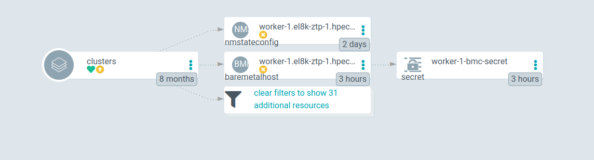

# Scaling down clusters with ZTP GitOps

[Zero Touch Provisioning Gitops way](https://docs.openshift.com/container-platform/4.11/scalability_and_performance/ztp_far_edge/ztp-deploying-far-edge-clusters-at-scale.html) is based on two CRDs for creation and maintenance of clusters. The whole stuck is mainly supported by Red Hat Advanced Cluster Management (ACM) and the Openshift Assisted Installer (AI).

The **Siteconfigs** CRD contains the information for the creation of clusters. This CRD is pretty static, it is used to start the cluster creation. After the creation, very few changes can be introduced. It also contains the list of hosts that will be part of the created clusters. After the installation:

* You can new hosts to the Siteconfig, and these will be included into the cluster. So, Scaling Up is working with ZTP.

* You can delete one (or more hosts) but this will not Scale Down the cluster. Or at least, not as you would expect.

When you delete the host from the Siteconfig, the ZTP Gitops will delete, mainly, a corresponding object called BareMetalHost (BMH). From ACM perspective, you are deleting the host from the ACM management. You no longer will manage the host from ACM. But, the host still exists, and still is part of the cluster. From the point of view of the Spoke (installed) cluster, nothing happened.

While writing this document, there is an [Request Feature Enhancement](https://issues.redhat.com/browse/RFE-3431) to enhance this behavior. This will open the possibility of really deleting the host from the Spoke cluster.

Meanwhile, or if this feature is not included, in your current ZTP version), this document covers a semi-automatic way of deleting the hosts. You should have in mind that using ZTP, Zero Touch Provisioning, should be fully automatic. Therefore, the following steps should be considered as a workaround.

## Steps for Scaling Down clusters

We will need four main steps:

* Use ZTP Gitops flow to delete the host

* Manually delete the Agent object from Hub cluster

* Delete the host from the Openshift  Spoke cluster

* Decommisioning the host

From the three steps, ideally, only the first one should be needed. This is expected to happen when the functionality has been implemented

### Using ZTP to delete the host

In this stage you should be familiar about how Siteconfig works. You will have something like this:

```yaml
...
...
    nodes:
      - hostName: "master-0.el8k-ztp-1.hpecloud.org"
        role: "master"
        bmcAddress: "redfish-virtualmedia://10.19.109.248/redfish/v1/Systems/1"
        bmcCredentialsName:
          name: "master-0-bmc-secret"
...
...
      - hostName: "master-1.el8k-ztp-1.hpecloud.org"
        role: "master"
        bmcAddress: "redfish-virtualmedia://10.19.109.247/redfish/v1/Systems/1"
        bmcCredentialsName:
          name: "master-1-bmc-secret"
...
...
      - hostName: "master-2.el8k-ztp-1.hpecloud.org"
        role: "master"
        bmcAddress: "redfish-virtualmedia://10.19.109.246/redfish/v1/Systems/1"
        bmcCredentialsName:
          name: "master-2-bmc-secret"
...
...
      - hostName: "worker-0.el8k-ztp-1.hpecloud.org"
        role: "worker"
        bmcAddress: "redfish-virtualmedia://10.19.10.71:6443/redfish/v1/Systems/64fee173-6d1b-43bc-ae9d-80b72ee57e6a"
        bmcCredentialsName:
          name: "worker-0-bmc-secret"
...
...
      - hostName: "worker-1.el8k-ztp-1.hpecloud.org"
        role: "worker"
        bmcAddress: "redfish-virtualmedia://10.19.10.71:6443/redfish/v1/Systems/2f03b103-596c-4736-aeed-289e590a8bb0"
        bmcCredentialsName:
          name: "worker-1-bmc-secret"
...
...
```

The cluster has 3 master and two workers. We will delete the worker-1. Delete the host entry in the SiteConfig and let the GitOps flow to delete the related resources.



From deleting the host, the Resources that are going to be deleted are a BMH and a NMStateconfig. Also, a Secrete will be deleted. This Secret is not under the control of the GitOps (as it can be seen in the image, not out-synch icon, because it is not controlled by ArgoCD). Anyway, it will be deleted, because it is referenced from the BMH.

### Manually delete the Agent object

After deleting the BMH, in the ACM GUI, you will still see host. During the host installation, the Assisted Installer created a new object of kind Agent. This Agent is out of any control on the GitOps flow. It was not created from the Siteconfig. It is created by the installation service.

How to know which Agent resource was created during the installation of this host? You can use this command with the name the BMH (which is actually the same as the hostname):

```bash
$> oc -n el8k-ztp-1 get Agent.agent-install.openshift.io  -o json \
 | jq '.items[].metadata | select(.labels."agent-install.openshift.io/bmh"=="worker-1.el8k-ztp-1.hpecloud.org") | .name'
"2f03b103-596c-4736-aeed-289e590a8bb0"

$> oc -n el8k-ztp-1 delete Agent 2f03b103-596c-4736-aeed-289e590a8bb0
agent.agent-install.openshift.io "2f03b103-596c-4736-aeed-289e590a8bb0" deleted
```

Now, the host is completely deleted from ACM. You will not see it neither in the Infrastructure nor in the Cluster.

### Delete the host from the Openshift cluster

From the spoke perspective, nothing happened yet. In order to delete the host, we will follow the [official documentation](https://docs.openshift.com/container-platform/4.10/machine_management/deleting-machine.html). More in concrete, we will use the Machine API to delete the corresponding Machine node. This will first drain the node and then delete it from the cluster.

In this case, we want to delete the worker-1 from all the Machines

```bash
>  oc -n openshift-machine-api get machine
NAME                              PHASE     TYPE   REGION   ZONE   AGE
el8k-ztp-1-bdxf5-master-0         Running                          72m
el8k-ztp-1-bdxf5-master-1         Running                          72m
el8k-ztp-1-bdxf5-master-2         Running                          72m
el8k-ztp-1-bdxf5-worker-0-98qzv   Running                          55m
el8k-ztp-1-bdxf5-worker-0-jf8lw   Running                          55m
```

From each Machine  you can have the host name:

```json
>  oc -n openshift-machine-api get machine el8k-ztp-1-bdxf5-worker-0-jf8lw -o jsonpath={.status.nodeRef.name}
worker-1.el8k-ztp-1.hpecloud.org
```

This will depend on how it was installed. The workers added as extra-workers dont belong to the MachineSet. But it is better to ensure that, in case you dont know how the worker was created.

```json
>  oc -n openshift-machine-api get machine el8k-ztp-1-bdxf5-worker-0-jf8lw \
-o jsonpath={.metadata.labels} | jq
{
  "machine.openshift.io/cluster-api-cluster": "el8k-ztp-1-bdxf5",
  "machine.openshift.io/cluster-api-machine-role": "worker",
  "machine.openshift.io/cluster-api-machine-type": "worker",
  "machine.openshift.io/cluster-api-machineset": "el8k-ztp-1-bdxf5-worker-0"
}

```

In this case, yes, it belongs to the MachineSet: 'el8k-ztp-1-bdxf5-worker-0'

step 1) Lets delete the Machine for the worker-1

```bash
> oc -n openshift-machine-api delete machine el8k-ztp-1-bdxf5-worker-0-jf8lw 
machine.machine.openshift.io "el8k-ztp-1-bdxf5-worker-0-jf8lw" deleted
```

step 2) (only if the Machine belongs to a MachineSet)  Scale down the MachineSet

In this case, the Machine was part of the MachineSet, we have to scale down the replicas. This MachineSet had two Machines, we scale it to 1.

```bash
> oc -n openshift-machine-api get machineset
NAME                        DESIRED   CURRENT   READY   AVAILABLE   AGE
el8k-ztp-1-bdxf5-worker-0   2         2         1       1           58m

> oc -n openshift-machine-api scale machineset el8k-ztp-1-bdxf5-worker-0  \
--replicas=1
machineset.machine.openshift.io/el8k-ztp-1-bdxf5-worker-0  scaled

> oc -n openshift-machine-api get machine
NAME                              PHASE     TYPE   REGION   ZONE   AGE
el8k-ztp-1-bdxf5-master-0         Running                          83m
el8k-ztp-1-bdxf5-master-1         Running                          83m
el8k-ztp-1-bdxf5-master-2         Running                          83m
el8k-ztp-1-bdxf5-worker-0-98qzv   Running                          66m

```

So, MachineSet dont try to re-provision the Machine, and keep it in just one worker.

step 3)  Delete the BMH object.

```bash
> oc -n openshift-machine-api delete bmh worker-1.el8k-ztp-1.hpecloud.org 
baremetalhost.metal3.io "worker-1.el8k-ztp-1.hpecloud.org" deleted
```

If the deletion get stuck, it could be because of [a know bug](https://issues.redhat.com/browse/OCPBUGS-7581). Related to deleting unmanaged BMH. [Unmanaged happens](https://issues.redhat.com/browse/OCPBUGS-5784) because of a different way of installing workers on day-0 or day-2.

In this case, the BMH was unmanaged, and got stuck deleting. To remove the finalizer:

```bash
> oc  -n openshift-machine-api patch bmh worker-1.el8k-ztp-1.hpecloud.org \
--type=merge -p '{"metadata": {"finalizers":null}}' 
baremetalhost.metal3.io/worker-0.el8k-ztp-1.hpecloud.org patched
```

The node is out of the Openshift cluster, and there are neither Machine nor BMH resources related.

### Decommisioning the node

After deleting the node, you cannot re-start the host,  or it will re-join the cluster. This happens, because it will boot again and it will start the 'kubelet' service, that will make the host to rejoin to the cluster.

The decommisioining process consists on deleting all the data from the cluster. There are many ways of doing this. One option would be: [How to destroy all the data from server for decommission? - Red Hat Customer Portal](https://access.redhat.com/solutions/84663)