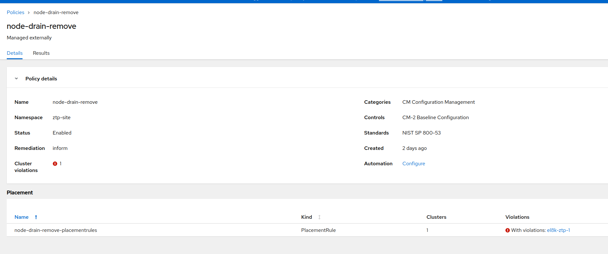
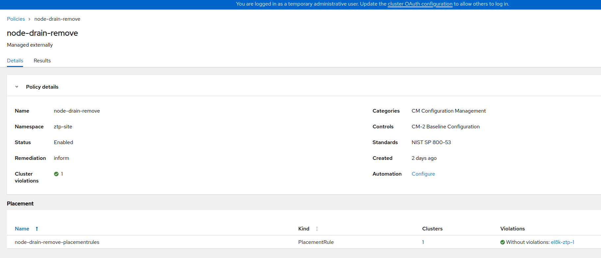

# Scaling down clusters with ZTP GitOps

[Zero Touch Provisioning Gitops way](https://docs.openshift.com/container-platform/4.11/scalability_and_performance/ztp_far_edge/ztp-deploying-far-edge-clusters-at-scale.html) is based on two CRDs for creation and maintenance of clusters. The whole stuck is mainly supported by Red Hat Advanced Cluster Management (ACM) and the Openshift Assisted Installer (AI).

The **Siteconfigs** CRD contains the information for the creation of clusters. This CRD is pretty static, it is used to start the cluster creation. After the creation, very few changes can be introduced. It also contains the list of hosts that will be part of the created clusters. After the installation:

* You can new hosts to the Siteconfig, and these will be included into the cluster. So, Scaling Up is working with ZTP.

* You can delete one (or more hosts) but this will not Scale Down the cluster. Or at least, not as you would expect.

When you delete the host from the Siteconfig, the ZTP Gitops will delete, mainly, a corresponding object called BareMetalHost (BMH). From ACM perspective, you are deleting the host from the ACM management. You no longer will manage the host from ACM. But, the host still exists, and still is part of the cluster. From the point of view of the Spoke (installed) cluster, nothing happened.

While writing this document, there is an [Request Feature Enhancement](https://issues.redhat.com/browse/RFE-3431) to enhance this behavior. This will open the possibility of really deleting the host from the Spoke cluster.

Meanwhile, or if this feature is not included, in your current ZTP version), this document covers a semi-automatic way of deleting the hosts. You should have in mind that using ZTP, Zero Touch Provisioning, should be fully automatic. Therefore, the following steps should be considered as a workaround.

## Steps for Scaling Down clusters

We will need three main steps:

* Use ZTP Gitops flow to delete the host

* Manually delete the Agent object

* Delete the host from the Openshift cluster. The usual 'oc drain and oc delete node'

From the three steps, ideally, only the first one should be needed. This is expected to happen when the functionality has been implemented


### Using ZTP to delete the host

In this stage you should be familiar about how Siteconfig works. You will have something like this:

```yaml
...
...
    nodes:
      - hostName: "master-0.el8k-ztp-1.hpecloud.org"
        role: "master"
        bmcAddress: "redfish-virtualmedia://10.19.109.248/redfish/v1/Systems/1"
        bmcCredentialsName:
          name: "master-0-bmc-secret"
...
...
      - hostName: "master-1.el8k-ztp-1.hpecloud.org"
        role: "master"
        bmcAddress: "redfish-virtualmedia://10.19.109.247/redfish/v1/Systems/1"
        bmcCredentialsName:
          name: "master-1-bmc-secret"
...
...
      - hostName: "master-2.el8k-ztp-1.hpecloud.org"
        role: "master"
        bmcAddress: "redfish-virtualmedia://10.19.109.246/redfish/v1/Systems/1"
        bmcCredentialsName:
          name: "master-2-bmc-secret"
...
...
      - hostName: "worker-0.el8k-ztp-1.hpecloud.org"
        role: "worker"
        bmcAddress: "redfish-virtualmedia://10.19.10.71:6443/redfish/v1/Systems/64fee173-6d1b-43bc-ae9d-80b72ee57e6a"
        bmcCredentialsName:
          name: "worker-0-bmc-secret"
...
...
      - hostName: "worker-1.el8k-ztp-1.hpecloud.org"
        role: "worker"
        bmcAddress: "redfish-virtualmedia://10.19.10.71:6443/redfish/v1/Systems/2f03b103-596c-4736-aeed-289e590a8bb0"
        bmcCredentialsName:
          name: "worker-1-bmc-secret"
...
...
```

The cluster has 3 master and two workers. We will delete the worker-1. Delete the host entry in the SiteConfig and let the GitOps flow to delete the related resources.


From deleting the host, the Resources that are going to be deleted are a BMH and a NMStateconfig. Also, a Secrete will be deleted. This Secret is not under the control of the GitOps (as it can be seen in the image, not out-synch icon, because it is not controlled by ArgoCD). Anyway, it will be deleted, because it is referenced from the BMH.

### Manually delete the Agent object

After deleting the BMH, in the Agent GUI, you will still see host. During the host installation, the Assisted Installer creates a new object of kind Agent. This Agent is out of any control on the GitOps flow. It was not created from the Siteconfig. It is created by the installation service.

How to know which Agent resource was created during the installation of this host? You can use this command with the name the BMH (which is actually the same as the hostname):

```bash
$> oc -n el8k-ztp-1 get Agent.agent-install.openshift.io  -o json \
 | jq '.items[].metadata | select(.labels."agent-install.openshift.io/bmh"=="worker-1.el8k-ztp-1.hpecloud.org") | .name'
"2f03b103-596c-4736-aeed-289e590a8bb0"

$> oc -n el8k-ztp-1 delete Agent 2f03b103-596c-4736-aeed-289e590a8bb0
agent.agent-install.openshift.io "2f03b103-596c-4736-aeed-289e590a8bb0" deleted
```

Now, the host is completely deleted from ACM. You will not see it neither in the Infrastructure nor in the Cluster.

### Delete the host from the Openshift cluster

In ACM the host no longer exists, but in the Spoke side nothing happened. From the Spoke cluster:

```bash
> oc get nodes
NAME                               STATUS   ROLES           AGE    VERSION
master-0.el8k-ztp-1.hpecloud.org   Ready    master,worker   2d4h   v1.23.12+8a6bfe4
master-1.el8k-ztp-1.hpecloud.org   Ready    master,worker   2d4h   v1.23.12+8a6bfe4
master-2.el8k-ztp-1.hpecloud.org   Ready    master,worker   2d4h   v1.23.12+8a6bfe4
worker-0.el8k-ztp-1.hpecloud.org   Ready    worker          112m   v1.23.12+8a6bfe4
worker-1.el8k-ztp-1.hpecloud.org   Ready    worker          114m   v1.23.12+8a6bfe4
```

To delete the Node you can use your oc client or create an ACM Policy

#### Using 'oc client'

This option is pretty easy and straightforward.  But you need Admin access to the Spoke cluster. Something that would not happen on a GitOps scenario. Where your only way of connecting the cluster is with you Git Repository.

You only have to oc drain and oc delete the node. More details [here](https://access.redhat.com/solutions/4976801) or [here](https://docs.openshift.com/container-platform/4.10/machine_management/deleting-machine.html). Both ways will be oka.

When each host is deployed, it is also created a BMH object for each one, in the Spoke cluster. In the previous step we deleted the BMH from the Hub cluster. Now, we have to do the same in the spoke.  Using 'oc -n openshift-machine-api get bmh' you can get the list of BMH, delete the one corresponding the node deleted.

#### Using an ACM Policy

If you are using a GitOps approach, maybe you dont have Admin access to Spoke cluster. Also, ZTP is your point of truth about the Cluster status. So, you can create an ACM Policy inside your GitOps flow, that marks this host to be deleted.

> Here we dont cover details about creating Policies, or how to use CGU to enforce them. It is expected you have some minimum knowledge about how to use ZTP

Create an ACM Policy to delete the Machine corresponding to that Node, and the proper PlacementRules and PlacementBindings. I have another [document](https://github.com/jgato/jgato/blob/main/random_docs/ztp-zero-touch-all.md#making-the-match-between-policies-and-clusters) summarizing how to create these Policies.

The Policy: instead of deleting the Node, we will delete the Machine. This ensures that before deleting the Node, it makes a drain process.

```yaml
---
apiVersion: policy.open-cluster-management.io/v1
kind: Policy
metadata:
  annotations:
    policy.open-cluster-management.io/categories: CM Configuration Management
    policy.open-cluster-management.io/controls: CM-2 Baseline Configuration
    policy.open-cluster-management.io/standards: NIST SP 800-53
    ran.openshift.io/ztp-deploy-wave: "20"
  name: node-drain-remove
  namespace: ztp-site
spec:
  disabled: false
  policy-templates:
  - objectDefinition:
      apiVersion: policy.open-cluster-management.io/v1
      kind: ConfigurationPolicy
      metadata:
        name: node-drain-remove-configurationpolicy
      spec:
        namespaceselector:
          exclude:
          - kube-*
          include:
          - '*'
        object-templates:
        - complianceType: mustnothave
          objectDefinition:
            apiVersion: machine.openshift.io/v1beta1
            kind: Machine
            metadata:
              name: el8k-ztp-1-worker-1.el8k-ztp-1.hpecloud.org
              namespace: openshift-machine-api
        - complianceType: mustnothave
          objectDefinition:
            apiVersion: metal3.io/v1alpha1
            kind: BareMetalHost
            metadata:
              name: worker-1.el8k-ztp-1.hpecloud.org
              namespace: openshift-machine-api
        remediationAction: inform
        severity: low
  remediationAction: inform
```

Get the proper name for the Machine (Spoke cluster):

```bash
> oc -n openshift-machine-api get machine
NAME                                          PHASE         TYPE   REGION   ZONE   AGE
el8k-ztp-1-2bjf2-master-0                     Running                              2d5h
el8k-ztp-1-2bjf2-master-1                     Running                              2d5h
el8k-ztp-1-2bjf2-master-2                     Running                              2d5h
el8k-ztp-1-worker-0.el8k-ztp-1.hpecloud.org   Running                              120m
el8k-ztp-1-worker-1.el8k-ztp-1.hpecloud.org   Running                              127m
```

And here the Placements to match the Policy and the Cluster where the host was created:

```yaml
---
apiVersion: apps.open-cluster-management.io/v1
kind: PlacementRule
metadata:
  name: node-drain-remove-placementrules
  namespace: ztp-site
spec:
  clusterSelector:
    matchExpressions:
      - key: name
        operator: In
        values:
          - el8k-ztp-1
---
apiVersion: policy.open-cluster-management.io/v1
kind: PlacementBinding
metadata:
  name: node-drain-remove-placementbinding
  namespace: ztp-site
placementRef:
  apiGroup: apps.open-cluster-management.io
  kind: PlacementRule
  name: node-drain-remove-placementrules
subjects:
  - apiGroup: policy.open-cluster-management.io
    kind: Policy
    name: node-drain-remove
```

Push the changes to create the Policy on ACM:
 
The Policy is not-compliant because the desired status points to not have that host. Create a CGU to enforce the proper status. After that:



and the Node is gone from the Spoke cluster:

```bash
> oc get nodes
NAME                               STATUS   ROLES           AGE    VERSION
master-0.el8k-ztp-1.hpecloud.org   Ready    master,worker   2d4h   v1.23.12+8a6bfe4
master-1.el8k-ztp-1.hpecloud.org   Ready    master,worker   2d5h   v1.23.12+8a6bfe4
master-2.el8k-ztp-1.hpecloud.org   Ready    master,worker   2d5h   v1.23.12+8a6bfe4
worker-0.el8k-ztp-1.hpecloud.org   Ready    worker          125m   v1.23.12+8a6bfe4
```

After that, the host should be switched off.


### Decommisioning the node

After finishing the procedure the host will be off. You cannot re-start the host,  or

it will re-join the cluster. This happens, because it will boot again and it will start the 'kubelet' service, that will make the host to rejoin to the cluster.

The decommisioining process consists on deleting all the data from the cluster. There are many ways of doing this. One option would be: [How to destroy all the data from server for decommission? - Red Hat Customer Portal](https://access.redhat.com/solutions/84663)


