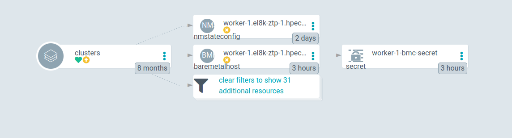

Disclaimer: this procedure is just a work around. The official implementation will be included soon (RHACM 2.8). If you are using Red Hat supported products, **this is not a supported solution**. If you are dont need official supported solutions, this would help you to scale down clusters, meanwhile the official implementation is out.

# Scaling down clusters with ZTP GitOps

[Zero Touch Provisioning Gitops](https://docs.openshift.com/container-platform/4.11/scalability_and_performance/ztp_far_edge/ztp-deploying-far-edge-clusters-at-scale.html) workflow is based on two CRDs (Siteconfig, PolicyGenTemplate) for creation and maintenance of clusters. The whole stack mainly leverages by Red Hat Advanced Cluster Management (ACM) and the Openshift Assisted Installer (AI).
When you delete a host from the Siteconfig, the ZTP Gitops will delete an object called BareMetalHost (BMH). From RHACM perspective, you are deleting the host from RHACM management. You will no longer manage the host from RHACM. But the host still exists, and is still part of the previously created spoke cluster. From the point of view of the spoke cluster, nothing happened, and the host is not deleted.

There is a [Request Feature Enhancement](https://issues.redhat.com/browse/RFE-3431) to improve this behavior. This will open the possibility of really deleting the host from the spoke cluster.

Meanwhile, or if this feature is not included in your current ZTP environment, this document covers a semi-automatic way of deleting the hosts. You should have in mind that using ZTP should be fully automatic. Therefore, the following steps should be considered as a workaround.

## Steps for Scaling Down clusters

We will need four main steps for scaling down clusters using a ZTP GitOps scenario:

- (Hub cluster) Use ZTP Gitops flow to delete the host
- (Hub cluster) Manually delete the Agent object from Hub cluster
- (Spoke cluster) Delete the host from the Openshift Spoke cluster
- (Spoke cluster) Decommissioning the host

**Constrains**  

Depending on the number of hosts in your spoke cluster. 

- If the cluster was created as a compact cluster, removing masters will break HA of the cluster. You cannot do that.
- If the cluster was created as a standard cluster, removing masters will break HA of the cluster. You cannot do that either.
- If the cluster was created as a standard cluster with 2 workers, You cannot remove any worker. 
  This procedure only applies to clusters deployed with ZTP and Assisted Installer on RHACM

### Using ZTP to delete the host

In this stage, you should be familiar about how Siteconfig works. Following an example on the Siteconfig nodes list:

```yaml
...
...
    nodes:
      - hostName: "master-0.el8k-ztp-1.hpecloud.org"
        role: "master"
        bmcAddress: "redfish-virtualmedia://10.19.109.248/redfish/v1/Systems/1"
        bmcCredentialsName:
          name: "master-0-bmc-secret"
...
...
      - hostName: "master-1.el8k-ztp-1.hpecloud.org"
        role: "master"
        bmcAddress: "redfish-virtualmedia://10.19.109.247/redfish/v1/Systems/1"
        bmcCredentialsName:
          name: "master-1-bmc-secret"
...
...
      - hostName: "master-2.el8k-ztp-1.hpecloud.org"
        role: "master"
        bmcAddress: "redfish-virtualmedia://10.19.109.246/redfish/v1/Systems/1"
        bmcCredentialsName:
          name: "master-2-bmc-secret"
...
...
      - hostName: "worker-0.el8k-ztp-1.hpecloud.org"
        role: "worker"
        bmcAddress: "redfish-virtualmedia://10.19.10.71:6443/redfish/v1/Systems/64fee173-6d1b-43bc-ae9d-80b72ee57e6a"
        bmcCredentialsName:
          name: "worker-0-bmc-secret"
...
...
      - hostName: "worker-1.el8k-ztp-1.hpecloud.org"
        role: "worker"
        bmcAddress: "redfish-virtualmedia://10.19.10.71:6443/redfish/v1/Systems/2f03b103-596c-4736-aeed-289e590a8bb0"
        bmcCredentialsName:
          name: "worker-1-bmc-secret"
...
...
```

The cluster has 3 master and 3 workers. We will delete the worker-1. Delete the host entry in the SiteConfig and let the GitOps flow to delete the related resources.



From deleting the host on your Siteconfig, the Resources that are going to be deleted are:

- a BMH
- NMStateconfig
- a Secret.

Sync the objects and these will be deleted from your Hub cluster.

### Manually delete the Agent object

After deleting the BMH, in the ACM GUI, you will still see the host. 
During the host installation, the Assisted Installer created a new object of kind Agent. This Agent is out of any control on the GitOps flow. It was not created from the Siteconfig and it cannot be deleted using our GitOps flow. We have to delete it manually. 

How to know which Agent resource was created during the installation of this host? You can use this command using the name of the BMH (which is actually the same as the hostname, here, worker-1.el8k-ztp-1.hpecloud.org):

```bash
$> oc -n el8k-ztp-1 get Agent.agent-install.openshift.io  -o json \
 | jq '.items[].metadata | select(.labels."agent-install.openshift.io/bmh"=="worker-1.el8k-ztp-1.hpecloud.org") | .name'
"2f03b103-596c-4736-aeed-289e590a8bb0"

$> oc -n el8k-ztp-1 delete Agent 2f03b103-596c-4736-aeed-289e590a8bb0
agent.agent-install.openshift.io "2f03b103-596c-4736-aeed-289e590a8bb0" deleted
```

Now, the host is completely deleted from RHACM and the Hub Cluster.

### Delete the host from the Openshift cluster

From the spoke perspective, nothing happened yet. In order to delete the host, we will follow the [official documentation](https://docs.openshift.com/container-platform/4.10/machine_management/deleting-machine.html).Concretely, we will use the machine API to delete the corresponding machine node. This will drain first the node and then delete it from the cluster.

In this case, we want to delete the worker-1 from the machines list.

```bash
>  oc -n openshift-machine-api get machine
NAME                              PHASE     TYPE   REGION   ZONE   AGE
el8k-ztp-1-vkp72-master-0         Running                          14h
el8k-ztp-1-vkp72-master-1         Running                          14h
el8k-ztp-1-vkp72-master-2         Running                          14h
el8k-ztp-1-vkp72-worker-0-9mbmc   Running                          14h
el8k-ztp-1-vkp72-worker-0-n6rnh   Running                          14h
el8k-ztp-1-vkp72-worker-0-qkcs2   Running                          14h
```

From each machine, you can have the host name:

```bash
> oc -n openshift-machine-api get machine el8k-ztp-1-vkp72-worker-0-n6rnh -o jsonpath={.status.nodeRef.name}
worker-1.el8k-ztp-1.hpecloud.org
```

The machine about worker-1 is the el8k-ztp-1-vkp72-worker-0-n6rnh.

Now, let's find out if the machine belongs to a machineset. This will depend on how it was installed. The workers added as extra-workers don't belong to the Machineset. But it is better to ensure it, in case we don't know how the worker was created.

```bash
> oc -n openshift-machine-api get machine el8k-ztp-1-vkp72-worker-0-n6rnh -o jsonpath={.metadata.labels} | jq
{
  "machine.openshift.io/cluster-api-cluster": "el8k-ztp-1-vkp72",
  "machine.openshift.io/cluster-api-machine-role": "worker",
  "machine.openshift.io/cluster-api-machine-type": "worker",
  "machine.openshift.io/cluster-api-machineset": "el8k-ztp-1-vkp72-worker-0"
}
```

We can observe how the Machine el8k-ztp-1-vkp72-worker-0-n6rnh belongs to the machineset el8k-ztp-1-vkp72-worker-0. In the following steps, we will have to delete the machine, but also, to scale down the machineset.

step 1) Lets delete the machine for the worker-1

```bash
> oc -n openshift-machine-api delete machine el8k-ztp-1-vkp72-worker-0-n6rnh 
machine.machine.openshift.io "el8k-ztp-1-vkp72-worker-0-n6rnh" deleted
```

step 2) (only if the machine belongs to a machineSet) scale down the machineset

In this case, the machine was part of the machineset, we have to scale down the replicas. This machineset had three machines, we scale it to 2.

```bash
> oc -n openshift-machine-api get machineset
NAME                        DESIRED   CURRENT   READY   AVAILABLE   AGE
el8k-ztp-1-vkp72-worker-0   3         3         2       2           14h

> oc -n openshift-machine-api scale machineset el8k-ztp-1-vkp72-worker-0  \
--replicas=2
machineset.machine.openshift.io/el8k-ztp-1-vkp72-worker-0 scaled

> oc -n openshift-machine-api get machineset
NAME                        DESIRED   CURRENT   READY   AVAILABLE   AGE
el8k-ztp-1-vkp72-worker-0   2         2         2       2           14h

> oc -n openshift-machine-api get machine
NAME                              PHASE     TYPE   REGION   ZONE   AGE
el8k-ztp-1-vkp72-master-0         Running                          14h
el8k-ztp-1-vkp72-master-1         Running                          14h
el8k-ztp-1-vkp72-master-2         Running                          14h
el8k-ztp-1-vkp72-worker-0-9mbmc   Running                          14h
el8k-ztp-1-vkp72-worker-0-qkcs2   Running                          14h
```

So, machineSet doesnt try to reprovision the machine, and keep it in just one worker.

step 3)  Delete the BMH object.

```bash
> oc -n openshift-machine-api delete bmh worker-1.el8k-ztp-1.hpecloud.org 
baremetalhost.metal3.io "worker-1.el8k-ztp-1.hpecloud.org" deleted
```

If the deletion get stuck, it might be because of [a known bug](https://issues.redhat.com/browse/OCPBUGS-7581). Related to deleting unmanaged BMH. In this case, the BMH was unmanaged, and got stuck deleting. We will have to remove the finalizer:

```bash
> oc  -n openshift-machine-api patch bmh worker-1.el8k-ztp-1.hpecloud.org \
--type=merge -p '{"metadata": {"finalizers":null}}' 
baremetalhost.metal3.io/worker-0.el8k-ztp-1.hpecloud.org patched
```

The node is out of the Openshift cluster, and there are neither Machine nor related BMH resources.

```bash
> oc get nodes
NAME                               STATUS   ROLES                  AGE   VERSION
master-0.el8k-ztp-1.hpecloud.org   Ready    control-plane,master   14h   v1.25.4+a34b9e9
master-1.el8k-ztp-1.hpecloud.org   Ready    control-plane,master   14h   v1.25.4+a34b9e9
master-2.el8k-ztp-1.hpecloud.org   Ready    control-plane,master   14h   v1.25.4+a34b9e9
worker-0.el8k-ztp-1.hpecloud.org   Ready    worker                 14h   v1.25.4+a34b9e9
worker-2.el8k-ztp-1.hpecloud.org   Ready    worker                 14h   v1.25.4+a34b9e9

> oc  -n openshift-machine-api get bmh,machine
NAME                                                       STATE       CONSUMER                          ONLINE   ERROR   AGE
baremetalhost.metal3.io/master-0.el8k-ztp-1.hpecloud.org   unmanaged   el8k-ztp-1-vkp72-master-0         true             14h
baremetalhost.metal3.io/master-1.el8k-ztp-1.hpecloud.org   unmanaged   el8k-ztp-1-vkp72-master-1         true             14h
baremetalhost.metal3.io/master-2.el8k-ztp-1.hpecloud.org   unmanaged   el8k-ztp-1-vkp72-master-2         true             14h
baremetalhost.metal3.io/worker-0.el8k-ztp-1.hpecloud.org   unmanaged   el8k-ztp-1-vkp72-worker-0-9mbmc   true             14h
baremetalhost.metal3.io/worker-2.el8k-ztp-1.hpecloud.org   unmanaged   el8k-ztp-1-vkp72-worker-0-qkcs2   true             14h

NAME                                                           PHASE     TYPE   REGION   ZONE   AGE
machine.machine.openshift.io/el8k-ztp-1-vkp72-master-0         Running                          14h
machine.machine.openshift.io/el8k-ztp-1-vkp72-master-1         Running                          14h
machine.machine.openshift.io/el8k-ztp-1-vkp72-master-2         Running                          14h
machine.machine.openshift.io/el8k-ztp-1-vkp72-worker-0-9mbmc   Running                          14h
machine.machine.openshift.io/el8k-ztp-1-vkp72-worker-0-qkcs2   Running                          14h
```

### Decommisioning the node

With the host deleted from the Spoke cluster, you cannot restart the host, or it will rejoin the cluster.This is so because it will boot again and will start the 'kubelet' service, which will make the host rejoin the cluster.

The decommissioning process consists of deleting all the data from the host. There are many ways of doing this. One option might be: [How to destroy all the data from server for decommission? - Red Hat Customer Portal](https://access.redhat.com/solutions/84663)