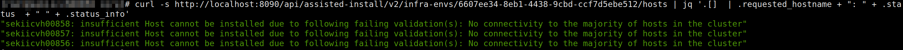

# Tips, tricks and troubleshooting Assisted Installer

Some tips, tricks and troubleshooting that would help deployment OCP with AI.

## AI Kubernetes API based

Here, our main way of interacting is using Openshift/Kubernetes resources. As the way of deploying the cluster.

## Agent Based AI

With  Agent Based AI, the bootstrap node exposes the Assisted Service REST API. This AI is easily accesible. It provides information about the clusters, infraenvs and hosts. The same than Kuberentes API, but using a REST API, instead of Openshift/Kubernetes resources.

Of course, also logs, from the different services, helps with the troubleshootings

### Which Agent version you are using

Connect to any installing host to check the Agent service and the image that was used:

```bash
#> journalctl -u agent --no-pager
```


 
Then use skopeo to get the commit that was used to build the Agent image:

```bash
#> skopeo inspect   docker://quay.io/openshift-release-dev/ocp-v4.0-art-dev@sha256:6d361dd7384890d5d1887af77dcea37c3b47b232b9038d4040b45e202bae7793 \
| grep "io.openshift.build.commit.url" \
| awk '{print $2}' \
| awk -F '"' '{print $2}'
```

or pull the image and query the local image:

```bash
#> podman pull   docker://quay.io/openshift-release-dev/ocp-v4.0-art-dev@sha256:6d361dd7384890d5d1887af77dcea37c3b47b232b9038d4040b45e202bae7793  
Trying to pull quay.io/openshift-release-dev/ocp-v4.0-art-dev@sha256:6d361dd7384890d5d1887af77dcea37c3b47b232b9038d4040b45e202bae7793...
Getting image source signatures
Copying blob 97da74cc6d8f skipped: already exists  
Copying blob 79bfdf372cab skipped: already exists  
Copying blob f0f4937bc70f skipped: already exists  
Copying blob 833de2b0ccff skipped: already exists  
Copying blob d8190195889e skipped: already exists  
Copying config 876a08c4b6 done  
Writing manifest to image destination
Storing signatures
876a08c4b6f801f6db5cff48d6460288a42ccb4fb6ba5e6dcd4cb6c07bf619dd
#> skopeo inspect   containers-storage:876a08c4b6f8 | grep "io.openshift.build.commit.url" | awk '{print $2}' | awk -F '"' '{print $2}'
https://github.com/openshift/assisted-installer-agent/commit/271a6f48486db5702d3ebc4b644b74722319d49d
```

With the URL and the commit '271a6f48486db5702d3ebc4b644b74722319d49d', we can see the branches where it was included:

```bash
> git branch -a --contains 271a6f48486db5702d3ebc4b644b74722319d49d | tr -d '[:space:]'
remotes/origin/release-4.12
```

And also, how many commits we are from there to the current version:

```bash
> git rev-list 271a6f48486db5702d3ebc4b644b74722319d49d..origin/release-4.12 --pretty=format:'%Cred%h%Creset -%C(yellow)%d%Creset %s %Cgreen(%cr) %C(cyan)<%an>%Creset' --abbrev-commit --date=relative 
```

If empty response, we have an image built from the last version on that branch. With respect to master.

### Create the CRs that are going to be used during the installation:

With this command

```bash
> openshift-install agent create cluster-manifests
```

### Interacting with the Assisted Service REST API

You have to SSH into the host which is the boostrap, and it contains the assisted-service. 

#### How to know the installation status:

You can get the validation info of each host:

```bash
#> curl -s http://localhost:8090/api/assisted-install/v2/infra-envs/${INFRAENV_ID}/hosts | jq -r .[].validations_info | jq
```

Trick to watch it:

```bash
> shell_code=$(cat << 'EOF'
  curl -s http://localhost:8090/api/assisted-install/v2/infra-envs/${INFRAENV_ID}/hosts | jq  '.[] | .requested_hostname + ": " + .status + " " + .progress.current_stage + " " + (.progress.installation_percentage|tostring) + "%"'
EOF
)
> watch "$shell_code"
```

you can make it more selectively: 

```bash
#> curl -s http://localhost:8090/api/assisted-install/v2/infra-envs/${INFRAENV_ID}/hosts/${HOST_ID} | jq -r .validations_info | jq
```


Get just the status and status info of each host:

```bash
#> curl -s http://localhost:8090/api/assisted-install/v2/infra-envs/${INFRAENV_ID}/hosts | jq  '.[] | .requested_hostname + ": " + .status + " " + .status_info'
```



#### How to get the Connectivity Groups

During installation, there are some tests about the connectivity between all the nodes to be installed. In case of dual stack, it includes also connectivity in both interfaces.

```bash
#> curl -s http://localhost:8090/api/assisted-install/v2/clusters | jq -r .[].connectivity_majority_groups | jq
```

In this example, we have 3 hosts, so all have connectivity in all groups.


How to get the connectivity check of one host, with respect to the others:

```bash
#> curl -s http://localhost:8090/api/assisted-install/v2/infra-envs/${INFRAENV_ID}/hosts/${HOST_ID} | jq  -r '.connectivity' | jq
```

```bash
#> curl -s http://localhost:8090/api/assisted-install/v2/clusters | jq '.[] | .hosts[] | {"validations": .validations_info | fromjson | to_entries[].value[] | select(.id == "belongs-to-majority-group"), "connectivity": .connectivity | fromjson | [.remote_hosts[]]}'
```

```yaml
  "connectivity": [
    {
      "host_id": "a92a8904-7aac-0542-1289-c7b4260036f9",
      "l2_connectivity": [
        {
          "outgoing_ip_address": "10.131.30.70",
          "outgoing_nic": "bond0.601",
          "remote_ip_address": "10.131.30.71",
          "remote_mac": "40:a6:b7:46:45:80",
          "successful": true
        },
        {
          "outgoing_nic": "bond0.601",
          "remote_ip_address": "2001:1b74:480:6140:42a6:b7ff:fe46:4580",
          "remote_mac": "40:a6:b7:46:45:80",
          "successful": true
        }
      ],
      "l3_connectivity": [
        {
          "average_rtt_ms": 0.198,
          "outgoing_nic": "bond0.601",
          "remote_ip_address": "10.131.30.71",
          "successful": true
        },
        {
          "average_rtt_ms": 0.222,
          "outgoing_nic": "bond0.601",
          "remote_ip_address": "2001:1b74:480:6140:42a6:b7ff:fe46:4580",
          "successful": true
        }
      ]
    },
    {
      "host_id": "f95dd0f7-e328-dd4f-5fdc-bd329ff77153",
      "l2_connectivity": [
        {
          "outgoing_ip_address": "10.131.30.70",
          "outgoing_nic": "bond0.601",
          "remote_ip_address": "10.131.30.72",
          "remote_mac": "40:a6:b7:50:1f:b0",
          "successful": true
        },
        {
          "outgoing_nic": "bond0.601",
          "remote_ip_address": "2001:1b74:480:6140:42a6:b7ff:fe50:1fb0",
          "remote_mac": "40:a6:b7:50:1f:b0",
          "successful": true
        }
      ],
      "l3_connectivity": [
        {
          "average_rtt_ms": 0.22,
          "outgoing_nic": "bond0.601",
          "remote_ip_address": "10.131.30.72",
          "successful": true
        },
        {
          "average_rtt_ms": 0.191,
          "outgoing_nic": "bond0.601",
          "remote_ip_address": "2001:1b74:480:6140:42a6:b7ff:fe50:1fb0",
          "successful": true
        }
      ]
    }
  ]
}
{
  "validations": {
    "id": "belongs-to-majority-group",
    "status": "failure",
    "message": "No connectivity to the majority of hosts in the cluster"
  },
  "connectivity": [
    {
      "host_id": "1719d65d-ecc8-8e07-b868-284711f738ba",
      "l2_connectivity": [
        {
          "outgoing_ip_address": "10.131.30.71",
          "outgoing_nic": "bond0.601",
          "remote_ip_address": "10.131.30.70",
          "remote_mac": "40:a6:b7:46:56:b0",
          "successful": true
        },
        {
          "outgoing_nic": "bond0.601",
          "remote_ip_address": "2001:1b74:480:6140:42a6:b7ff:fe46:56b0",
          "remote_mac": "40:a6:b7:46:56:b0",
          "successful": true
        }
      ],
      "l3_connectivity": [
        {
          "average_rtt_ms": 0.15,
          "outgoing_nic": "bond0.601",
          "remote_ip_address": "10.131.30.70",
          "successful": true
        },
        {
          "average_rtt_ms": 0.147,
          "outgoing_nic": "bond0.601",
          "remote_ip_address": "2001:1b74:480:6140:42a6:b7ff:fe46:56b0",
          "successful": true
        }
      ]
    },
    {
      "host_id": "f95dd0f7-e328-dd4f-5fdc-bd329ff77153",
      "l2_connectivity": [
        {
          "outgoing_ip_address": "10.131.30.71",
          "outgoing_nic": "bond0.601",
          "remote_ip_address": "10.131.30.72",
          "remote_mac": "40:a6:b7:50:1f:b0",
          "successful": true
        },
        {
          "outgoing_nic": "bond0.601",
          "remote_ip_address": "2001:1b74:480:6140:42a6:b7ff:fe50:1fb0",
          "remote_mac": "40:a6:b7:50:1f:b0",
          "successful": true
        }
      ],
      "l3_connectivity": [
        {
          "average_rtt_ms": 0.213,
          "outgoing_nic": "bond0.601",
          "remote_ip_address": "10.131.30.72",
          "successful": true
        },
        {
          "average_rtt_ms": 0.214,
          "outgoing_nic": "bond0.601",
          "remote_ip_address": "2001:1b74:480:6140:42a6:b7ff:fe50:1fb0",
          "successful": true
        }
      ]
    }
  ]
}
{
  "validations": {
    "id": "belongs-to-majority-group",
    "status": "failure",
    "message": "No connectivity to the majority of hosts in the cluster"
  },
  "connectivity": [
    {
      "host_id": "1719d65d-ecc8-8e07-b868-284711f738ba",
      "l2_connectivity": [
        {
          "outgoing_ip_address": "10.131.30.72",
          "outgoing_nic": "bond0.601",
          "remote_ip_address": "10.131.30.70",
          "remote_mac": "40:a6:b7:46:56:b0",
          "successful": true
        },
        {
          "outgoing_nic": "bond0.601",
          "remote_ip_address": "2001:1b74:480:6140:42a6:b7ff:fe46:56b0",
          "remote_mac": "40:a6:b7:46:56:b0",
          "successful": true
        }
      ],
      "l3_connectivity": [
        {
          "average_rtt_ms": 0.201,
          "outgoing_nic": "bond0.601",
          "remote_ip_address": "10.131.30.70",
          "successful": true
        },
        {
          "average_rtt_ms": 0.193,
          "outgoing_nic": "bond0.601",
          "remote_ip_address": "2001:1b74:480:6140:42a6:b7ff:fe46:56b0",
          "successful": true
        }
      ]
    },
    {
      "host_id": "a92a8904-7aac-0542-1289-c7b4260036f9",
      "l2_connectivity": [
        {
          "outgoing_ip_address": "10.131.30.72",
          "outgoing_nic": "bond0.601",
          "remote_ip_address": "10.131.30.71",
          "remote_mac": "40:a6:b7:46:45:80",
          "successful": true
        },
        {
          "outgoing_nic": "bond0.601",
          "remote_ip_address": "2001:1b74:480:6140:42a6:b7ff:fe46:4580",
          "remote_mac": "40:a6:b7:46:45:80",
          "successful": true
        }
      ],
      "l3_connectivity": [
        {
          "average_rtt_ms": 0.187,
          "outgoing_nic": "bond0.601",
          "remote_ip_address": "10.131.30.71",
          "successful": true
        },
        {
          "average_rtt_ms": 0.194,
          "outgoing_nic": "bond0.601",
          "remote_ip_address": "2001:1b74:480:6140:42a6:b7ff:fe46:4580",
          "successful": true
        }
      ]
    }
  ]
}
```

# Other tips

## Environment variables during the installation

Some common issues are about env variables (usually the proxy). These are configured on `/etc/systemd/system.conf.d/10-default-env.conf`

You can change there the proxy configuration:

```bash
DefaultEnvironment=HTTP_PROXY="http://<proxy-ip>:80"
DefaultEnvironment=HTTPS_PROXY="http://<proxy-ip>:443"
DefaultEnvironment=NO_PROXY="..."
```