*ongoing work*

# how to contribute to an Openshift Cluster Operator

Or at least how it was my experience.

## Do an small change in the code and run it

I have this other document about how to code, play and do your first "hello world" into an existing operator: https://github.com/jgato/jgato/blob/main/random_docs/coding_cluster_operator.md

## Fix a bug

Create a bug ticket on our jira.

Do the fix in the code, build and test as explained above.

It is good to start from the main branch on upstream.

## Upstream first

With the fix ready, clone the Upstream version of the operator.

Rebase your branch with your fix. Build and test.

Do a PR of your branch to main branch. 

You have to sign your commit with a DCO: https://github.com/apps/dco

wait to get accepted and merged

## Cherry pick to downstream

Eventually someone will pull upstream into downstream containing your fix. But, you can do this by yourself. Specially if you want to have this into an incoming release.

Make a new brach, this time based on the main branch of downstream.
```bash
git checkout -b  PreprovisioningImage-poweroff-fix

Cherry pick the commit/commits with your fix into the branch (the commits you did in the previous PR). You have to cherry pick the commits with the fix, not the merge commit.

git cherry-pick d2d700e73
```

Git log shows that now you have added this last commit

```
commit 9f7b61ec799f434e4466645e521e6e4802c05d62 (HEAD -> PreprovisioningImage-poweroff-fix, origin/PreprovisioningImage-poweroff-fix)
Author: Jose Gato <jgato@redhat.com>
Date:   Mon Apr 29 13:14:59 2024 +0200

     PreprovisioningImage should not be created on poweroff

```

Now you can make a PR with the new branch into the downstream/main. That should contain downstrea/main plus your commits with the fix.

Tittle this PR with [openshift-bug-id] of our jira system.

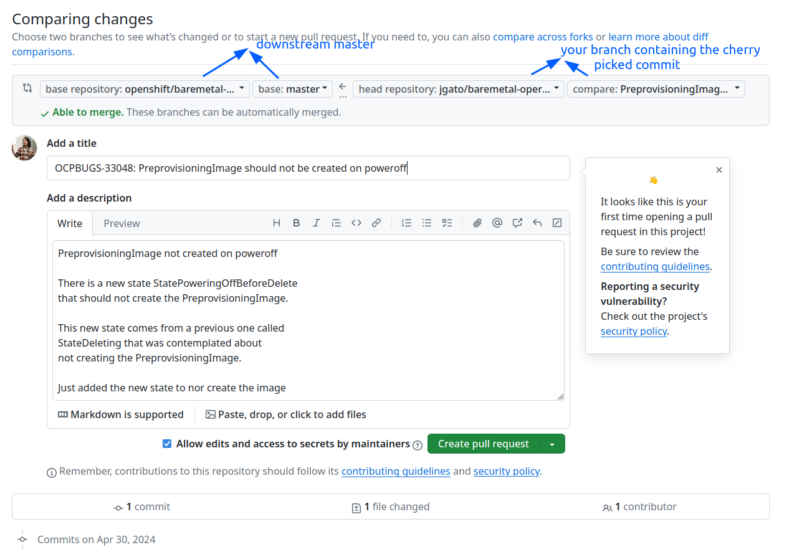

Set the Jira ticket target to the release-4.y version

It is very important to have the PR correctly linked with the bug. And this properly set. If not you will receive a not-valid-bug. To have this correctly set provides automatic integration in the next steps. 

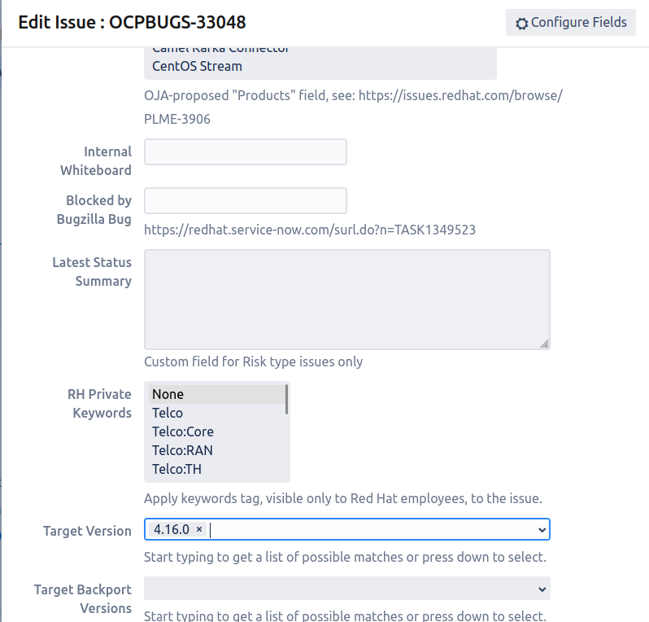

you will get reviewers and valid reference to the bug:

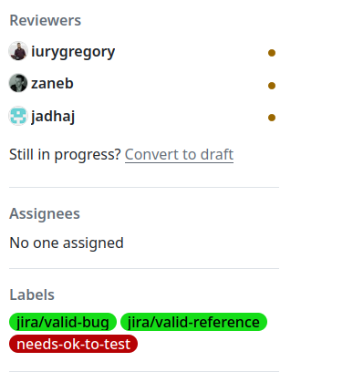

notice how your bug has been automatically moved to a new POST stage:

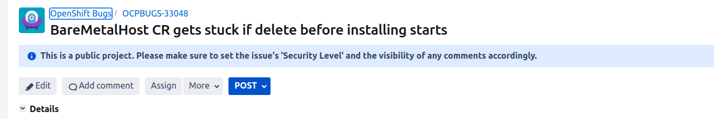

## Get the PR accepted on downstream

When you have the ok-to-test, a battery of test will be executed. 


When passed, and you have the ok from reviewers(/lgtm), the PR is accepted and merged.
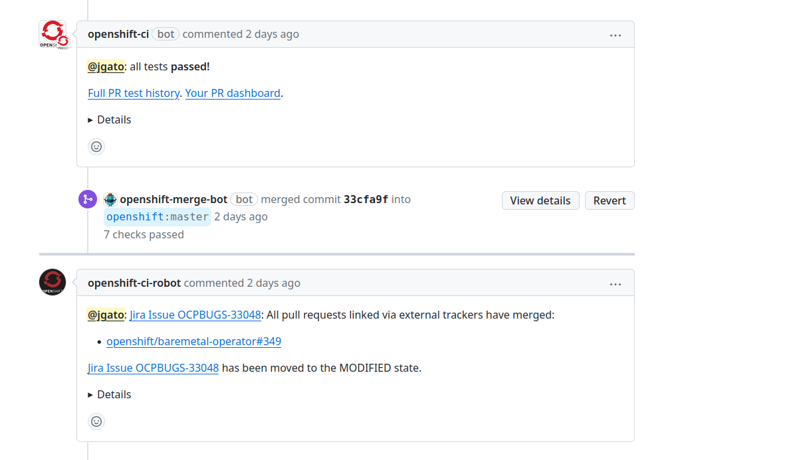

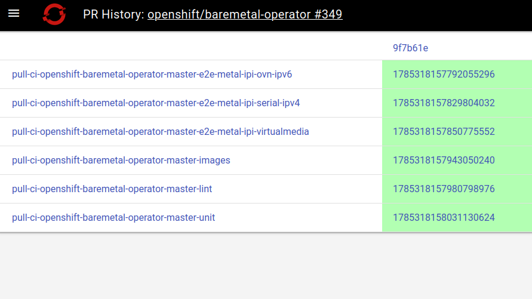

The bug is also automatically moved to ON_QA, demonstrating the integration with Github.

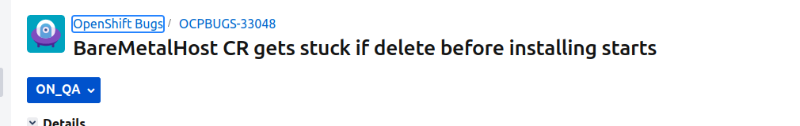

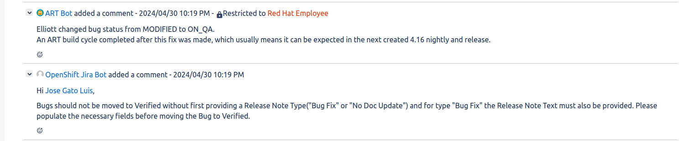

When merged, the PR is included into night builds that will be tested and accepted by the QA team:

You also receive a notification about when it will be available. In Github you see:

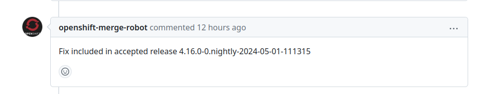

And in Jira you see:

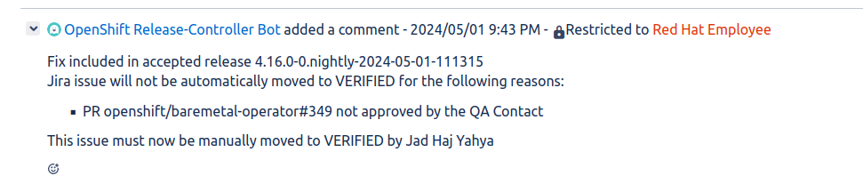

The QA team will now, not just test your changes, but also the whole integrated release. If the but no long happens, it will be `verified`.

### Testing your nightly build

You can check the nightly build created on Openshift release stream, with the tool:

https://amd64.ocp.releases.ci.openshift.org/

After some search you will find your build:

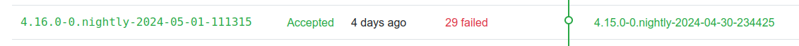

https://amd64.ocp.releases.ci.openshift.org/releasestream/4.16.0-0.nightly/release/4.16.0-0.nightly-2024-05-01-111315

There you can see all the news for that nightly build, including our fix:

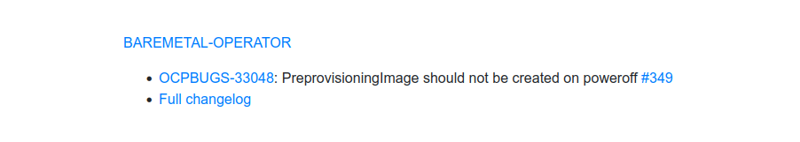

#### Access the nightly build image on `registry.ci`

This registry requires special perms that are not included in your usual `pull-secret`.  So, first obtain an API token by visiting https://oauth-openshift.apps.ci.l2s4.p1.openshiftapps.com/oauth/token/request and login
 

```bash
> oc login --token=sha256~<TOKEN> --server=https://api.ci.l2s4.p1.openshiftapps.com:6443
```

Then, you can save the credentials to your existing pull-secret:

```
> oc registry login --registry-config ~/.config/containers/auth.json 
> cat ~/.config/containers/auth.json | grep registry.ci -A 2
		"registry.ci.openshift.org": {
			"auth": "<TOKEN>"
		},


```

Now, you can access to the image:

```
>  oc adm release info  registry.ci.openshift.org/ocp/release:4.16.0-0.nightly-2024-05-01-111315
Name:           4.16.0-0.nightly-2024-05-01-111315
Digest:         sha256:eeb02c62d7ec73433e31de1aca03270fdc0ccaadefc46163e9983153f5270462
Created:        2024-05-01T11:14:56Z
OS/Arch:        linux/amd64
Manifests:      733
Metadata files: 1

Pull From: registry.ci.openshift.org/ocp/release@sha256:eeb02c62d7ec73433e31de1aca03270fdc0ccaadefc46163e9983153f5270462

Release Metadata:
  Version:  4.16.0-0.nightly-2024-05-01-111315
  Upgrades: <none>
  Metadata:

Component Versions:
  kubectl          1.29.1                
  kubernetes       1.29.4                
  kubernetes-tests 1.29.0                
  machine-os       416.94.202405010033-0 Red Hat Enterprise Linux CoreOS

Images:
  NAME                                           DIGEST
  agent-installer-api-server                     sha256:f59fb87a9f6583bb772f48cc171eb7d915c11b8d69862a1dc553d95a96321214
  agent-installer-csr-approver                   sha256:31c6c4b2640ccf2d9906f9a852cea649b6d71cdc64e32713721136b5d00413bd
  agent-installer-node-agent                     sha256:e7d77d7615da44e2e302e4ea0b9f502076d4902cb794ba32f803238bd91f03a6
  agent-installer-orchestrator                   sha256:65c3cffa769f664bc3f181fb9cf48ef29255da52fe62a42e5b7bba4540f8a758

```


> Eventually, the registry.ci token expires, so you will have to update it with a new login token

If you still receives an unathorized answer, try the oc command with `--registry-config ~/.config/containers/auth.json`. The auth.json contains your previous gained authorization. 

#### Try the image with the Agent Based installer

From the previous [tool](https://amd64.ocp.releases.ci.openshift.org/releasestream/4.16.0-0.nightly/release/4.16.0-0.nightly-2024-05-01-111315) you have an option to download the installer:

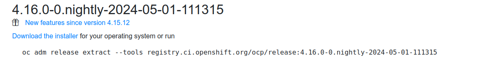

Or use `adm` command to generate the installer.

```bash
> oc adm release extract --tools registry.ci.openshift.org/ocp/release:4.16.0-0.nightly-2024-05-01-111315 --registry-config ~/.config/containers/auth.json
> ls -l
total 480920
-rwxr-xr-x. 1 jgato jgato  35909338 abr 30 02:07 ccoctl-linux-4.16.0-0.nightly-2024-05-01-111315.tar.gz
-rwxr-xr-x. 1 jgato jgato  66770163 may  1 01:14 openshift-client-linux-4.16.0-0.nightly-2024-05-01-111315.tar.gz
-rwxr-xr-x. 1 jgato jgato 389739326 may  1 11:57 openshift-install-linux-4.16.0-0.nightly-2024-05-01-111315.tar.gz
-rw-r--r--. 1 jgato jgato     32562 may  6 09:22 release.txt
-rw-r--r--. 1 jgato jgato       462 may  6 09:22 sha256sum.txt

```

#### Try out using ZTP and Assisted Installer

You can create a `clusterImagetSet`pointing to the nightly build, to be used from a Siteconfig:

```yaml
> oc get clusterimagesets.hive.openshift.io img4.16.0-0.nightly-2024-05-01-111315 -o yaml
apiVersion: hive.openshift.io/v1
kind: ClusterImageSet
metadata:
  creationTimestamp: "2024-05-03T15:45:12Z"
  generation: 1
  labels:
    channel: fast
    visible: "true"
  name: img4.16.0-0.nightly-2024-05-01-111315
  resourceVersion: "11197666"
  uid: 910964ab-b2c7-4b6c-a2f9-91da037f2898
spec:
  releaseImage: registry.ci.openshift.org/ocp/release:4.16.0-0.nightly-2024-05-01-111315
```


```yaml
---
apiVersion: ran.openshift.io/v1
kind: SiteConfig
metadata:
  name: "multinode-1"
  namespace: "multinode-1"
spec:
  baseDomain: "spoke-mno.el8k.se-lab.eng.rdu2.dc.redhat.com"
  pullSecretRef:
    name: "assisted-deployment-pull-secret"
  clusterImageSetNameRef: "img4.16.0-0.nightly-2024-05-01-111315"
<REDACTED>
```

> Notice the image is download from `registry.ci.openshift.org` which requires special perms and pull-secret.


#### Check the operator contains the fix

Because, in this example, we are using a cluster operator that installs other operators, maybe the answer is more complex. 

In this case what I did was, after having the cluster deployed:

```bash
> oc get clusterversions.config.openshift.io 
NAME      VERSION       AVAILABLE   PROGRESSING   SINCE   STATUS
version   4.16.0-rc.2   True        False         163m    Cluster version is 4.16.0-rc.2

```

To get all the images used by the cluster operator:

```bash
> oc -n openshift-machine-api get cm cluster-baremetal-operator-images -o yaml                                                                                                                                   
apiVersion: v1                                                                                                                                                                                                      
data:                                                                                                                                                                                                                 images.json: |                                                                                                                                                                                                    
    {                                                                                                                                                                                                               
      "clusterBaremetalOperator": "quay.io/openshift-release-dev/ocp-v4.0-art-dev@sha256:de8bd415ac0f3692844ab009fe6cd50e74f11e48ba5c15de4877c849faa74f3b",                                                         
      "kubeRBACProxy": "quay.io/openshift-release-dev/ocp-v4.0-art-dev@sha256:0954a53fe830d4c49ffdced2beb2461f92f305d8d72b003f7fd54e990ee42868",                                                                    
      "baremetalOperator": "quay.io/openshift-release-dev/ocp-v4.0-art-dev@sha256:b304daeb0f1d28b246f387d072075df577e48bbb431be1f42b8790968bd24bf8",                                                                
      "baremetalIronic": "quay.io/openshift-release-dev/ocp-v4.0-art-dev@sha256:2a1a54da91003180c8edc97187a93aec3c0a0027be005914c5dc210c350d1c8c",                                                                  
      "baremetalMachineOsDownloader": "quay.io/openshift-release-dev/ocp-v4.0-art-dev@sha256:c7882c5cd360a424d7f78f72840554c5852c6743bc4bfb7951235466b25605d9",
      "baremetalStaticIpManager": "quay.io/openshift-release-dev/ocp-v4.0-art-dev@sha256:c29e2e59bb9d522c9ffdc0265b66556e4b55726445250da80e9da9c3ee6d9b03",
      "baremetalIronicAgent": "quay.io/openshift-release-dev/ocp-v4.0-art-dev@sha256:5e082dfe445b4e7e763c76b7e6a8089f1cd3f8f6a1a770187fc2fb780bbb87ec",
      "imageCustomizationController": "quay.io/openshift-release-dev/ocp-v4.0-art-dev@sha256:b716bb38f2f073e2e6e0bedd73c465114fcf22eee875949a43dfcb7d29482632",
      "machineOSImages": "quay.io/openshift-release-dev/ocp-v4.0-art-dev@sha256:796ecb84d6f0ee8d51215e1eae2c9646cac312220309c583daf7714bce5f0796"
    }

```

Take the one for baremetalOperator and:

```bash

> skopeo inspect --no-tags docker://${IMAGE} --authfile ~/.config/containers/auth.json | grep "io.openshift.build.commit.id" |  awk '{print $2}' | awk -F '"' '{print $2}' 
3df2ece805a50a5988fc1c213b5f2e321f1c3d2a
```

My PR accepted with the commit [ce4b79df8ad374d9f2079b18b678ff301ce395be](https://github.com/metal3-io/baremetal-operator/commit/ce4b79df8ad374d9f2079b18b678ff301ce395be). So, we can check if this commit is previous to the last one included in the built using during the installation.

```bash
> git log -1 3df2ece805a50a5988fc1c213b5f2e321f1c3d2a
commit 3df2ece805a50a5988fc1c213b5f2e321f1c3d2a
Merge: 33cfa9fcf 2cf380ef1
Author: openshift-merge-bot[bot] <148852131+openshift-merge-bot[bot]@users.noreply.github.com>
Date:   Tue May 7 15:12:27 2024 +0000

    Merge pull request #335 from zaneb/revert-default-webhook-port
    
    NO-ISSUE: Revert "downstream-only: Disable webhooks"
> git log -1 ce4b79df8ad374d9f2079b18b678ff301ce395be
commit ce4b79df8ad374d9f2079b18b678ff301ce395be (HEAD -> main)
Merge: aaa95a16d d2d700e73
Author: metal3-io-bot <55852648+metal3-io-bot@users.noreply.github.com>
Date:   Tue Apr 30 01:30:18 2024 +0300

    Merge pull request #1702 from jgato/PreprovisioningImage-poweroff
    
    🐛  PreprovisioningImage should not be created on poweroff before delete

```

It looks good, the last included commit is newer than the one with my fix. 

## Bug fix verifed

After QA finishes to verify that bug no longer happens, the jira ticket is marked as verified:

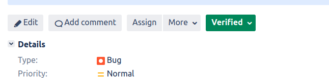

In this case, the code was on time before of a new minor release of OCP, with OCP4.16. So, there is no need of publishing an errata.

Before verified, you have to set the release-notes. 

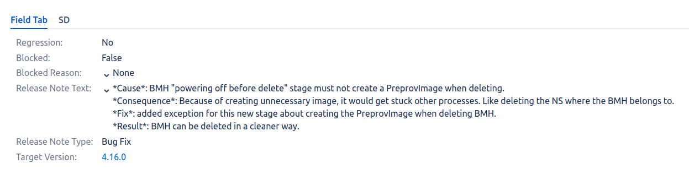

Later, the backport, that will make a clone on the Jira ticket, will complain if there are no release-notes. 

## Trigger backports

With the Bug verified, you can trigger the backport, doing the `cherry-pick`over the other branches. In this case, the original PR was on time to be included on `release-4.16`, so the backport will be done for `release-4.15` and `release-4.14`. 

> On Openshift the backport are done on "cascade". So, the `release-4.15` backport is done over the PR original. The `release-4.14` needs to be done over the PR backport for `release-4.15. So, first you have to get the verification on 4.15, have the release notes, and proceed with the verification on 4.14. 

The command can be done on GitHub over the original PR, something like this:

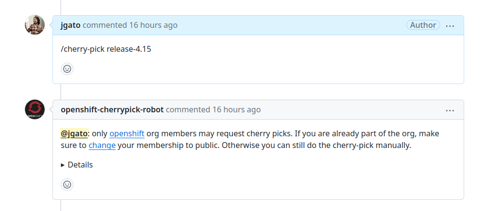

But I fear I have not enough perms. So, I asked a colleague to just trigger it for me. 
Or, you can manually do the `cherry-pick`:
 * git checkout of `release-4.15` and create a new branch form there
 * make the cherry-pick on the commit with the fix
 * push and do a PR of your branch into `release-4.15`

Finally, in the PR, do a `/jira cherrypick OCPBUGS-ID`, this last will create the Jira Ticket as a clone of the original one. This links will enable also the different CI actions.

The backport will need the usual labels and tests passed, but also, an extra label `backport-risk-assessed` from the assigned person from QA


