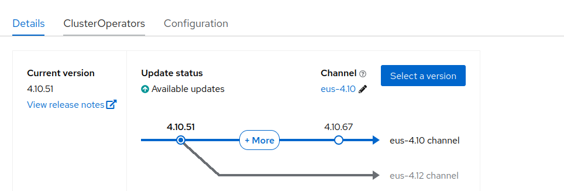

# EUS to EUS Openshift upgrade

Just following and testing the [official documentation](https://docs.openshift.com/container-platform/4.10/updating/preparing-eus-eus-upgrade.html)

I have my cluster with OCP4.10 EUS channel:



and I can move to eus-4.12:


According to the doc, we first pause any MCP. We will move first to 4.11 and then to 4.12. Pausing MCP, will save the reboot in the middle (4.11) upgrade, in all the "workers*".

```bash
[jgato@provisioner ~]$ oc get mcp
NAME     CONFIG                                             UPDATED   UPDATING   DEGRADED   MACHINECOUNT   READYMACHINECOUNT   UPDATEDMACHINECOUNT   DEGRADEDMACHINECOUNT   AGE
ht       rendered-ht-9f169d809085c1323d092fb5746b72e0       True      False      False      1              1                   1                     0                      6d4h
master   rendered-master-004b725d034b8d863f6245ad529ef2cd   True      False      False      3              3                   3                     0                      6d4h
std      rendered-std-062532295c85773c2d9f433706460d1a      True      False      False      0              0                   0                     0                      6d4h
worker   rendered-worker-297b571a17df085f4a2bf28c0b40437c   True      False      False      2              2                   2                     0                      6d4h
[jgato@provisioner ~]$  oc patch mcp/worker --type merge --patch '{"spec":{"paused":true}}'
machineconfigpool.machineconfiguration.openshift.io/worker patched
[jgato@provisioner ~]$  oc patch mcp/std --type merge --patch '{"spec":{"paused":true}}'
machineconfigpool.machineconfiguration.openshift.io/std patched
[jgato@provisioner ~]$  oc patch mcp/ht --type merge --patch '{"spec":{"paused":true}}'
machineconfigpool.machineconfiguration.openshift.io/ht patched
```

and now we proceed with the upgrade. First time, it will do the upgrade 4.y+1. So, from 4.10, to 4.11

```bash
$ oc get clusterversions.config.openshift.io 
NAME      VERSION   AVAILABLE   PROGRESSING   SINCE   STATUS
version   4.10.51   True        False         6d3h    Cluster version is 4.10.51
$ oc adm upgrade --to-latest
Updating to latest version 4.11.50

```

you can see how the upgrade on non-master nodes is paused:


After the first upgrade finished:

```bash
[jgato@provisioner ~]$ oc get clusterversion 
NAME      VERSION   AVAILABLE   PROGRESSING   SINCE   STATUS
version   4.11.50   True        False         15h     Cluster version is 4.11.50
[jgato@provisioner ~]$ oc get nodes
NAME                               STATUS   ROLES       AGE     VERSION
master-0.el8k-ztp-1.hpecloud.org   Ready    master      6d20h   v1.24.16+6981c04
master-1.el8k-ztp-1.hpecloud.org   Ready    master      6d20h   v1.24.16+6981c04
master-2.el8k-ztp-1.hpecloud.org   Ready    master      6d20h   v1.24.16+6981c04
worker-0.el8k-ztp-1.hpecloud.org   Ready    ht,worker   6d20h   v1.23.12+8a6bfe4
worker-1.el8k-ztp-1.hpecloud.org   Ready    worker      6d20h   v1.23.12+8a6bfe4
worker-2.el8k-ztp-1.hpecloud.org   Ready    worker      6d20h   v1.23.12+8a6bfe4

```

Clusterversion is on '4.11.50', but all the nodes are not in the same version. This is oka.

Now, lets proceed with the next step. I had to follow the [steps](https://access.redhat.com/articles/6955381) to ensure the removal APIs dont affect my cluster. Anyway, the cluster is just for testing, and there are no workloads:

```bash
$ oc adm upgrade --to-latest
Updating to latest version 4.12.39

```

After the upgrade:

```bash
$ oc get clusterversions.config.openshift.io 
NAME      VERSION   AVAILABLE   PROGRESSING   SINCE   STATUS
version   4.12.39   True        False         97m     Cluster version is 4.12.39
$ oc get nodes
NAME                               STATUS   ROLES       AGE     VERSION
master-0.el8k-ztp-1.hpecloud.org   Ready    master      7d      v1.25.14+20cda61
master-1.el8k-ztp-1.hpecloud.org   Ready    master      6d23h   v1.25.14+20cda61
master-2.el8k-ztp-1.hpecloud.org   Ready    master      7d      v1.25.14+20cda61
worker-0.el8k-ztp-1.hpecloud.org   Ready    ht,worker   6d23h   v1.23.12+8a6bfe4
worker-1.el8k-ztp-1.hpecloud.org   Ready    worker      6d23h   v1.23.12+8a6bfe4
worker-2.el8k-ztp-1.hpecloud.org   Ready    worker      6d23h   v1.23.12+8a6bfe4

```

We can see we have upgraded OCP 4.y to 4.y+2, but the non-master nodes are still two versions behind. We will MCP one after one, this will do a reboot of each node to reboot with a new RHCOS version:

```bash
$  oc patch mcp/ht --type merge --patch '{"spec":{"paused":false}}'
machineconfigpool.machineconfiguration.openshift.io/ht patched

```
After node reboot, the new node is in the same version as masters

```bash
$ oc get nodes
NAME                               STATUS   ROLES       AGE    VERSION
master-0.el8k-ztp-1.hpecloud.org   Ready    master      7d1h   v1.25.14+20cda61
master-1.el8k-ztp-1.hpecloud.org   Ready    master      7d     v1.25.14+20cda61
master-2.el8k-ztp-1.hpecloud.org   Ready    master      7d1h   v1.25.14+20cda61
worker-0.el8k-ztp-1.hpecloud.org   Ready    ht,worker   7d     v1.25.14+20cda61
worker-1.el8k-ztp-1.hpecloud.org   Ready    worker      7d     v1.23.12+8a6bfe4
worker-2.el8k-ztp-1.hpecloud.org   Ready    worker      7d     v1.23.12+8a6bfe4

```

We un-pause the workers:
```bash
$  oc patch mcp/worker --type merge --patch '{"spec":{"paused":false}}'
machineconfigpool.machineconfiguration.openshift.io/worker patched

$ oc get nodes 
NAME                               STATUS                        ROLES       AGE    VERSION
master-0.el8k-ztp-1.hpecloud.org   Ready                         master      7d1h   v1.25.14+20cda61
master-1.el8k-ztp-1.hpecloud.org   Ready                         master      7d1h   v1.25.14+20cda61
master-2.el8k-ztp-1.hpecloud.org   Ready                         master      7d1h   v1.25.14+20cda61
worker-0.el8k-ztp-1.hpecloud.org   Ready                         ht,worker   7d1h   v1.25.14+20cda61
worker-1.el8k-ztp-1.hpecloud.org   Ready                         worker      7d1h   v1.25.14+20cda61
worker-2.el8k-ztp-1.hpecloud.org   NotReady,SchedulingDisabled   worker      7d1h   v1.23.12+8a6bfe4


```

just one more reboot and:

```bash
$ oc get nodes 
NAME                               STATUS   ROLES       AGE    VERSION
master-0.el8k-ztp-1.hpecloud.org   Ready    master      7d1h   v1.25.14+20cda61
master-1.el8k-ztp-1.hpecloud.org   Ready    master      7d1h   v1.25.14+20cda61
master-2.el8k-ztp-1.hpecloud.org   Ready    master      7d1h   v1.25.14+20cda61
worker-0.el8k-ztp-1.hpecloud.org   Ready    ht,worker   7d1h   v1.25.14+20cda61
worker-1.el8k-ztp-1.hpecloud.org   Ready    worker      7d1h   v1.25.14+20cda61
worker-2.el8k-ztp-1.hpecloud.org   Ready    worker      7d1h   v1.25.14+20cda61

```

everything on the same version.