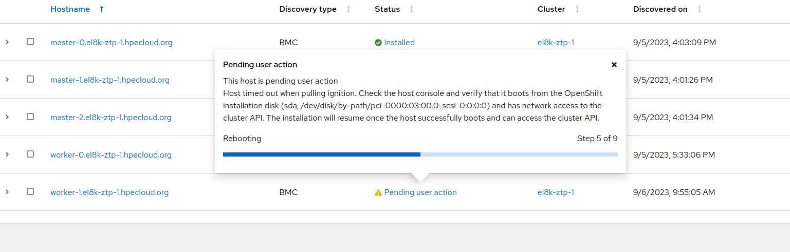

*This is just an experiment to reproduce a know issue, and to test a possible solution. More here: 
https://issues.redhat.com/browse/OCPBUGS-18189
https://github.com/coreos/coreos-installer/pull/554 *

# Forcing networking configuration adding nodes on day-2 (ZTP and Assisted Installer)

Context and background. When you have a cluster installed by the Assisted Installer, you will give the Networking configuration. This is used on the discovery phase, and phased to the rhcos installer for the next phase. 

In this next (installation) phase the networking configuration is propagated to the installing node. Unless, there exists something on folders of the `/etc/NetworkManager`. The [script that checks this](https://github.com/coreos/ignition/blame/c8c631a2b7a7bf10f7b5b1cb037b6d3e2608c909/dracut/30ignition/coreos-teardown-initramfs.sh#L46C1-L63C2)

Therefore, on an existing cluster, for some reason, on day-2 you make some networking tuning. Maybe small changes. But this affects to the MCP of Workers or Masters. Then, if you try to install new nodes of these roles, they will receive an Ignition file with these changes. The previous script detects this files, and assumes that: if there are files on the NetworkManager dir, these are the networking configuration. That would be the case, but in our scenarios, these are just small tweaks. 

In theory, we should be able to force to propagate the discovery phase AI networking configuration. No matter what the installer finds in these directories. More about this feature:
 * https://github.com/coreos/coreos-installer/pull/554
 * https://github.com/coreos/fedora-coreos-config/pull/1045
 * https://github.com/coreos/fedora-coreos-tracker/issues/853

The experiment will consist on:
 * Create a compact cluster (baremetal) + 1 worker
 * Create a MC for workers with small network changes
 * Try to add a new Worker node
 * It should fail because of lack of network configuration
 * Try to install it forcing to propagate initial network configuration
 
 ## Environment
 
We already have a cluster created as a compact cluster. With all the Policies/Configuration done correctly.


After that, we added a new extra worker on day-2. This worker was added without problems. And it receives the network configuration based on its role in the cluster.


On day-2, we decide to include a new configuration (with a MC) that creates a dummy connection on our worker. This will do nothing. We are just forcing the expected issue. 

```yaml
piVersion: machineconfiguration.openshift.io/v1
kind: MachineConfig
metadata:
  labels:
    machineconfiguration.openshift.io/role: worker
  name: 50-network-dumy
spec:
  config:
    ignition:
      version: 3.2.0
    storage:
      files:
      - contents:
          source: data:text/plain;charset=utf-8;base64,W2Nvbm5lY3Rpb25dCmlkPWR1bW15LWR1bW15MAp1dWlkPWRkMzZjN2ZjLTgyZWMtNDk4Ny1iYzVmLTQxMDc2MDJmZGM1Mgp0eXBlPWR1bW15CmF1dG9jb25uZWN0PWZhbHNlCmludGVyZmFjZS1uYW1lPWR1bW15MAp0aW1lc3RhbXA9MTY5MzkxMDY5MwoKW2R1bW15XQoKW2lwdjRdCm1ldGhvZD1kaXNhYmxlZAoKW2lwdjZdCmFkZHItZ2VuLW1vZGU9ZGVmYXVsdAptZXRob2Q9ZGlzYWJsZWQKCltwcm94eV0K
          verification: {}
        mode: 420
        path: /etc/NetworkManager/system-connections/dummy-dummy0.nmconnection

```

The MC will place a dummy.connection file on `/etc/NetworkManager/system-connections/dummy-dummy0.nmconnection`

```bash
sh-4.4# ls /etc/NetworkManager/system-connections/dummy-dummy0.nmconnection 
/etc/NetworkManager/system-connections/dummy-dummy0.nmconnection
```

Which it does nothing, and it is not even connected.

After having tweaking the network for workers, we will proceed to install a new worker node. In this case, we are using ZTP and Assisted Installer.

## Brief installation procedure

During a normal AI installation procedure, these are (very briefly) the different steps done (more details can be seen [here](https://github.com/jgato/jgato/blob/main/random_docs/RHCOS-boot-process-RHACM-AI.md)):

1- There is a discovery phase, where nodes are discovered, checked requirements and this will initiate the installation. This is done with a reboot, that will start RHCOS, together with an Ignition file that configures the node and starts the installation. In this phase, the network is configured regarding your ZTP settings. And this network configuration is copied to the next phase.


 2- The server reboot with RHCOS, using the previously copied network (we can consider this as a temporal networking configuration). With this network configuration, it downloads the Ignition file (in this case for Worker) and the node is configured.

 3- The node start using the configuration from "Real Root" coming in the ignition. But, it will propagate the networking from the discovery phase into the "Real Root". Or, from the temporal Initramfs, into the local `/sys/root`
 4 - The node ends the start-up and initiate the OCP installaton. 
 
 
 
 4- This cleans, among other things, the files from --copy-network in '/mnt/boot-partition/coreos-firstboot-network'  In this moment, NetworkManager is still working with the temporal files from '/run/NetworkManager'

which is a [directory checked during the server installation phase](https://github.com/coreos/ignition/blame/c8c631a2b7a7bf10f7b5b1cb037b6d3e2608c909/dracut/30ignition/coreos-teardown-initramfs.sh#L46C1-L63C2). If the directory is not empty, it does not prop

## Node installation fails

The new node starts the installation. In RHACM we can observe how the discovery phase happens correctly.


After discovery phase, it reboots, and after a time we see the message:



The message:

```
This host is pending user action
Host timed out when pulling ignition. Check the host console and verify that it boots from the OpenShift installation disk (sda, /dev/disk/by-path/pci-0000:03:00.0-scsi-0:0:0:0) and has network access to the cluster API. The installation will resume once the host successfully boots and can access the cluster API.
```

It is, in some way, confusing. The AI dont receive any communication after reboot, so it is not clear what happened. It could be not booting from the proper disk, or there is no network acces. The part about the ignition is confusing, because actually it pulled correctly the ignition.

## Troubleshooting the installation fail

As we explained above, after the reboot, several steps have been done. We will focus on what happened with the network. 

Looking to the journal logs, inside the host, we can see that in a very start stage it is using the networking configuration from the Discovery Phase:

```
Aug 30 13:26:16 localhost systemd[1]: Starting CoreOS Enable Network...
Aug 30 13:26:16 localhost systemd[1]: Started CoreOS Enable Network.
Aug 30 13:26:16 localhost systemd[1]: Starting Ignition (fetch)...
Aug 30 13:26:16 localhost systemd[1]: Starting Copy CoreOS Firstboot Networking Config...

Aug 30 13:26:17 localhost coreos-copy-firstboot-network[2456]: info: copying files from /mnt/boot_partition/coreos-firstboot-network to /run/NetworkManager/system-connections/

```

and it can download the ignition file:

```
Aug 30 13:26:27 localhost.localdomain ignition[2887]: INFO     : Ignition 2.14.0
Aug 30 13:26:27 localhost.localdomain ignition[2887]: INFO     : Stage: files
<REDACTED>
Aug 30 13:26:27 localhost.localdomain ignition[2887]: INFO     : files: ensureUsers: op(1): [finished] creating or modifying user "core"
Aug 30 13:26:27 localhost.localdomain ignition[2887]: INFO     : files: ensureUsers: op(2): [started]  adding ssh keys to user "core"
Aug 30 13:26:27 localhost.localdomain ignition[2887]: INFO     : files: ensureUsers: op(2): [finished] adding ssh keys to user "core"
Aug 30 13:26:27 localhost.localdomain ignition[2887]: INFO     : files: createFilesystemsFiles: createFiles: op(3): [started]  writing file "/sysroot/etc/chrony.conf"
Aug 30 13:26:27 localhost.localdomain ignition[2887]: INFO     : files: createFilesystemsFiles: createFiles: op(3): [finished] writing file "/sysroot/etc/chrony.conf"
...
...
```

But in some moment the network configuration is not propagated from the Discovery Phase to the Real Root:


This is what we were trying to confirm. Network is not propagated, and this is caused because [NetworkManager dirs](https://github.com/coreos/ignition/blame/c8c631a2b7a7bf10f7b5b1cb037b6d3e2608c909/dracut/30ignition/coreos-teardown-initramfs.sh#L46C1-L63C2) were not empty. And these were not empty, because of the MC we created that placed (as an example) a dummy interface there.

Therefore, any kind of tune/tweak modification on this directories will break the installation of nodes on day-2. MachineConfigOperator needs to be used with care, because it can modifies the system with unexpected scenarios by the user. In this case, an small change should not break the installation. But, the script that triggers the network configuration propagation only checks emptiness of some directories. Supposing, that if directory is not empty, it is because the real network configuration is there. And here is not the case.

## Solution: forcing merge between network configurations

According to [this]() RHCOS feature, it should be possible to merge the configurations in the Real Root, to what it comes from the Initramfs. That it should should this kind of scenarios. Where, we did small networking changes (day-2), that we want to keep, but we need the networking configured in our cluster definition for installations (day-0). 
