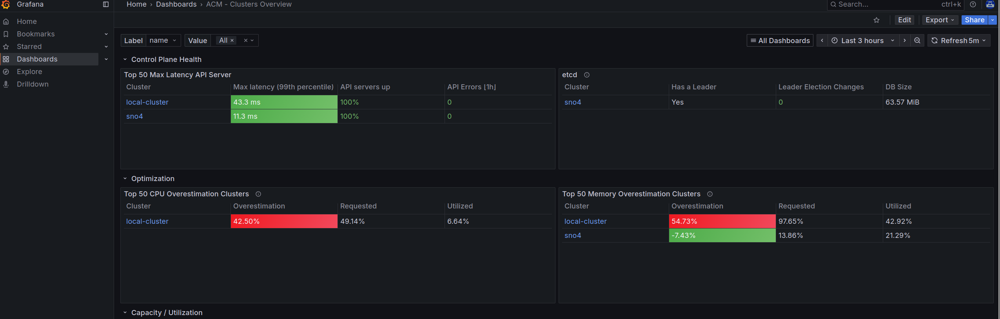

# Creating a Hub as an HostedControlPlane with Openshift virtualization

>Warning: this is a quick tutorial on how to create a Hub with a cluster created with HostedControlPlane and Openshift Virtualization

Some concepts about what we want to do:
 * Management cluster: basically an Openshift cluster that manages other clusters.
 * A hub: it is basically a management cluster with an specific configuration or combination of operators. Like the [Telco Hub](https://docs.redhat.com/en/documentation/openshift_container_platform/4.21/html/scalability_and_performance/telco-hub-ref-design-specs)
 * HostedControlPlane (HCP) or Hypershift: you create new clusters, where the usual control planes as pods on a management cluster without the need for dedicated virtual or physical machines for each control plane. And the workers can be created from different providers. In the case of this tutorial: virtual machines.
 * Openshift Virtualization to provide the infrastructure as VMS
 
So, the architecture will be:

```
┌──────────────────────────────────────────────────┐
│       Regular Compact Management Cluster         │
│   (Telco Hub + OCP Virtualization + MetalLB)     │
└─────────────────────┬────────────────────────────┘
                      │
            HCP + OpenShift Virtualization
                      │
                      ▼
          ┌──────────────────────────────┐
          │      HCP Compact Cluster     │
          └────┬──────────┬──────────┬───┘
               │          │          │
               ▼          ▼          ▼
         ┌─────────┐ ┌─────────┐ ┌─────────┐
         │  sno1   │ │  sno2   │ │  sno3   │
         └─────────┘ └─────────┘ └─────────┘
         (baremetal) (baremetal) (baremetal)
```
 
 The regular compact management cluster it is just a our usual Telco Hub + Openshift Virtualization + Metallb
 
# create the HCP Compact

## Using HCP cli

From the management cluster, download the [HCP cli](https://docs.redhat.com/en/documentation/openshift_container_platform/4.21/html/hosted_control_planes/preparing-to-deploy-hosted-control-planes#hcp-cli-console_hcp-cli)
An hcp cluster is created with hcp cli

```
> hcp create cluster kubevirt   --name hcp-2   --node-pool-replicas 3   
	\--pull-secret /home/jgato/.config/containers/auth.json   
	\--memory 16Gi   --cores 8   --etcd-storage-class=ocs-storagecluster-cephfs   
	\--arch amd64   --release-image quay.io/openshift-release-dev/ocp-release:4.21.0-multi
```

## Using Manifests


## Install the hub usual operators

Install:
 * ACM/MCE
 * Openshift GitOps
 * TALM
 * Metallb
ODF is not needed, because it is exported from the management cluster. Neither the local-storage operator


## Enabling the baremetal operator


By default the HCP hosted cluster is created with BMO disabled:

Edit:
```
oc edit clusterversions.config.openshift.io version 
```

to enable Baremetal capability.

It should be enabled when creating the HCP (to try next time).

when enabled:

```
> oc -n openshift-machine-api get pod
NAME                                                        READY   STATUS    RESTARTS   AGE
cluster-baremetal-operator-hostedcluster-5669fc4f78-jgwqk   1/1     Running   0          5m41s

```

Then, in the hosted cluster create:

```
apiVersion: v1
kind: Service
metadata:
  name: nodeport-svc
  namespace: openshift-machine-api
spec:
  type: NodePort
  selector:
    baremetal.openshift.io/cluster-baremetal-operator: metal3-state
  ports:
  - name: http
    protocol: TCP
    port: 6180
    targetPort: 6180
    nodePort: 30701
  - name: vmedia-https
    protocol: TCP
    port: 6183
    targetPort: 6183
    nodePort: 30702
  - name: ironic
    protocol: TCP
    port: 6385
    targetPort: 6385
    nodePort: 30703
```


In a Hosted Control Plane setup, Ironic runs inside a guest cluster (hcp-2), not on a node directly reachable by baremetal servers. So there has to be some indirection — a LoadBalancer or NodePort — to bridge the physical server network to the pod network.
Therefore, in the management cluster create LoadBalancer: (configure the nodepool and create it in the NS of the hosted cluster):

```
apiVersion: v1
kind: Service
metadata:
  name: lbsvc
  namespace: clusters-hcp-2
spec:
  type: LoadBalancer
  allocateLoadBalancerNodePorts: false
  ports:
  - name: http
    protocol: TCP
    port: 6180
    targetPort: 30701
  - name: httpd
    protocol: TCP
    port: 6183
    targetPort: 30702
  - name: ironic
    protocol: TCP
    port: 6385
    targetPort: 30703
  selector:
    hypershift.openshift.io/nodepool-name: hcp-2

```

In the hosted cluster the Provisioning:

```
apiVersion: metal3.io/v1alpha1
kind: Provisioning
metadata:
  name: provisioning-configuration
spec:
  provisioningNetwork: Disabled
  externalIPs:
  - 10.6.77.102
  watchAllNamespaces: true  
```

Use the external IP from the created lbsvc (LoadBalancer, from the management cluster)
```
> oc -n clusters-hcp-2 get svc lbsvc
NAME    TYPE           CLUSTER-IP       EXTERNAL-IP   PORT(S)                      AGE
lbsvc   LoadBalancer   172.30.182.160   10.6.77.102   6180/TCP,6183/TCP,6385/TCP   156m

```


Graphically, this is what we are trying to do:

```

    MANAGEMENT CLUSTER (hub-2)
   ┌─────────────────────────────────────────────────────────────────┐
   │                                                                 │
   │   namespace: clusters-hcp-2                                     │
   │  ┌──────────────────────────────────────────────────────────┐   │
   │  │                                                          │   │
   │  │   lbsvc (LoadBalancer)                                   │   │
   │  │   external IP: 10.6.77.102                               │   │
   │  │   ports: 6180 → 30701 / 6183 → 30702 / 6385 → 30703     │   │
   │  │                                                          │   │
   │  └───────────────────────┬──────────────────────────────────┘   │
   │                          │ selector: nodepool hcp-2             │
   └──────────────────────────┼──────────────────────────────────────┘
                              │ routes to NodePorts on hcp-2 workers
                              ▼
    HOSTED CLUSTER (hcp-2) — worker nodes
   ┌─────────────────────────────────────────────────────────────────┐
   │                                                                 │
   │   namespace: openshift-machine-api                              │
   │  ┌──────────────────────────────────────────────────────────┐   │
   │  │  nodeport-svc                                            │   │
   │  │  30701 (http) / 30702 (vmedia-https) / 30703 (ironic)   │   │
   │  └───────────────────────┬──────────────────────────────────┘   │
   │                          │                                      │
   │  ┌───────────────────────▼──────────────────────────────────┐   │
   │  │  metal3 pod                                              │   │
   │  │                                                          │   │
   │  │   metal3-ironic   (10.128.1.130)                         │   │
   │  │   ├─ external_http_url:     https://10.6.77.102:6183     │   │
   │  │   └─ external_callback_url: https://10.6.77.102:6385     │   │
   │  │                                                          │   │
   │  │   /shared/html/redfish/boot-<uuid>.iso  ◄── ISO built    │   │
   │  │                  │          with callback URL embedded    │   │
   │  └──────────────────┼───────────────────────────────────────┘   │
   │                     │                                           │
   └─────────────────────┼───────────────────────────────────────────┘
                         │
            1) BMC fetches ISO via https://10.6.77.102:6183
                         │
                         ▼
    PHYSICAL NETWORK (10.6.x.x)
   ┌─────────────────────────────────────────────────────────────────┐
   │                                                                 │
   │   sno4 — HPE ProLiant e910                                      │
   │   BMC: 10.6.75.176                                              │
   │                                                                 │
   │   ┌─────────────────────────────────────────────────────────┐   │
   │   │  boots inspection ISO via Redfish VirtualMedia          │   │
   │   │                                                         │   │
   │   │  IPA (Ironic Python Agent) starts                       │   │
   │   │                                                         │   │
   │   │  2) calls back to external_callback_url                 │   │
   │   │     https://10.6.77.102:6385  ──────────────────────────┼───┼──► lbsvc
   │   │                                                         │   │    → NodePort 30703
   │   └─────────────────────────────────────────────────────────┘   │    → metal3-ironic :6385
   │                                                                 │
   └─────────────────────────────────────────────────────────────────┘


```

Now we have BMO configured.

```
> oc -n openshift-machine-api get pod
NAME                                                        READY   STATUS    RESTARTS   AGE
cluster-baremetal-operator-hostedcluster-5669fc4f78-jgwqk   1/1     Running   0          23m
metal3-5fdfd6795b-msxrz                                     3/3     Running   0          8m55s
metal3-baremetal-operator-f9884ddb-wbpt6                    1/1     Running   0          8m55s
metal3-image-customization-c99865f56-jb6zl                  1/1     Running   0          8m52s

```

The assisted service is running:

```
> oc -n multicluster-engine get pod assisted-service-fc976457f-2xfbx
NAME                               READY   STATUS    RESTARTS        AGE
assisted-service-fc976457f-2xfbx   2/2     Running   200 (20m ago)   16h

```

Siteconfig operator has been enabled in the MCH:

```
> oc -n open-cluster-management get pod siteconfig-controller-manager-55499c95b-wrnzv
NAME                                            READY   STATUS    RESTARTS      AGE
siteconfig-controller-manager-55499c95b-wrnzv   1/1     Running   3 (13h ago)   17h

```

Now, you hosted hub, should be able to allow your usual ZTP/GitOps deployments.

## Enabling observability on a hcp hub

The hosted cluster does not have ODF installed. It just uses like ODF pass-through from the management cluster, to have the StorageClass:

```
> oc get sc
NAME                                   PROVISIONER       RECLAIMPOLICY   VOLUMEBINDINGMODE   ALLOWVOLUMEEXPANSION   AGE
kubevirt-csi-infra-default (default)   csi.kubevirt.io   Delete          Immediate           true                   27h
```

So, the object's bucket storage is created in the management cluster, and accessed "remotely" from the hosted cluster. The hosted cluster (hcp-2) lives inside the management cluster, as it was another cluster. So, it access the management cluster "remotely".

```
> cat <<EOF | oc apply -f -
---
apiVersion: objectbucket.io/v1alpha1
kind: ObjectBucketClaim
metadata:
  name: thanos-hcp-2
  namespace: open-cluster-management-observability
spec:
  bucketName: observability-hcp-2
  storageClassName: openshift-storage.noobaa.io

EOF
```

In order to get the S3 bucket credentials inspect the content of the secret called thanos within the namespace open-cluster-management-observability.

```
> oc -n open-cluster-management-observability get secret thanos-hcp-2 -o yaml
apiVersion: v1
data:
  AWS_ACCESS_KEY_ID: dFBMak9.....WUY=
  AWS_SECRET_ACCESS_KEY: MFZkNlB...E4yL1ExcQ==
kind: Secret
metadata:
  creationTimestamp: "2026-04-14T14:13:05Z"
  finalizers:
  - objectbucket.io/finalizer
  labels:
    app: noobaa
    bucket-provisioner: openshift-storage.noobaa.io-obc
    noobaa-domain: openshift-storage.noobaa.io
  name: thanos-hcp-2
  namespace: open-cluster-management-observability
  ownerReferences:
  - apiVersion: objectbucket.io/v1alpha1
    blockOwnerDeletion: true
    controller: true
    kind: ObjectBucketClaim
    name: thanos-hcp-2
    uid: 40ff696c-f859-4b6f-8239-5403603480b4
  resourceVersion: "152678738"
  uid: 0f47584f-c1c6-4f8b-be5f-4752fc85cef0
type: Opaque

```

Notice: they key/access are base64 encoded. When using them in the secret, decode first.

To access externally (hcp-2) we have to the s3 external route:


```
> oc get route s3 -n openshift-storage
NAME   HOST/PORT                                                            PATH   SERVICES   PORT       TERMINATION       WILDCARD
s3     s3-openshift-storage.apps.hub-2.el8k.se-lab.eng.rdu2.dc.redhat.com          s3         s3-https   reencrypt/Allow   None
```

Now, in the hosted cluster we enable MultiClusterHub Observability.

```bash
# Create the NS
> oc create ns open-cluster-management-observability
namespace/open-cluster-management-observability created

# This secrets contains the S3 connection to the created
# bucket
>  cat <<EOF | oc apply -f -
apiVersion: v1
kind: Secret
metadata:
  name: thanos-object-storage
  namespace: open-cluster-management-observability
type: Opaque
stringData:
  thanos.yaml: |
    type: s3
    config:
      bucket:  "observability-hcp-2"
      endpoint: "s3-openshift-storage.apps.hub-2.el8k.se-lab.eng.rdu2.dc.redhat.com:443"
      insecure: false
      http_config:
        insecure_skip_verify: true
      access_key: "tPLjO...Yln6YF="
      secret_key: "0Vd6Pc...8HN2/Q1q"
EOF

# create a pull-secret
> DOCKER_CONFIG_JSON=`oc extract secret/pull-secret -n openshift-config --to=-`

> oc create secret generic multiclusterhub-operator-pull-secret \
    -n open-cluster-management-observability \
    --from-literal=.dockerconfigjson="$DOCKER_CONFIG_JSON" \
    --type=kubernetes.io/dockerconfigjson
```

and finally, we create the MCO:

```
> cat <<EOF | oc apply -f -
apiVersion: observability.open-cluster-management.io/v1beta2
kind: MultiClusterObservability
metadata:
  name: observability
  annotations:
    mco-disable-alerting: "true"
spec:
  advanced:
    retentionConfig:
      blockDuration: 2h
      deleteDelay: 48h
      retentionInLocal: 24h
      retentionResolutionRaw: 15d
  enableDownsampling: false
  observabilityAddonSpec:
    enableMetrics: true
    interval: 300
  storageConfig:
    alertmanagerStorageSize: 10Gi
    compactStorageSize: 100Gi
    metricObjectStorage:
      key: thanos.yaml
      name: thanos-object-storage
    receiveStorageSize: 25Gi
    ruleStorageSize: 10Gi
    storeStorageSize: 25Gi
    storageClass: kubevirt-csi-infra-default
EOF
```

The MCO Dashboard:

