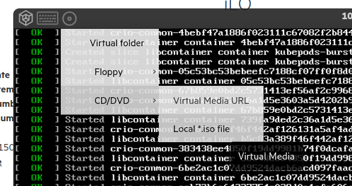
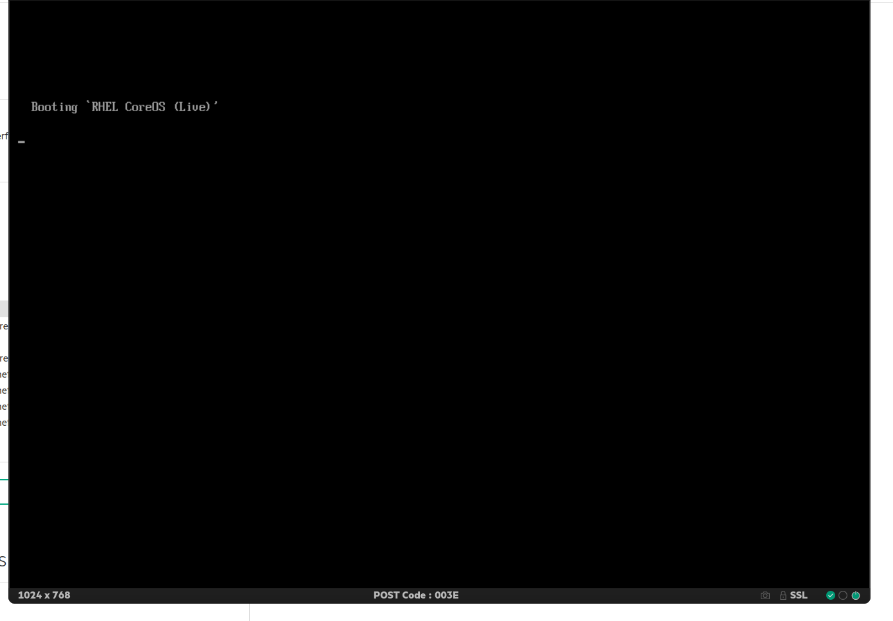
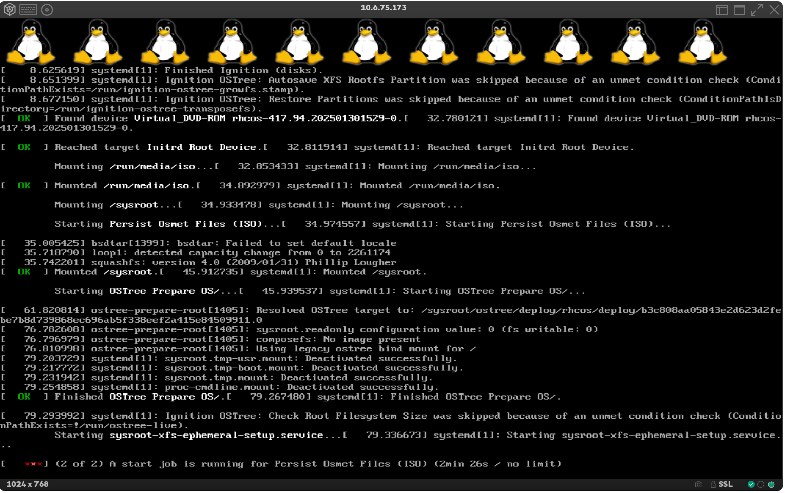

# Quick Openshift installations with Image Base Install

Previously, I talked about [Image Base Upgrade](https://jgato.github.io/jgato/posts/image-base-upgrade/). Based on the same idea, the image used to quickly upgrade Single Node Openshift, can be used to deploy a new SNO. Of course, based on a image created from a seed cluster, that will install other new clusters with the same hardware (or very much similar).


## Initiate the IBI

The starting process is pretty quick and you just need to download the `openshift-install` cli with the version of the target Openshift to be installed. Following my previous blog, I have create a need seed image, this time based on 4.17.17:

```bash
$ bin/4.17.17/openshift-install version
bin/4.17.17/openshift-install 4.17.17
built from commit 8bcf87f80e1803f9ec986dfe099625a088ac2412
release image quay.io/openshift-release-dev/ocp-release@sha256:2c8a2124df0a8c865a3771c49d01bfcb96cadc7f411e23870eb9f8adbe032ec1
WARNING Release Image Architecture not detected. Release Image Architecture is unknown 
release architecture unknown
default architecture amd64

```

We init the process:

```
$ bin/4.17.17/openshift-install image-based create image-config-template --dir live-iso-sno4/
INFO Image-Config-Template created in: live-iso-sno4
```

Then, edit the `image-based-installation-config.yaml` pointing to the seed image, and configuring the network and disk of the new cluster:
```yaml
apiVersion: v1beta1
kind: ImageBasedInstallationConfig
metadata:
  name: installing-from-sno4
seedImage: "quay.io/jgato/sno4:4.17.7"
seedVersion: "4.17.17"
extraPartitionStart: "-240G"
installationDisk: "/dev/nvme0n1"
sshKey: 'ssh-rsa AAAAB3NzaC1yc2EAAAADAQABAAABgQCei2UnkBB9g9DPhu4fpMFKmrlhR9UIYYPet61WF3qr6Rp2LkxEhZtb...VUKnvxZ0Gwajy1Ru+xjrlROFT+761faJHmG5Ev/EdwKHkXHq5EMHgopyiYV7swJEnFzAUzaiu8DP1FYNJyocRvp6AZpbIlyFoabyq+o2yn2Fhny6gs= jgato@provisioner.el8k.hpecloud.org
'
pullSecret: '{"auths": { "quay.io/jgato": { "auth": "amdhdG9AcmVkaGF...jFuX0c2bmE=" } } } '
networkConfig:
  interfaces:
    - name: "eno3"
      macAddress: "94:40:c9:1f:bd:6c"
  config:
    interfaces:
      - name: eno3
        type: ethernet
        state: up
        ipv4:
          enabled: true
          address:
            - ip: 10.6.77.31
              prefix-length: 24
        ipv6:
          enabled: false
    dns-resolver:
      config:
        server:
          - 10.6.77.20
    routes:
      config:
        - destination: 0.0.0.0/0
          next-hop-address: 10.6.77.254
          next-hop-interface: eno3

```

And finally, we will create the image:

```
$ bin/4.17.17/openshift-install image-based create image --dir live-iso-sno4
INFO Adding NMConnection file <eno3.nmconnection> 
INFO Consuming Image-based Installation ISO Config from target directory 
INFO Creating Image-based Installation ISO with embedded ignition 

$ du -hs live-iso-sno4/rhcos-ibi.iso 
1.2G	live-iso-sno4/rhcos-ibi.iso

```


## Inject the live iso

For demoing purpuse I will just inject the iso using the BMC emulator:



Then change the boot order to boot once from CD, and after a while (it need to upload more than 1GB to the server):




BMCs are not very friendly about uploading big isos. But this is only for demoing intention. This procedure is more useful on virtual environments, or having local direct access to the isos, and specially, at factory. So, servers leave the factory with images already installed.

Anyway, after a while, the ISO will boot.

