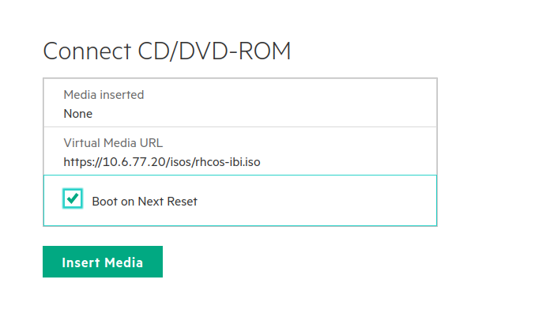

# Quick Openshift installations with Image Base Install

Previously, I talked about [Image Base Upgrade](https://jgato.github.io/jgato/posts/image-base-upgrade/). Based on the same idea, the image used to quickly upgrade Single Node Openshift, can be used to deploy a new SNO. Of course, based on a image created from a seed cluster, that will install other new clusters with the same hardware (or very much similar).


## Initiate the IBI

The starting process is pretty quick and you just need to download the `openshift-install` cli with the version of the target Openshift to be installed. Following my previous blog, I have create a need seed image, this time based on 4.17.17:

```bash
$ bin/4.17.17/openshift-install version
bin/4.17.17/openshift-install 4.17.17
built from commit 8bcf87f80e1803f9ec986dfe099625a088ac2412
release image quay.io/openshift-release-dev/ocp-release@sha256:2c8a2124df0a8c865a3771c49d01bfcb96cadc7f411e23870eb9f8adbe032ec1
WARNING Release Image Architecture not detected. Release Image Architecture is unknown 
release architecture unknown
default architecture amd64

```

We init the process:

```
$ bin/4.17.17/openshift-install image-based create image-config-template --dir live-iso-sno4/
INFO Image-Config-Template created in: live-iso-sno4
```

Then, edit the `image-based-installation-config.yaml` pointing to the seed image, and configuring the network and disk of the new cluster:

```
$ bin/4.17.17/openshift-install image-based create image --dir live-iso-sno4
INFO Adding NMConnection file <eno3.nmconnection> 
INFO Consuming Image-based Installation ISO Config from target directory 
INFO Creating Image-based Installation ISO with embedded ignition 

$ du -hs live-iso-sno4/rhcos-ibi.iso 
1.2G	live-iso-sno4/rhcos-ibi.iso

```


## Inject the live iso

For that purpose I will just serve the ISO with a simple Python server:

```
$ python3 -m http.server 7800
Serving HTTP on 0.0.0.0 port 7800 (http://0.0.0.0:7800/) ...

```

Then I inject the iso directly from the BMC.




Then I will mount the BMC virtual media and boot from CD (more on [how to use Redfish on my blog](https://jgato.github.io/jgato/posts/redfish-sushy/):

```

```