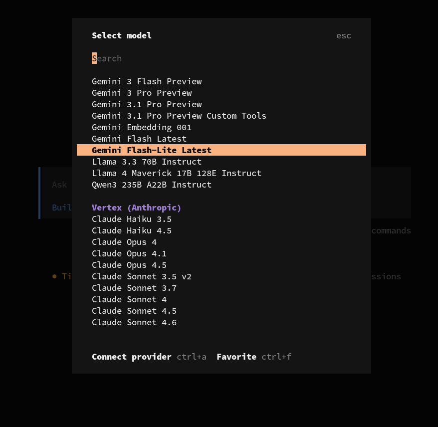
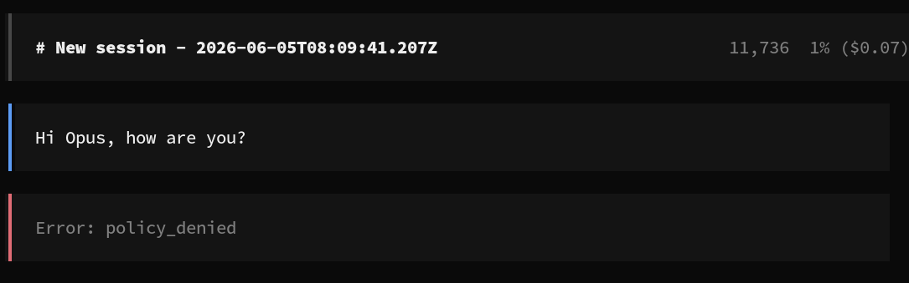
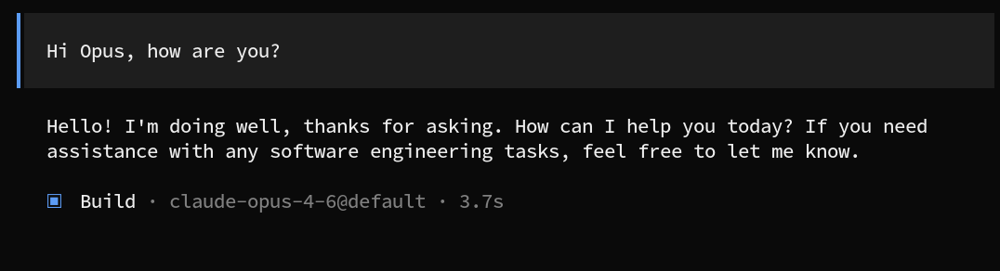

# NVIDIA Openshell

NVIDIA Openshell allows to run AI Agent from a sandbox. The sandbox perms are "denied by default", that means, you have to specifically allow what can be done inside the sandbox (with Policies).

The installation is pretty easy if you follow the instructions in the [official doc](https://docs.nvidia.com/openshell/about/installation).

## Hello sandbox

In my case, I want to use a SandBox with Opencode. I also have access to Anthropic models with Google Vertex AI. Openshell allows to connect different providers to the Sandbox, but, in the time of writing this document Vertex AI is not supported ([but it is on the way](https://github.com/NVIDIA/OpenShell/pull/1568).

So, lets try a quick sandbox:

```bash
> openshell sandbox create --name my-sandbox
```

This sandbox can do almost nothing. So, I will configure Vertex AI access inside. There are some manual steps to do, that hopefully, soon will be more straight forward when the Vertex provider is available.

The first, I copy inside the Google Cloud credentials for Vertex:

```bash
> openshell sandbox upload my-sandbox ~/.config/gcloud/application_default_credentials.json /sandbox/.config/gcloud/application_default_credentials.json
```

Then, inside the sandbox I create the needed env variables for Vertex:

```bash
[sandbox]> export GOOGLE_APPLICATION_CREDENTIALS=/sandbox/.config/gcloud/application_default_credentials.json
[sandbox]> export CLOUD_ML_REGION=<YOUR_REGION>
[sandbox]> export GOOGLE_CLOUD_PROJECT=<YOUR_PROJECT>

```

So, lets try:

```bash
[sandbox]> opencode
```

All the Vertex models are available:



But, if I try to interact with the model:



As I said, the Policies are denied by default. I need to enable a Policy to access the Vertex urls:


```yaml
version: 1

# Sandbox policy for the triage agent.
#
# Needs GitHub API for issue/PR triage and Vertex AI for inference.
# curl intentionally excluded from vertex_ai binaries to prevent
# disallowedTools bypass via raw HTTP with the injected GH_TOKEN.

filesystem_policy:
  include_workdir: true
  read_only: [/usr, /lib, /proc, /dev/urandom, /app, /etc, /var/log]
  read_write: [/sandbox, /tmp, /dev/null]
landlock:
  compatibility: best_effort
process:
  run_as_user: sandbox
  run_as_group: sandbox

network_policies:
  vertex_ai:
    name: vertex-ai
    endpoints:
      - host: "api.anthropic.com"
        port: 443
        protocol: rest
        enforcement: enforce
        access: read-write
      - host: "*.googleapis.com"
        port: 443
        protocol: rest
        enforcement: enforce
        access: read-write
    binaries:
      - path: "**/claude"
      - path: "**/node"
```

And we add the Policy to the sandbox:

```
> openshell policy set my-sandbox --policy /tmp/policy.yaml --wait
```

Now, we try again to interact with the model:



We are ready to go!.
