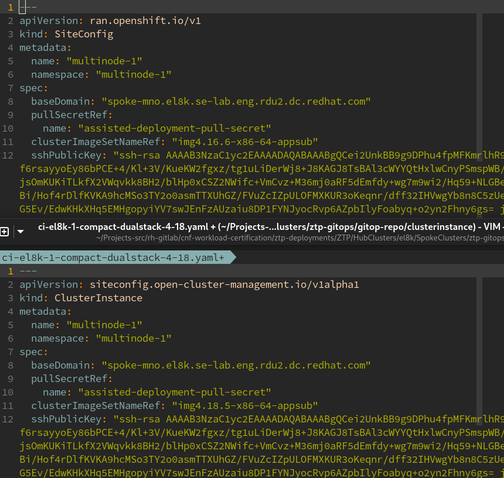
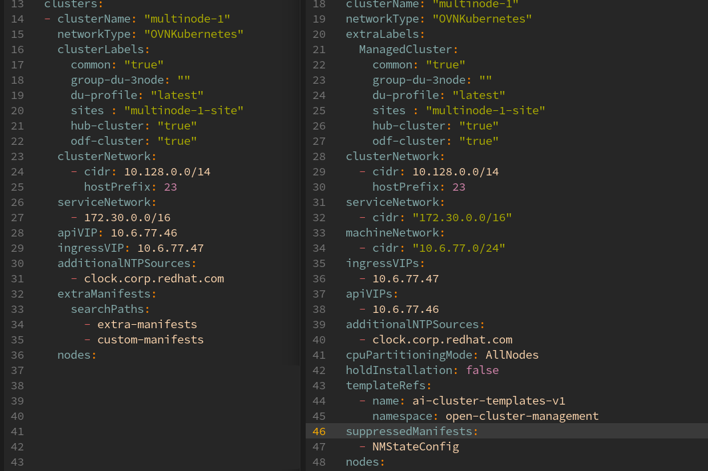
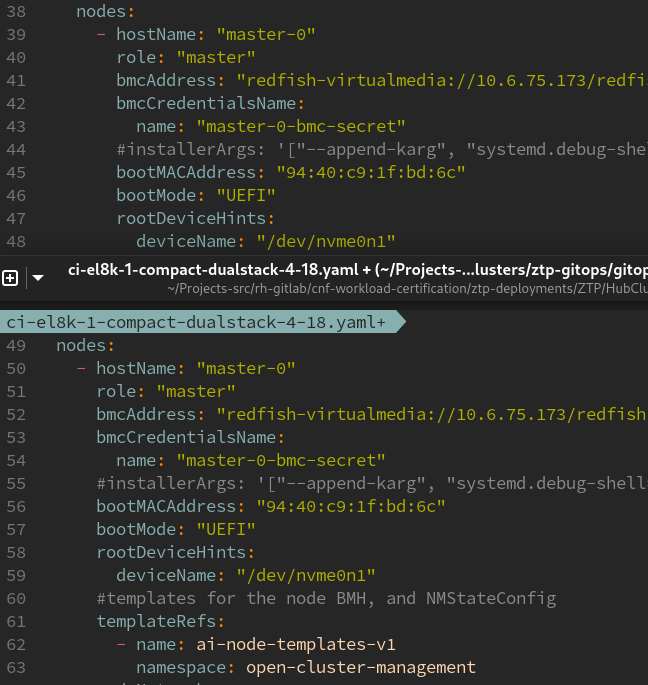

# From SiteConfig to ClusterInstance

Not too much context, just some experience moving from previous ZTP CR SiteConfig to ClusterInstance CR. This new is managed by a new operator inside RHACM, and before, it was a Kustomize pluging running on ArgoCD. So now, we really have the CR ClusterInstance created on Openshift and managed by an Operator.

The API is not 1 to 1, so you have to make some changes. As today, there is no tool to migrate from one to the other. Main concepts are still in the new ClusterInstance and most of the keys are names the same (or pretty much the same):

For example, basic `spec` for the cluster:



After that, SiteConfig had an `spec.clusters` because a site could contain more than one cluster. ClusterInstance contains only one cluster, so, this section does not exist and you directly configure the specification of the cluster:



Pretty much the same, not the labels can be added at different levels. The main difference is about how we use `extra-manifests` (we can go with it later) and `templateRefs`. The `templateRefs` are Configmap used as templates to generate CRs for the cluster. For example, there exists some at cluster level for AgentClusterInstall, ClusterDeployment, etc:

```
> oc -n open-cluster-management get cm | grep ai
ai-cluster-templates-v1             5      22h
ai-node-templates-v1                2      22h

```

Similar to what we had [here](https://github.com/openshift-kni/cnf-features-deploy/blob/master/ztp/siteconfig-generator/siteConfig/clusterCRsV1.go) for the old ZTP SiteConfig. But now, these exists in the cluster. You could create your own templates, to render the configuration on your own way.

Then, we go with the nodes information:



Pretty similar, but the adding on managing templates, the same that happened at cluster level. But this time, for CRs of BMH and NMStateConfig. 

The `nodeNetwork` is exactly the same, because it is exactly the API of an NMStateConfig. Before, you could directly write the network config in the SiteConfig, or you could use a reference:

```yaml
   crTemplates:                                                                                                      
     NMStateConfig: "NMStates/nmstate-b3-el8k-1-master-1.yaml"    
```

Adding these NMSateConfig yamls from your kustomize. 

This now can be done similarly. You can just write the network configuration:
```yaml
 nodes:                                                                          
    - hostName: "master-0"                                                        
      role: "master"                                                           
      bmcAddress: "redfish-virtualmedia://10.6.75.173/redfish/v1/Systems/1"    
      bmcCredentialsName:                                                      
        name: "master-0-bmc-secret"                                               
      #installerArgs: '["--append-karg", "systemd.debug-shell=1"]'                
      bootMACAddress: "94:40:c9:1f:bd:6c"                                         
      bootMode: "UEFI"                                                            
      rootDeviceHints:                                                            
        deviceName: "/dev/nvme0n1"                                                
      #templates for the node BMH, and NMStateConfig                              
      templateRefs:                                                               
        - name: ai-node-templates-v1                                              
          namespace: open-cluster-management                                      
      nodeNetwork:                                                                                                                                                                                                                                            
        interfaces:                                                               
          - name: "eno3"                                                          
            macAddress: "94:40:c9:1f:bd:6c"                                       
        config:                                                                   
          interfaces:                                                             
            - name: eno3                                                          
              type: ethernet                                                      
              state: up                                                        
              ipv4:                                                            
                enabled: true                                                  
                address:                                                       
                  - ip: 10.6.77.40                                             
                    prefix-length: 24                                          
              ipv6:                                                            
                enabled: true                                                  
                address:                                                       
                  - ip: 2620:0052:0009:164d:0000:0000:0000:040                 
                    prefix-length: 64                                          
                dhcp: false                                                    
          dns-resolver:                                                        
            config:                                                            
              server:                                                          
                - 10.6.77.20                                                   
          routes:                                                              
            config:                                                            
              - destination: 0.0.0.0/0                                         
                next-hop-address: 10.6.77.254                                  
                next-hop-interface: eno3                                       
              - destination: '::/0'                                            
                next-hop-address: '2620:52:9:164d::1'                          
                next-hop-interface: eno3                    
```

Or remove the nodeNetwork section, and, add the NMStateConfigs manually in the kustomization file:
```yaml
---
apiVersion: kustomize.config.k8s.io/v1beta1
kind: Kustomization

resources:
  - ci-el8k-1-compact-dualstack-4-18.yaml
  # NMStateconfigs for el8k-1-compact
  - NMStates/nmstate-b1-el8k-1-master-0.yaml
  - NMStates/nmstate-b3-el8k-1-master-1.yaml
  - NMStates/nmstate-b5-el8k-1-master-2.yaml
```

And setting that you dont want to use the NMStateConfig template to automatically render the configuration. Using the `spec.suppressedManifests`: 

```yaml
  suppressedManifests:
    - NMStateConfig
  nodes:
    - hostName: "master-0"
      role: "master"
      bmcAddress: "redfish-virtualmedia://10.6.75.173/redfish/v1/Systems/1"
      bmcCredentialsName:
        name: "master-0-bmc-secret"
      #installerArgs: '["--append-karg", "systemd.debug-shell=1"]'
      bootMACAddress: "94:40:c9:1f:bd:6c"
      bootMode: "UEFI"
      rootDeviceHints:
        deviceName: "/dev/nvme0n1"
      #templates for the node BMH, and NMStateConfig
      templateRefs:
        - name: ai-node-templates-v1
          namespace: open-cluster-management

```

After all these changes, you could have the info from a SiteConfig into a ClusterInstance

## Dealing with the extra-manifests


Previously we used the ZTP extra-manifests (espcially as RAN profile). In principle, you used all of them, but you could use some filtering process to make the selection. And, you could add new folders with more manifests, that could be also be filtered. More [here](https://docs.redhat.com/en/documentation/openshift_container_platform/4.18/html-single/edge_computing/index#ztp-customizing-the-install-extra-manifests_ztp-advanced-install-ztp).

Now, you have to add them to the kustomization file, using a kustomize generator to put every manifest into a ConfigMap.

These manifests can be whatever Openshift/Kubernetes CR. But the ClusterInstance needs to put them into a ConfigMap. Taking this directory with several custom-manifests as example:

```bash
> ls custom-manifests/
00-autologin.yaml  00-debug-networkmanager.yaml  50-mcp-ht.yaml  50-mcp-standard.yaml  99-cgroupsv1.yaml
```

We will select some of them:

```
configMapGenerator:
  - files:
    - extra-manifests/master-core-password.yaml
    name: extra-manifests-cm
    namespace: sno3
```

Notice how the different Manifests are encapsulated into a ConfigMap, in the NameSpace to be used by our cluster. Then, you have to point it from the ClusterIntance:


```yaml
 extraManifestsRefs: 
    - name: 00-autologin
```

After syncing, you can see the new ConfigMap with the objects inside:

```bash
> oc -n multinode-1 get cm custom-manifests-cm 
NAME                  DATA   AGE
custom-manifests-cm   2      47s

```

After the installation, the cluster contains the extra configuration. 

### Having to add many manifest

If you have to add many manifests, you can use this kustomize command to add all the manifests in the folder to the kustomize file:

```bash
> kustomize edit add configmap ztp-ran-profile --from-file="./extra-manifest/*.yaml" --namespace multinode-1
>  cat kustomization.yaml 
apiVersion: kustomize.config.k8s.io/v1beta1
kind: Kustomization

  # NMStateconfigs for el8k-1-compact
resources:
- ci-el8k-1-compact-dualstack-4-18.yaml
- NMStates/nmstate-b1-el8k-1-master-0.yaml
- NMStates/nmstate-b3-el8k-1-master-1.yaml
- NMStates/nmstate-b5-el8k-1-master-2.yaml

configMapGenerator:
- files:
  - custom-manifests/00-autologin.yaml
  - custom-manifests/00-debug-networkmanager.yaml
  name: custom-manifests-cm
  namespace: multinode-1
- files:
  - extra-manifest/01-container-mount-ns-and-kubelet-conf-master.yaml
  - extra-manifest/01-container-mount-ns-and-kubelet-conf-worker.yaml
  - extra-manifest/06-kdump-master.yaml
  - extra-manifest/06-kdump-worker.yaml
  - extra-manifest/07-sriov-related-kernel-args-master.yaml
  - extra-manifest/07-sriov-related-kernel-args-worker.yaml
  - extra-manifest/08-set-rcu-normal-master.yaml
  - extra-manifest/08-set-rcu-normal-worker.yaml
  - extra-manifest/09-openshift-marketplace-ns.yaml
  - extra-manifest/99-crio-disable-wipe-master.yaml
  - extra-manifest/99-crio-disable-wipe-worker.yaml
  - extra-manifest/99-sync-time-once-master.yaml
  - extra-manifest/99-sync-time-once-worker.yaml
  - extra-manifest/enable-crun-master.yaml
  - extra-manifest/enable-crun-worker.yaml
  name: ztp-ran-profile
  namespace: multinode-1
  options:
    disableNameSuffixHash: true

generatorOptions:
  disableNameSuffixHash: true

```

But yo will need to do the same for every cluster, and the size of the kustomize.yaml would get increased a lot.
