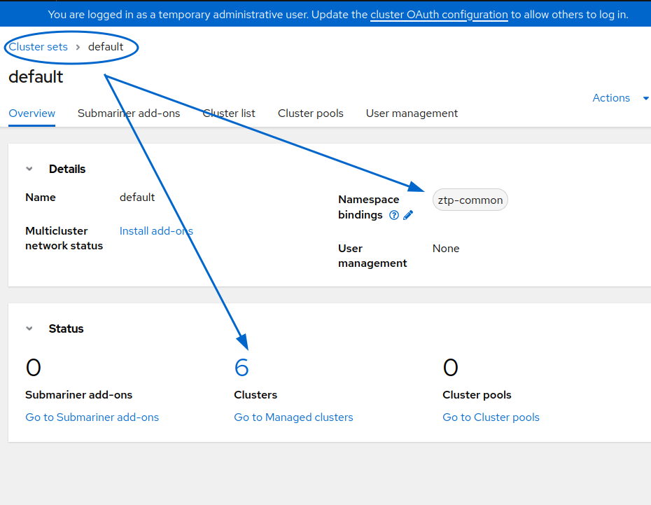
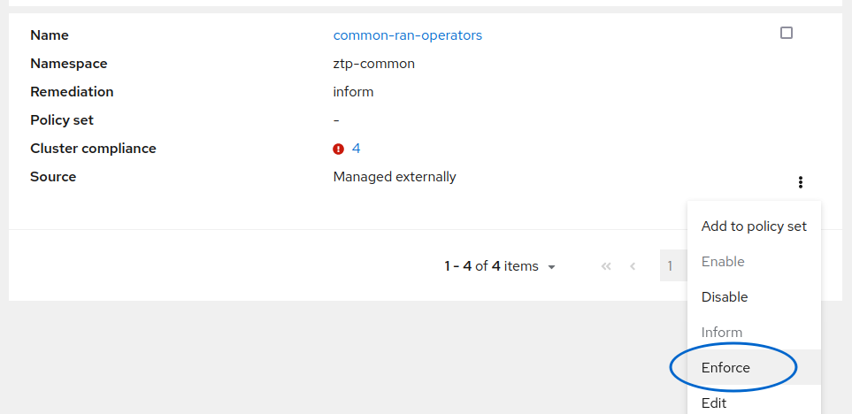
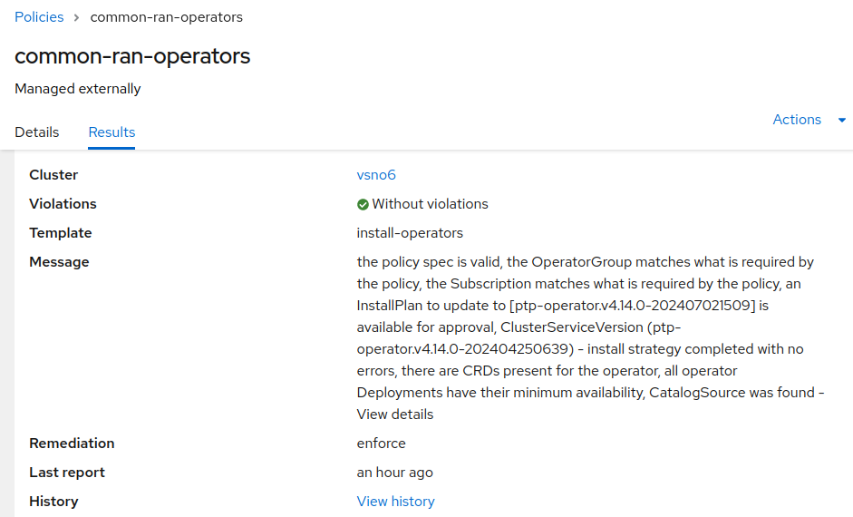

[draft][abstract]

This document is just a first experiment on the new [RHACM Governance OperatorPolicy API](https://docs.openshift.com/container-platform/4.16/edge_computing/policygentemplate_for_ztp/ztp-configuring-managed-clusters-policies.html). This API would allow us to implement the [Ability to declare Operator versions through GitOps/ZTP workflow](https://issues.redhat.com/browse/RFE-4890).

The objective is to test this new feature, and to detect the main missing integration points between ZTP GitOps and the new API. Due to, this API is not exploitable yet from ZTP.

This document is not a real tutorial on how to use OperatorPolicies from ZTP (but it would help you on some manual work to do it), because this is not implemented as today. 


# Lifecycle management of Openshift operators with RHACM and ZTP

[Red Hat Advanced Cluster Management](https://www.redhat.com/en/technologies/management/advanced-cluster-management) (ACM) allows you to deploy, upgrade, and configure different spoke clusters from a hub cluster. It's an OpenShift cluster that manages other clusters. For all management, one can imagine many APIs exist to complete all the needed features. Together with RHACM, we use [Zero Touch Provisioning](https://docs.openshift.com/container-platform/4.16/edge_computing/ztp-preparing-the-hub-cluster.html) (ZTP), which enables us to facilitate interaction with these resources. Additionally, using a GitOps methodology allows for life cycle management in a more DevOps way. ZTP includes a set of helpers to define your infrastructure and configurations with a scalable approach, and is very focused on Telco scenarios and needs.

One of the helpers for life cycle management between ZTP and RHACM APIs are the resources needed to install and upgrade different Telco operators, such as those for [PTP](https://github.com/openshift-kni/cnf-features-deploy/blob/master/ztp/source-crs/PtpSubscription.yaml) or [SRIOV(https://github.com/openshift-kni/cnf-features-deploy/blob/master/ztp/source-crs/SriovSubscription.yaml. ZTP provides an API called [PolicyGenTemplate](https://docs.openshift.com/container-platform/4.16/edge_computing/policygentemplate_for_ztp/ztp-configuring-managed-clusters-policies.html) that allows you to 
include these resources, which can then be committed to a Git repository.


```yaml
apiVersion: ran.openshift.io/v1
kind: PolicyGenTemplate
metadata:
  name: "common"
  namespace: "ztp-common"
spec:
  bindingRules:
    # These policies will correspond to all clusters with this label:
    common: "true"
  sourceFiles:
    # Create operators policies that will be installed in all clusters
    - fileName: SriovSubscription.yaml
      policyName: "subscriptions-policy"
      spec:
        source: redhat-operators
	- fileName: PtpSubscription.yaml
	  policyName: "subscriptions-policy"
````

There is still another component in place. [The Topology Aware Lifecycle Manager](https://www.redhat.com/en/blog/how-to-use-the-topology-aware-lifecycle-manager) (TALM) will be in charge, once the cluster is deployed, to make compliant the PolicyGenTemplates and RHACM Policies ([RHACM Governance model](https://docs.redhat.com/en/documentation/red_hat_advanced_cluster_management_for_kubernetes/2.11/html-single/governance). When having to install a new operator:

```
apiVersion: operators.coreos.com/v1alpha1
kind: Subscription
metadata:
  name: openshift-ptp
  namespace: openshift-ptp
spec:
  channel: "stable"
  name: ptp-operator
  source: redhat-operators
  sourceNamespace: openshift-marketplace
  startingCSV: ptp-operator.v4.14.0-202404250639
status:
  state: AtLatestKnown
```

TALM and Openshift [OLM](https://docs.openshift.com/container-platform/4.16/operators/understanding/olm/olm-understanding-olm.html) will try to get the latest available version, even if you specific a concrete one with `startingCSV`.
This is a know [limitation](https://issues.redhat.com/browse/OCPBUGS-22838) and there is a [Request Feature Enhancement](https://issues.redhat.com/browse/RFE-4890) about it. 

This approach of always having the latest available version works well in most scenarios, based on the idea that "latest is always best". However, if something goes wrong, it will likely be fixed in a subsequent version. In Telco scenarios, where we need to validate hardware, platform, and workloads, it's crucial to release a validated solution with specific versions of each component, as opposed to relying solely on the latest available version.


Recently, Red Hat Advanced Cluster Management (RHACM) Governance model has released a new API called  [OperatorPolicy](https://docs.redhat.com/en/documentation/red_hat_advanced_cluster_management_for_kubernetes/2.11/html/governance/governance#policy-operator), which aligns with this intention. Although it's still not yet exploitable by ZTP or PolicyGenTemplates, I believe it's worth experimenting with this new API to see if it's suitable for Telco needs. In order to create blueprints that validate solutions with strong pinned versions of all components.

## Using the new API

With ZTP and PolicyGenTemplate (PGT), we are used to create whatever needed Openshift/Kubernetes object as a manifest inside a `source-crs` folder. So, we could just create a new manifest source, that could be linked from a PGT. PGTs are managed by a ZTP kustomize generator plugin that transforms the PGTs and creates a RHACM `Policy`and the desired objects inside a `ConfigurationPolicies`. Simplified: `Policy.object-definition.ConfigurationPolicy.object-templates[].object`. PGTs allows you easily to fill the list of objects to be managed by the RHACM Governance. 

But, an [`OperatorPolicy` cannot be encapsulated under a ConfigurationPolicy](https://docs.redhat.com/en/documentation/red_hat_advanced_cluster_management_for_kubernetes/2.11/html/governance/governance#create-operator-policy), that is the only way of working with the PGT generator. And therefore, we cannot create `OpertorPolicies` from a PGT.  interacting with RHACM Governance. And therefore, 


> Here we find the first lack of feature, PGT generator plugin encapsulate all the CRs as a `ConfigurationPolicy`. This is oka for encapsulating the creation/configuration of any Openshift/Kubernetes object. But, `OpertorPolicy` works differently:  [ToDo] Link to an RFE 

> Also, we find a second issue: TALM dont know how to act when using [anything but a `ConfigurationPolicy`](https://github.com/openshift-kni/cluster-group-upgrades-operator/blob/cf5b4af06f107b7e6385fb3afed674937c6e4909/controllers/utils/policy_util.go#L199-L209), so, `OperatorPolicies`will not work, and it cannot manage when to move from inform to enforce for doing the remediation:  [ToDo] link to the RFE

Anyway, ZTP is not only a set of generators, it is also a methodology. If we cannot manage the `OperatorPolicy` by a PTG, we still can just directly use the RHACM Governance API. Placing the needed manifests inside our ZTP Git repository. 

It is not so easy as using a PGT and it makes us to directly play with the RHACM Governance API. In this case: `OperatorPolicies` and the `PlacementBindings` and  `PlacementRules`. 

```
apiVersion: policy.open-cluster-management.io/v1
kind: Policy
metadata:
  name: common-ran-operators
  namespace: ztp-common
spec:
  disabled: false
  policy-templates:
    - objectDefinition:
        apiVersion: policy.open-cluster-management.io/v1beta1
        kind: OperatorPolicy
        metadata:
          name: install-operators
        spec:
			...
			...
			...
```

Using the placements, we will select the clusters affected by the `OperatorPolicies`, that we will have to also create manually:
 
```
---
apiVersion: cluster.open-cluster-management.io/v1beta1
kind: Placement
metadata:
  name: common-ran-operators-placement
  namespace: ztp-common
spec:
  predicates:
    - requiredClusterSelector:
        labelSelector:
          matchExpressions:
            - key: common
              operator: In
              values:
                - 'true'
---
apiVersion: policy.open-cluster-management.io/v1
kind: PlacementBinding
metadata:
  name: common-ran-operators-placement-binding
  namespace: ztp-common
placementRef:
  name: common-ran-operators-placement
  apiGroup: cluster.open-cluster-management.io
  kind: Placement
subjects:
  - name: common-ran-operators
    apiGroup: policy.open-cluster-management.io
    kind: Policy

```


There is also another extra configuration derived of using `OperatorPolicies`. `ConfigurationPolicies` match affected clusters with `PlacementBindings` and the `PlacementRules`. `OperatorPolicies` need also to mach a RHACM `ClusterSet`:

```yaml
---
apiVersion: cluster.open-cluster-management.io/v1beta1
kind: Placement
metadata:
  name: common-ran-operators-placement
  namespace: ztp-common
spec:
  predicates:
    - requiredClusterSelector:
        labelSelector:
          matchExpressions:
            - key: common
              operator: In
              values:
                - 'true'
  clusterSets:
    - default
```

If you are used to use ZTP, maybe you are not very aware of the `ClusterSet`API, because it is not needed. But anyway, there is a default one that includes all the created clusters. We can use this default one, setting it also to be able to access the Namespace where the Policies will be places. In our case, `ztp-common` Namespace.



> Third issue, a `ClusterSet` needs to be created/modified with a `ClusterSetBinding` to the usual Namespaces we use with ZTP: ztp-common, ztp-group, etc. 

With the `ClusterSet` accessing the Namespaces of the `Policies` that we will create, we can start creating our own `OperatorPolicies`.

## Create `OperatorPolicies` to manage the Operators lifecycle

Following an example, of an `OperatorPolicy` that install the PTP operator on an specific version:

```yaml
apiVersion: policy.open-cluster-management.io/v1
kind: Policy
metadata:
  name: common-ran-operators
  namespace: ztp-common
spec:
  disabled: false
  policy-templates:
    - objectDefinition:
        apiVersion: policy.open-cluster-management.io/v1beta1
        kind: OperatorPolicy
        metadata:
          name: install-operators
        spec:
          complianceType: musthave
          remediationAction: enforce
          severity: critical
          upgradeApproval: None
          operatorGroup:
            name: openshift-ptp
            namespace: openshift-ptp
            targetNamespaces:
            - openshift-ptp
          subscription:
            channel: stable
            name: ptp-operator
            source: redhat-operators
            sourceNamespace: openshift-marketplace
            startingCSV: ptp-operator.v4.14.0-202404250639
          versions:
          - 4.14.0-202404250639
 ```

 

Some comments on the Manifest for the `OperatorPolicy`:
 * `remediationAction` following the ZTP way of doing. Policies are always inform, and the user can use TALM to decide when (And to which clusters) we want to remediate/apply the Policy. In our case, because of the current limitation, we dont use TALM but RHACM Governance to enforce when needed. 
 * `subscription` is the usual specification for an operator `subcription`. Here `startingCSV` will be the version that will be used to configure the cluster right after the installation. The corresponding InstallPlan will be automatically created.
 * `versions`: This is the list of versions that we allow to get installed. We could add more versions that we know have been validated. By the moment, we will keep only one version, following the idea of having a reference blueprint with an specific version of an operator validated. 
 * `upgradeApproval` , in a first phase, the `subscription.startingCSV` determinates the version to install the Operator. This plan is always automatically created and approved. From this `subscription.startingCSV` other InstallPlans will be created, that are susceptible to replace the currently installed version. For these InstallPlans, more in concrete, for the ones in the `versions` list, the `upgradeApproval` value determinates the later behaviour:
   *  If none, none of the existing InstallPlans will be automatically approved.
   *  If Automatic, the available InstallPlans that belongs to the list of validated`versions` will be automatically approved. According to their upgrade path. In general, it would happen that there is not a long upgrade chain. It is more common to observe that your current installed operator is just replaced by the last available version.
 
It is important to remark that the available `InstallPlans` in the cluster, are derived from the created `subscription` and the `currentCSV`. Based on the available versions of the catalog, that can replace the starting/running operator's version. This is not managed by the  `OperatorPolicy`, this is just OLM way of doing. `OperatorPolicy` can manage which starting version to install, and how to upgrade to one of the available ones. 

In summary, this `OperatorPolicy` will install the operator PTP with the version `v4.14.0-202404250639`. 

Also, we create another Policy->ConfigurationPolicy to manage the creation of the Namespace needed to install the Operator. 

```yaml

    - objectDefinition:
        apiVersion: policy.open-cluster-management.io/v1
        kind: ConfigurationPolicy
        metadata:
          name: install-operators-ns
        spec:
          remediationAction: inform
          evaluationInterval:
            compliant: 10m
            noncompliant: 10s
          object-templates:
            - complianceType: musthave
              objectDefinition:
                apiVersion: v1
                kind: Namespace
                metadata:
                  name: openshift-ptp

```

We keep Policies to inform, so, for demoing we can manually force them when needed. We also get rid of the `ztp-deploy-wave` annotation. Therefore, TALM will ignore these `Policies` and we can just manage them with the RHACM Governance API.

Which clusters are affected by these two `Policies`?. We use the `PlacementBindings` and the `PlacementRules`. Basically, any of our clusters with the label `common`:

```yaml
---
apiVersion: cluster.open-cluster-management.io/v1beta1
kind: Placement
metadata:
  name: common-ran-operators-placement
  namespace: ztp-common
spec:
  predicates:
    - requiredClusterSelector:
        labelSelector:
          matchExpressions:
            - key: common
              operator: In
              values:
                - 'true'
  clusterSets:
    - default                
---
apiVersion: policy.open-cluster-management.io/v1
kind: PlacementBinding
metadata:
  name: common-ran-operators-placement-binding
  namespace: ztp-common
placementRef:
  name: common-ran-operators-placement
  apiGroup: cluster.open-cluster-management.io
  kind: Placement
subjects:
  - name: common-ran-operators
    apiGroup: policy.open-cluster-management.io
    kind: Policy
  - name: common-ran-operators-ns
    apiGroup: policy.open-cluster-management.io
    kind: Policy
```


Placing all these CRs in our ZTP Git Repo will configure the RHACM Governance accordingly. 

## Enforcing and remediating the Policy

As explained above, we cannot use TALM to manage the remediation of our Policies. But the Policies are created anyway, and we can just enforce them to do the remediation. As TALM would ideally do in a more controlled way.

The Policy created has two different templates: the Namespace (`Policy->ConfigurationPolicy`) and the OperatorPolicy (`Policy->OperatorPolicy`):


We can enforce both in order to install the ptp-operator:




Notice how the OperatorPolicy will create all the different resources, including `Subscriptions`, `ClusterServiceVersion`, `OperatorGroup`, etc. But more important. 

```bash
> oc -n openshift-ptp get subscriptions,csv 
NAME                                             PACKAGE        SOURCE             CHANNEL
subscription.operators.coreos.com/ptp-operator   ptp-operator   redhat-operators   stable

NAME                                                                           DISPLAY        VERSION               REPLACES   PHASE
clusterserviceversion.operators.coreos.com/ptp-operator.v4.14.0-202404250639   PTP Operator   4.14.0-202404250639              Succeeded


```

Initially, we can see how it has been created `InstallPlan` for our `spec.currentCSV`, and it will be automatically approved, now matter how you `upgradeApproval' is set:`

```bash
> oc -n openshift-ptp get ip
NAME            CSV                                 APPROVAL   APPROVED
install-6hmpt   ptp-operator.v4.14.0-202404250639   Manual     true

```

And this is a really cool feature for our need of having blueprints validated with specific versions of an operator.   

After a while, the operator is installed and available.




Once the operator is installed, OLM will check the available upgrades to the operator from the available ones in the catalog. The ones marked as a replacement for the curret version. So, after a while, you could see other available `InstallPlans`:


```bash
$ oc -n openshift-ptp get ip
NAME            CSV                                 APPROVAL   APPROVED
install-5nzzk   ptp-operator.v4.14.0-202407021509   Manual     false
install-6hmpt   ptp-operator.v4.14.0-202404250639   Manual     true

```

It is cool, how, even if there exists newer versions of the operator (`ptp-operator.v4.14.0-202407021509`, the `Policy` remains compliant. As long as the current installed version is in the list of validated `versions`. If we rather prefer to get warned about new versions available, this can be changed at `OperatorPolicy` definition:

```yaml
spec:
  complianceConfig:
    catalogSourceUnhealthy: Compliant
    deploymentsUnavailable: NonCompliant
    upgradesAvailable: NonCompliant

```

Maybe this is not our case, because we want to get stick to only one version.


## Upgrading the operator

To install an operator on an specific version is part of the functionality that we need. But, what about upgrading the operator to a newer version?

For that, we can extend the list of validated versions:

```yaml
            startingCSV: ptp-operator.v4.14.0-202404250639
          versions:
          - 4.14.0-202404250639
		  - 4.14.0-202407021509   <=== added 
```

Remember: this list cannot be created with just the version we would like to have. It is a list of validated versions, but, the newly added should exists as a replacement for the current one. How each version of an operator is released to be able to substitute other previous versions, it depends on the release procedures of each operator owner. You would know, in advance, the upgrades path/chain, or, you can check in the subscription which is the next available version:

```bash
$ oc -n openshift-ptp get subscriptions.operators.coreos.com  ptp-operator -o jsonpath='{.status.currentCSV}'
ptp-operator.v4.14.0-202407021509
```

The version `ptp-operator.v4.14.0-202407021509` could be added to our versions list and it could be managed/approved by the `OperatorPolicy`. Maybe this is not the last available one. It is the next step in the upgrade path of the currently installed one. 

So, we can just add this newer version to the `versions` list. After updating our `OperatorPolicy` and the `spec.versions` the `InstallPlan` is not approved yet, even if it is in our list of validated versions:

```
$ oc -n openshift-ptp get ip
NAME            CSV                                 APPROVAL   APPROVED
install-5nzzk   ptp-operator.v4.14.0-202407021509   Manual     false
install-6hmpt   ptp-operator.v4.14.0-202404250639   Manual     true
```

Why the `InstallPlan` is not approved yet?. Because we have `upgradeApproval: none`. So, even if the added version has a correct `InstallPlan` (means, it can replace the current version), we are configuring the `OperatorPolicy` to not automatically approve it. Right now, we can manually approved, or to change the `upgradeApproval: Automatic`. 
> Here, TALM would do a great job about managing this approvals 

By the moment, we edit and approve manually the InstallPlan. Making the operator to be upgraded to the new added version.

```bash
$ oc -n openshift-ptp get csv
NAME                                DISPLAY        VERSION               REPLACES                            PHASE
ptp-operator.v4.14.0-202407021509   PTP Operator   4.14.0-202407021509   ptp-operator.v4.14.0-202404250639   Succeeded
```


## Improvements in ZTP to easiness all the process:

 * PGT generator to support encapsulate OperatorPolicies.
 * Configure `ClusterSet` and `ClusterSetBindings`
 * TALM to manage Policies with two different kinds of PolicyTemplates (OperatorPolicies and ConfigurationPolicies) inside the same Policy
 * TALM to manage the `InstallPlans` approvals 
 
 
 Bugs found:
  * [TALM policy objects inspect wrong mesage](https://issues.redhat.com/browse/OCPBUGS-37466)
  

# Demonstration with an hypothetical TALM capable of managing OperatorPolicies

The objective here is to do a proof of concept or demo, trying to emulate the way we would like to deploy operators in a Telco scenario. Basically, I have a ZTP4.16 environment capable of deploy a SNO. The ptp operator will be installed with a new Policy, that installs an specific version of the operator: `4.14.0-202404250639`

The PGT plugin cannot manage OperatorPolicies, therefore, the OperatorPolicy is directly created using the RHACM Governance API:

```yaml
apiVersion: policy.open-cluster-management.io/v1
kind: Policy
metadata:
  annotations:
    ran.openshift.io/ztp-deploy-wave: "3"
  name: common-ran-operators
  namespace: ztp-common
spec:
  disabled: false
  remediationAction: inform
  policy-templates:
    #####
    # Create the OperatorPolicy to deploy the Operator
    #####
    - objectDefinition:
        apiVersion: policy.open-cluster-management.io/v1beta1
        kind: OperatorPolicy
        metadata:
          name: install-operators
        spec:
          complianceType: musthave
          remediationAction: inform
          severity: critical
          upgradeApproval: None
          operatorGroup:
            name: openshift-ptp
            namespace: openshift-ptp
            targetNamespaces:
            - openshift-ptp
          subscription:
            channel: stable
            name: ptp-operator
            source: redhat-operators
            sourceNamespace: openshift-marketplace
            startingCSV: ptp-operator.v4.14.0-202404250639
          versions:
1)           - ptp-operator.v4.14.0-202404250639
    - objectDefinition:
        apiVersion: policy.open-cluster-management.io/v1
        kind: ConfigurationPolicy
        metadata:
          name: install-operators-ns
        spec:
          remediationAction: inform
          evaluationInterval:
            compliant: 10m
            noncompliant: 10s
          object-templates:
            - complianceType: musthave
              objectDefinition:
                apiVersion: v1
                kind: Namespace
                metadata:
                  name: openshift-ptp
---
apiVersion: policy.open-cluster-management.io/v1
kind: PlacementBinding
metadata:
  name: common-ran-operators-placement-binding
  namespace: ztp-common
placementRef:
  name: common-ran-operators-placement
  apiGroup: cluster.open-cluster-management.io
  kind: Placement
subjects:
  - name: common-ran-operators
    apiGroup: policy.open-cluster-management.io
    kind: Policy
    #  - name: common-ran-operators-ns
    #    apiGroup: policy.open-cluster-management.io
    #    kind: Policy
---
apiVersion: cluster.open-cluster-management.io/v1beta1
kind: Placement
metadata:
  name: common-ran-operators-placement
  namespace: ztp-common
spec:
  predicates:
    - requiredClusterSelector:
        labelSelector:
          matchExpressions:
            - key: common
              operator: In
              values:
                - 'true'
  clusterSets:
    - default

```

TALM cannot manage Policies when our `policy-templates` have `object-definitions` different than `ConfigurationPolicies`. But, as we explained above, to use the new RHACM Governance API to manage operators, we have to use an `OperatorPolicy`.

For just a quick demo, I have created a custom version of TALM, with very basic support of OperatorPolicies. You can find it [here](https://github.com/jgato/cluster-group-upgrades-operator/tree/try-operatorpolicy-support).

> It is not expected to be a real support of `OperatorPolicies`, just me adding some ifs here and there. TALM is only designed for `ConfigurationPolicies`, so, my added new conditions are far of been something realistic. Something quick for a demo.

Using my custom TALM version and the previous created Policy, everything synch with ZTP GitOps. We deploy a new SNO baremetal cluster that will be configured on day-1 by:

 * `common-config-policy` created by a PGT with some basic configurations 
 * `common-subscriptions-policy` created by a PGT with our usual subscriptions for operators (but ptp)
 * `common-ran-operators` which is an ACM Policy with:
   *  `ConfigurationPolicy` to create the operator Namespace
   * `OperatorPolicy` to create the OperatorPolicy for the ptp operator
  * `group-du-sno-validator-du-validator`  created by a PGT that makes usual validations of the installation and readiness. 

Here we dont cover the deploment process, but, it is just a `Siteconfig` that will trigger the installation. When the cluster is created, TALM start working and remediating all the Policies. Here it is the real demo.

The cluster has been created:
```bash
> oc get managedcluster vsno5 
NAME    HUB ACCEPTED   MANAGED CLUSTER URLS                                              JOINED   AVAILABLE   AGE
vsno5   true           https://api.vsno5.spoke.el8k.se-lab.eng.rdu2.dc.redhat.com:6443   True     True        37m

```


TALM will create automatically a first CGU. This custom version of TALM supports a very light/simple/test/playing for `OperatorPolicies`. So, at least, this CGU should contain the new Policies and should be marked as "correct":

```yaml
apiVersion: ran.openshift.io/v1alpha1
kind: ClusterGroupUpgrade
metadata:
 ...
 ...
  name: vsno5
  namespace: ztp-install
 ...
 ...
spec:
 ...
 ...
  clusters:
  - vsno5
  enable: true
  managedPolicies:
  - common-config-policy
  - common-subscriptions-policy
  - group-du-sno-validator-du-validator
 ...
 ...
status:
  computedMaxConcurrency: 1
  conditions:
  - lastTransitionTime: "2024-07-30T12:17:36Z"
    message: All selected clusters are valid
    reason: ClusterSelectionCompleted
    status: "True"
    type: ClustersSelected
  - lastTransitionTime: "2024-07-30T12:17:36Z"
    message: Completed validation
    reason: ValidationCompleted
    status: "True"
    type: Validated
  - lastTransitionTime: "2024-07-30T12:17:36Z"
    message: Remediating non-compliant policies
    reason: InProgress
    status: "True"
    type: Progressing
 ...
 ...
```

It seems that TALM knows how to manage `OperatorPolicies`, no errors apparently. But, the `common-ran-operators` Policy is not under the `managedPolicies`. Something wrong on my implementation. If I delete the cgu, and let TALM to recreate it, now it appears:

```yaml
> oc -n ztp-install delete cgu vsno5
clustergroupupgrade.ran.openshift.io "vsno5" deleted

> oc -n ztp-install get cgu vsno5 -o yaml
apiVersion: ran.openshift.io/v1alpha1
kind: ClusterGroupUpgrade
metadata:
 ...
 ...
  name: vsno5
  namespace: ztp-install
 ...
 ...
spec:
 ...
 ...
  clusters:
  - vsno5
  enable: true
  managedPolicies:
  - common-config-policy
  - common-subscriptions-policy
  - common-ran-operators
  - group-du-sno-validator-du-validator
 ...
 ...
status:
  computedMaxConcurrency: 1
  conditions:
  - lastTransitionTime: "2024-07-30T12:20:30Z"
    message: All selected clusters are valid
    reason: ClusterSelectionCompleted
    status: "True"
    type: ClustersSelected
  - lastTransitionTime: "2024-07-30T12:20:30Z"
    message: Completed validation
    reason: ValidationCompleted
    status: "True"
    type: Validated
  - lastTransitionTime: "2024-07-30T12:20:30Z"
    message: Remediating non-compliant policies
    reason: InProgress
    status: "True"
    type: Progressing
 ...
 ...
```

Now, TALM took the management of all the required `Policies` including the one of Kind `OperatorPolicy`. Eventually, TALM will remediate and enforce the Policy:

```bash
> oc -n vsno5 get policies
NAME                                     REMEDIATION ACTION   COMPLIANCE STATE   AGE
ztp-common.common-config-policy          inform               Compliant          43m
ztp-common.common-ran-operators          inform               Compliant          6m43s
ztp-common.common-subscriptions-policy   inform               Compliant          43m

```


Once this is done, the new RHACM controller for `OpeartorPolicies` should do the work and deploy the operator on the version `4.14.0-202404250639`:

```bash
[spoke]$ oc -n openshift-ptp get csv
NAME                                DISPLAY        VERSION               REPLACES   PHASE
ptp-operator.v4.14.0-202404250639   PTP Operator   4.14.0-202404250639              Succeeded
```

Which is the version we wanted to install. Even if there are other available in the catalog, and that could replace it:

```bash
[spoke]$ oc -n openshift-ptp get ip
NAME            CSV                                 APPROVAL   APPROVED
install-mdt2d   ptp-operator.v4.14.0-202407021509   Manual     false
install-s9rkz   ptp-operator.v4.14.0-202404250639   Manual     true

```

What about upgrades? With the `OperatorPolicy` we can specify other validated and available versions:

```yaml
...
            startingCSV: ptp-operator.v4.14.0-202404250639
          versions:
          - ptp-operator.v4.14.0-202404250639
          - ptp-operator.v4.14.0-202407021509

```

The `OperatorPolicy` controls the different versions (apart from the starting one) with the `versions` list, and the `OperatorPolicy.spec.upgradeApproval`. If we re-sync the `Policy` including the new version as valid, nothing will happen. 

```
[spoke~]$ oc -n vsno5 get operatorpolicies.policy.open-cluster-management.io -o yaml  | grep versions -A 2
    versions:
    - 4.14.0-202404250639
    - 4.14.0-202407021509
[spoke]$ oc -n vsno5 get policies
NAME                                     REMEDIATION ACTION   COMPLIANCE STATE   AGE
ztp-common.common-config-policy          inform               Compliant          13m
ztp-common.common-ran-operators          inform               Compliant          13m
ztp-common.common-subscriptions-policy   inform               Compliant          13m

```

The `Policy`is still compliant, this is because, the running version is under the validated `versions` list. So, for the controller everything is oka. There is a new version, it is under the validated ones. You dont have to be on the last available one. Unless you configure the `OperatorPolicy` to be NotCompliant if newer versions available.

Anyway, someone/something has to approve the InstallPlan, it could be with `OperatorPolicy.spec.upgradeApproval` as Automatic. Ideally, TALM would do the work. How TALM should integrate here? It is not clear for me. 

For demoing, we can manually approve it, to see how to upgrade the operator:

```bash
[spoke]$ oc -n openshift-ptp get ip
NAME            CSV                                 APPROVAL   APPROVED
install-mdt2d   ptp-operator.v4.14.0-202407021509   Manual     false
install-s9rkz   ptp-operator.v4.14.0-202404250639   Manual     true

[spoke]$ oc -n openshift-ptp patch installplan install-mdt2d  --type merge --patch '{"spec":{"approved":true}}'
installplan.operators.coreos.com/install-mdt2d patched

[spoke]$ $ oc -n openshift-ptp get csv
NAME                                DISPLAY        VERSION               REPLACES                            PHASE
ptp-operator.v4.14.0-202407021509   PTP Operator   4.14.0-202407021509   ptp-operator.v4.14.0-202404250639   Succeeded

```

The operator has been upgraded, and the Policy is compliant, because the new version belongs to the validated `versions` list. 