# RHACM Cluster monitoring

Before going with the real topic of this document, lets understand briefly how Cluster Monitoring works in any cluster with Openshift.

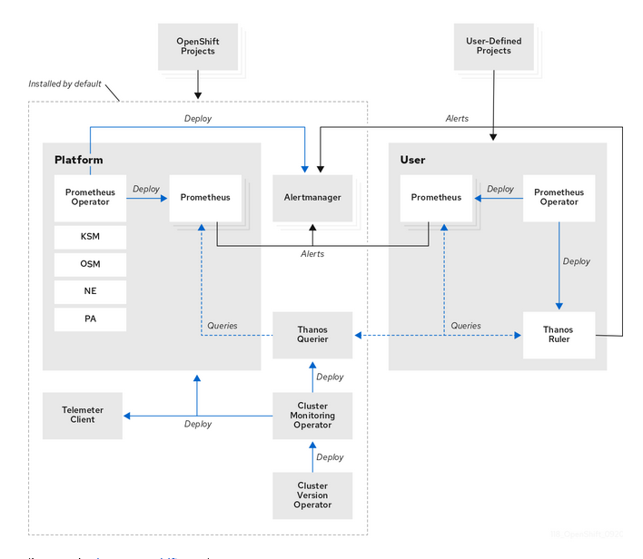

The main component in the Cluster Monitoring is Prometheus. Prometheus will scrape metrics of any service (defined by ServiceMonitoring) that exports a `/metrics` interface returning a set of different metrics. It has it own time series database, but it is not intended to persist or to keep data for long period. ServiceMonitoring resources points Prometheus to where (And when) scrape metrics.

But how to scale, query and persist all the data? Thanos is in charge of that. You can directly query Prometheus with PromQL, but remember Prometheus is not intended to persist data. Instead of that, Prometheus sends the data to a Thanos Querier, that centralizes the data from different Prometheus. We have the default Openshift Prometheus (scraping node-exporter, kubelet, etc), but we could have another Prometheus for user's workloads that will export their own metrics. The data is sent from Prometheus to Thanos using the Remote-Write protocol. 

When we have enabled RHACM Multicluster Observability, now we not only have the local Prometheus (local Openshift Cluster Monitoring), we will receive data from the Cluster Monitoring's Prometheus from other Openshift spoke's clusters. 

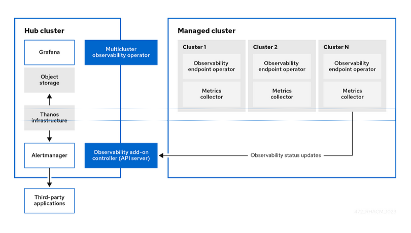

RHACM Multicluster Observability provides (at Hub level ) a centralized Thanos Querier, and Thanos Receiver, that will collect metrics from other spoke clusters.

Therefore, every Openshif Cluster Montoring (including the local one in the hub cluster) gathers metrics with their local Prometheus. Enabling Multicluster Observability (at spoke level) will deploy a way of forwarding metrics to the Hub central Observability components. 

Finally, the Hub Multicluster Observability (at the hub) provides its own Grafana instance to show all the metrics from all the cluster (including their local ones).

# RHACM Multicluster Observality

RHACM Observability is an operator that enables a set of RHACM add-ons and controllers. 

When enabled, the hub cluster creates a new NS `open-cluster-management-addon-observability` with an operator, grafana and thanos component to collect (and forward) records and alerts (metrics). 

When enabled, every spoke cluster will have installed a new add-on called `addon-observability-controller` that deploys a controller/operator and a collector. These will forward all the default (and custom created) alerts and records managed by the local Cluster Monitoring Operator. 

Requirements:
 * RHACM and MCE operators installed
 * Storage system:
   * For this example an Storage bucket S3 compatible. At the bottom there is an small section to create an S3 compatbile endpoing using ODF. 
   * Other supported cloud storage systems [available](https://access.redhat.com/documentation/en-us/red_hat_advanced_cluster_management_for_kubernetes/2.3/html-single/observability/index#prerequisites-observability)
   
Resources consumption:
 * At hub level: 2701mCPU and 11972Mi to manage about 5 spoke clusters. More [here](https://access.redhat.com/documentation/en-us/red_hat_advanced_cluster_management_for_kubernetes/2.10/html-single/observability/index#observability-pod-capacity-requests)

 * At spoke level: there is no documentation about it. But looking to the pods deployed (actually 2, `endpoint-observability-operator` and `metrics-collector-deployment`), this seems to request 2mCPU and 50Mi (`endpoint-observability-operator`) and 10mCPU and 100Mi(`metrics-collector-deployment`). Notice there are no limits sets, that would be something interesting. 
 
> All the work here done on OCP4.15 RHACM Hub. The Cluster Observability Operator is a Technology Preview feature only.

## Install the operator

To install the operator you can mainly follow [this instructions](https://access.redhat.com/documentation/en-us/red_hat_advanced_cluster_management_for_kubernetes/2.3/html-single/observability/index#enabling-observability).

Create a NS and copy there a `pull-secret`:

```bash
> oc create namespace open-cluster-management-observability
namespace/open-cluster-management-observability created
> DOCKER_CONFIG_JSON=`oc extract secret/p	ull-secret -n openshift-config --to=-`
# .dockerconfigjson
> oc create secret generic multiclusterhub-operator-pull-secret \
    -n open-cluster-management-observability \
    --from-literal=.dockerconfigjson="$DOCKER_CONFIG_JSON" \
    --type=kubernetes.io/dockerconfigjson
secret/multiclusterhub-operator-pull-secret created

```

Create the object storage credentials (some example at the bottom of the document):

```yaml
apiVersion: v1
kind: Secret
metadata:
  name: thanos-object-storage
  namespace: open-cluster-management-observability
type: Opaque
stringData:
  thanos.yaml: |
    type: s3
    config:
      bucket:  observability-bucket-e196c599-dfe6-413d-b23d-e671902b3ae7
      endpoint: rook-ceph-rgw-ocs-storagecluster-cephobjectstore.openshift-storage.svc
      insecure: true
      access_key: 7I62........53VRG
      secret_key: NCQV........oRYX0VMp8H
```


Create the MultiClusterObservability:
```yaml
apiVersion: observability.open-cluster-management.io/v1beta2
kind: MultiClusterObservability
metadata:
  name: observability
spec:
  observabilityAddonSpec: {}
  storageConfig:
    storageClass: ocs-storagecluster-ceph-rbd
    metricObjectStorage:
      name: thanos-object-storage
      key: thanos.yaml

```

Use the `.spec.storageClass` to use a proper StorageClass to be used by the Observability pods.

If everything was oka:

```bash
─> oc -n open-cluster-management-observability get pods
NAME                                                      READY   STATUS    RESTARTS   AGE
endpoint-observability-operator-748767778f-c67mr          1/1     Running   0          5m16s
metrics-collector-deployment-85ff445f49-zrldc             1/1     Running   0          5m16s
observability-alertmanager-0                              4/4     Running   0          5m13s
observability-alertmanager-1                              4/4     Running   0          4m41s
observability-alertmanager-2                              4/4     Running   0          4m6s
observability-grafana-67bdc6c8dc-79j5c                    3/3     Running   0          5m15s
observability-grafana-67bdc6c8dc-k445m                    3/3     Running   0          5m15s
observability-observatorium-api-974646b7c-6jz56           1/1     Running   0          5m15s
observability-observatorium-api-974646b7c-jbtzh           1/1     Running   0          5m15s
observability-observatorium-operator-7ff98677fc-cbp78     1/1     Running   0          5m15s
observability-rbac-query-proxy-5d67cd8c6d-b9zws           2/2     Running   0          5m14s
observability-rbac-query-proxy-5d67cd8c6d-rskw2           2/2     Running   0          5m14s
observability-thanos-compact-0                            1/1     Running   0          5m13s
observability-thanos-query-5c8f78747b-4bv8l               1/1     Running   0          5m14s
observability-thanos-query-5c8f78747b-5pzwd               1/1     Running   0          5m14s
observability-thanos-query-frontend-5f74c8d9b9-7xs5t      1/1     Running   0          5m14s
observability-thanos-query-frontend-5f74c8d9b9-mlkm7      1/1     Running   0          5m14s
observability-thanos-query-frontend-memcached-0           2/2     Running   0          5m10s
observability-thanos-query-frontend-memcached-1           2/2     Running   0          5m6s
observability-thanos-query-frontend-memcached-2           2/2     Running   0          5m4s
observability-thanos-receive-controller-8d45599cd-tdwvb   1/1     Running   0          5m13s
observability-thanos-receive-default-0                    1/1     Running   0          5m11s
observability-thanos-receive-default-1                    1/1     Running   0          4m58s
observability-thanos-receive-default-2                    1/1     Running   0          4m52s
observability-thanos-rule-0                               2/2     Running   0          5m12s
observability-thanos-rule-1                               2/2     Running   0          4m47s
observability-thanos-rule-2                               2/2     Running   0          4m30s
observability-thanos-store-memcached-0                    2/2     Running   0          5m9s
observability-thanos-store-memcached-1                    2/2     Running   0          5m5s
observability-thanos-store-memcached-2                    2/2     Running   0          5m2s
observability-thanos-store-shard-0-0                      1/1     Running   0          5m11s
observability-thanos-store-shard-1-0                      1/1     Running   0          5m11s
observability-thanos-store-shard-2-0                      1/1     Running   0          5m10s
uwl-metrics-collector-deployment-6fb9fc8ff7-pj2c6         1/1     Running   0          5m11s

```

You can check how `managedcluster` CR of every spoke cluster contains now the `addon-observability-controller`:

```yaml
> oc get managedcluster sno4 -o jsonpath='{.metadata.labels}' | jq
{
  "feature.open-cluster-management.io/addon-cluster-proxy": "available",
  "feature.open-cluster-management.io/addon-config-policy-controller": "available",
  "feature.open-cluster-management.io/addon-governance-policy-framework": "available",
  "feature.open-cluster-management.io/addon-observability-controller": "available",
  "feature.open-cluster-management.io/addon-work-manager": "available",
<REDACTED>
}

```

In the spoke you will see the add-on:
```bash
> oc -n open-cluster-management-addon-observability get pods
NAME                                              READY   STATUS    RESTARTS   AGE
endpoint-observability-operator-78b7ddc74-wl8vb   1/1     Running   0          121m
metrics-collector-deployment-5956f9f8b-bjjmt      1/1     Running   0          121m

```


## Quick overview of spoke cluster's metrics

View of spoke metrics from the hub:

Prometheus metrics can be classified as [records](https://prometheus.io/docs/prometheus/latest/configuration/recording_rules/)` or [alerts](https://prometheus.io/docs/prometheus/latest/configuration/alerting_rules/).

Once the Observability is enabled you will have a quick overview on the RHACM overview section:

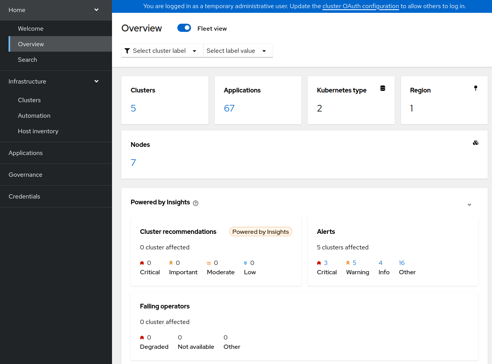

Clicking on each alert you will be forwarded to Grafana dashboard:

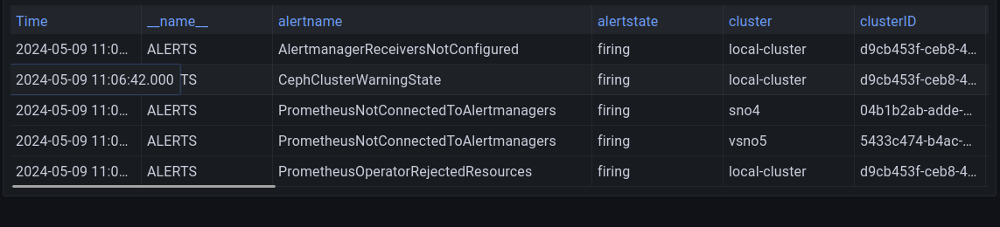

Using Grafana observability dashboard (https://grafana-open-cluster-management-observability.apps.your-domain) you can also check some other metrics and dashboards:

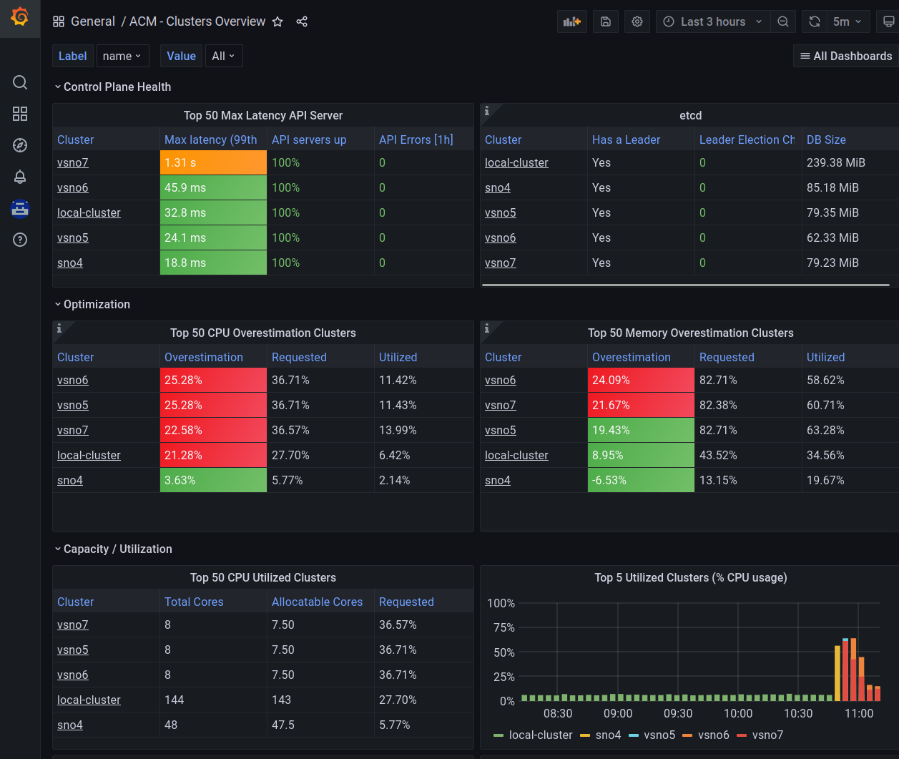

We can browse any of the Prometheus (from the Cluster Monitoring Operator) alert rule per spoke. For example, all the alerts in the hub sno4:

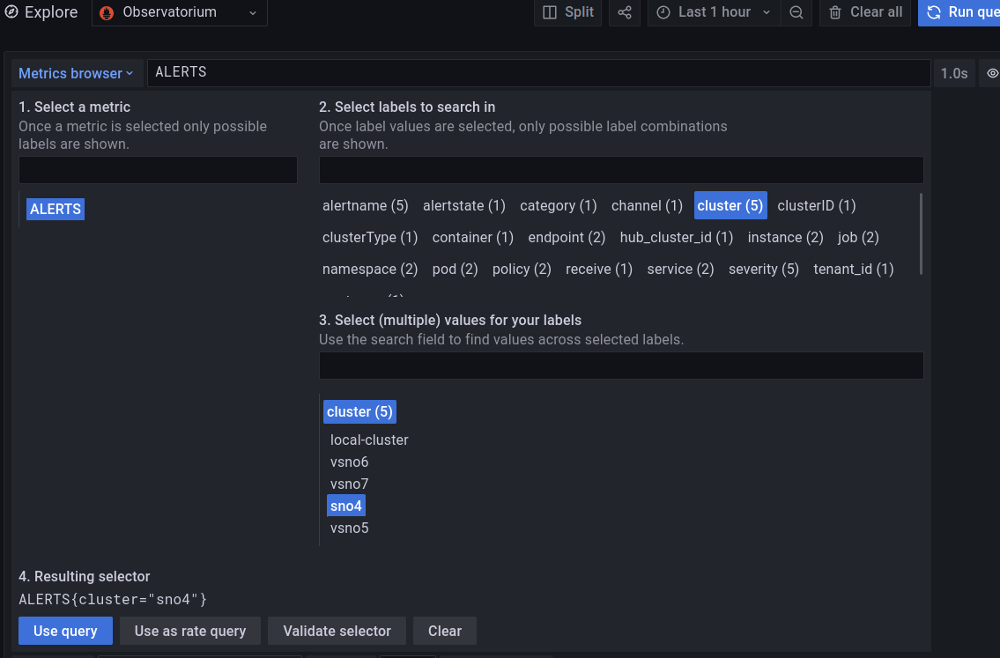

### Playing with Alerts

For example, we can check ACM Policies violations in the last minutes:

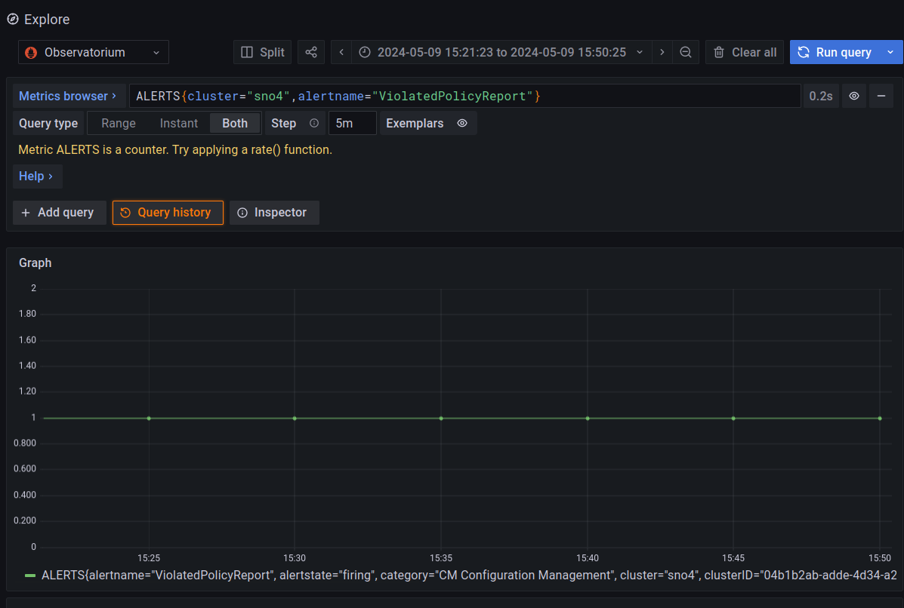

If we fix this Policy violation and we make it compliant:

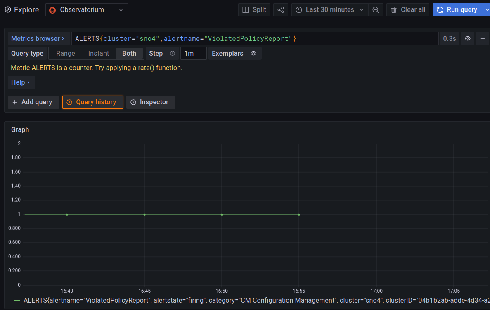


## Which metrics logs are collected per each spoke

Openshift Cluster Monitoring collect metrics, by default, from different sources:
 * Prometheus-adapter: that exports metrics from Kubernetes Node and Pods.
 * kube-state-metric:  converts Kubernetes objects to metrics that Prometheus can use
 * node-exporter: metrics about the node
 * Other services that provides a `/metrics` interface by default:
   * CoreDNS, etcd, kubelet, OLM, OVN, Openshift/Kubernetes API server, etc.
   
For these sources there exists a ServiceMonitor/PodMonitor CR that determinate where (and when) Prometheus will scrap metrics. These are not just a few:

```bash
─> oc get servicemonitors.monitoring.coreos.com -A 
NAMESPACE                                    NAME                                                        AGE
hypershift                                   operator                                                    14d
multicluster-engine                          assisted-service                                            14d
multicluster-engine                          clusterlifecycle-state-metrics-v2                           14d
multicluster-engine                          console-mce-monitor                                         14d
multicluster-engine                          multicluster-engine-operator-metrics                        3d4h
open-cluster-management-agent-addon          mce-hypershift-addon-agent-metrics                          14d
open-cluster-management-agent-addon          ocm-config-policy-controller-metrics                        14d
open-cluster-management-agent-addon          ocm-governance-policy-framework-metrics                     14d
open-cluster-management-observability        alertmanager                                                44h
open-cluster-management-observability        metrics-collector                                           44h
open-cluster-management-observability        observability-observatorium-api                             44h
<REDACTED>

> oc get servicemonitors.monitoring.coreos.com -A  | wc -l
107

```

About Alerts, it will happen the same:

```
> oc get PrometheusRule -A | wc -l
56

```

And you can find more Alerts on:
```
> oc -n openshift-monitoring get cm  prometheus-k8s-rulefiles-0 -o yaml | grep "alert:" | wc -l
296

```

This make us to understand how complete is the whole Monitoring stack. 

Everything related to Monitoring on kube-* and openshift-* NS cannot be modified (or disabled). And you cannot add more ServiceMonitor, PodMonitor, and PrometheusRule on this NSs.

## Real consumption of observability on spokes

Taking measurements of only the Pods related to Observability on the spoke. Cluster Monitoring Operator is fully enabled and it is not measured.

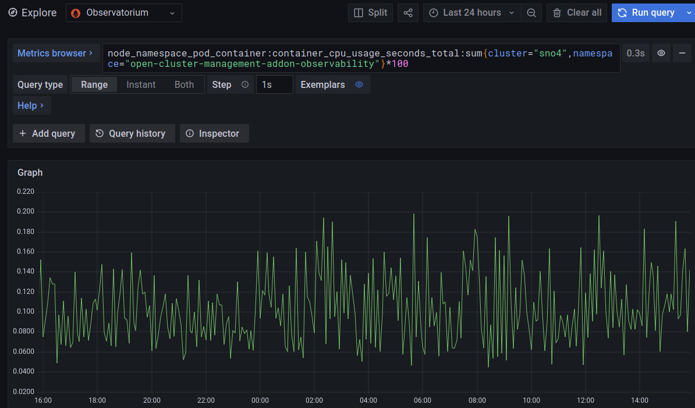

Not even reaching 20% of one Core during the last 24h. Considering this cluster have not any workload running.


## Filtering some metrics

Multicluster Observability allows, in every spoke, to filter with metrics should be forwared to the hub.

For example we have this metric about the Openshift version in every cluster:

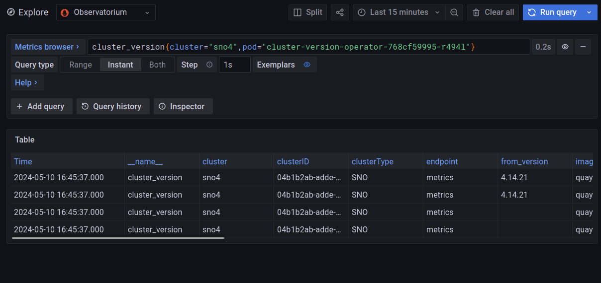

We can see the reported values in the last minutes.

Now, lets disable this metric from the `allowlist`: 

```bash
> oc -n open-cluster-management-addon-observability edit cm observability-metrics-allowlist

# Please edit the object below. Lines beginning with a '#' will be ignored,    
# and an empty file will abort the edit. If an error occurs while saving this file will be
# reopened with the relevant failures.                                         
#                                                                              
apiVersion: v1                                                                 
data:                                                                          
  metrics_list.yaml: |                                                         
    names:                                                                     
    - :node_memory_MemAvailable_bytes:sum                                      
    - ALERTS                                                                   
    - acm_managed_cluster_labels                                               
    - authenticated_user_requests                                              
    - authentication_attempts                                                  
    - cluster:capacity_cpu_cores:sum                                           
    - cluster:capacity_memory_bytes:sum                                        
    - cluster:container_cpu_usage:ratio                                        
    - cluster:container_spec_cpu_shares:ratio                                  
    - cluster:cpu_usage_cores:sum                                              
    - cluster:memory_usage:ratio                                               
    - cluster:memory_usage_bytes:sum                                           
    - cluster:usage:resources:sum                                              
    - cluster_infrastructure_provider                                          
#    - cluster_version                                                         
#    - cluster_version_payload                                 
<REDACTED>
```

if we repeat the previous query again, the metric has not been reported recently:

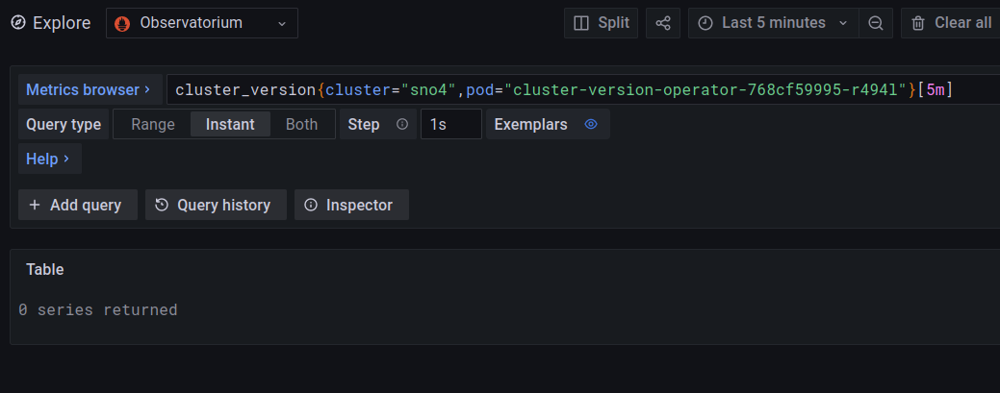

and we have to go longer in the past to find the previous reported values:

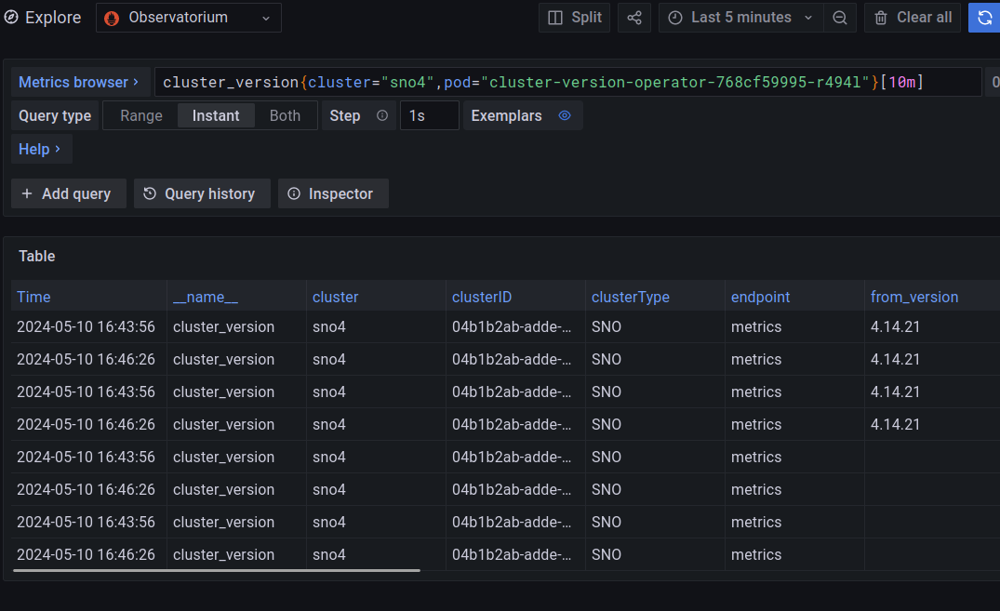

## Disabling an spoke from observability

You only have to label as disabled the `managedcluster` CR of the spoke:

```bash
[hub]> oc label managedcluster vsno5 observability=disabled
[hub]> oc get managedcluster vsno5 -o jsonpath='{.metadata.labels}' | jq
{
  "feature.open-cluster-management.io/addon-cluster-proxy": "available",
  "feature.open-cluster-management.io/addon-config-policy-controller": "available",
  "feature.open-cluster-management.io/addon-governance-policy-framework": "available",
  "feature.open-cluster-management.io/addon-work-manager": "available",
  "observability": "disabled",
<REDACTED>
}

```

When `observability: disabled` the `addon-observability-controller` is no longer available. 

Inmediatly, you can observe how the spoke delete the addon:

```bash
[spoke]> oc -n open-cluster-management-addon-observability get pods -w
NAME                                               READY   STATUS    RESTARTS   AGE
endpoint-observability-operator-6c96c49c67-p69js   1/1     Running   0          147m
metrics-collector-deployment-69cfc56858-brbgc      1/1     Running   0          147m
metrics-collector-deployment-69cfc56858-brbgc      1/1     Terminating   0          148m
metrics-collector-deployment-69cfc56858-brbgc      0/1     Terminating   0          148m
endpoint-observability-operator-6c96c49c67-p69js   1/1     Terminating   0          148m
endpoint-observability-operator-6c96c49c67-p69js   0/1     Terminating   0          148m

```


# Creating an Storage bucket with ODF/CEPH

If you already have ODF in your claster (in my case with an internal CEPH cluster), you can create an object bucket through and object bucket claim.

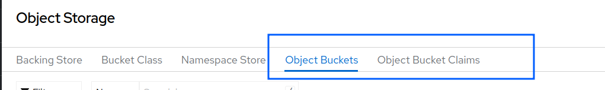

The object bucket claim allows you to use on of your available StorageClasses:

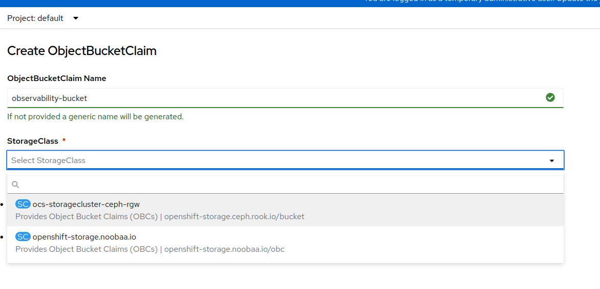

Once the claim is created, an new object bucket is available with all the S3 endpoint and credentials: