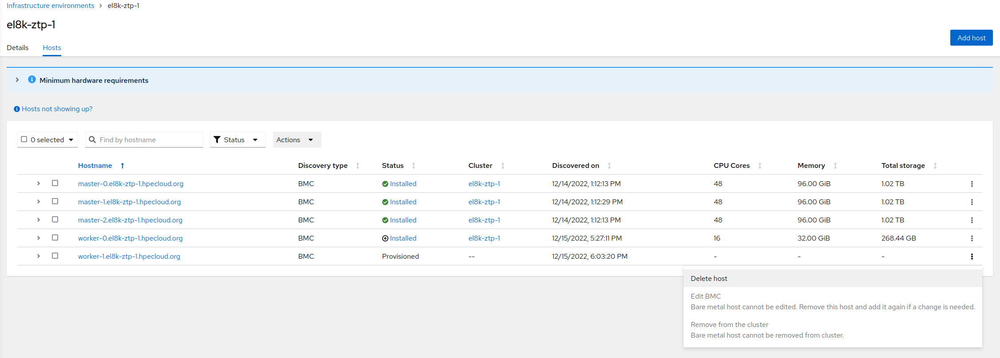
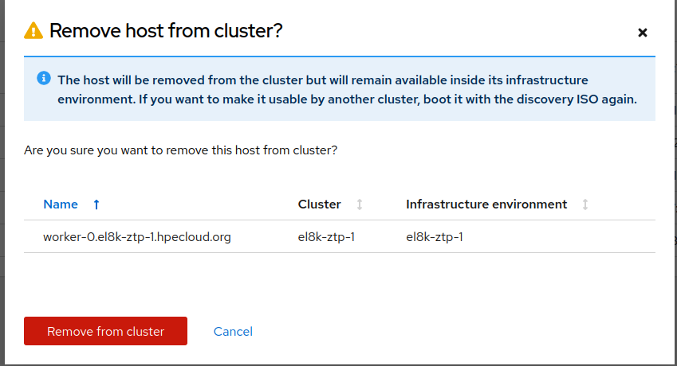
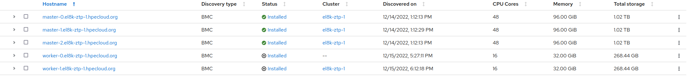
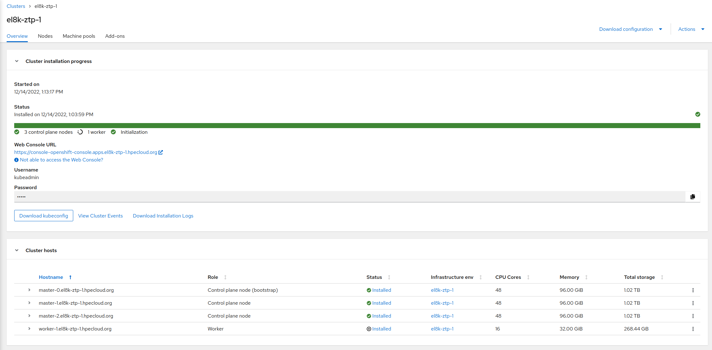
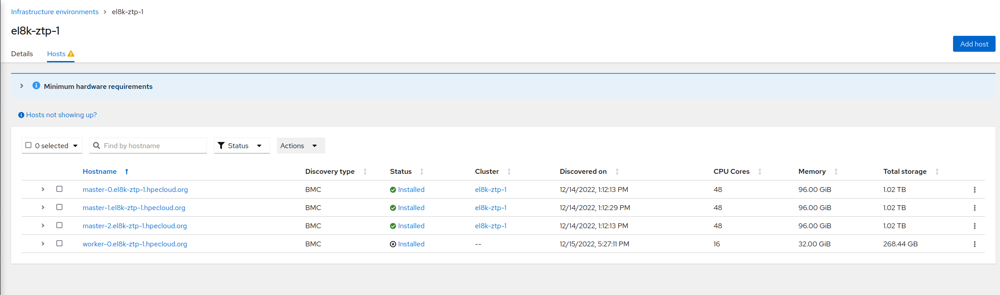
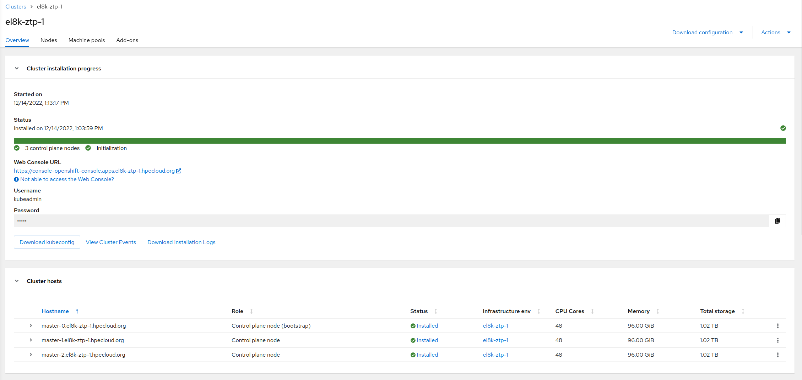

 [draft][ongoing]

# Scaling down clusters created with Zero Touch Provisioning

Here, Zero Touch Provisioning or ZTP, is a set of tools that helps you to deploy Red Hat Openshift (OCP) clusters. Mainly, it is composed by ACM, Openshift Assisted Installer and ArgoCD with a set of specific Kustomize plugins. These plugins, allows you to define your clusters on a single manifest called Siteconfig. More info [here](https://docs.openshift.com/container-platform/4.11/scalability_and_performance/ztp_far_edge/ztp-deploying-far-edge-clusters-at-scale.html)

The whole ZTP stack is composed by many different, independent components. ZTP Plugins, ArgoCD, ACM, Assisted Installer, Baremetal Operator. 

In this combination we still miss a feature that allows to scale down clusters. There is a  [request to implement that feature](https://issues.redhat.com/browse/RFE-3431), but not yet implemented at the time of written this article.

The Assisted Installer deploys an agent service in each host during installation. But after that, the agent finishes and the service is out. We would say that Agent Installer covers the installation, but it is not aware of anything happening in the cluster after the installation. 

## Understanding the installation

*First of all, it is important to notice we are not just using ACM. We are using Red Hat ACM, which is composed by ACM, and other controllers, operators and configurations.*

When you deploy a cluster using ZTP, you have to define your Siteconfig Manifest that will initiate the deployment. Gitops part will take the Siteconfig information to generate the different manifests needed by the other components (ACM, Assisted Installer, BareMetalOperator).

[Here](https://docs.openshift.com/container-platform/4.11/scalability_and_performance/ztp_far_edge/ztp-manual-install.html#ztp-installation-crs_ztp-manual-install) the list of generated manifests/resources.

The most relevant parts are:

* BareMetalHost/BMH that contains information of the BMCs of the different servers to be installed. With this info, the BaremetalOperator can boot servers with an installation ISO.

* The BMH are incorporated into an Infraenv resource, which contains common information for all the hosts, about the infrastructure.

* AgentClusterInstall, contains information of the clusters and the different hosts.

All these three objects (and some others more) are generated by the Siteconfig. And all of them are under the ZTP Gitops control. You would modify Siteconfig adding and deleting hosts. And the corresponding objects will be deleted from the cluster.

BareMetalHost is an object exposed by the BareMetalOperator. With this information, BMO boots the server with an installation ISO. This installation ISO is created/injected into the BMH by the Assisted Installer (or Assisted Service). 

The server boots and initiates an Assisted Service Agent, that will register the host, and it will initiate the OCP installation. [From this moment](https://github.com/openshift/assisted-service/blob/master/internal/controller/controllers/bmh_agent_controller.go#L464-L487), BMH is managed from the AI controller and BMO dont watch/observe any changes on the BMH. 

```yaml
> oc -n el8k-ztp-1 get bmh worker-1.el8k-ztp-1.hpecloud.org -o yaml
apiVersion: metal3.io/v1alpha1
kind: BareMetalHost
metadata:
  annotations:
    argocd.argoproj.io/sync-wave: "1"
    baremetalhost.metal3.io/detached: assisted-service-controller
...
...
...
```

The AI also creates, in the hub, an Agent object. Which contains all the information about the host installation. 

Here we find a first issue with the ZTP flow. The Siteconfig and the ZTP GitOps dont know anything about this Agent object. So, you cannot delete with ZTP a host representation (which includes BMH and Agent).

### Automated Cleaning Mode and Inspection on BMH

AutomatedCleaningMode controls if the disks will be wiped-out before and after installing. With RHACM+BMO this is disabled by default. It is not supported to use Ironic to provides this functionality. Even if you set this enabled, it will be disabled by the an specific controller.

Similarly, Inspection on BMH is a procedure that runs a procedure to collect the hardware info on a Ready host. Maybe after some replacement of hardware. In a regular ACM+BMO scenario, this is done by an Ironic process. Using RHACM+AI this is disabled by default and the discovery is done by the Agent making the installation on each host.

You can see how both are disabled.

```yaml
> oc -n el8k-ztp-1 get bmh worker-1.el8k-ztp-1.hpecloud.org -o yaml
apiVersion: metal3.io/v1alpha1
kind: BareMetalHost
metadata:
  annotations:
...
...
    inspect.metal3.io: disabled
...
spec:
  automatedCleaningMode: disabled
...
```

More [here](https://github.com/openshift/assisted-service/blob/6dbae00c314345388407e8252591d226180d0321/docs/hive-integration/baremetal-agent-controller.md#creating-baremetalhost-resources)

## Scaling down clusters with ZTP

BMH, Infraenv and AgentClusterInstall are created by the Siteconfig and the GitOps flow. So, you would modify the Siteconfig to interact with them. 

In principle, if you delete a host in the SiteConfig, this will delete its corresponding BMH object. But you will see nothing really happens:

* The Assisted Installer contains an Openshift/Kubernetes controller. When a BMH is created, the controller and the Assisted Installer create the installation images for each BMH.

* The AI starts the installation taking the contr

* As an a side-effect of the AI installation (explained above), the BMO has lost the control over the BMH. 

* ```yaml
  > oc -n el8k-ztp-1 get bmh worker-1.el8k-ztp-1.hpecloud.org -o yaml
  apiVersion: metal3.io/v1alpha1
  kind: BareMetalHost
  metadata:
    annotations:
      argocd.argoproj.io/sync-wave: "1"
      baremetalhost.metal3.io/detached: assisted-service-controller
  ...
  ...
  ...
  ```

* The AI controller is not looking for BMHs deletion. But, should the Assisted Installer covers also uninstalling functionality?. Maybe not.

* So no one do anything after deleting the BMH

So, deleting a Siteconfig host (or the corresponding BMH) should not raise anything very meaningful in the Hub. You will not see very much changes on ACM. The BMO controller has been replaced by the AI controller, which is not in charge of any uninstalling or deleting procedure. 

> Anyway, to delete a BareMetalHost/BMH is pretty strange for BareMetalOperator and ACM. BMH is a representation of an existing host. You usually dont erase a BMH, you make it unmanaged, you make a deprovisioning for cleaning and get it ready to be reused, etc.

But also, there is no process saying to the Spoke cluster to delete the host. By delete th hoste, here, we mean: to remove the node as part of the Openshift Cluster. In principle, not needed to delete the host OS or wiping disks. 

* BMO has been in some way disabled (but I dont think it has the logic to do this process). 

* AI dont know anything about uninstalling process. 

In any case, lets do some testings about deleting BMH (and the Agent).

### Trying to delete a host from spoke (ACM GUI)

In this example we can see a cluster with 3 masters and two workers, and the corresponding Agents and BMHs:

```bash
$> oc -n el8k-ztp-1 get agent,bmh
NAME                                                                    CLUSTER      APPROVED   ROLE     STAGE
agent.agent-install.openshift.io/2f03b103-596c-4736-aeed-289e590a8bb0   el8k-ztp-1   true       worker   Done
agent.agent-install.openshift.io/42a4c6df-1598-1e66-efb1-16a1712c8362   el8k-ztp-1   true       master   Done
agent.agent-install.openshift.io/64fee173-6d1b-43bc-ae9d-80b72ee57e6a   el8k-ztp-1   true       worker   Done
agent.agent-install.openshift.io/b023e155-14fa-3c24-c6d7-0b07a0cf6dde   el8k-ztp-1   true       master   Done
agent.agent-install.openshift.io/feeda90a-75c8-c1bb-3ba2-88fb4be2d2b5   el8k-ztp-1   true       master   Done

NAME                                                       STATE         CONSUMER   ONLINE   ERROR   AGE
baremetalhost.metal3.io/master-0.el8k-ztp-1.hpecloud.org   provisioned              true             28h
baremetalhost.metal3.io/master-1.el8k-ztp-1.hpecloud.org   provisioned              true             28h
baremetalhost.metal3.io/master-2.el8k-ztp-1.hpecloud.org   provisioned              true             28h
baremetalhost.metal3.io/worker-0.el8k-ztp-1.hpecloud.org   provisioned              true             43m
baremetalhost.metal3.io/worker-1.el8k-ztp-1.hpecloud.org   provisioned              true             43m
```

You can see the same from the GUI:



Also, you can observe you cannot delete the host, because it is already installed. But you can unbind, or remove from the cluster:



The host is removed from the cluster but its BMH still belongs to the Infraenv. You can see the Infraenv as a pool of hosts. After removing it from the cluster, the host still belongs to the Infraenv and it is released. It could be used in a new installation. 

If we remove from cluster, the host  is released:




```bash
> oc -n el8k-ztp-1 get agent,bmh
NAME                                                                    CLUSTER      APPROVED   ROLE     STAGE
agent.agent-install.openshift.io/2f03b103-596c-4736-aeed-289e590a8bb0   el8k-ztp-1   true       worker   Done
agent.agent-install.openshift.io/42a4c6df-1598-1e66-efb1-16a1712c8362   el8k-ztp-1   true       master   Done
agent.agent-install.openshift.io/64fee173-6d1b-43bc-ae9d-80b72ee57e6a                true       worker   Done
agent.agent-install.openshift.io/b023e155-14fa-3c24-c6d7-0b07a0cf6dde   el8k-ztp-1   true       master   Done
agent.agent-install.openshift.io/feeda90a-75c8-c1bb-3ba2-88fb4be2d2b5   el8k-ztp-1   true       master   Done

NAME                                                       STATE         CONSUMER   ONLINE   ERROR   AGE
baremetalhost.metal3.io/master-0.el8k-ztp-1.hpecloud.org   provisioned              true             29h
baremetalhost.metal3.io/master-1.el8k-ztp-1.hpecloud.org   provisioned              true             29h
baremetalhost.metal3.io/master-2.el8k-ztp-1.hpecloud.org   provisioned              true             29h
baremetalhost.metal3.io/worker-0.el8k-ztp-1.hpecloud.org   provisioned              true             58m
baremetalhost.metal3.io/worker-1.el8k-ztp-1.hpecloud.org   provisioned              true             12m
```

Also, in the cluster we dont see that worker-0:



It has been removed from cluster, but from the GUI, the host still cannot be deleted.  Not sure of the reason. Maybe because of the way of ZTP creating the relations between BMHs, Infraenv and AgentClusterInstall. This would be avoiding the proper unbind process. Actually, If we check the unbound BMH:

```yaml

```

The GUI only allows us to unbind/unregister from cluster. Which seems to be failing.  We still see the worker as part of the Infraenv. In theory, unbound, and ready to be re-used. But we cannot delete the host (BMH).

### Tryng to delete a host from spoke (client)

Now, we directly use oc client to force BMHs and Agents deletion. This time we use the worker-1

```bash
> oc -n el8k-ztp-1 delete agent 2f03b103-596c-4736-aeed-289e590a8bb0 
agent.agent-install.openshift.io "2f03b103-596c-4736-aeed-289e590a8bb0" deleted
> oc -n el8k-ztp-1 delete bmh worker-1.el8k-ztp-1.hpecloud.org
baremetalhost.metal3.io "worker-1.el8k-ztp-1.hpecloud.org" deleted
```

If we go back to the GUI and the Infraenv:



We really see the worker-1 disappeared.  Not just removed from cluster as before. Because we here also deleted the Agent object. But also because we are not doing an unbound, we are directly deleting.
If we take a look to the cluster:



It has been also removed from there. 

### What happened on the spoke side?

Of course, in the spoke side nothing happened in both cases:

```bash
> oc get nodes
NAME                               STATUS   ROLES           AGE     VERSION
master-0.el8k-ztp-1.hpecloud.org   Ready    master,worker   28h     v1.23.12+8a6bfe4
master-1.el8k-ztp-1.hpecloud.org   Ready    master,worker   28h     v1.23.12+8a6bfe4
master-2.el8k-ztp-1.hpecloud.org   Ready    master,worker   28h     v1.23.12+8a6bfe4
worker-0.el8k-ztp-1.hpecloud.org   Ready    worker          49m     v1.23.12+8a6bfe4
worker-1.el8k-ztp-1.hpecloud.org   Ready    worker          3m40s   v1.23.12+8a6bfe4
```

Who should be deleting the worker? Something like 'oc delete node worker-0'.

This functionality is not implemented yet, there is an [RFE for that](https://issues.redhat.com/browse/RFE-3431). So, we would say that what is happening, it is expected, AI does not provide this functionality, and BMO has been replaced as controller.  No one is providing the logic to delete the Openshift Node from the Spoke cluster.

## Workaround for a semi-automatic way of deleting hosts with ZTP

As explained above, ZTP and Gitops are only controlling AgentClusterInstall, BMH and Infraenv. If you delete a host from your Siteconfig, the only resource that ZTP will try to delete is the corresponding BMH. So the GUI will not show very much. The Agent is still there. 

But at the same time, deleting BMH dont really means you are deleting an Openshift Node from their cluster. And none of BMO or AI have this logic. 

We need a semi-automatic way of forcing that:

* Spoke: to really delete the Openshift Node from the cluster.

* Hub: delete the needed resources to not see the host as a kind of released resource.

We really delete the host resources from ACM, not released to be reused. Because ZTP dont seem to follow this re-usability approach. Or at least, by the moment, the only existing interface (Siteconfig) only allows to add/delete hosts. 


### Spoke: Deleting Openshift node from cluster

We will create two Policies into our ZTP GitOps, and the corresponding Rules and Bindings. Something more about how ACM Works [here](https://github.com/jgato/jgato/blob/main/random_docs/ztp-zero-touch-all.md#configuring-with-acm-policies)

The idea is to first taint the node (ideally should be drained) and then delete. Notice the deletion rule has less priority. So we ensure first to make it unschedulable:

```yaml
apiVersion: policy.open-cluster-management.io/v1
kind: Policy
metadata:
  annotations:
    policy.open-cluster-management.io/categories: CM Configuration Management
    policy.open-cluster-management.io/controls: CM-2 Baseline Configuration
    policy.open-cluster-management.io/standards: NIST SP 800-53
    ran.openshift.io/ztp-deploy-wave: "22"
  name: node-drain
  namespace: policies-site
spec:
  disabled: false
  policy-templates:
  - objectDefinition:
      apiVersion: policy.open-cluster-management.io/v1
      kind: ConfigurationPolicy
      metadata:
        name: node-drain-configurationpolicy
      spec:
        namespaceselector:
          exclude:
          - kube-*
          include:
          - '*'
        object-templates:
        - complianceType: musthave
          objectDefinition:
            apiVersion: v1
            kind: Node
            metadata:
              name: worker-0.el8k-ztp-1.hpecloud.org
            spec:
              taints:
              - effect: NoSchedule
                key: node.kubernetes.io/unschedulable
              unschedulable: true
        remediationAction: inform
        severity: low
  remediationAction: inform
---
apiVersion: policy.open-cluster-management.io/v1
kind: Policy
metadata:
  annotations:
    policy.open-cluster-management.io/categories: CM Configuration Management
    policy.open-cluster-management.io/controls: CM-2 Baseline Configuration
    policy.open-cluster-management.io/standards: NIST SP 800-53
    ran.openshift.io/ztp-deploy-wave: "20"
  name: node-remove
  namespace: policies-site
spec:
  disabled: false
  policy-templates:
  - objectDefinition:
      apiVersion: policy.open-cluster-management.io/v1
      kind: ConfigurationPolicy
      metadata:
        name: node-remove-configurationpolicy
      spec:
        namespaceselector:
          exclude:
          - kube-*
          include:
          - '*'
        object-templates:
        - complianceType: mustnothave
          objectDefinition:
            apiVersion: v1
            kind: Node
            metadata:
              name: worker-0.el8k-ztp-1.hpecloud.org
        remediationAction: inform
        severity: low
  remediationAction: inform

---
apiVersion: apps.open-cluster-management.io/v1
kind: PlacementRule
metadata:
  name: node-drain-remove-placementrules
  namespace: policies-site
spec:
  clusterSelector:
    matchExpressions:
      - key: name
        operator: In
        values:
          - el8k-ztp-1
---
apiVersion: policy.open-cluster-management.io/v1
kind: PlacementBinding
metadata:
  name: node-drain-remove-placementbinding
  namespace: policies-site
placementRef:
  apiGroup: apps.open-cluster-management.io
  kind: PlacementRule
  name: node-drain-remove-placementrules
subjects:
  - apiGroup: policy.open-cluster-management.io
    kind: Policy
    name: node-drain
  - apiGroup: policy.open-cluster-management.io
    kind: Policy
    name: node-remove
```

This is working to delete the node, but is is not a very safe procedure. This Policy dont make the node drained before deleting. It just make it unschedulable. Also, after deleting the Node, the first Policy that keep it unschedulable will fail. Because, it tries to keep a non existing Node unschedulable. If we cannot drain it, maybe makes sense to just delete it. 


[ToDo] Instead of deleting the Node, we should try to delete the Machine CR


### Hub: Deleting host resources


When you delete the host from the Siteconfig, automatically the BMH will be deleted. After that, you will have to manually delete the corresponding Agent.

[ToDo] Script to facilitate knowing which agent to delete