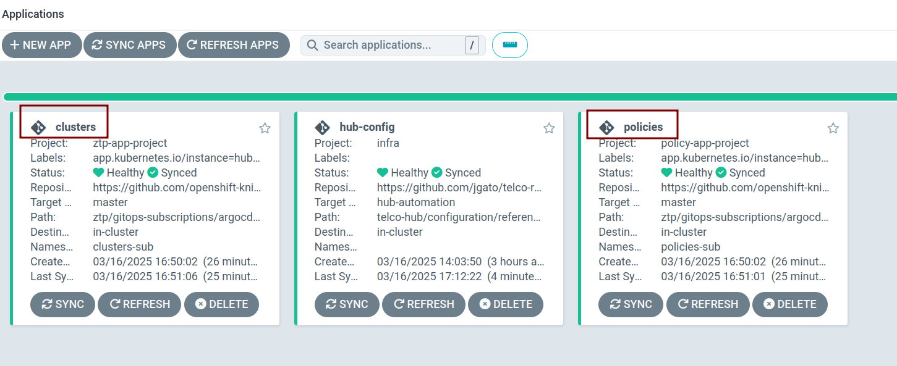

# Creating a Red Hat Telco Hub 

> Notice: this is still a Tech Preview technology. Also, the process to automatize the installation of the hub is still under development. So, you would find changes when reading this document. Consider this as a testing for a future potential to deploy Telco Hubs.

Recently, from Openshift 4.18, it has been released the called "Telco Hub". What is this? Basically, an Openshift cluster that manages other Telco OCP clusters. Therefore, the Telco Hub is an Openshift cluster together with:
 * Red Hat Advanced Cluster Management (RHACM): to enable the whole life-cycle management of other clusters. An OCP cluster that manages other Openshift clusters.
 * These Openshift Clusters are used to deploy Telco Worloads, like [CORE](https://docs.redhat.com/en/documentation/openshift_container_platform/4.17/html/scalability_and_performance/reference-design-specifications#telco-core-ref-design-overview) and [RAN](https://docs.redhat.com/en/documentation/openshift_container_platform/4.17/html/scalability_and_performance/reference-design-specifications). But we dont focus on the configuration of these managed cluster on this document.
 * Openshift-gitops, basically, ArgoCD. That will allow to do the life-cycle management with GitOps methodologies.
 * Zero Touch Provisioning, a set of tools that easiness to describe your infrastruture and configurations together with GitOps. So, you describe your manifests on Git, sync to ArgoCD, and RHACM do the rest.
 * Some more operators for storage, observability, etc.
 
It is an OCP cluster plus other XXX Operators, and all the needed configuration. The operators and the needed configurations (with their requirements) are designed to allow a Telco Hub cluster to manage up to 3500 SNOs (Single Node Openshift). To make this possible (and supportable) the operators and configurations are defined by a **Reference Design Specification document you can read [here]()**. 

Creating the Hub cluster not following the specification would make the cluster to diverge. Making it out of support. The RDS document is very detailed, but we have also [a set of manifests](https://github.com/openshift-kni/telco-reference/tree/main/telco-hub) to create the Telco Hub fully compliant. So, finally, we go to the scope of this document: 

**"How to use [this Git repo](https://github.com/openshift-kni/telco-reference/tree/main/telco-hub), and their manifests, to easily create a Telco Hub. Which is fully compliant with the Telco HUB specification."**

## Staring point, creating and OCP cluster

In order to not make this document to dense, we already start with an OCP cluster. That has been deployed using [Agent Based Installer]() (ABI) as recommended in the RDS. I dont go too much on details about network and hardware requirements, for this demo, I dont really need to manage 3500 other clusters. But basically I have a compact baremetal cluster:

```bash
$ oc get nodes 
NAME                                                STATUS   ROLES                         AGE   VERSION
master-0.hub-1.el8k.se-lab.eng.rdu2.dc.redhat.com   Ready    control-plane,master,worker   19h   v1.31.6
master-1.hub-1.el8k.se-lab.eng.rdu2.dc.redhat.com   Ready    control-plane,master,worker   20h   v1.31.6
master-2.hub-1.el8k.se-lab.eng.rdu2.dc.redhat.com   Ready    control-plane,master,worker   20h   v1.31.6
$ oc get clusterversion
NAME      VERSION   AVAILABLE   PROGRESSING   SINCE   STATUS
version   4.18.4    True        False         19h     Cluster version is 4.18.4

```

There are no extra OLM installed operator but `openshift-gitops`:

```bash
$ oc get operators -A
NAME                                             AGE
local-storage-operator.openshift-local-storage   20h
openshift-gitops-operator.openshift-operators    20h
```

During the ABI deployment I already installed Openshift GitOps operator, that will enable to use ArgoCD. 

This is a little bit tricky: The Telco Hub uses ArgoCD for the life-cycle management, it is part of the specification. But, to convert an OCP cluster into a HuB I also need ArgoCD. I have to break the "chicken and egg problem", Openshift GitOps can be seen as a pre-requirement. 

I have also labeled all the nodes with `cluster.ocs.openshift.io/openshift-storage=` because I want to have ODF for storage.

```bash
$ oc label node master-0.hub-1.el8k.se-lab.eng.rdu2.dc.redhat.com cluster.ocs.openshift.io/openshift-storage=
node/master-0.hub-1.el8k.se-lab.eng.rdu2.dc.redhat.com labeled

$ oc label node master-1.hub-1.el8k.se-lab.eng.rdu2.dc.redhat.com cluster.ocs.openshift.io/openshift-storage=
node/master-1.hub-1.el8k.se-lab.eng.rdu2.dc.redhat.com labeled

$ oc label node master-2.hub-1.el8k.se-lab.eng.rdu2.dc.redhat.com cluster.ocs.openshift.io/openshift-storage=
node/master-2.hub-1.el8k.se-lab.eng.rdu2.dc.redhat.com labeled
```

With the basic requirements full-filled (OCP compact cluster and Openshift GitOps operator), I can convert this compact cluster into a Telco Hub.

## Use ArgoCD to deploy the Telco Hub

First we need to prepare the environment and ArgoCD to apply all the needed manifest.

Clone the [Telco Hub repository](https://github.com/openshift-kni/telco-reference.git) to make some modifications:

> The following steps would be done using the manifests from the repo, in a near future.

First of all you have to modify the ArgoCD App and Project that will point to the Telco Hub git repository. You can find these manifests on `telco-hub/configuration/reference-crs/required/gitops/`:

```
apiVersion: argoproj.io/v1alpha1
kind: Application
metadata:
  name: hub-config
  namespace: openshift-gitops
spec:
  destination:
    server: https://kubernetes.default.svc
  project: infra
  source:
    path: telco-hub/configuration/reference-crs/
    repoURL: https://github.com/jgato/telco-reference.git
    targetRevision: hub-automation
---
apiVersion: argoproj.io/v1alpha1
kind: AppProject
metadata:
  name: infra
  namespace: openshift-gitops
spec:
  destinations:
    - namespace: '*'
      server: '*'
  sourceRepos:
    - '*'
  clusterResourceWhitelist:
    - group: '*'
      kind: '*'
    - group: ""
      kind: Namespace

```

Then create the Manifests:

```
> oc create -f telco-hub/configuration/reference-crs/required/gitops/app-project.yaml -f telco-hub/configuration/reference-crs/required/gitops/argocd-application.yaml
```


With the ArgoCD and Project created, we can see the whole Telco Hub structure: 


The ArgoCD App is mainly pointing to a git repository containing all the needed manifests to convert the cluster, into a Telco Hub. These manifests are already configured to be executed, by ArgoCD, in the proper order. In my case, I am using my own forked version of the [Telco Hub](https://github.com/openshift-kni/telco-reference/tree/main), to do some modifications.

Actually, the ArgoCD app points to a `kustomization.yaml` in the configured repo. There you can point to all the optinal/Required components to be installed and configured:

```yaml
> cat telco-hub/configuration/reference-crs/kustomization.yaml 
---
# It is not expected that this kustomization will be used directly. Most deployments will create an overlay with custom values for environment specific values (eg URL for gitops, disks for LSO, etc). The overlay will include the resources listed here as bases.
apiVersion: kustomize.config.k8s.io/v1beta1
kind: Kustomization
resources:
  - optional/lso/
  - optional/odf-internal/
  - required/gitops/
  - required/acm/
  - required/talm/
  # Include this content if you want to include the argocd
  # configuration and apps for gitops ztp management of cluster
  # installation and configuration
  - required/gitops/ztp-installation
```


As pointed in the description, this kustomiztion file requieres some extra manual configurations. Lets proceed with it:

I have modified the [`LocalVolume` manifest](https://github.com/openshift-kni/telco-reference/blob/main/telco-hub/configuration/reference-crs/required/lso/lsoLocalVolume.yaml) pointing to the disks to be used by the LocalStorage operator. These volumes will be later used by ODF. In my case, I modified the `devicePaths:` to point use disks on `/dev/nvme1n1`:

```yaml
---
apiVersion: "local.storage.openshift.io/v1"
kind: "LocalVolume"
metadata:
  name: "local-disks"
  namespace: "openshift-local-storage"
  annotations:
    argocd.argoproj.io/sync-wave: "2"
    argocd.argoproj.io/sync-options: SkipDryRunOnMissingResource=true
spec:
  nodeSelector:
    nodeSelectorTerms:
    - matchExpressions:
        - key: cluster.ocs.openshift.io/openshift-storage
          operator: In
          values:
          - ""
  storageClassDevices:
    - storageClassName: "local-sc"
      forceWipeDevicesAndDestroyAllData: true
      volumeMode: Block
      devicePaths:
        - /dev/nvme1n1
```


Create the following Secret, with your pull-secret, to pull needed images for MultiClusterHub observability:

```
apiVersion: v1
data:
  .dockerconfigjson: ewogICJhdX...gIH0KICB9Cn0=
kind: Secret
metadata:
  name: multiclusterhub-operator-pull-secret
  namespace: open-cluster-management-observability
type: kubernetes.io/dockerconfigjson


```


The Telco Hub is by default designed to work in disconnected environments. That means you will have your mirrored container's registries. Not my case, so I have changed the Openshift marketplace to work as it was not a disconnected environment:
 
```bash
> find . -type f -exec sed -i 's/-disconnected//g' {} +
```

Configure ACM AgentServiceConfig: 
 * I have a connected environment, so, removed internal registry section.
 * RHCOS url configured to use the official repository.
 * Configured `storageClassName=ocs-storagecluster-cephfs`
 
```yaml
---
apiVersion: agent-install.openshift.io/v1beta1
kind: AgentServiceConfig
metadata:
  name: agent
  annotations:
    argocd.argoproj.io/sync-wave: "7"
    argocd.argoproj.io/sync-options: SkipDryRunOnMissingResource=true
spec:
  databaseStorage:
    storageClassName: ocs-storagecluster-cephfs
    accessModes:
      - ReadWriteOnce
    resources:
      requests:
        storage: 20Gi
  filesystemStorage:
    storageClassName: ocs-storagecluster-cephfs
    accessModes:
      - ReadWriteOnce
    resources:
      requests:
        storage: 20Gi
  imageStorage:
    storageClassName: ocs-storagecluster-cephfs
    accessModes:
      - ReadWriteOnce
    resources:
      requests:
        storage: 100Gi
  osImages:
  - cpuArchitecture: "x86_64"
    openshiftVersion: "4.17"
    rootFSUrl:  https://mirror.openshift.com/pub/openshift-v4/x86_64/dependencies/rhcos-4.17.0-x86_64-live-rootfs.x86_64.img
    url: https://mirror.openshift.com/pub/openshift-v4/x86_64/dependencies//rhcos-4.17.0-x86_64-live.x86_64.iso
    version: "417.94.202409121747-0"

```

Configure MultiClusterHub Observability storage class:

```
---
apiVersion: observability.open-cluster-management.io/v1beta2
kind: MultiClusterObservability
metadata:
  name: observability
  annotations:
    argocd.argoproj.io/sync-wave: "10"
    argocd.argoproj.io/sync-options: SkipDryRunOnMissingResource=true
    # avoids MultiClusterHub Observability to own/manage the
    # spoke clusters configuration about AlertManager forwards.
    # ZTP Policies will be in charge of configuring it
    # https://issues.redhat.com/browse/CNF-13398
    mco-disable-alerting: "true"
spec:
  # based on the data provided by acm-capacity tool
  # https://github.com/stolostron/capacity-planning/blob/main/calculation/ObsSizingTemplate-Rev1.ipynb
  # for an scenario with:
  # 3500SNOs, 125 pods and 4 Namespaces (apart from Openshift NS)
  # storage retention 15 days
  # downsampling disabled
  # default MCO Addon configuration samples_per_hour, pv_retention_hrs.
  # More on how to stimate: https://access.redhat.com/articles/7103886
  advanced:
    retentionConfig:
      blockDuration: 2h
      deleteDelay: 48h
      retentionInLocal: 24h
      retentionResolutionRaw: 15d
  enableDownsampling: false
  observabilityAddonSpec:
    enableMetrics: true
    interval: 300
  storageConfig:
    storageClass: "ocs-storagecluster-cephfs"
    alertmanagerStorageSize: 10Gi
    compactStorageSize: 10Gi
    metricObjectStorage:
      key: thanos.yaml
      name: thanos-object-storage
    receiveStorageSize: 10Gi
    ruleStorageSize: 10Gi
    storeStorageSize: 10Gi
```

The selection of StorageClass has to be set, because it is not mandatory to have ODF. So, your StorageClasses would be different.

And that is all.


## Convert the OCP cluster to a Telco Hub

Go ahead and sync. After a while all the objects should be sync. This can take a while, specially, installing some operators.


After a while:


So finally your OCP cluster is now a compliant Telco HUB.

What do you have? Some more olm operators:

```bash
$ oc get operators -A
NAME                                                   AGE
advanced-cluster-management.open-cluster-management    141m
cephcsi-operator.openshift-storage                     140m
local-storage-operator.openshift-local-storage         169m
mcg-operator.openshift-storage                         140m
multicluster-engine.multicluster-engine                133m
ocs-client-operator.openshift-storage                  140m
ocs-operator.openshift-storage                         140m
odf-csi-addons-operator.openshift-storage              140m
odf-operator.openshift-storage                         141m
odf-prometheus-operator.openshift-storage              140m
openshift-gitops-operator.openshift-gitops-operator    141m
openshift-gitops-operator.openshift-operators          169m
recipe.openshift-storage                               140m
redhat-oadp-operator.open-cluster-management-backup    130m
rook-ceph-operator.openshift-storage                   140m
topology-aware-lifecycle-manager.openshift-operators   141m
```

ODF configured provisioning dynamic classes storage:

```bash
$ oc get sc
NAME                          PROVISIONER                             RECLAIMPOLICY   VOLUMEBINDINGMODE      ALLOWVOLUMEEXPANSION   AGE
local-sc                      kubernetes.io/no-provisioner            Delete          WaitForFirstConsumer   false                  150m
ocs-storagecluster-ceph-rbd   openshift-storage.rbd.csi.ceph.com      Delete          Immediate              true                   94m
ocs-storagecluster-ceph-rgw   openshift-storage.ceph.rook.io/bucket   Delete          Immediate              false                  143m
ocs-storagecluster-cephfs     openshift-storage.cephfs.csi.ceph.com   Delete          Immediate              true                   94m
openshift-storage.noobaa.io   openshift-storage.noobaa.io/obc         Delete          Immediate              false                  92m

```

You have RHACM ready to deploy and manage other Telco clusters:


With Assisted Service that will manage the installation of new clusters:

```bash
$ oc -n multicluster-engine get pod | grep assisted
assisted-image-service-0                               1/1     Running   0              64s
assisted-service-5f584f44d-5g5zf                       2/2     Running   0              63s
```

MultiClusterHub Observability gathering metrics from your fleet:


[Zero Touch Provisioning](https://docs.redhat.com/en/documentation/openshift_container_platform/4.18/html/edge_computing/ztp-deploying-far-edge-clusters-at-scale#ztp-challenges-of-far-edge-deployments_ztp-deploying-far-edge-clusters-at-scale) configured inside ArgoCD, enabling you to do the GitOps using [Siteconfigs](https://docs.redhat.com/en/documentation/openshift_container_platform/4.18/html/edge_computing/ztp-deploying-far-edge-clusters-at-scale#ztp-creating-ztp-crs-for-multiple-managed-clusters_ztp-deploying-far-edge-clusters-at-scale) and [PolicyGenTemplates](https://docs.redhat.com/en/documentation/openshift_container_platform/4.18/html/edge_computing/ztp-deploying-far-edge-clusters-at-scale#ztp-configuring-cluster-policies_ztp-deploying-far-edge-clusters-at-scale):

```bash
$ oc -n openshift-gitops get argocds.argoproj.io openshift-gitops -o yaml | grep -C 5 ztp-site
    initContainers:
    - args:
      - /.config
      command:
      - /exportkustomize.sh
      image: registry.redhat.io/openshift4/ztp-site-generate-rhel8:v4.17.0
      imagePullPolicy: Always
      name: kustomize-plugin
      terminationMessagePath: /dev/termination-log
      terminationMessagePolicy: File
      volumeMounts:

```

I have also included the creation of two new ArgoCD Applications, one for containing your ZTP Siteconfigs and other for the ZTP PolicyGenTemplates:



But needs to be tuned to point to real git repo containing these Siteconfigs and PolicyGenTemplates.

And some more extras included in the Telco Hub RDS, like backup and restore, TALM, etc.


## Conclusions

To have a cluster with all the characteristics to manage a huge fleet of other Telco Cluster, needs a clear specification and set of requirements. For that reason, the Telco Hub RDS was created. 

There are many ways you can achieve a Telco Hub, following the specification document on your own, or using the Telco Hub Git repository and all their manifest. But at the end, it is important to have an specification that defines how a cluster can be called a Telco Hub, and therefore, supported to enable all the expected needs.
