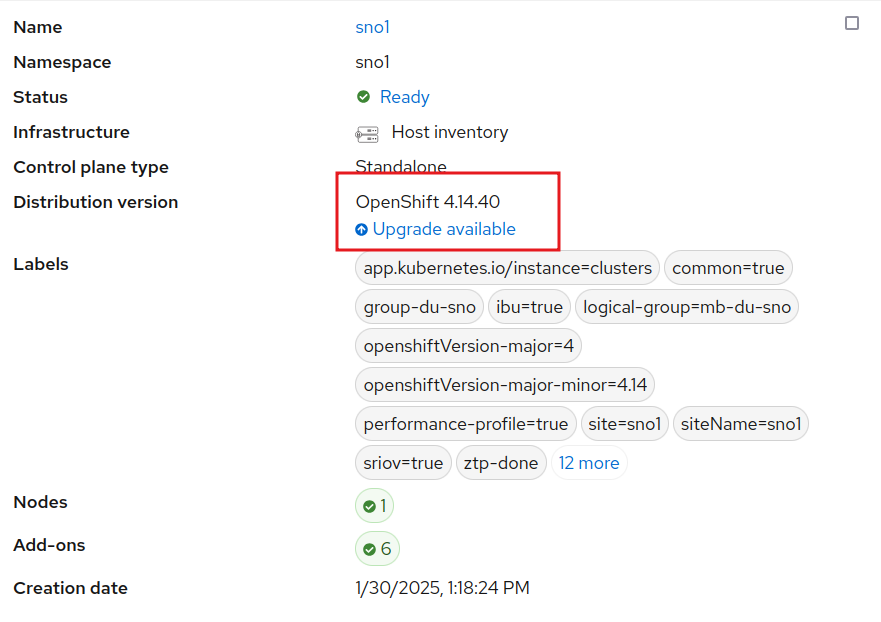
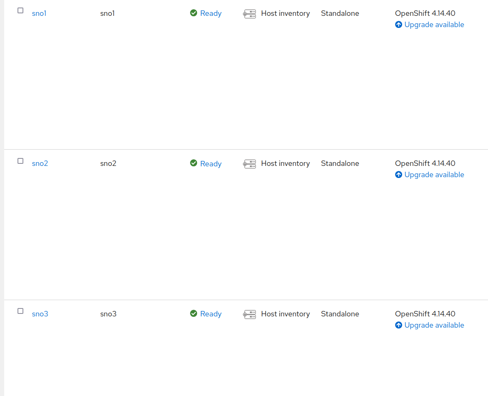
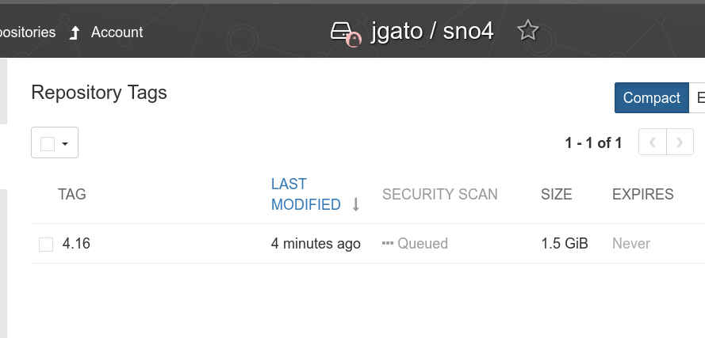

# Upgrading clusters with Image Base Upgrade (IBU)

In this blog, I will focus on how to proceed on upgrading the clusters of your infrastructure, managed by Red Hat Advanced Cluster Management (RHACM). More in concrete, using the new upgrade mechanism called Image Base Upgrade.

Previously, you could upgrade your infrastructure, just using the Openshift usual upgrade way:


Or, just using the `oc cli`, [more in the official documentation](https://docs.openshift.com/container-platform/4.16/updating/updating_a_cluster/updating-cluster-cli.html).

Both methods trigger the same procedure, that it will update the operative system, Openshift, operators, etc. For a Single Node Openshift (SNO) this time would vary depending on the configuration. But it would be around 60/70 minutes.

When we move to telecommunications scenarios, SNOs are designed to run the Telco Radio Access Network. You can think on the software managing every antenna, and your infrastructure would be composed by thousands of antennas that you need upgrade. The process is done during a maintenance window, and the requirements on time are super strict. 

Therefore, IBU comes to solve this scenario, providing a mechanisms that provides upgrades on about 25 minutes. IBU is based on creating an image from a called "seed" clusters. All the clusters in your infrastructure, that can be considered as clones of this seed cluster, could be upgraded by this image. So, the mechanism is very good on this telco RAN scenarios, very homogeneous and composed by SNO. But IBU is not suitable for multi node clusters, or heterogeneous infrastructures. Actually, IBU contains some pre-checks related to configurations for telco RAN.

During this blog I will briefly cover how this new upgrade process works. But, I will not go into detail on how configure, install, deploy your infrastructure. The starting scenario is composed by three SNOs, already installed, configured and managed by ACM.


Notice how all these are based on Openshift 4.14, and we want to upgrade to 4.16. Other advantage of IBU, is that we can move directly to 4.16. Not needing to go through 4.15 first (1 hour) and then 4.16 (1 hour.).

There is a fourth SNO4 cluster that will be used as seed clusters. All the clusters are based on the same hardware, software, and network configuration.

## Using the seed cluster to create the upgrade image

The whole process I am explained is more detailed [here](https://docs.openshift.com/container-platform/4.16/edge_computing/image_based_upgrade/cnf-understanding-image-based-upgrade.html)

The seed cluster is a kind of clone cluster that contains the software and desired version. In this case, SNO4 has been deployed with Openshift 4.16, that is the desired version to upgrade. But it contains the same hardware and network than the others.

The seed cluster is something that should be considered as en ephemeral cluster. It should be installed, configured, created the seed and disappear. It does not contain any extra workload, or, these will be received by the upgrade clusters later. The seed cluster is not a cluster that has been running for a time. Otherwise, we would create an image not so clean as expected. 

If the seed cluster is part of ACM (or ZTP), it should be first detached. To create an image not containing workloads related to ACM.

Apart from the usual Openshift installation, and the RAN configurations (that we don cover in this blog), it needs two extra operators:
 * [Operator life-cycle agent](https://docs.openshift.com/container-platform/4.16/edge_computing/image_based_upgrade/preparing_for_image_based_upgrade/cnf-image-based-upgrade-install-operators.html#cnf-image-based-upgrade-installing-lifecycle-agent-using-cli_install-operators): that trigger the image creation.
 * [OADP](https://docs.openshift.com/container-platform/4.16/backup_and_restore/application_backup_and_restore/installing/oadp-installing-operator.html#oadp-installing-operator-doc) (OpenShift APIs for Data Protection) for backups management. The seed cluster does not do any backup, but upgraded clusters will do a restore of their own workloads. So, the operator is packaged with the image. When the clusters are upgraded, they will contain this operator, that will be used to trigger a restore of the previous running workloads. 
 
Check the official documentation of each operator about how to do the installation. But, it is just an usual Openshift operator installation.

After that, we have to trigger the seed creation. First, we create a secret with the authentication details for the container registry to store the image:

```
apiVersion: v1
kind: Secret
metadata:
  name: seedgen
  namespace: openshift-lifecycle-agent
type: Opaque
data:
  seedAuth: <jgato_quay_authentication>
```

In my case I use quay.io and the `seedAuth` is base64 encoded of a json similar to:

```
{
	"auths": {
		"quay.io/jgato": {
			"auth": "amdhdG9......FuX0c2bmE="
		}
	}
}
```

Now, we trigger the seed creation with:

```
apiVersion: lca.openshift.io/v1
kind: SeedGenerator
metadata:
  name: seedimage
spec:
  seedImage: quay.io/jgato/sno4:4.16
```

We can observe the image creation:
```
$ oc create -f seedgenerator.yaml  && oc get seedgenerators.lca.openshift.io  -w
seedgenerator.lca.openshift.io/seedimage created
NAME        AGE   STATE   DETAILS
seedimage   0s            
seedimage   0s    SeedGenInProgress   Waiting for system to stabilize
seedimage   2s    SeedGenInProgress   Starting seed generation
seedimage   2s    SeedGenInProgress   Pulling recert image
seedimage   7s    SeedGenInProgress   Preparing for seed generation
seedimage   8s    SeedGenInProgress   Cleaning cluster resources
seedimage   80s   SeedGenInProgress   Launching imager container
seedimage   80s   SeedGenInProgress   Launching imager container

```

In this moment, kubelet is stoped, and a container is created (outside Openshift) to create the image. After a while, kukbelet will be restarted and:

```
$ oc get seedgenerators.lca.openshift.io  -w
NAME        AGE   STATE              DETAILS
seedimage   21s   SeedGenCompleted   Seed Generation completed

```

The image has been generated and upload it to my quay.io.



## Using the seed image to upgrade a cluster

As a difference of a seed cluster, the cluster to be upgrade is an operational cluster and it would be running whatever workload. These extra workloads will be included on a backup (by OADP), and recovered after the upgrade. A part from that, all the clusters are practically the same.

