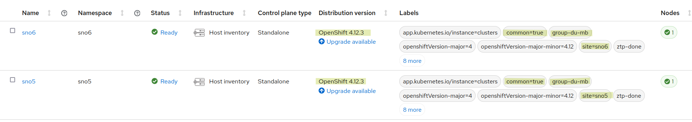
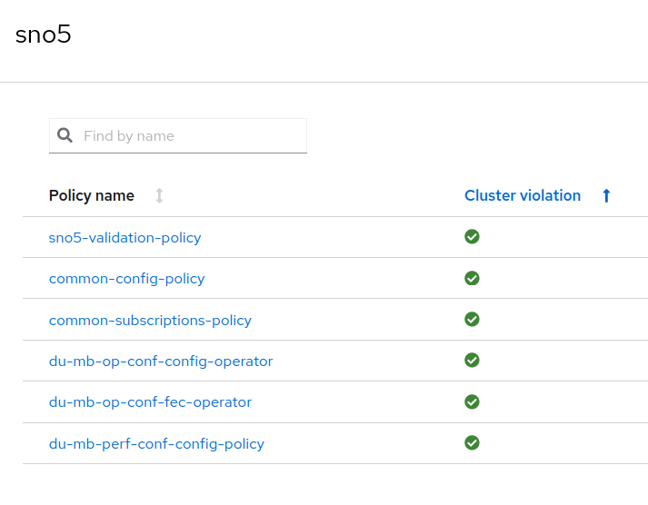
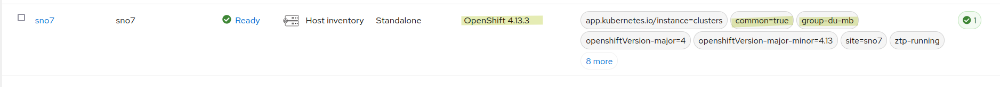
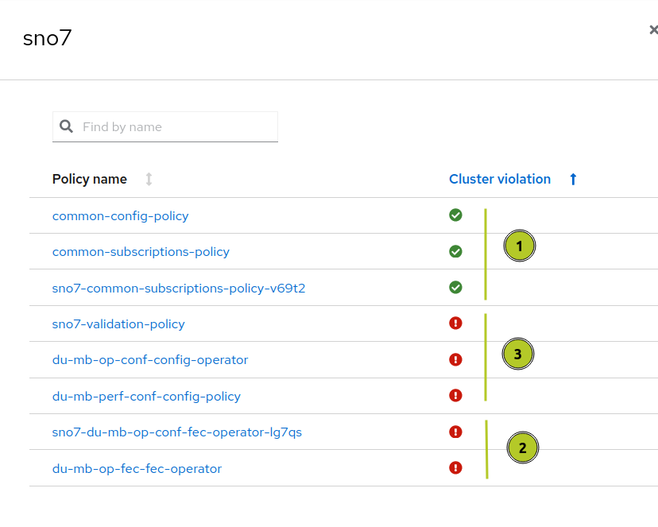
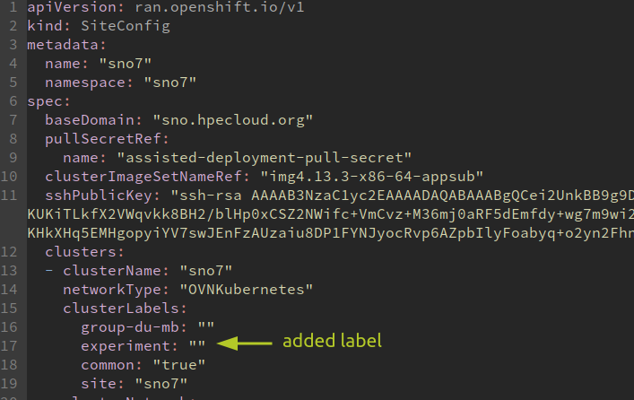
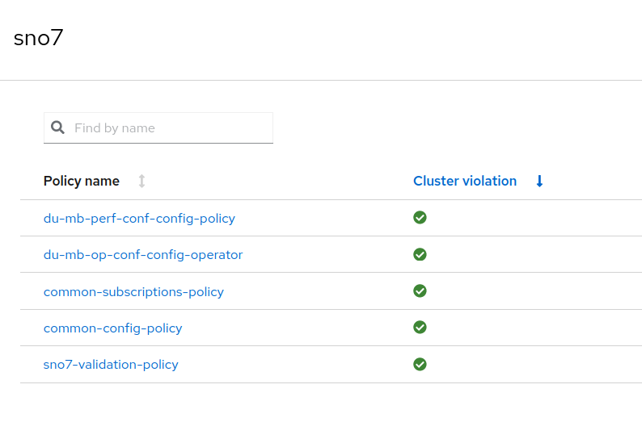

# Working with exceptions on your ZTP/RHACM infrastructure

[Red Hat ACM](https://www.redhat.com/en/technologies/management/advanced-cluster-management) allows you to deploy, upgrade, configure different Spoke clusters, from a Hub cluster. It is an Openshift cluster that manages other clusters.

Together with this platform, your infrastructure, and the configuration of this infrastructure, can be defined using a [GitOps methodology and tools](https://docs.openshift.com/container-platform/4.12/scalability_and_performance/ztp_far_edge/ztp-deploying-far-edge-clusters-at-scale.html). 

The [PolicyGenTemplates](https://docs.openshift.com/container-platform/4.12/scalability_and_performance/ztp_far_edge/ztp-configuring-managed-clusters-policies.html) allows you to define the Policies that will manage the configuration of your infrastructure. These configurations will be linked to the group/clusters of you infrastructure with a set of labels:

```yaml
apiVersion: ran.openshift.io/v1
kind: PolicyGenTemplate
metadata:
  name: "group-du-sno"
  namespace: "ztp-group"
spec:
  bindingRules:
    group-du-sno: ""

```

All the clusters with the `group-du-sno:""` label, will be affected by the `Policies`generated by this `PolicyGenTemplate` or `PGT`.

All the clusters in this group are automatically configured according to this PGT. But, what happens if we need to make exceptions? What if a cluster, that logically belongs to that group, needs to be configured exceptionally? 

We need to set exceptions, but,  we dont want to make the cluster to be out of this group. Because, it actually (and logically) belongs to it, and because, it would be affected by other configurations for that group, that we want to happen. Maybe, this exceptional behavior is going to be temporal.  

Therefore, the mechanism that we will use cannot brake with the logic of groups. The cluster will belong to that group, with some exceptional configurations. And the most important thing: "the exceptional configuration of that cluster would be reverted. Making the cluster to be configured exactly the same than the other components of the group". 

The following tutorial shows up how to manage your Zero Touch Provisioning with exceptions on configurations, and an easy way of revert exceptions back to a normal configuration.

## The scenario

For this tutorial we will focus on an scenario with three Single Node Openshift (SNOs). All of them are intended to be used in a telco environment to deploy a Midband Distribution Unit. But this is just an example, and the way of proceeding can apply to whatever other scenario with ZTP having to implement exceptions on some configurations. 

SNO5 and SNO6 are already deployed and working. Both are based on OCP4.12 and have been configured for a Midband DU. In their configuration, we can see the groups they belong to and the OCP version.



From the RHACM GUI, we can see they belong to the groups: `common` and `group-du-mb`. Also, they are individually affected by the configurations regarding their `site name`. 

In addition, we can see the label `ztp-done`, that confirms the clusters have been correctly configured by ZTP. And therefore, workloads can be deployed. 

Going further about Polices, we can also see, the different configurations (Policies) that have been applied. 



With this scenario as base, we want to introduce a new SNO for a MB DU. But now, we want to test our configurations with OCP4.13. The idea, is to start experimenting if the workloads to be deployed can run in this environment. With the intention of detecting possible issues and missconfigurations. Therefore, we need to reach to the `ztp-done` considering that everything would not be 100% available yet, and, some exceptions would be considered.

The implemented mechanisms has to:

* To not affect the current deployments and configurations. Here, for demoing reasons, we are using only 3 SNOs and some few configurations. Imagine scenarios with hundreds of clusters, and dozens of configurations. 

* To allow exceptions on some configurations. At the same time, we cannot make the infrastructure definition and configuration more complex.

* The cluster with exceptions belongs to the groups that should belong. In this case, the cluster is part of the group `group-du-mb`. No matter if it contains exceptions. From a logical and functional point of view, the cluster is a DU MB.

* The exceptions can be, easily, reverted. 

## Adding a new cluster with exceptions

As we have explained above, our new cluster SNO7 will be deployed using OCP4.13.



The cluster installation with OCP4.13 has been done correctly, and the cluster configuration is managed by the labels: `common` and `group-du-mb`. But we can also see, in the labels, how `ztp-running` point us that it is not fully configured. It is not ready for day-2 and workloads deployments.

If we take a look to the Policies on RHACM, we can see the Policies that are trying to be applied.



1) These three first Policies install all the configurations for the clusters labelled as common. It is expected this will work. Common policies are pretty generic to all environments.
2. These are the ones failing. Without going very much on details, `sno7-du-mb-op-conf-fec-operator-lg7qs` is the one trying to remediate the Policy `du-mb-op-fec-operator`. And for some reason is failing.

3. These Policies are not even trying to be applied. These are awaiting the previous one to succeed, before continuing. This is default behavior remediating Policies.

So what is our situation now? For some reason, we have a Policy which is failing, maybe we dont need it in this case, or we want to proceed anyway. But for sure, it is avoiding other Policies (for this `group-du-mb` and maybe others) to apply their configurations. And finally, we cannot run the last Policy with the final `validation-policy` that will check the readiness and it will bring the `ztp-done`label. 

For only one failing configuration we cannot proceed with our testing cluster.

The reason for the failure, it is an operator that dont exist (yet) on the OCP 4.13 catalog. The reasons is not very relevant, because this is only one example, and other similar situations would happen. Actually, in this case, we know the Operator will appear in the Catalog very soon. So, this encourage us to create an exception to continue with the configuration. When the Operator is available, we can remove, easily, the exception.

## Creating the configuration exceptions

The `du-mb-op-fec-fec-operator`Policy comes from a PolicyGenTemplate in our GitOps repository:

```yaml
apiVersion: ran.openshift.io/v1
kind: PolicyGenTemplate
metadata:
  name: "du-mb-op-fec"
  namespace: "ztp-group"
spec:
  bindingRules:
    group-du-mb: ""
  mcp: "master"
  sourceFiles:
    # Install fec operator as part of the DU
    - fileName: AcceleratorsNS.yaml
      policyName: "fec-operator"
    - fileName: AcceleratorsOperGroup.yaml
      policyName: "fec-operator"
    - fileName: AcceleratorsOperatorStatus.yaml
      policyName: "fec-operator"
    - fileName: AcceleratorsSubscription.yaml
      policyName: "fec-operator"


```

And this Operator dont exists, yet, on our new OCP 4.13. We can observe this on the details of the Subscription (on the SNO7 cluster) that is trying to be created:

```bash
[SNO7]$ oc -n vran-acceleration-operators get subscriptions.operators.coreos.com sriov-fec-subscription  -o jsonpath={.status.conditions[1]} | jq
{
  "message": "constraints not satisfiable: no operators found in package sriov-fec in the catalog referenced by subscription sriov-fec-subscription, subscription sriov-fec-subscription exists",
  "reason": "ConstraintsNotSatisfiable",
  "status": "True",
  "type": "ResolutionFailed"
}

```

We can modify the PolicyGenTemplate conditions about which clusters will be affected. Currently, all the clusters with `group-du-mb` are affected, but we will add an exception in the PGT:

```yaml
apiVersion: ran.openshift.io/v1
kind: PolicyGenTemplate
metadata:
  name: "du-mb-op-fec"
  namespace: "ztp-group"
spec:
  bindingRules:
    group-du-mb: ""
  bindingExcludedRules:
    experiment: ""
```

Now, the PGT will affect to the clusters in the group `group-du-mb`, except for the ones that also belong to the group `experiment`. Our cluster still belongs to the `group-du-mb` but it is not going to be affected. 

Of course, we also need to label the cluster with this new label `experiment`. In order to do that, we edit the Siteconfig of the SNO7 in our GitOps repository.



## Checking the new status

With the new exception added, the cluster is not affected by the Policy `du-mb-op-fec-operator`. And the configuration will continue applying the configurations related to this cluster. 



We have reached the final validation and the cluster is `ztp-done`. We can start deploying workloads.

## Revert back to a normal configuration

Just removing the label `experiment` from the Siteconfig will make the cluster, to be affected by all the Policies of the group `group-du-mb`. So, to revert our exceptionally is very easy to achieve. 

## Conclusions

Using cluster's labels, `bindingExcludedRules` and `bindingRules`, we can work at very detailed level about how we want to configure our clusters. In this tutorial, we have seen how to implement exceptions for clusters groups, not having to create multiple copies of a Policy for different groups or subgroups. The exceptions allow us to skip some configurations, with an easy way of going back to a normal configuration.

For a second tutorial, we will go further about using these exceptions. Not only to skip configurations, but also, to apply a different configuration with the exception. For example, in the scenario covering in this tutorial, an exception could install a new `Catalogsource`which contains that missing operator.


