*This work officially published as [Red Hat blog](https://www.redhat.com/en/blog/working-subgroups-and-configurations-your-ztpred-hat-advanced-cluster-management-kubernetes-infrastructure). Consider this link as the official version of the document.*

# Working with subgroups and configurations on your ZTP/RHACM infrastructure

[Red Hat ACM](https://www.redhat.com/en/technologies/management/advanced-cluster-management) allows you to deploy, upgrade and configure different Spoke clusters, from a Hub cluster. It is an Openshift cluster that manages other clusters. The infrastructure, and its configuration, can be defined using [RHACM Governance](https://access.redhat.com/documentation/en-us/red_hat_advanced_cluster_management_for_kubernetes/2.7/html/governance/governance). 
This governance, allows you to define configurations in the way of Policies. Very briefly, these Policies defines sets of `mustHave`or `mustNotHave`objects:

```yaml
apiVersion: policy.open-cluster-management.io/v1
kind: Policy
metadata:
    <REDACTED>
    name: du-mb-op-conf-config-operator
    namespace: ztp-group
spec:
    <REDACTED>
    policy-templates:
        - objectDefinition:
            <REDACTED>
            spec:
                <REDACTED>
                object-templates:
                    - complianceType: musthave
                      objectDefinition:
                        apiVersion: local.storage.openshift.io/v1
                        kind: LocalVolume
                        <REDACTED>
                        spec:
                            logLevel: Normal
                            managementState: Managed
                            <REDACTED>
```
Then, bindings and placement rules, matches these Policies to different Spoke clusters of your infrastructure

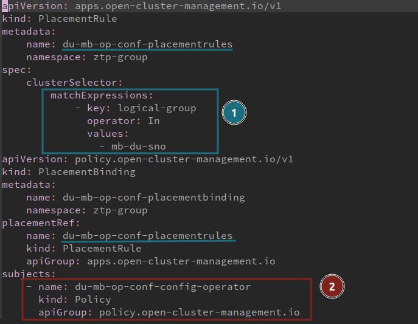
1. The PlacementRule select a set of clusters
2. The PlacementBinding, binds the PlacementRule with existing Policies 

All the clusters with the `logical-group: "mb-du-sno"` label, will be affected by the `Policy` `du-mb-op-conf-config-operator`. And therefore, different sets of `mustHave` and `mustNotHave`will define its desired status. Which can be considered as validated.

But, how would be a proper procedure to take a set, or subgroup, of these cluster to test some new Policies?. Or, how would we take some clusters, out of its logical group, to test some new configurations?. 

This tutorial shows how to use RHACM Governance and subgroups, to safety test new configurations. The tutorial is divided into the following steps: 
 * Existing scenario with a set of clusters belonging to  an specific logical group. We need to test and validate a new configuration.
 * The configurations are managed by RHACM Governance Policies.
 * To create subgroup, extracting one cluster out of this initial logical group. 
 * This new cluster (or subgroup) will use the same configuration from its original group. Plus, some new configurations to be validated. 
 * With the new configuration validated, on the subgroup, we can safety migrate all the clusters.
 * All the clusters running in the logical group with the new configuration.
 
A Git repository is connected to the Hub Cluster to inject the RHACM Policies into the Governance process. *This tutorial dont cover this "GitOps" methodology, but Policies would be directly created into the Hub Cluster, as any other Openshift/Kubernetes resource.*

# The scenario

For this tutorial, we will focus on an scenario with three Single Node Openshift (SNOs). All of them are intended to be used in a telco environment to deploy a Midband Distributed Unit. We take this is as an example, the way of proceeding can apply to whatever other scenario.

SNO5, SNO6 and SNO7 are already deployed and working. All of them are based on OCP4.12 and belong to the `logical-group: "mb-du-sno"`.

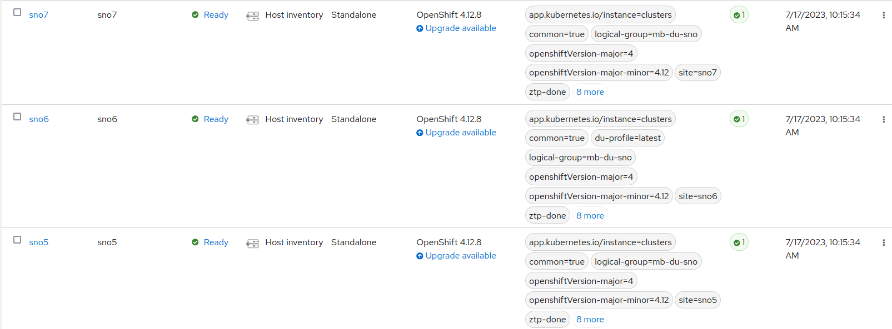

All the clusters have been configured using Policies from the RHACM Governance. All the Policies are `compliant`on all the clusters. Therefore, the cluster are deployed, working and properly configured.

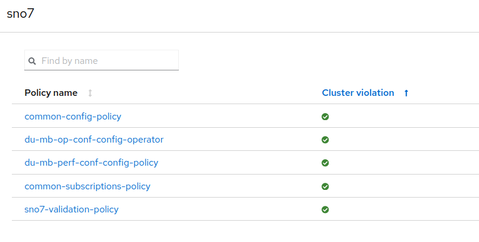

These Policies are created with a GitOps methodology, that connects a Git repository to the hub cluster. Following a view  of the Policies from the Git repository:

```bash
.
├── common
│   ├── common-config-policy.yaml
│   ├── common-placementbinding.yaml
│   ├── common-placementrules.yaml
│   └── common-subscriptions-policy.yaml
└── du-mb-op-conf
    ├── du-mb-op-conf-config-operator.yaml
    ├── du-mb-op-conf-placementbinding.yaml
    ├── du-mb-op-conf-placementrules.yaml
    ├── du-mb-perf-conf-config-policy.yaml
    ├── du-mb-perf-conf-placementbinding.yaml
    └── du-mb-perf-conf-placementrules.yaml

```

We will move out, of its logical-group, the cluster SNO5, creating a new subgroup. **We will test the same validated configuration but on a new version of OCP**. 

# Create the subgroup

The new subgroup will be called `mb-du-sno-4.12.26`.

First, copy previous Policies to a new folder for the subgroup.

```bash
> cp -r mb-du-sno/ mb-du-sno-4.12.26
> tree
├── common
│   ├── common-config-policy.yaml
│   ├── common-placementbinding.yaml
│   ├── common-placementrules.yaml
│   └── common-subscriptions-policy.yaml
├── mb-du-sno
│   ├── du-mb-op-conf-config-operator.yaml
│   ├── du-mb-op-conf-placementbinding.yaml
│   ├── du-mb-op-conf-placementrules.yaml
│   ├── du-mb-perf-conf-config-policy.yaml
│   ├── du-mb-perf-conf-placementbinding.yaml
│   └── du-mb-perf-conf-placementrules.yaml
└── mb-du-sno-4.12.26
    ├── du-mb-op-conf-config-operator.yaml
    ├── du-mb-op-conf-placementbinding.yaml
    ├── du-mb-op-conf-placementrules.yaml
    ├── du-mb-perf-conf-config-policy.yaml
    ├── du-mb-perf-conf-placementbinding.yaml
    └── du-mb-perf-conf-placementrules.yaml
```

We cannot have several Policies with the same name. So, change the `metadata.name` on all the new Policies:

```bash

> cd mb-du-sno-4.12.26

# previous names
> yq '.metadata.name' *
du-mb-op-conf-config-operator
---
du-mb-op-conf-placementbinding
---
du-mb-op-conf-placementrules
---
du-mb-perf-conf-config-policy
---
du-mb-perf-conf-placementbinding
---
du-mb-perf-conf-placementrules

# append the -4.12.26 to all the names
> for i in `ls *.yaml`; do  yq e -i  '.metadata.name = .metadata.name + "-4.12.26"' $i; done
 
> yq '.metadata.name' *
du-mb-op-conf-config-operator-4.12.26
---
du-mb-op-conf-placementbinding-4.12.26
---
du-mb-op-conf-placementrules-4.12.26
---
du-mb-perf-conf-config-policy-4.12.26
---
du-mb-perf-conf-placementbinding-4.12.26
---
du-mb-perf-conf-placementrules-4.12.26
```

Change PlacementBindings to point PlacementRule(1) and the Policy(2) with the new names of these resources:

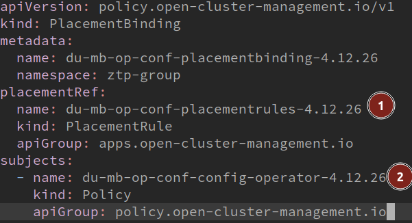

Change PlacementRules to bind the Policies to the new subgroup. Modifying the `clusterSelector`to match the name of the new subgroup:

```yaml
apiVersion: apps.open-cluster-management.io/v1
kind: PlacementRule
metadata:
  name: du-mb-op-conf-placementrules-4.12.26
  namespace: ztp-group
spec:
  clusterSelector:
    matchExpressions:
      - key: logical-group
        operator: In
        values:
          - mb-du-sno-4.12.26
apiVersion: apps.open-cluster-management.io/v1
kind: PlacementRule
metadata:
  name: du-mb-perf-conf-placementrules-4.12.26
  namespace: ztp-group
spec:
  clusterSelector:
    matchExpressions:
      - key: logical-group
        operator: In
        values:
          - mb-du-sno-4.12.26
```

Finally, we move SNO from his original logical group, to the new created one. Edit your `siteconfig`and change the labels of SNO5 to make it part of the new subgroup:

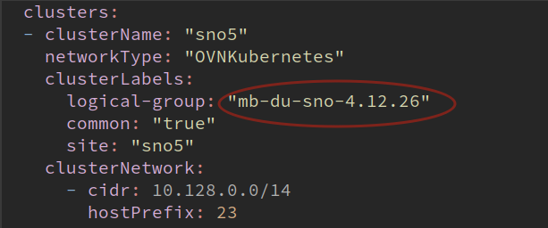

Push and synch everything from the Git repository.

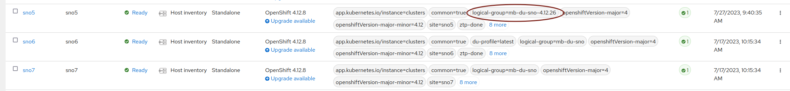

SNO5 is still compliant, but regarding the new set of Policies of the subgroup:

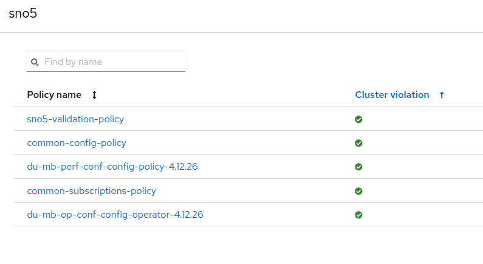

Notice, it is still compliant because we copied all the Policies from its previous logical group. So, new set of Policies but same configuration. Now, we will add a new configuration to the subgroup, that will make the desired upgrade.

# Introduce changes in the subgroup configuration

In order to produce the desired change, to make a cluster upgrade to validate Policies in a new environment, we will create a new Policy. Together with the needed PlacementRules and PlacementBindings.

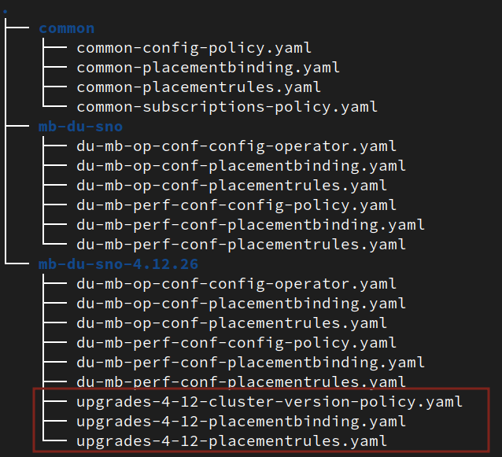


For easiness of the tutorial we dont go in detail about the Policy. Basically, an RHACM Policy with a must have object in the way of:

```yaml
- complianceType: musthave
  objectDefinition:
    apiVersion: config.openshift.io/v1
    kind: ClusterVersion
    metadata:
        name: version
    spec:
        channel: stable-4.12
        desiredUpdate:
            version: 4.12.26
        upstream: https://api.openshift.com/api/upgrades_info/v1/graph
    status:
        history:
            - state: Completed
              version: 4.12.26

```

That will produce an upgrade to OCP 4.12.26.

PlacementRule will make the cluster SNO5 affected by this upgrade:

```yaml
apiVersion: apps.open-cluster-management.io/v1
kind: PlacementRule
metadata:
    name: upgrades-4-12-placementrules
    namespace: ztp-common
spec:
    clusterSelector:
        matchExpressions:
            - key: logical-group
              operator: In
              values:
                - mb-du-sno-4.12.26
```

With the new files in the Git repo and everything synced, SNO5 is now not compliant.

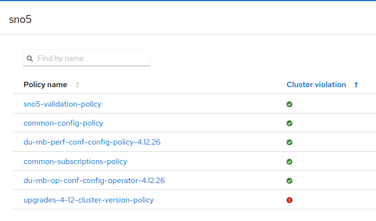


# Apply new Policies and wait for the validation

In order to remediate the new Policy, TALM Operator and ClusterGroupUpgrade(CGU) resources go into play. Basically, a new CR that makes the remediation for Clusters and Policies. More details on how to use TALM Operator can be found 
[here](https://docs.openshift.com/container-platform/4.12/scalability_and_performance/cnf-talm-for-cluster-upgrades.html).

TALM Operator helps to manage usual situations about how you manage your changes. For example, far edge use case updates can only be made during predefined maintenance windows. Or, how many clusters you want/can update at the same time. TALM provides features about these kind of needs.

We create a CGU that will remediate the not compliant Policy o SNO5.

```bash
> cat <<EOF | oc apply -f -
apiVersion: ran.openshift.io/v1alpha1
kind: ClusterGroupUpgrade
metadata:
  name: sno5-subgroup-change
  namespace: ztp-install
spec:
  backup: false
  clusters:
  - sno5
  enable: true
  managedPolicies:
  - upgrades-4-12-cluster-version-policy
  preCaching: false
  remediationStrategy:
    maxConcurrency: 1
    timeout: 240
EOF
```

Once TALM starts the remediation, the new Policy (upgrades-4-12-cluster-version-policy) is applied. In this case, this will trigger a cluster upgrade.

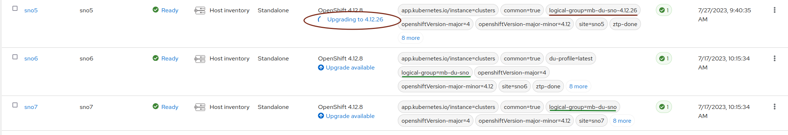

After a while, the upgrade is done. All the Policies are again compliant.
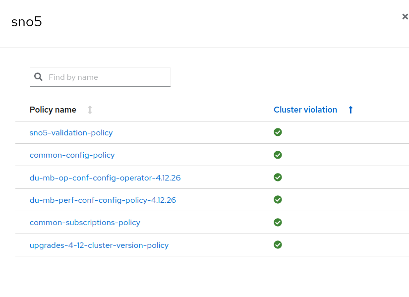

We have finished correctly the validation of the new configuration. We can conclude that all the Policies are still valid in the new subgroup. There, we can include the new tested Policies to the original logical group. And of course, we can return SNO5 cluster to its logical group.

# Apply the new configuration to all the clusters

In this point, you could apply different strategies. Like getting back SNO5 to its original logical group. For this example, we will do a kind of canary rollout. Now, that we have demonstrated that new configuration worked on one SNO, we can move all the clusters to the new logical group.

In the Siteconfig, we change the logical group in the way of:

```bash
> cat site-multi-sno-ipv4-4-12.yaml | grep logical-group -B 3
  - clusterName: "sno5"
    networkType: "OVNKubernetes"
    clusterLabels:
      logical-group: "mb-du-sno-4.12.26"
--
  - clusterName: "sno6"
    networkType: "OVNKubernetes"
    clusterLabels:
      logical-group: "mb-du-sno-4.12.26"
--
  - clusterName: "sno7"
    networkType: "OVNKubernetes"
    clusterLabels:
      logical-group: "mb-du-sno-4.12.26"
```

Once the configuration is sync, SNO6 and SNO6 now belong to a new logical group. Therefore are affected by the Policy created above, and they are not compliant


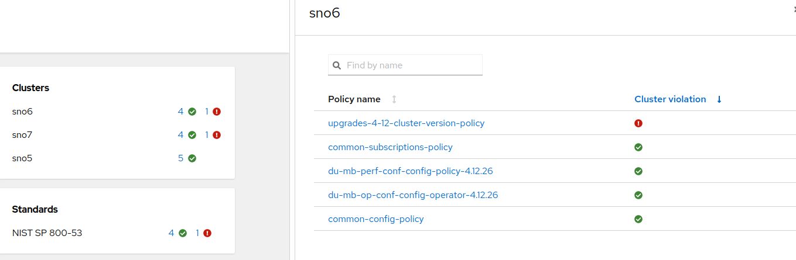

We create a new CGU to start a remediation:

```yaml
> cat <<EOF | oc apply -f -
apiVersion: ran.openshift.io/v1alpha1
kind: ClusterGroupUpgrade
metadata:
  name: mb-du-upgrade
  namespace: ztp-install
spec:
  backup: false
  clusters:
  - sno6
  - sno7
  enable: true
  managedPolicies:
  - upgrades-4-12-cluster-version-policy
  preCaching: false
  remediationStrategy:
    maxConcurrency: 1
    timeout: 240
EOF
```

By default (`maxConcurrency: 1`) will remediate Policies one by one. For that reason, SNO7 cluster will be upgraded after SNO6 success:

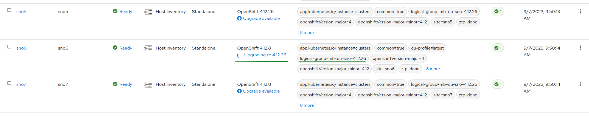


After a while both clusters are compliant. We did the upgrade and everything is validated out of risk. 

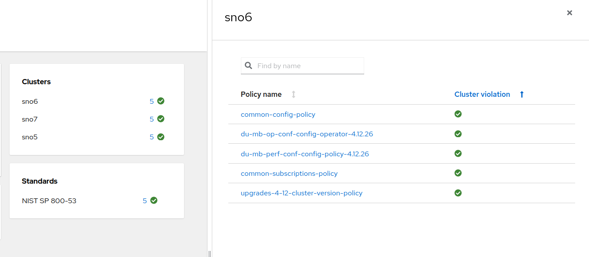


# Conclusions

The concept of subgroups, it is a way of using the RHACM Governance, to apply different sets of Policies to different clusters. This would help us to test and validate Policies and Configurations lowering possible risks, without affecting a significant number of clusters. The process is really flexible about which Policies and Clusters are involved. 

There are other similar techniques, like Policies Exceptions, that will be covered in a future second part of this tutorial. 