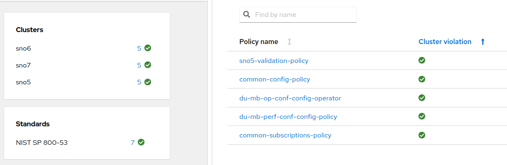
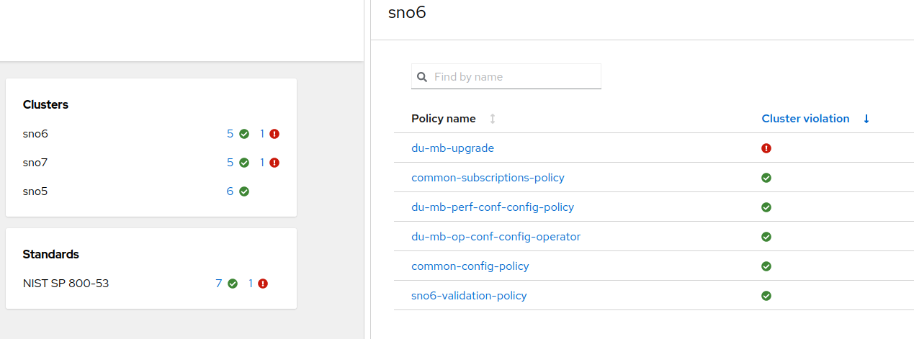

# Working with subgroups and configurations on your ZTP/RHACM infrastructure

[Red Hat ACM](https://www.redhat.com/en/technologies/management/advanced-cluster-management) allows you to deploy, upgrade, configure different Spoke clusters, from a Hub cluster. It is an Openshift cluster that manages other clusters. The infrastructure, and its configuration, can be defined using [RHACM Governance](https://access.redhat.com/documentation/en-us/red_hat_advanced_cluster_management_for_kubernetes/2.7/html/governance/governance). 
This governance, allows you to define configurations in the way of Policies. Very briefly, these Policies defines sets of `mustHave`or `mustNotHave`objects:

```yaml
apiVersion: policy.open-cluster-management.io/v1
kind: Policy
metadata:
    <REDACTED>
    name: du-mb-op-conf-config-operator
    namespace: ztp-group
spec:
    <REDACTED>
    policy-templates:
        - objectDefinition:
            <REDACTED>
            spec:
                <REDACTED>
                object-templates:
                    - complianceType: musthave
                      objectDefinition:
                        apiVersion: local.storage.openshift.io/v1
                        kind: LocalVolume
                        <REDACTED>
                        spec:
                            logLevel: Normal
                            managementState: Managed
                            <REDACTED>
```
Then, bindings and placement rules, matches these Policies to different Spoke clusters of your infrastructure


1. The PlacementRule select a set of clusters
2. The PlacementBinding, binds the PlacementRule with existing Policies 

All the clusters with the `logical-group: "mb-du-sno"` label, will be affected by the `Policy` `du-mb-op-conf-config-operator`. And therefore, different sets of `mustHave` and `mustNotHave`will define its desired status.

All the clusters in this group are automatically configured according to Policies that have been tested and validated. But, what is the correct procedure to take a set, or subgroup, of these cluster to test some new Policies?. Or, how we take, some clusters, out of its logical group to test some new Polices?. 

The procedure has to be easy to implement, and, clusters on the subgroup would get back to its previous logical group.

The following tutorial shows up how to use RHACM Governance and subgroups of configurations. The different steps on this tutorial: 
 * We will take one cluster out of its logical group. 
 * This new cluster (or subgroup) will test the same configuration (Policies), than its original group.
 * A new configuration will be added to test a new version of OCP. 
 * When everything is oka, Policies can be considered as valid in the OCP version. We can safety migrate all the clusters to the new configuration.
 * The new configuration is included in the original logical groupand our testing clusters is reverted back to its original group. 
 * All the clusters running in the logical groupwith the proper Policies and the new OCP version. 
 
A Git repository is connected to the Hub Cluster to inject the RHACM Policies, into the Governance process. *This tutorial dont cover this "GitOps" methodology, but Policies would be directly created into the Hub Cluster, as any other Openshift/Kubernetes resource.*

# The scenario

For this tutorial, we will focus on an scenario with three Single Node Openshift (SNOs). All of them are intended to be used in a telco environment to deploy a Midband Distribution Unit. But this is just an example, and the way of proceeding can apply to whatever other scenario.

SNO5, SNO6 and SNO7 are already deployed and working. All of them are based on OCP4.12 and belong to the `logical-group: "mb-du-sno"`.


Going further about Polices, we can also see, the different configurations (Policies) that have been applied. All the Policies are `compliant`.


That corresponds with our Git repository containing Policies for the `logical-group`:

```bash
.
├── common
│   ├── common-config-policy.yaml
│   ├── common-placementbinding.yaml
│   ├── common-placementrules.yaml
│   └── common-subscriptions-policy.yaml
└── du-mb-op-conf
    ├── du-mb-op-conf-config-operator.yaml
    ├── du-mb-op-conf-placementbinding.yaml
    ├── du-mb-op-conf-placementrules.yaml
    ├── du-mb-perf-conf-config-policy.yaml
    ├── du-mb-perf-conf-placementbinding.yaml
    └── du-mb-perf-conf-placementrules.yaml

```

We will move out, of its logical-group, the cluster SNO5, creating a new subgroup. We will test the same validated configuration but on a new version of OCP. 

# Create the subgroup

The new subgroup will be called `mb-du-sno-4.12.26`.

First copy previous Policies/Configuration to a new folder for the subgroup.

```bash
> cp -r mb-du-sno/ mb-du-sno-4.12.26
> tree
├── common
│   ├── common-config-policy.yaml
│   ├── common-placementbinding.yaml
│   ├── common-placementrules.yaml
│   └── common-subscriptions-policy.yaml
├── mb-du-sno
│   ├── du-mb-op-conf-config-operator.yaml
│   ├── du-mb-op-conf-placementbinding.yaml
│   ├── du-mb-op-conf-placementrules.yaml
│   ├── du-mb-perf-conf-config-policy.yaml
│   ├── du-mb-perf-conf-placementbinding.yaml
│   └── du-mb-perf-conf-placementrules.yaml
└── mb-du-sno-4.12.26
    ├── du-mb-op-conf-config-operator.yaml
    ├── du-mb-op-conf-placementbinding.yaml
    ├── du-mb-op-conf-placementrules.yaml
    ├── du-mb-perf-conf-config-policy.yaml
    ├── du-mb-perf-conf-placementbinding.yaml
    └── du-mb-perf-conf-placementrules.yaml
```

We cannot have several Policies with the same name. So, change the `metadata.name`on all the objects to a different name:

```bash
# previous names
> cd mb-du-sno-4.12.26
> yq '.metadata.name' *
du-mb-op-conf-config-operator
---
du-mb-op-conf-placementbinding
---
du-mb-op-conf-placementrules
---
du-mb-perf-conf-config-policy
---
du-mb-perf-conf-placementbinding
---
du-mb-perf-conf-placementrules

# append the -4.12.26 to all the names
> for i in `ls *.yaml`; do  yq e -i  '.metadata.name = .metadata.name + "-4.12.26"' $i; done
 
> yq '.metadata.name' *
du-mb-op-conf-config-operator-4.12.26
---
du-mb-op-conf-placementbinding-4.12.26
---
du-mb-op-conf-placementrules-4.12.26
---
du-mb-perf-conf-config-policy-4.12.26
---
du-mb-perf-conf-placementbinding-4.12.26
---
du-mb-perf-conf-placementrules-4.12.26
```

All PlacementBindings have to be changed to point PlacementRule(1) and the Policy(2) with their new names:


Finally, change PlacementRules to bind the Policies to the new subgroup:

```yaml
apiVersion: apps.open-cluster-management.io/v1
kind: PlacementRule
metadata:
  name: du-mb-op-conf-placementrules-4.12.26
  namespace: ztp-group
spec:
  clusterSelector:
    matchExpressions:
      - key: logical-group
        operator: In
        values:
          - mb-du-sno-4.12.26
apiVersion: apps.open-cluster-management.io/v1
kind: PlacementRule
metadata:
  name: du-mb-perf-conf-placementrules-4.12.26
  namespace: ztp-group
spec:
  clusterSelector:
    matchExpressions:
      - key: logical-group
        operator: In
        values:
          - mb-du-sno-4.12.26
```

Make SN5 cluster part of the subgroup:

 * Edit your `siteconfig`and change the labels of SNO5 to make it part of the new subgroup:


Push the changes to the Git repository and synch. 

SNO5 is still compliant, but regarding the new set of Policies of the subgroup:


Notice, it is still compliant because we copied all the copies from its previous logical group. So, new set of Policies but same configuration. Now, we will add a new configuration to the subgroup, that will make the desired upgrade.

# Introduce changes in the subgroup configuration

In order to produce the desired change, to make a cluster upgrade to validate Policies in a new environment, we will create a new Policy. Together with the needed PlacementRules and PlacementBindings.


For easiness of the tutorial we dont go in detail about the Policy. Basically, an ACM Policy with a must have object in the way of

```yaml
- complianceType: musthave
  objectDefinition:
    apiVersion: config.openshift.io/v1
    kind: ClusterVersion
    metadata:
        name: version
    spec:
        channel: stable-4.12
        desiredUpdate:
            version: 4.12.26
        upstream: https://api.openshift.com/api/upgrades_info/v1/graph
    status:
        history:
            - state: Completed
              version: 4.12.26

```

PlacementRules will make the cluster SNO5 affected by this upgrade:
```yaml
apiVersion: apps.open-cluster-management.io/v1
kind: PlacementRule
metadata:
    name: upgrades-4-12-placementrules
    namespace: ztp-common
spec:
    clusterSelector:
        matchExpressions:
            - key: logical-group
              operator: In
              values:
                - mb-du-sno-4.12.26
```

With the new files in the Git repo and everything synced, SNO5 is now not compliant.


# Apply new Policies and wait for the validation

In order to remediate the new Policy, TALM Operator and ClusterGroupUpgrade(CGU) resources go into play. Basically, a new CR that makes the remediation for Clusters and Policies. More details on how to use TALM Operator can be found 
[here](https://docs.openshift.com/container-platform/4.12/scalability_and_performance/cnf-talm-for-cluster-upgrades.html)

We create a CGU that will remediate the not compliant Policy:
```yaml
apiVersion: ran.openshift.io/v1alpha1
kind: ClusterGroupUpgrade
metadata:
  name: sno5-subgroup-change
  namespace: ztp-install
spec:
  backup: false
  clusters:
  - sno5
  enable: true
  managedPolicies:
  - upgrades-4-12-cluster-version-policy
  preCaching: false
  remediationStrategy:
    maxConcurrency: 1
    timeout: 240

```

Once TALM starts the remediation, the new Policy is applied. In this case, this will trigger a cluster upgrade.


After a while the upgrade is done. All the Policies are again compliant.


In this moment, we can say that all the Policies are still valid in the new subgroup, under the new conditions. Therefore, we can return SNO5 cluster to its logical group. Also, we can include the new tested Policies to the original group.


# Apply the new configuration to all the clusters

First, we get back SNO5 to its original logical group. Just changing back the value of the label `logical-group: mb-du-sno`at Siteconfig level.

```yaml
clusterName: "sno5"
networkType: "OVNKubernetes"
clusterLabels:
  logical-group: "mb-du-sno"
  common: "true"
  site: "sno5"
```

Back to its original group, you can check how it is still compliant. Currently, with its original Policies:



There are none of the Policies created about the upgrade, and the subgroup, 4.12.26. We copy these Policies from subgroup to the group `logical-group: mb-du-sno`. We also adapt the `.metadata.name` values to not conflict with the copies from the subgroup:

```bash
> cp mb-du-sno-4.12.26/upgrades-4-12-* mb-du-sno/ 

> yq e -i  '.metadata.name = "du-mb-upgrade"' upgrades-4-12-cluster-version-policy.yaml 

> yq e -i  '.metadata.name = "du-mb-upgrade-placementrule"' upgrades-4-12-placementrules.yaml  

> yq e -i  '.metadata.name = "du-mb-upgrade-placementbinding"' upgrades-4-12-placementbinding.yaml 

```

Modify the PlacementBinding to match the new Policy name into the `subjects[].name`, and the new PlacementRule name into the`placementRef[].name`:

```yaml
apiVersion: policy.open-cluster-management.io/v1
kind: PlacementBinding
metadata:
  name: du-mb-upgrade-placementbinding
  namespace: ztp-common
placementRef:
  name: du-mb-upgrade-placementrule
  kind: PlacementRule
  apiGroup: apps.open-cluster-management.io
subjects:
  - name: du-mb-upgrade
    kind: Policy
    apiGroup: policy.open-cluster-management.io

```

Modify the PlacementRule to match the `logical-group: mb-du-sno` into the `matchExpression`:

```yaml
> cat mb-du-sno/upgrades-4-12-placementrules.yaml 
apiVersion: apps.open-cluster-management.io/v1
kind: PlacementRule
metadata:
    name: upgrades-4-12-placementrules
    namespace: ztp-common
spec:
    clusterSelector:
        matchExpressions:
            - key: logical-group
              operator: In
              values:
                - mb-du-sno

```


Add the changes to the Git repo, and the original logical group is now affected by the Policies. That we tested on the subgroup. Therefore, now, SNO6 and SNO7 will be as not compliant.



We create a new CGU to remediate this two clusters about the Policy mb-du-sno:

```yaml
apiVersion: ran.openshift.io/v1alpha1
kind: ClusterGroupUpgrade
metadata:
  name: mb-du-upgrade
  namespace: ztp-install
spec:
  backup: false
  clusters:
  - sno6
  - sno7
  enable: true
  managedPolicies:
  - du-mb-upgrade
  preCaching: false
  remediationStrategy:
    maxConcurrency: 1
    timeout: 240
```

By default (`maxConcurrency: 1`) will remediate Policies one by one. For that reason, SNO7 cluster will be upgraded after SNO6 success:


After a while both clusters are compliant. We did the upgrade and everything is validated out of risk. Because we tested, first, with our one cluster subgroup.


The subgroup configuration would be deleted from the Git repo, to have a cleaner list of Policies into the RHACM Governance.

# Conclusions

The concept of subgroups, it is a way of using the RHACM Governance, to apply different sets of Policies to different clusters. This would help us to test and validate Policies and Configurations lowering possible risks, without affecting a significant number of clusters. The process is really flexible about which Policies and Clusters are involved. And finally, everything can be reverted when new Policies are ready and valid.

There are other similar techniques, like Policies Exceptions, that will be covered in a future second part of this tutorial. 