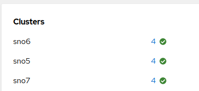
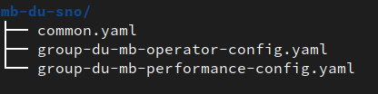

# Working with subgroups and configurations on your ZTP/RHACM infrastructure

[Red Hat ACM](https://www.redhat.com/en/technologies/management/advanced-cluster-management) allows you to deploy, upgrade, configure different Spoke clusters, from a Hub cluster. It is an Openshift cluster that manages other clusters.

Together with this platform, your infrastructure, and the configuration of this infrastructure, can be defined using a [GitOps methodology and tools](https://docs.openshift.com/container-platform/4.12/scalability_and_performance/ztp_far_edge/ztp-deploying-far-edge-clusters-at-scale.html).

The [PolicyGenTemplates](https://docs.openshift.com/container-platform/4.12/scalability_and_performance/ztp_far_edge/ztp-configuring-managed-clusters-policies.html) allows you to define the Policies that will manage the configuration of your infrastructure. These configurations will be linked to the group/clusters of you infrastructure with a set of labels:

```yaml
apiVersion: ran.openshift.io/v1
kind: PolicyGenTemplate
metadata:
  name: "group-du-sno"
  namespace: "ztp-group"
spec:
  bindingRules:
    logical-group: "mb-du-sno"
```

All the clusters with the `logical-group: "mb-du-sno"` label, will be affected by the `Policies`generated by this `PolicyGenTemplate` or `PGT`.

All the clusters in this group are automatically configured according to different PGTs that have been tested and validated. But, what is the correct procedure to take a set, or subgroup, of these cluster to test some new Policies. One example would be take a group of clusters, with a logical set of Policies, and extract a number of these. 

The procedure has to be easy to implement. Clusters on the subgroup would get back to its previous `logical-group`, but the most important point, more clusters would be taken into the new `logical-group`. 

The following tutorial shows up how to manage your Zero Touch Provisioning with subgroups of configurations. In this case, we will take one cluster out of its `logical-group`. This new cluster (or subgroup) will test the same configuration (Policies), than its original group, but using a new version of OCP. When all the configurations are validated in the new scenario, the new OCP version is included into the original group. The cluster that was moved out can get back to its original `logical-group`. 

# The scenario

For this tutorial we will focus on an scenario with three Single Node Openshift (SNOs). All of them are intended to be used in a telco environment to deploy a Midband Distribution Unit. But this is just an example, and the way of proceeding can apply to whatever other scenario with ZTP.

SNO5, SNO6 and SNO7 are already deployed and working. All of them are based on OCP4.12 and belong to the `logical-group: "mb-du-sno"`.


In addition, we can see the label `ztp-done`, that confirms the clusters have been correctly configured by ZTP. And therefore, workloads can be deployed.

Going further about Polices, we can also see, the different configurations (Policies) that have been applied.



That corresponds with our GitOps repository PGTs applied to the `logical-group`:



Now, we will move out of its logical-group the cluster SNO5, creating a new subgroup. We will test the same validated configuration but on a new version of OCP. Once this is tested, the Policy that upgraded the subgroup, will be included in the original logical-group. And SNO5 can be included back to this group.

# Create the subgroup

# Wait for the validation

# Apply the new configuration to all the clusters

# Conclussions
