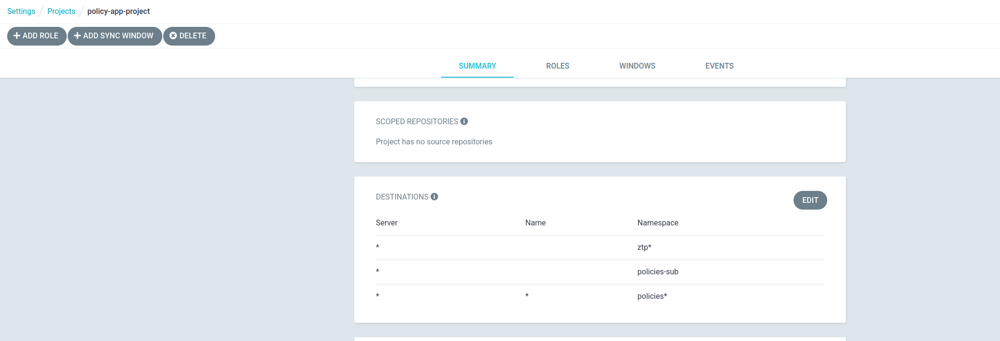

# Going further about Zero Touch with ZTP Gitop tools

[WIP]

## Siteconfigs

Siteconfig is the template for making your cluster's deployment. It is related to day-0 and it includes some pre-configuration or RAN profile. This profile includes some extra configurations related to telco RAN infrastructures.

The different configurations of this profile can be enabled or disabled.

But also, the profile can be extended with the usage of extra-manifest according to each environment needs.

It is important to remark, these manifests are applied during installation. The advantage of applying here is, that you have your cluster up and configured at the same time. Not having to apply policies on day-2 operations. Some of these Policies would require to reboot nodes to be applied. Something, sometimes, would be not desired or allowed. 

### Using extra-manifests

To extend any Siteconfig with extra configuration, you can create any directories with yamls including Resources to be added to the cluster during installation.

*Here I need a better example, this one dont works to label nodes during installation.*

~~For example, you can write some Node Resource to create some roles during installation:~~

~~'cluster-extra-configs'~~

```yaml
apiVersion: v1
kind: Node
metadata:
  name: "master-0.el8k-ztp-1.hpecloud.org"
  labels:
    node-role.kubernetes.io/role1: ""
    node-role.kubernetes.io/master: ""                                         
    node-role.kubernetes.io/worker: ""
---
apiVersion: v1
kind: Node
metadata:
  name: "master-1.el8k-ztp-1.hpecloud.org"
  labels:
    node-role.kubernetes.io/role1: ""
    node-role.kubernetes.io/master: ""                                         
    node-role.kubernetes.io/worker: ""
---
apiVersion: v1
kind: Node
metadata:
  name: "master-2.el8k-ztp-1.hpecloud.org"
  labels:
    node-role.kubernetes.io/role2: ""
```

Then you can add this extra manifest to the siteconfig:

'el8k-ztp-1.yaml Siteconfig'

```yaml
apiVersion: ran.openshift.io/v1
kind: SiteConfig
metadata:
  name: "el8k-ztp-1"
  namespace: "el8k-ztp-1"
spec:
  baseDomain: "hpecloud.org"
  pullSecretRef:
    name: "assisted-deployment-pull-secret"
  clusterImageSetNameRef: "img4.10.10-x86-64-appsub"
  sshPublicKey: "ssh-rsa AAAAB3NzaC1yc2EAAAADAQABAAABgQCei2UnkBB9g9DPhu4fpMFKmrlhR9UIYYPet61WF3qr6Rp2LkxEhZtbRk6tZjaiVXo/Ff6rsayyoEy86bPCE+4/Kl+3V/KueKW2fgxz/tg1uLiDerWj8+J8KAGJ8TsBAl3cWYYQtHxlwCnyPSmspWB/UegNTd+0cHhkPiTYd6wylgmbBi9MWOAISkXOLWUjsOmKUKiTLkfX2VWqvkk8BH2/blHp0xCSZ2NWifc+VmCvz+M36mj0aRF5dEmfdy+wg7m9wi2/Hq59+NLGBef3kKjBnj0A/K0wFfT0ufi03OkztDOY7Y0xxIkl8Bi/Hof4rDlfKVKA9hcMSo3TY2o0asmTTXUhGZ/FVuZcIZpULOFMXKUR3oKeqnr/dff32IHVwgYb8n8C5zUepWu7tVUKnvxZ0Gwajy1Ru+xjrlROFT+761faJHmG5Ev/EdwKHkXHq5EMHgopyiYV7swJEnFzAUzaiu8DP1FYNJyocRvp6AZpbIlyFoabyq+o2yn2Fhny6gs= jgato@provisioner.el8k.hpecloud.org"
  clusters:
  - clusterName: "el8k-ztp-1"
    networkType: "OVNKubernetes"
    clusterLabels:
      common-4-10: "true"
      group-du-3node: ""
      sites : "el8k-ztp-1-site"
...
....
    extraManifestPath: "extra-manifests/el8k-ztp-1-roles.yaml"
    nodes:
      - hostName: "master-0.el8k-ztp-1.hpecloud.org"
        role: "master"
        bmcAddress: "redfish-virtualmedia://10.19.1
```

## PolicyGenTemplates

PolicyGenTemplate is a CRD by ZTP tools. It allows you to use some pre-existing templates that will generate ACM Policies related to Telco RAN usual activities. It can be seen as a set of pre-created helpers, that can make same upgrade/configuration of Telco RAN activities easier. For example: deploying RAN operators, configuring SRIOV interfaces, configuring PTP, etc

When you need to make more generic configurations, like RBAC, Users, Projects, etc, you can still combine your GitOps/ArgoCD pipelines but directly using ACM Policies. ACM Policies would be a little bit more complex, than just using a PGT, but are much more flexible. Actually, these Policies can desired status of whatever existing resource on an Openshift/Kubernetes cluster.

### Configuring/Upgrading with exiting PolicyGenTemplates

The list of templates that can be references from a PGT can be found [here](https://github.com/openshift-kni/cnf-features-deploy/blob/master/ztp/source-crs)

From there we will find different templates that can be easily used from a PGT for making new configurations

#### Disabling CatalogesSources from an OperatorHub

There exists a [template for managing the OperatorHub](https://github.com/openshift-kni/cnf-features-deploy/blob/release-4.10/ztp/source-crs/OperatorHub.yaml). It is designed to disable the pre-configured CatalogesSources that came, by default, with Openshift:

```bash
NAMESPACE               NAME                  DISPLAY               TYPE   PUBLISHER   AGE
openshift-marketplace   certified-operators   Certified Operators   grpc   Red Hat     16d
openshift-marketplace   community-operators   Community Operators   grpc   Red Hat     16d
openshift-marketplace   redhat-marketplace    Red Hat Marketplace   grpc   Red Hat     16d
openshift-marketplace   redhat-operators      Red Hat Operators     grpc   Red Hat     16d
```

So it will disable all of them if you add this to your PGT:

```yaml
kind: PolicyGenTemplate                                                           
metadata:                                                                         
  name: "common-4-9"                                                              
  namespace: "ztp-common"                                                         
  annotations:                                                                    
    force: "force-again"                                                          
spec:                                                                             
  bindingRules:                                                                   
    common-4-9: "true"                                                            
  sourceFiles:       
    - fileName: OperatorHub.yaml                                               
      policyName: "registries-policy"               
```

This will disable all the 'Catalogesources'.

You can configure your PGT to be more specific. When you add the 'OperatorHub.yaml', this is including the disableall. But, you can override that, and be more specific. According to the specification of the CR OperatorHub, you could do something like:

```yaml
    - fileName: OperatorHub.yaml                                               
      policyName: "registries-policy"                                          
      spec:                                                                    
        disableAllDefaultSources: false                                        
        sources:                                                               
          - disabled: true                                                     
            name: redhat-marketplace                                           
          - disabled: true                                                     
            name: certified-operators                                          
          - disabled: true                                                     
            name: community-operators 
```

Only these 3 sources will be disabled. remaining the redhat-operators only.

```bash
$ oc get catalogsources -A
NAMESPACE               NAME               DISPLAY             TYPE   PUBLISHER   AGE
openshift-marketplace   redhat-operators   Red Hat Operators   grpc   Red Hat     17d
```

### Injecting/Creating your own PolicyGenTemplates

In the previous section we have used PGTs with existing templates to facilitate configurations and upgrades. When you are using a PGT to create a Policy you will have some of these references to other existing yamls.

```yaml
 sourceFiles:
    - fileName: SriovSubscription.yaml
      policyName: "subscriptions-policy"
    - fileName: SriovSubscriptionNS.yaml
      policyName: "subscriptions-policy"
    - fileName: SriovSubscriptionOperGroup.yaml
      policyName: "subscriptions-policy"
```

These yamls files lives inside the ZTP installation you did into ArgoCD. You can check all these pre-created yamls [here](https://github.com/openshift-kni/cnf-features-deploy/blob/master/ztp/source-crs/). But mainly, inside these files, you will find just Openshift/Kubernetes pre-configured resources:

'SriovSubscription.yaml'

```yaml
apiVersion: operators.coreos.com/v1alpha1
kind: Subscription
metadata:
  name: sriov-network-operator-subscription
  namespace: openshift-sriov-network-operator
  annotations:
    ran.openshift.io/ztp-deploy-wave: "2"
spec:
  channel: "stable"
  name: sriov-network-operator
  source: redhat-operators
  sourceNamespace: openshift-marketplace
  installPlanApproval: Manual
status:
  state: AtLatestKnown
```

Internally, ZTP tools will create the proper Policies (Based on these resources) and will make the need it bindings according to your PGT rules:

```yaml
apiVersion: ran.openshift.io/v1
kind: PolicyGenTemplate
metadata:
  name: "common-rangen-4.9"
  namespace: "ztp-common"
spec:
  bindingRules:
    common: "true"
    du-profile: "v4.9"
```

If you need to create any Openshift/kubernetes Resource that is not managed by any of these pre-existing files, you can inject your own ones. Or you can just use raw ACM Policies, as it is explained in the next section.

How we inject our own files to be used by a PGT?

First you create the yaml with the Resource you want to manage:

```yaml
apiVersion: project.openshift.io/v1
kind: Project
metadata:
  name: foo
status:
  phase: Active
```

Then we have to inject the yaml into the currently running Pod with ArgoCD.

Lets copy that file inside:

```bash
$>  oc -n openshift-gitops rsync source-crs/ openshift-gitops-repo-server-684d5bd56-t4lts:/.config/kustomize/plugin/ran.openshift.io/v1/policygentemplate/source-crs/ -c argocd-repo-server
WARNING: cannot use rsync: rsync not available in container
CreateProject.yaml
```

Now it can be referenced from a PGT:

```yaml
 sourceFiles:
    - fileName: CreateProject.yaml
      policyName: "projects-policy"
```

And you can use it to create projects different than foo, when you reference one resource, you can override whatever attribute in the CRD.

```yaml
 sourceFiles:
    - fileName: CreateProject.yaml
      policyName: "projects-policy"
      metadata:
        name: bar
```

### Configuring with ACM Policies

When there are no PGT templates, raw ACM Policies can be created. Actually, the PGT Templates are transformed into ACM Policies by one of the two Kustomize plugins.

An ACM Policy is composed by a Policy with the desired status, and a set of roles and bindings to select which cluster will be affected. More in concrete, these are the needed objects:

* [The Policy](https://open-cluster-management.io/concepts/policy/). The main object, it contains a set of 'must have' and must not have' Kuberentes/Openshift objects.

* PlacementRule. This object select different clusters according to different labels.

* PlacementBinding. This object selects a set of Policies with the PlacementRules. 

These objects have to be placed on a Git repository/directory controlled by an ArgoCD App. It could be the same you are using for your PGTs. These objects will be synchronized by ArgoCD as usual Kubernetes/Openshift objects. ACM controllers will make the reconciliation accordingly. 

#### Creating a Policy

A Policy is an object with a set of 'must have' and/or 'must not have' of any Kuberentes/Openshift object.

```yaml
apiVersion: policy.open-cluster-management.io/v1
kind: Policy
metadata:
  annotations:
    policy.open-cluster-management.io/categories: CM Configuration Management
    policy.open-cluster-management.io/controls: CM-2 Baseline Configuration
    policy.open-cluster-management.io/standards: NIST SP 800-53
    ran.openshift.io/ztp-deploy-wave: "2"
  name: extra-project-create
  namespace: policies-site
spec:
  disabled: false
  policy-templates:
  - objectDefinition:
      apiVersion: policy.open-cluster-management.io/v1
      kind: ConfigurationPolicy
      metadata:
        name: testing-policy-project
      spec:
        namespaceselector:
          exclude:
          - kube-*
          include:
          - '*'
        object-templates:
        - complianceType: musthave
          objectDefinition:
            apiVersion: project.openshift.io/v1
            kind: Project
            metadata:
              name: foo
            status:
              phase: Active
        remediationAction: inform
        severity: low
  remediationAction: inform
```

In this example:

* Name: I have put a prefix 'extra-' to the name. Just to differentiate this Policy from the ones created by ZTP Tooling using PGTs. But it is just a suggestion or a personal convention. 

* Objective: it will create a Project called 'foo'. 
  
  ```yaml
  apiVersion: project.openshift.io/v1
  kind: Project
  metadata:
    name: foo
  status:
    phase: Active
  ```

* About the Namespace: As a suggestion, use different Namespaces from the usual ztp ones (ztp-site, ztp-common, ztp.group. The name should be allowed by your ArgoCD Project:
  
  

* remediationAction: from ZTP4.10, all the Policies are created with remediation Inform. This is hidden inside the existing PGT templates. When you create raw ACM Policies, you have to set it to Inform. Later, TALM will manage when to Enforce the Policies

* severity is just informational

#### Making the match between policies and clusters

ZTP Gitops Tooling proposes 3 kind of PGT about which clusters are affected. And these is managed by their own convencion about labeling clusters on Siteconfigs:

* SiteSpecific Policies. Labeling clusters on the way of:  'name: "CLUSTER_NAME"'

* Group Policies. Labeling clusters on the way of: '<GROUP_POLICY_NAME>: ""'

* Common Policies. Labeling clusters on the way of: '<COMMON_POLICY_NAME>: "true"'

Then ZTP Tooling will configure the different PlacementRule/PlacementBinding. When using raw ACM Policies, you have to create PlacementRule/PlacementBinding manually together with the Policy.

##### Applying Policies to SiteSpecific

With the above Policy created, we have to match the PlacementRule/PlacementBinding to be applied to an specific site. Consider we have one cluster which is called 'intel-1-sno-1'. This match will fire the configuration only on this cluster.

`PlacementBinding:'

```yaml
apiVersion: apps.open-cluster-management.io/v1
kind: PlacementRule
metadata:
  name: extra-intel-1-sno-1-placementrules
  namespace: policies-site
spec:
  clusterSelector:
    matchExpressions:
      - key: name
        operator: In
        values:
          - intel-1-sno-1
```

You are just creating a link called 'extra-intel-1-sno-1-placementrules' with the cluster 'intel-1-sno-1'. 

`PlacementRule:' it will relate a policy (or a a list of policies) with a 'PlacementRule'

```yaml
apiVersion: policy.open-cluster-management.io/v1
kind: PlacementBinding
metadata:
  name: extra-intel-1-sno-1-placementbinding
  namespace: policies-site
placementRef:
  apiGroup: apps.open-cluster-management.io
  kind: PlacementRule
  name: extra-intel-1-sno-1-placementrules
subjects:
  - apiGroup: policy.open-cluster-management.io
    kind: Policy
    name: extra-project-create
```

Here we are linking the previous selected cluster on (PlacementRule for extra-intel-1-sno-1-placementrules) and the Policy called site-project.

With all these objects created, you will see how the Policy is created on ACM but affecting only one cluster.

##### Applying Policies to Groups

We can use the same previous created Policy, but this time we configure the PlacementRule/PlacementBinding to match a group of clusters. The Policy should be placed on a Namespace called policies-group, or similar.

```yaml
apiVersion: policy.open-cluster-management.io/v1
kind: Policy
metadata:
...
...
  name: extra-project-create
  namespace: policies-group
spec:
...
...
```

A group of clusters according to ZTP Tooling convention means, clusters labeled in the way of: '<GROUP_POLICY_NAME>: ""'

Main changes happens PlacementRule. This time, it will match clusters with the label 'group-du=""'

```yaml
apiVersion: apps.open-cluster-management.io/v1                                   
kind: PlacementRule                                                               
metadata:                                                                         
  name: extra-intel-1-sno-1-placementrules                                        
  namespace: policies-group                                                       
spec:                                                                             
  clusterSelector:                                                                
    matchExpressions:                                                             
      - key: group-du                                                           
        operator: Exists                                                              
```

`PlacementBinding:' here there are no changes, you are just linking the Policy with the PlacementRule

```yaml
apiVersion: policy.open-cluster-management.io/v1                                  
kind: PlacementBinding                                                            
metadata:                                                                         
  name: extra-intel-1-sno-1-placementbinding                                      
  namespace: policies-group                                                       
placementRef:                                                                     
  apiGroup: apps.open-cluster-management.io                                       
  kind: PlacementRule                                                             
  name: extra-intel-1-sno-1-placementrules                                        
subjects:                                                                         
  - apiGroup: policy.open-cluster-management.io                                   
    kind: Policy                                                                  
    name: extra-project-create  
```

##### Applying Policies to Common

We can use the same previous created Policy, but this time we configure the PlacementRule/PlacementBinding to match a Common Policy. 

A Common Policy according to ZTP Tooling convention means, clusters labeled in the way of:  '<COMMON_POLICY_NAME>: "true"'

Again, the Policy dont need to be changed. But, it should be placed on a proper Namespace like policies-common.

Main changes happens PlacementRule. This time, it will match clusters with the label 'common="true"'

```yaml
apiVersion: apps.open-cluster-management.io/v1
kind: PlacementRule
metadata:
  name: extra-intel-1-sno-1-placementrules
  namespace: policies-common
spec:
  clusterSelector:
    matchExpressions:
      - key: common
        operator: In
        values:
          - "true"
```

`PlacementBinding:' here there are no changes, you are just linking the Policy with the PlacementRule

```yaml
apiVersion: policy.open-cluster-management.io/v1                                  
kind: PlacementBinding                                                            
metadata:                                                                         
  name: extra-intel-1-sno-1-placementbinding                                      
  namespace: policies-group                                                       
placementRef:                                                                     
  apiGroup: apps.open-cluster-management.io                                       
  kind: PlacementRule                                                             
  name: extra-intel-1-sno-1-placementrules                                        
subjects:                                                                         
  - apiGroup: policy.open-cluster-management.io                                   
    kind: Policy                                                                  
    name: extra-project-create  
```